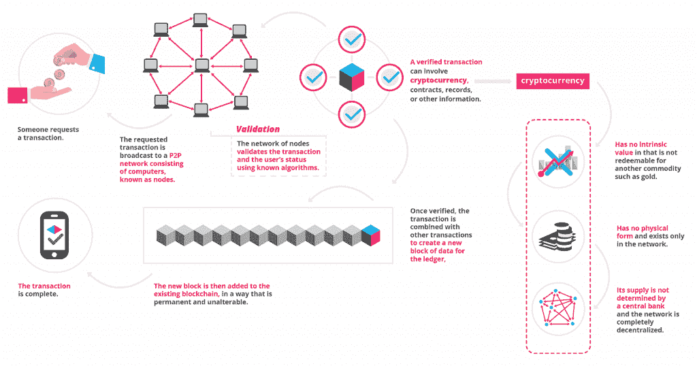

# 为什么程序员永远不应该停止学习

> 原文：<https://simpleprogrammer.com/programmers-never-stop-learning/>

One of the reasons why IT is still one of the most profitable industries in the world is that it’s constantly changing and evolving. New trends appear every day, along with new technologies and marketing strategies. Anyone who wants to be in this business needs to constantly keep track of everything and be ready to [learn on the fly](https://www.amazon.com/Never-Stop-Learning-Relevant-Reinvent/dp/163369285X).

当然，你可能会想，“但我是一名程序员。为什么我需要学习工作之外的东西？”答案很简单。如今，如果你想在事业上有所发展，你必须尽可能地多才多艺。即使你不想进步，你仍然需要[不断学习新技能](https://simpleprogrammer.com/learn-code-where-start/)，提升自己，这样你才不会变得落伍。

你可能想知道，你应该关注哪些新的行业、趋势和技术，以及你如何跟踪它们？我们已经找到了一些最相关的，并列在下面，所以看看吧。

## Web 开发

如果你的主要工作领域是网页开发，如果你想保持领先地位，2018 年你应该关注三个新趋势。

### view . js-检视. js

如果你了解 JavaScript 的话，你可能对 Vue.js 有点熟悉。这个框架在 2014 年发布，现在变得非常流行，主要是因为它快速、轻便、可靠。这个框架的伟大之处在于它是由一个人创造的，[尤雨溪](https://medium.freecodecamp.org/between-the-wires-an-interview-with-vue-js-creator-evan-you-e383cbf57cc4)，因此感觉像一个独立的项目，人们总是很欣赏它。

现在，根据 [Packt Hub，](https://hub.packtpub.com/why-has-vuejs-become-so-popular/)使用 Vue.js 有很多好处:。

*   与其他一些框架不同，Vue.js 相当容易学习，并且拥有涵盖所有基础的大量文档。通过学习这个轻量级框架，你将能够比使用 Angular 和 React 更快、更容易地创建应用程序。
*   Vue.js 相当灵活，所以你可以使用任何你想要的库，包括官方支持的 Vuex 和 vue-router。如果你不喜欢这些，你可以选择 Redux 甚至 JSX。
*   这是最小和最快的框架之一，几乎不需要优化就能超出程序员的任何期望。
*   最重要的是，Vue.js 有一个专注而忠诚的社区，他们不断地合作来帮助框架发展。

我们只提到了几个好处，以便让您了解 Vue.js 对 web 开发人员有多有效，但是还有更多好处需要您去研究和学习，以保持对这项技术的了解。

### 函数式编程

当谈到函数式编程时，大多数人都有分歧——他们要么喜欢它，要么讨厌它。倡导者声称这是一种比典型的面向对象代码更干净、更有效的编程方式。

如果你不太熟悉命令式编程和函数式编程的区别，你可以在 Mikolaj Szabo 的博客 [HackerNoon](https://hackernoon.com/why-functional-programming-matters-c647f56a7691) 上阅读。他生动地将命令式编程描述为一条装满小型机器的装配线，每台机器都有一个确切的角色来制造最终产品。所有这些操作都是相互关联的，这意味着它们相互依赖:如果一项操作出现故障，产品就会受到影响。

另一方面，函数式编程创造了许多独立工作、互不依赖的机器。这为代码简洁腾出了空间，这是函数式编程的最大好处之一。

在前几年，函数式编程还没有那么流行，但它正在崛起。UserSnap 表示，这种受欢迎程度的增加主要是因为 T2 JavaScript 的改进，也就是最近增加的三个功能:

*   箭头功能
*   对象/数组分布
*   异步/等待

你是否会使用函数式编程取决于你，但明智的做法是注意到它在 2018 年呈上升趋势。

### 浏览器扩展

几乎所有的主流浏览器都有安装扩展的选项(尽管 Mozilla 称之为插件)。它们是非常有用的代码，允许对用户的浏览体验进行各种修改。例如，一个比较流行的扩展是 AdBlock，它可以在你浏览的时候屏蔽广告。

然而，有趣的是，这些扩展不断提高兼容性，这意味着为谷歌 Chrome 创建的扩展也可以在 Mozilla Firefox 上使用。Mozilla 实际上领先于 Google Chrome，使用跨浏览器的 [WebExtensions API](https://developer.mozilla.org/en-US/Add-ons/WebExtensions) ，所以你可以简单地将代码移植到其他浏览器。这种兼容性很可能只会在 2018 年得到改善。

## 软件开发

如果你是一名软件开发人员，这里有一些你应该在 2018 年注意的事情。

### 区块链

毫不奇怪，[区块链](https://en.wikipedia.org/wiki/Blockchain)仍然是世界上最受欢迎的技术之一。它是一个被称为“块”的记录列表，这些记录是相互关联和加密的。由于区块链数据不可更改，并且每个块都是加密的，因此非常适合加密货币。

加密货币热潮在 2017 年创下历史新高。你认识的每个人都在用他们一无所知的虚拟货币交易，试图轻松赚钱。这种狂热现在已经过去，但世界再也不会像以前一样了。世界各地的公司对区块链开发者的需求仍然很高。

来源:https://block geeks . com/WP-content/uploads/2017/12/infographics 0517-01-1 . png

### 物联网

据专门从事统计的网站 Statista T1 称，到 2020 年，物联网将拥有大约 300 亿台联网设备。这是一个巨大的数字，世界各地的公司都在不断寻找方法来改善、优化和加快这些设备之间的通信。

在被数据量淹没之前，云计算只能走这么远。这就是物联网将使用[边缘计算](https://blog.nordicsemi.com/getconnected/edge-fog-computing-explained)并不断寻找新开发者的原因。毫无疑问，Edge 和 Fog 计算都是软件开发的未来，所以你应该在它还是新的和未开发的时候深入研究它。

### 网络安全

当然，随着设备和程序数量的增加，网络安全也面临着更大的风险。网络安全初创公司正在成倍增加，到今年年底，似乎会有更多这样的公司。在整个 2018 年，你可以关注 eSecurity 的 20 家有前途的网络安全公司的名单，并学习应对威胁的新方法。

事实上，今年我们可能会遇到哪些威胁呢？嗯，前面提到的物联网当然是一个主要关注点，因为它每年都在逐渐变大。

大多数专家的一个主要担忧是，越来越多的网络攻击正在人工智能的帮助下发生，这是一个危险的趋势，许多安全公司将被迫应对。程序员应该考虑尽可能多地学习和参与，因为物联网是一个需要更多有能力的专业人员的主要行业。

## 移动应用

对于那些从事移动应用行业的人来说，我们列出了几个你可以学习的领域，以提高你的编程技能，为未来做好准备。

### 增强现实

我们都记得那个相对短暂的神奇宝贝游戏，它使用了增强现实技术，让人们手里拿着手机跑来跑去。虽然 Pokémon Go 是一款 AR 视频游戏，但还有许多其他有用的方法来重新引入这项技术。

例如，Amicasa 是一个 AR 应用程序，让你在购买家具之前就可以设计你的房间。SketchAR 使用 AR 跟踪来帮助您绘制和绘制草图。事实上， [Digital Trends](https://www.digitaltrends.com/mobile/best-augmented-reality-apps/) 编辑了一份清单，上面列出了一些你应该注意的使用 AR 的真正出色的应用。

当然，这只是一个开始。我们对这项技术还只是皮毛，谁知道几年后会是什么样子呢？

世界上一些最好的应用程序设计机构正在研究这些应用程序的潜力，你也应该这样做。虽然 VR 技术稍微更受欢迎，但当与手机结合时，ar 更有用。

### 移动支付

我们生活在一个甚至信用卡在几年后都会过时的时代。将摆脱它们的最新趋势与移动支付有关。

在 2018 年 1 月的消费电子展期间，谷歌宣布了一项新服务，将他们所有的支付应用统一在一个名字下——[Google Pay](https://www.engadget.com/2018/01/08/google-pay/)。考虑到苹果也有类似的服务，亚马逊 Go 商店利用他们的无结账应用程序，可以肯定地说[手机支付是未来的](https://www.computerworld.com/article/3259849/application-development/tech-talk-the-fate-of-developers-and-the-future-of-mobile.html)，许多较小的公司将跟随他们的脚步。

[支付愿景](https://www.paymentvision.com/blog/2017/12/26/7-trends-that-prove-mobile-payments-are-here-to-stay-in-2018)为我们提供了一系列他们认为移动支付将在 2018 年变得更加流行的原因。这都要归功于近场通信技术、生物识别技术、人工智能控制的交互等等。这些都是值得研究的技术。

## 为未来做好准备

所有这些都只是等待您的一些创新，作为一名程序员，您需要准备好掌握这些概念中的大部分。

我们生活在一个快节奏的世界中，所以至少了解这些问题以及解决这些问题的最新趋势和技术将会使你的工作和生活变得更容易。

作为一名程序员，你需要不断的个人发展(有些人可能会说每一行都是如此)，所以准备好跟上变化，或者更好的是，领先一步。