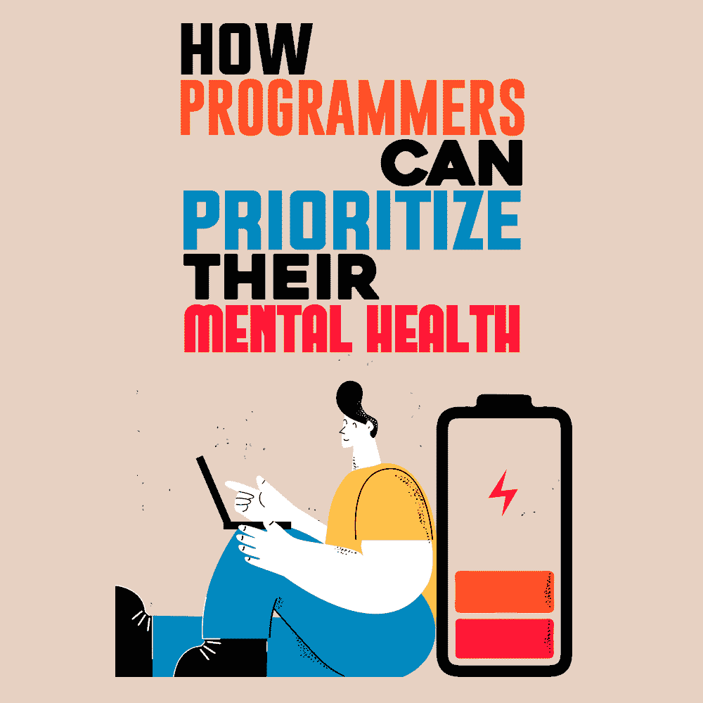

# 程序员如何优先考虑他们的心理健康

> 原文：<https://simpleprogrammer.com/programmers-prioritize-mental-health/>

Programming is rewarding, but it can also be highly stressful. Our line of work will undoubtedly affect our mental health at some point—blame it on the mental effort it takes to code, trying to keep up with the other talented programmers out there, constant overtime, or a whole host of other things.

令人难过的是，精神健康的压力和紧张会摧毁任何一个程序员的职业生涯。所以，关心你的大脑和应对压力是很重要的。

大多数程序员已经开始优先考虑他们的心理健康和管理压力。但是你实际上是怎么做的呢？

在这篇文章中，我会给你一些具体的建议，告诉你如何确保自己的精神健康，保持健康、快乐和富有成效。

## 平衡你的工作职责

程序员有很多事情要做。从编写代码到测试代码，再到软件发布后的更新，我们的工作职责对我们的精神要求很高。因为[我们想要超越](https://www.amazon.com/dp/0137081073/makithecompsi-20)，我们倾向于承担超出我们能力的事情，包括我们没有任何业务要做的项目。

不要让你的工作负担过重，而是平衡它们。在不影响工作质量的前提下，尽可能多地承担项目和任务。此外，确保你在职业生涯中做你喜欢做的事情和你不喜欢的事情一样多，如果不是更多的话。

## 让自我保健成为你日常生活的一部分

让自我保健成为你每天生活的一部分也有利于你的心理健康。由于工作要求很高，程序员经常忽视照顾自己。心理健康的挑战，如焦虑和情绪障碍，可能会发生。

每天做一些有意识的自我护理会有帮助。你喜欢做什么？你什么时候感觉最平静？当你觉得最尊重自己的时候，你在做什么？用你对这些问题的回答列出一份自我保健活动的清单。然后，每天做这些活动中的一项来增加你的能量、热情和注意力。

## 管理工作和与工作无关的压力

作为一名程序员，与工作相关的压力已经够艰难的了——但是工作之外影响我们的压力源呢？如果除了与工作相关的压力之外，我们不能管理外部压力，这绝对会影响我们的表现和我们过健康快乐生活的能力。

例如，金钱会给我们带来很多压力。如果你在努力支付账单，这会影响你的生活和感受，也会让你在工作中分心。所以，找到解决方案是必须的。一个选择可能是[在家工作，在食物、通勤和裁员上省下钱。](https://www.raleighrealtyhomes.com/blog/money-saving-tips-work-from-home.html)

此外，还有与工作相关的压力，比如你公司有害的工作文化，或者你与同事之间不稳定的关系。这种压力会损害你的身心，阻碍你成为优秀的程序员。利用与经理一对一的会议或设定界限来管理与工作相关的压力对你的心理健康非常有益。

研究管理工作和与工作无关的压力的方法通过互联网、你的同事、朋友和其他资源会让你感觉压力更小。

## 组建一个整体医疗团队

优先考虑你的心理健康也意味着成为你自己需求的倡导者，组建一个专业团队来帮助你满足这些需求。

您的整体医疗保健团队可以由精神、身体、情感和精神健康专家组成。因此，这可能看起来像一个初级保健医生，治疗师，精神治疗师，营养师和私人教练。在给你的医疗团队做永久性的补充之前，做一些深入的研究。

## 追求编程之外的激情

Your healthcare team will probably encourage you to pursue passions outside programming to better your mental health. It can be hard to turn your work brain off when you get home. Indeed, doing so becomes even more complicated if you’re [working from home](https://simpleprogrammer.com/challenges-remote-workers-face/). Not unplugging after work can lead to burnout and exacerbate other mental health conditions.

当你回到家时，专注于其他爱好和创造性兴趣可以帮助你脱离工作。每天至少花 30 分钟做一些自己喜欢或者感兴趣的，与编程无关的事情。

## 坚持稳定的睡眠时间表

在一整天的工作和个人激情之后，你需要好好睡一觉；确保你得到它是必要的。稳定的睡眠时间表是身心健康不可或缺的。如果你发现自己像许多程序员一样，每天工作 7 天或 12 小时，睡眠就变得更加重要。

没有足够的休息会让你感到精疲力竭、行动迟缓、效率低下。所以，确保你每晚至少有六个小时的睡眠。实行夜间作息可以帮助你更快入睡，获得更深层次的睡眠。

## 展现你的优雅

一夜好眠也能帮助你展现你的优雅和理解，让你每天都把心理健康放在首位。每当你度过艰难的一天，放纵自己不会带来好的工作或更好的心理健康。另一方面，如果你在挣扎的时候表现出优雅，尽管你面临挑战，你也更有可能度过富有成效的一天。

对自己有耐心是关键，无条件地爱自己也是关键。你通往健康、富有成效的头脑的旅程不会是一条直线。随之而来的所有起伏都需要足够的耐心和更多的爱。有了这两者，当你跌倒时，你会回到正轨，而不是为此自责。

## 经常反思

除了展示自己的优雅，反思自己的工作和生活是你能为自己的心理健康做的最好的事情之一。

它可以让你深入了解自己是如何工作的，以及是什么促使你做到最好。它也能让你清楚地了解快乐、健康的生活是什么样子的。此外，经常反思可以让你知道你在心理健康方面已经走了多远。

所以，回顾一下你在职业上已经走了多远。想想你个人取得的成就。坐下来，接受你在人生愿景上取得的进步。反思你迄今为止的心理健康历程。此外，确定你仍然面临的挑战，并记录下你计划如何应对这些挑战。

## 这是个轻重缓急的问题

作为一种职业，编程可能是有回报和有利可图的。然而，它也会给你的身心健康带来压力和损害。

但不一定非要这样。

程序员必须优先考虑他们的心理健康，才能高效地工作和快乐地生活。从平衡你的工作职责到确保日常的自我保健，从追求编程之外的激情到经常反思，有许多事情可以帮助你增强你的头脑、身体和精神。