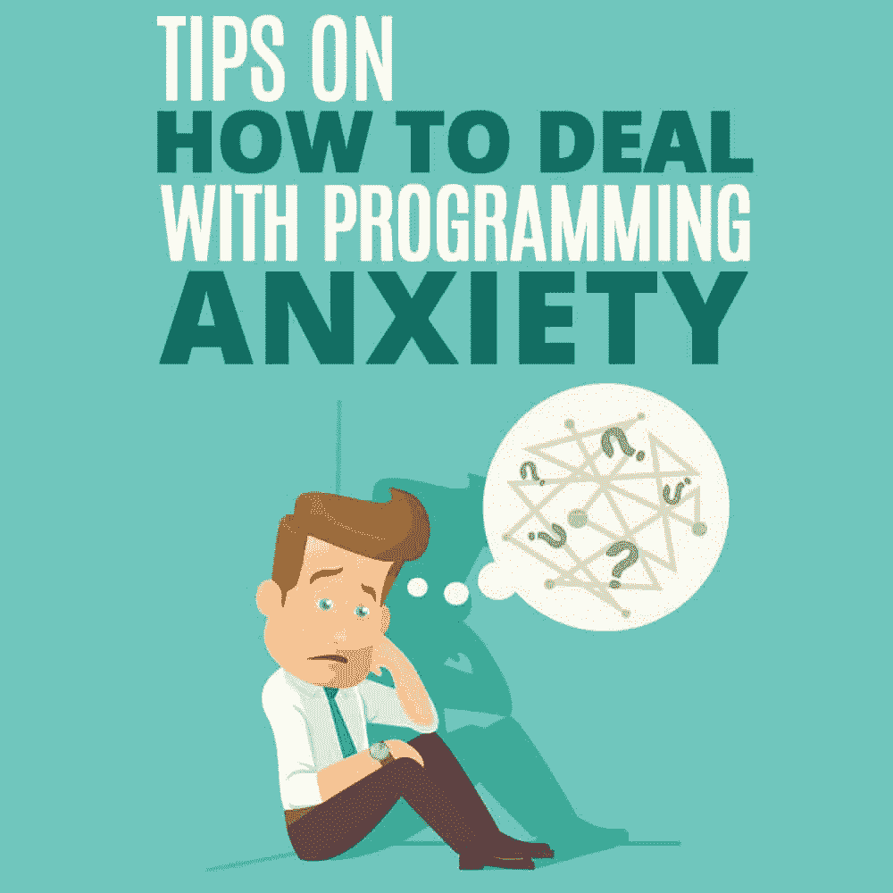

# 如何应对编程焦虑的小贴士

> 原文：<https://simpleprogrammer.com/programming-anxiety/>

<figure class="alignright is-resized">

</figure>

工作场所的焦虑影响着每个人，但有时感觉程序员最糟糕。

我们报酬过低，工作过度，并且几乎被公司的每个人误解。项目堆积很快，创意方向不断变化，由于公司里没有其他人理解我们的工作，他们没有意识到或不同情他们真正造成的压力。

正因为如此，2017 年，软件行业发布了比其他任何行业都高的员工离职率。虽然这很可怕，但并不奇怪。压力大，工作过度，本质上是编程文化的刻板印象。但不一定非要这样。

为了对抗现状，并给程序员提供健康对抗压力的方法，这里有一些关于如何应对编程焦虑的技巧。这些建议将让你能够控制自己的精神健康，对抗许多由长期压力引起的健康问题。

## 请求帮助

项目会很快堆积起来，在几分钟内将轻松的一周变成绝对的噩梦。当请求淹没你的收件箱时，你会感到不知所措。你可能会觉得你永远也完成不了。

这就是为什么向朋友和同事寻求帮助很重要。这可能意味着有一个同事协助你的工作职责。或者，可以请朋友或家人帮你做工作之外的事情。拥有一个支持系统对克服焦虑至关重要。

特别是程序员，容易忽略这个提示，把自己陷入困境。因为我们以解决问题和成为一个可以依靠来处理困难任务的人而自豪，所以寻求帮助会让人感觉像是软弱。

重要的是要记住，这是从来没有的情况。利用你的同事作为资源将有助于你个人完成更多的工作，并提高项目的整体质量。

## 设定诚实的截止日期

让堆积如山的工作变得可管理的另一个方法是设定诚实的、可实现的最后期限。虽然这似乎是显而易见的，但大多数人并没有坚持这个想法。

例如，如果你已经有一大堆工作了，而你的雇主要求你做更多，那就为你的工作制定一个准确的时间表。不要只是告诉他们一个他们乐意听到的时间表。

通过这样做，你将从额外的压力中拯救自己，因为你不会让自己变得更瘦，也不会产生匆忙的、充满错误的工作。

你还可以在高层中挽回你的声誉，因为当其他人给出不切实际的估计，说他们最终会失败时，你总是按时交付高质量的代码。

## 不要压抑你的感情

这在某种程度上与寻求帮助有关，因为这是让别人知道你的压力和焦虑的一种方式。但有时，我们也可能因为其他原因压抑自己的感情；例如，当我们不同意某事时。

简单地压抑你的焦虑对任何人都没有帮助，在某些情况下表达你的担忧有助于确保整个过程顺利进行。

与其与焦虑作斗争并试图隐藏它，不如拥抱它，甚至谈论它来处理这个潜在的令人衰弱的问题。然而，这并不意味着允许自己被压力消耗。

当你开始感到压力时，你不应该推后，假装它不存在。相反，你应该找到你压力的来源，并努力解决这个问题。

很多时候，我们感受到的巨大压力不仅仅是一件事；这是我们忽略的所有压力的总和。

这就是为什么直面焦虑并解决它是如此重要。

例如，如果你很早就知道你的代码有问题，你就不会等到犯了 50 个错误才试图改正它们。相反，你会立即纠正它，因为你知道这会让以后的生活变得更容易。你压抑的那些感觉也是如此。

## 定期锻炼

处理焦虑问题的最好方法之一是通过定期锻炼来解决它们。因为虽然锻炼对你的身体健康很重要，但对保持你的精神健康也是必不可少的。

这是因为体育活动会释放内啡肽，产生通常所说的“跑步者的高潮”

[https://www.youtube.com/embed/yIHyfr-IFkM](https://www.youtube.com/embed/yIHyfr-IFkM)

这种“兴奋”通过使你的身体充满内啡肽和[利用内源性大麻素系统(ECS)](https://www.scientificamerican.com/article/new-brain-effects-behind-runner-s-high/) 来调节情绪和减少运动期间和运动后的焦虑，从而产生缓解疼痛和减少焦虑的效果。

锻炼和 ECS 之间的关系是最近的发现，但这一发现是为什么许多运动员经常用大麻衍生的大麻二酚(CBD)油产品如外用面霜和橡皮糖来补充他们的锻炼。

因为 CBD 影响 ECS 的方式与锻炼类似，所以把它加入到你的锻炼或早晨的例行公事中是保持你注意力集中和无压力的好方法。

然而，根据哈佛健康杂志的一篇文章，仅仅走出户外，享受大自然就足以提升你的情绪。没有必要拿出补充剂，甚至流汗。一点点的运动和阳光就能带来巨大的变化。

## 休息一会儿

尽管所有这些建议都很棒，但当你在齐腰深的工作时，大多数建议都无法实现。这就是为什么我们把最重要的一课留到了最后:偶尔休息一下。

除非你在为复仇者联盟写代码，否则你的工作很可能不是生死攸关的事情。这意味着无论这些截止日期看起来有多重要，或者当权者告诉你什么职业道德，如果你充满焦虑和疲惫，你对任何人都没有好处。

让你的系统休眠一秒钟，从你的办公桌前站起来，每当你感到精疲力尽的时候，思考五分钟其他的事情。一旦你觉得你的头轻了一点，就重新投入工作，重新充满活力。

## 创造积极的前景

虽然这些建议可能不会消除你所有悬而未决的工作量，但它们有望激励你控制自己的心理健康，永远不要把压力当成生活的自然状态。

你有能力通过应对困难的方式来塑造你的世界。通过实践这些建议，你可以创造一个更积极的前景。

结合这些建议，加上你自己的正念和自我实现的方法，可以帮助你保持在焦虑和压力的顶端，防止它们悄悄靠近你。