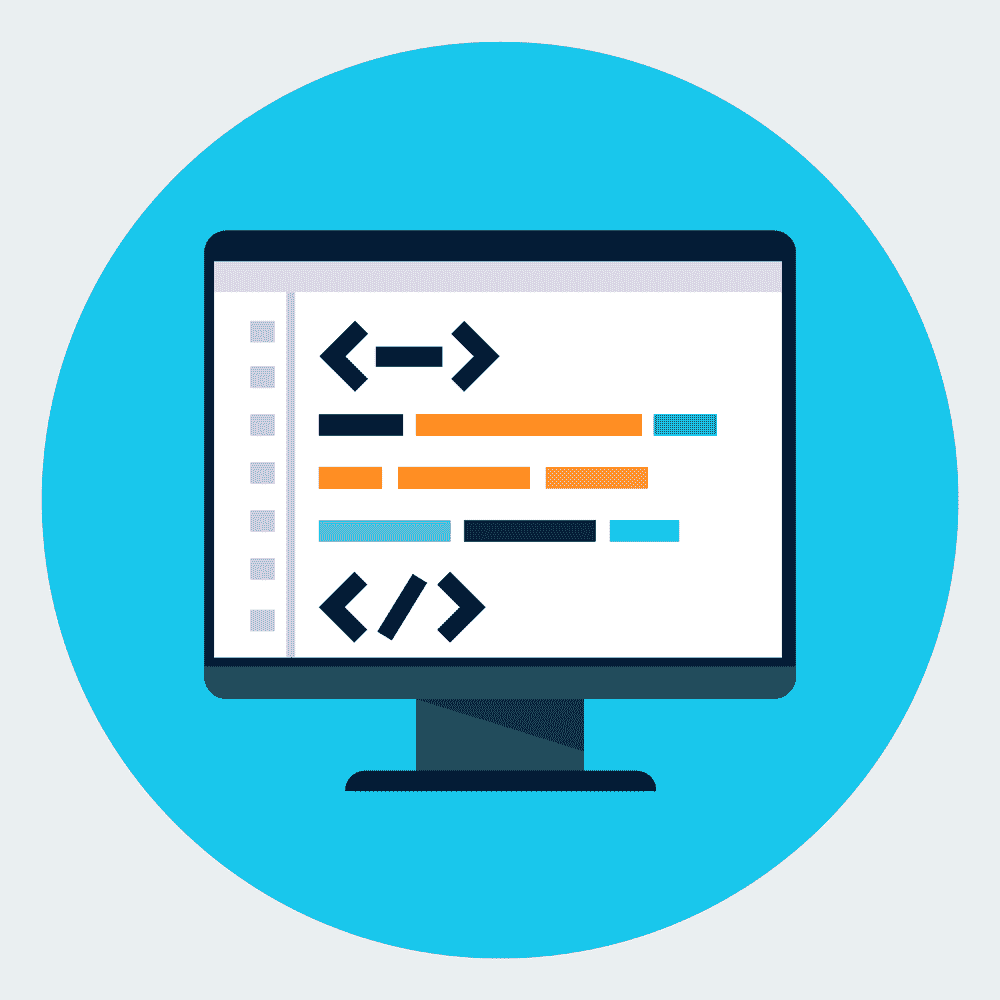

# 将推动您编程生涯的 5 项强大技能

> 原文：<https://simpleprogrammer.com/programming-career-techniques/>

<figure class="alignright is-resized">

</figure>

所以你已经编程有一段时间了，你不知道下一步该做什么来建立你的投资组合。

也许你是新来的，想成为一名出色的程序员。

当你在任何职业中积累经验时，你会经历一个有高有低的学习曲线。

当你第一次出发时，一切都令人兴奋。你每天都会遇到新的挑战，并对解决它们充满热情。

然后，几个月或几年后，你开始进入角色的平台期。你仍然喜欢它，但是你已经准备好学习一些新的技能来帮助你进入一个新的阶段。

你可能会开始错过学习新技能的挑战。然而，你不确定下一步该做什么。

如果你现在就在那里，那么这篇文章将帮助你重新构建一些你已经掌握的技能，让你前进。你将学习新的技术和策略来帮助你的职业发展。

让我们来谈谈能帮助你的投资组合更上一层楼的五项技能。
T1。med rectangle-4-multi-110 { border:none！重要；显示:屏蔽！重要；浮动:无！重要；行高:0；边距-底部:15px！重要；左边距:0！重要；右边距:0！重要；margin-top:15px！重要；最大宽度:100%！重要；最小高度:250px 最小宽度:250 像素；填充:0；文本对齐:居中！重要}

今天，我将讲述一项技术技能和四项软技能，它们将帮助你在职业生涯中取得进步。

首先，让我们来了解一下技术。

## 集成数据科学和分析

如今，数据科学是一个大行业。

虽然我们仍然看到可用的程序员数量和所需的程序员数量之间的巨大差距，但越来越多的人正在进入这个行业。这个行业有这么多新人，你脱颖而出是至关重要的。

随着纯数据科学家的不断增加，数据科学家的工资开始下降，那些能够跨业务和技术工作的人可以从中受益。

例如，如果你是一名自由职业的应用程序开发人员，许多客户希望在应用程序中加入数据科学元素。

您可以在您的应用程序中添加一个跟踪元素，与客户端共享关于客户行为的报告。这些数据可以用来增加应用程序的转化率。对于客户来说，这是一个好处，因为这将使他们赚更多的钱。

之所以这样，是因为很多 app 都是通过表面广告赚钱的。如果你能展示点击量更高的广告，客户就能从这款应用中赚更多的钱。

在应用的后端建立一个简单的数据分析和机器学习系统——根据用户的互动来定向广告——真的可以为客户端增加价值。你不需要谷歌 DeepMind 级别的人工智能来创造有用的东西。

### 程序员如何开始学习数据科学

从技术角度来看，有三个领域可以让您从数据科学起步:

*   **数据库设置和管理(本质上是后端开发)–**您需要了解如何在后端构建高质量的数据，以便可以有效地捕获和分析这些数据。
*   **提取数据并分析结果—**通常，这是使用结构化查询语言(SQL)完成的。您可以利用这一点来更好地了解该应用程序如何为客户服务。
*   **机器学习—**一旦你有了有用的数据，你就可以使用 Python 及其相关库在其上运行机器学习算法。当试图预测用户的未来行为时，这很有用。

所有这些技能都可以通过在线课程或老用户 YouTube 学习。

<figure class="alignright is-resized">

</figure>

然而，如果您是数据科学领域的新手，或者希望在编程生涯中取得成功，您可能不希望仅仅依靠您的技术技能。

和其他行业一样，拥有强大的技术背景显然是非常重要的，但是软技能确实可以帮助你脱颖而出。

所以，如果你想让自己与众不同，并真正推动你的事业，这里有四个软技能可以真正帮助你。

## 有效的项目管理

[项目管理](https://simpleprogrammer.com/programming-project-manager/)和组织能力对程序员有益。

您可以使用这些技能来协调您可能拥有的许多利益相关者和您的项目团队。这将帮助您不仅更快地交付项目，而且有效地管理期望。

企业中的许多人发现与软件开发相关的概念很难掌握。这些人可能不理解完成一个项目的过程。

您可以通过在开发中提供清晰的计划和里程碑来支持他们，这将有助于他们理解该过程。

作为一名程序员，我推荐开发的三项项目管理技能是:

*   **[利益相关者映射](https://study.com/academy/lesson/stakeholder-mapping-definition-importance.html)**——能够识别关键利益相关者及其在项目成功中的作用。有了这些知识，您就可以计划与这些利益相关者的合作。
*   **[里程碑计划](https://en.wikipedia.org/wiki/Milestone_(project_management))**[–](https://en.wikipedia.org/wiki/Milestone_(project_management))安排项目可交付成果并与项目干系人共享。
*   [**进度汇报**](http://www.businessdictionary.com/definition/progress-report.html)——简洁有效地分享更新，让团队了解开发状态。

与上面概述的项目管理技能密切相关的是一组技能，无论是在团队中工作，还是为客户单独编程，这些技能都是基本的。那就是沟通技巧。

## 出色的沟通技巧

沟通是帮助你向客户有效交付产品的关键。

沟通的一个主要部分是能够与人沟通，理解他们对某个话题的情绪反应。

一个经常被低估的能力是情商。

情商有可能成为另一个与企业界生活相关的时髦词汇。

但是你不应该让它。

拥有情商，理解客户对产品的情绪反应，将有助于你理解如何与他们沟通。

正如这篇简单的程序员文章中所讨论的，情商对于任何人来说都是一项强大的技能，包括希望在工作中表现出色的程序员。理解他人并以明智的方式回应他人需求的能力是一项重要的技能。

有许多不同的方法可以提高你的沟通技巧。

一个非常有效的技巧是向与你一起工作的人寻求对你沟通技巧的反馈。和他们坐下来，就他们觉得你在沟通方面的强项和弱项进行预先对话。

我知道这可能令人生畏，但如果你以正确的心态对待这个练习，作为一个学习机会，你真的可以更好地了解潜在的发展领域。

一旦你清楚了自己想要努力的领域，你就可以和你的经理一起去实现它们。

如果这一切感觉有点多，那么你可以从书中学到很多沟通技巧。

有很多可以选择。然而，根据我的经验，我用来提高沟通技巧的最有用的一本书是*[get to Yes:negoing Agreement Without Giving In](https://simpleprogrammer.com/gettingtoyes)。*

我知道你在想什么:“我是程序员，我不是做销售的。我为什么要读一本关于谈判的商业书籍？”

让我立刻打断你的思考过程。

不管你选择相信与否，你所做的每一次沟通都是一次谈判。

<figure class="alignright is-resized">

</figure>

就像和你的同事协商使用哪一个图书馆来运行你的程序，直到周五晚上和你的朋友一起看哪部电影。

如果有一个以上的意见或选择，这是一个谈判。

《走向成功》这本书很好地帮助你设身处地为他人着想。

作者教你如何更有效地理解一个人来自哪里，因此，如何向他们传达你的想法。这反过来促进了有效的关系。

当你打算发展你的编程生涯时，你应对和管理不同情况的方式对你的发展至关重要。

就像他们说的，你用蜂蜜抓更多的苍蝇！

## 利用你以前的经验

作为程序员，我们总是在学习和发展我们的技能。但是值得记住的是，并不是所有的技能和经验都是技术性的。

在你生活的这个世界上，有很多东西需要学习。这是一个你在一定程度上理解的世界，你对它有很多经验。

你的经历是一个难以置信的数据库，你可以从中提取数据，启动或提升你的编程生涯。欣赏你以前经历的价值将有助于你作为程序员发展独特的个人品牌。

之前的经历，或者你可以称之为训练数据，是你走到这一步的原因。这些数据也可以推动你前进，并为你当前的努力带来独特的见解。

没有人比你更了解你；你可以利用这些知识。

反思你以前的经历和你从中学到的东西对任何人来说都是一个有用的练习。通过反思，你可以把学到的东西内化，使之成为知识。

我们大多数人都熟悉以前的技术经验如何在新项目中发挥作用。

例如，假设您正在开发一个具有增强现实元素的产品。

如果这是你以前做过的事情，并且你发现了在某些装有 Android 的手机上渲染的挑战，这是你可以与客户分享的知识。你所掌握的知识将帮助他们理解新应用程序的不同选项。

另一个利用以往经验的例子来自为人父母。

作为一名家长，你习惯于平衡多个相互竞争的优先事项。你经常要在如何花费时间上做出艰难的选择，还要和难缠的客户(你的孩子)谈判。

你可以使用你在育儿过程中发展出来的成熟的技能和系统，然后将它们应用到你的编程工作中。你会惊讶地发现营销团队和孩子们是多么的相似！

实施有效的系统，让你在生活的各个领域都更有效率。

知识就是力量。

## 擅长合作和团队精神

与理解自己独特背景的价值相一致，看到他人带来的好处也是至关重要的。

看到他人作为团队成员带来的价值，将有助于你推动自己和他人的职业发展。毕竟，技术和发展都是关于合作的。

无论正在做什么类型的项目，如果你陷入了困境，你会希望能够找到一个解决方案。然而，制定解决方案往往需要许多人的智慧。

当处理一个可能阻碍发展的问题时，知道你有一个团队的支持是真正有价值的。

也许这个系统正在做一些你不理解的奇怪的事情。也许你用新的数据科学技能(:D)开发的算法需要更新，以管理所需的处理能力。

或者可能是代码中的某个地方有错误，尽管已经盯着它看了三个小时，但您就是找不到它！

程序员在团队中工作。在团队中，你们都能够有效地做出贡献是至关重要的。

在所有这些情况下，与他人合作解决问题的能力将有助于您的编程生涯。

## 在你的编程生涯中平衡技术和软技能

<figure class="alignright is-resized">

</figure>

这就是你要的，五项可以转移的技能将开启你的编程生涯。通过平衡你强大的技术组合和一些坚实的软技能，你将处于一个很好的位置，将自己提升到一个新的水平。

总而言之，您可以使用:

1.  向客户展示数据科学技能
2.  项目管理，掌控一切
3.  沟通以确保每个人都是一致的
4.  以前的经验，让你对项目有自己独特的见解
5.  更有效地解决问题的团队合作

技术理解是根本。但是要想脱颖而出，你需要利用你所有独特的训练数据。

你的工具箱里已经有了实施我们讨论的五个策略的工具。只要稍加提炼和打磨，你就会像钻石一样闪闪发光！