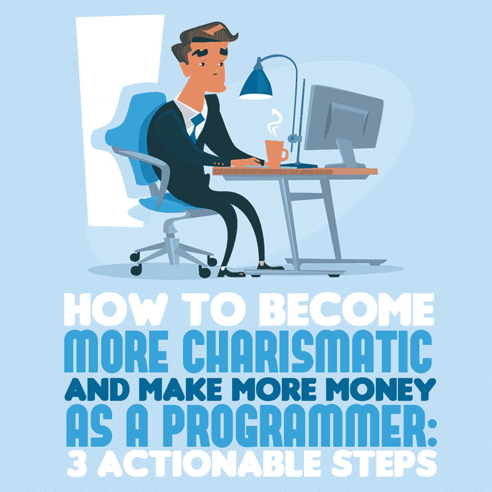

# 作为程序员，如何变得更有魅力，赚更多的钱:3 个可行的步骤

> 原文：<https://simpleprogrammer.com/programming-careers-charisma/>

<figure class="alignright is-resized">

</figure>

在我的计算机工程职业生涯中，我被解雇过三次——没有一次是因为我的编码或技术技能。

每一次，我都因为无法与重要的人建立强大而有意义的关系而被解雇。我是一个朋克程序员，认为唯一重要的事情是我编码的有多好。

作为程序员，我们被教导要相信，只要我们真的擅长编程，我们的职业生涯就会水到渠成。

然而，如果事实确实如此，为什么你公司里的经理、董事和副总裁连你一半的才华、聪明或才智都没有，却对你指手画脚？

答案就在你眼前:他们被提升不是因为他们是更好的程序员，而是因为他们更擅长交朋友、吸引人、影响人、激励人采取行动。

简而言之，他们有更好的人际交往能力。他们能够更好地处理冲突和困难的对话，他们比其他人更讨人喜欢。

如果我们想在程序员的职业生涯中取得成功，无论是作为企业家、顾问还是职业程序员，我们都需要发展非常强大的社交技能。在你的生活中，你能培养的最强有力的社交技能之一就是变得有魅力。

有魅力的人很快就能交到朋友，并影响他人的思维方式。有魅力的人激励他人。有魅力的人更讨人喜欢。
T1。med rectangle-4-multi-110 { border:none！重要；显示:屏蔽！重要；浮动:无！重要；行高:0；边距-底部:15px！重要；左边距:0！重要；右边距:0！重要；margin-top:15px！重要；最大宽度:100%！重要；最小高度:250px 最小宽度:250 像素；填充:0；文本对齐:居中！重要}

不幸的是，有一种神话认为有魅力的人天生就有魅力。然而，奥利维亚·福克斯·卡班在她的书《魅力神话 中揭穿了这个神话。她发现没有人生来就有魅力。相反，它是随着时间的推移和实践而发展的。

即使是比尔·克林顿——他被广泛认为是一个非常有魅力的人——在他开始职业生涯时也不是很有魅力。他差点被赶下民主党全国代表大会的舞台。下面我给大家讲讲他的故事。

事实是，魅力就像生活中的其他技能一样。它可以用非常特殊的方法来开发。

让我快速地告诉你一点关于我自己的情况。我曾经是财富 500 强科技巨头的电脑工程师。然而，我离开了那份工作，开始了一项名为“2000 本书”的书籍总结业务，我们将世界上最伟大的商业和个人发展书籍中的最佳想法压缩成 15 分钟的视频。

最近，我读了 30 多本关于发展人际交往和社交技能的最棒的书，在阅读中，我发现了三个概念，尽管这三个概念违反直觉，非常矛盾，但却是在生活中变得更有魅力的关键。

为了便于记忆，我称之为变得更有魅力的静脉注射法。

## 少说话，多倾听

我们错误地认为，为了有魅力，我们必须多说话，用我们的技能、聪明、智慧等给人们留下深刻印象。

然而，事实是魅力就是让别人说话。然后，至关重要的是，你要专注地听他们说话，仿佛他们是那一瞬间你世界的中心。魅力在于倾听和理解他人。

非常明确地说，这不仅仅是为了听而听。你必须积极地少说话，从别人那里寻找信息。你必须对它们感到好奇。

想出你可以问别人的有趣问题，这样你就可以理解他们的故事。这样，你会对他们了解更多。

你可以问一些开放式的问题，例如:

*   工作之外，你喜欢做什么？
*   如果你能改变这份工作/生意的任何方面，你会改变什么？
*   如果你拥有世界上所有的钱，你今天会做什么？

当你问类似这样的开放式问题时，对方不得不谈论他们自己。

当你让人们谈论他们自己时，他们自我感觉良好，结果他们开始喜欢你。

这里有一个简单的方法来思考魅力:当人们在你面前感觉良好时，他们会认为你很有魅力。

## 重要性——让别人觉得自己很重要

<figure class="alignright is-resized">

</figure>

魅力的一个常见误区是，为了变得有魅力，我们必须让自己在他人眼中看起来或听起来很重要。

然而，为了有魅力，我们必须做完全相反的事情。

魅力不是给别人留下深刻印象，而是被别人留下深刻印象。我们必须让对方感到重要，而不是试图让自己感到重要。

在《如何赢得朋友*[&影响他人](https://simpleprogrammer.com/howtowin)* 一书中，戴尔·卡耐基谈到了这样一个观点:你必须让对方觉得自己是房间里最重要的人。他说你必须对此保持真诚。不要试图奉承他们。你应该让他们觉得自己很重要，并且真诚地去做。

伟大的哲学家威廉·詹姆斯说过:“人性中最深层次的原则是渴望被欣赏。

我们必须意识到，重要不仅仅是人们的一种愿望。这是我们所有人最深切的渴望。我们都想被欣赏。所以，我们要让别人觉得自己很重要。我们必须真诚地去做。

让我给你一个简单的例子，告诉你如何真诚地让别人感到重要:

你刚刚听到你的同事说他/她很累，因为他们昨晚熬夜处理客户问题。

在这种情况下，你需要做的就是感谢他们刚刚所做的一切。所以你可以说一些简单的话:“哇…你在为这个生意牺牲你的个人时间。你很敬业。”

在那一刻，你真诚地让你的同事觉得自己很重要，很特别。一旦你开始寻找让别人感到重要的机会，你会发现它们就在你身边。这就是有魅力的人所做的，如果你想变得更有魅力，你也必须这样做。

魅力不在于声音大或者成为关注的焦点。这完全不是你的事，而是他们的事。这一切都是为了突出别人的优点，让他们觉得自己很重要。

## 弱点

我们不知何故相信，为了有魅力，我们必须表现得完美。然而，事实是我们很少有人喜欢看起来完美的人。

当我们试图表现得好像我们没有缺点或弱点时，我们给别人的印象是假的和不真实的。

想想你生命中所有你真正喜欢、崇拜或爱的人。是他们的完美让他们可爱，还是他们的不完美和脆弱让他们更加真实、可爱、讨人喜欢和可爱？

你总会发现，你爱的人是有弱点的人，是和你分享这些弱点的人。

如果你想让人们真正喜欢你和爱你，你必须在他们面前表现得脆弱。

与他人分享你的弱点可以让他们也这样做，这种交流是深层联系的本质。

脆弱是魅力最强大的支柱之一。

正如我前面提到的，许多人认为比尔·克林顿非常有魅力。但是他掌权背后的故事以及他如何变得对数百万美国人有魅力的故事非常有趣。

在本书 *[中点击](https://simpleprogrammer.com/click)* ***，*** 奥里·布拉夫曼讲述了比尔·克林顿是如何上台的。1992 年 6 月，克林顿在总统选举的民意测验中名列第三。他几乎无关紧要。他的支持率在 33%左右。

克林顿随后开始了一场脱口秀狂欢，他开始谈论自己的过去。他公开了他所有的弱点和他在生活中必须经历的所有挑战，包括

*   他酗酒的继父。
*   在单亲家庭中长大。
*   他艰难的童年。
*   他有毒瘾的哥哥。

由于这场运动，到 6 月底，他的支持率高达 77%。他在总统选举中名列榜首。

人们开始和他交往。他们现在能够接受他作为一个完整的人。

接受他自己的不完美让人们更喜欢他，想和他在一起，和他联系，如果我们想在生活中变得更有魅力，这也是我们需要做的事情。

你可能在想，在有同事、经理等在场的办公室环境中，你会变得更加脆弱。这里有一些对话的例子可以显示你的弱点:

*   你艰难的童年，
*   你在找工作时的挣扎，
*   你作为移民的挑战，
*   你第一次升职的努力，
*   你在与办公室的人打交道时的挣扎，

你可以想象，在你的职业生涯中，有很多方法可以让你变得更脆弱，更有亲和力，更有人情味。

## 魅力是每个人都可以学习的技能

<figure class="alignright is-resized">

</figure>

如果你真的想在职业生涯中赚更多的钱，你必须学会变得更有魅力，这样你才能交到朋友，建立强大的关系，激励和影响他人，最终实现你最大的目标。

我在这篇文章中与你分享的只是三个在商业和生活中变得更有魅力的自相矛盾的策略。

这些策略的有趣之处在于，它们非常违反直觉。它们几乎与大多数人为了在职业生涯中获得成功所做的事情完全相反。

好消息是，在我的 2x 社交技能项目中，我有 200 多个如此强大的技巧、提示、工具、想法和反直觉策略

*   变得更有魅力。
*   在任何环境下交朋友。
*   克服社交焦虑和害羞。
*   发展沟通技巧。
*   在任何情况下处理困难的对话。
*   当风险很高时解决冲突。
*   培养人际技能。
*   变得更讨人喜欢。
*   还有很多其他优秀的人和社交技巧。

这些都是你需要学习的策略，以便在你的职业生涯中成长，赚更多的钱。

你可能在想:什么是 2x 社交技能项目，这些 200+的策略是从哪里来的？

正如我之前告诉你的，在 2000 本书中，我研究了世界上最伟大的商业和个人发展书籍，并将这些书中的最佳知识压缩成 15 分钟的视频。

为了帮助人们提高社交和人际交往技能，我开设了一门名为“2x 社交技能”的课程

我研究了世界上 30 多本关于社交技能的伟大书籍。然后我从每本书里挑选出 5 到 10 个最重要的想法，制作 10 到 20 分钟的视频来总结这些关键的想法。然后我把它们放在 2x 社交技能项目中。

因此,“2x 社交技能项目”有超过 7 个小时的视频总结，介绍世界上最伟大的建立社交技能的书籍。

在一个 15 分钟的浓缩视频中，你可以从每本书中获得 5 到 10 个最重要的想法，这个视频很容易吸收，很容易回顾，也很容易立即付诸行动。

现在你可能在想:好吧，我可以自己读这些书。为什么我需要马尼的“2x 社交技能”项目？是的，你可以自己研究所有这些书，做大量的笔记，找出重要的想法，并把它们整理在一个地方，这样你就可以在需要的时候运用这些想法。

如果你一个月读一本书，光是读这 30 本书就要花你 2.5 年的时间。更不用说记笔记、确定大的想法、并保持它们都有组织以便快速回忆的时间了。那需要付出多大的努力？

坦白说，你的职业成长能等两年半吗？有了 2x 社交技能计划，你可以在 7 个小时内从这些伟大的书籍中吸收 200 多个最伟大的社交技能策略！

如果你想在 **[2x 社交技能项目](https://simpleprogrammer--2000books.thrivecart.com/2x-social-skills/)** 上获得较大折扣，我强烈推荐你在结账时使用简单程序员优惠券。我们每月为简单的程序员社区发放 50 张优惠券。

但是，一旦这 50 张优惠券在当月用完，优惠券代码将在本月剩余时间内停止工作，直到下个月的第一天配额被重置。

如果优惠券代码今天不起作用，只需等到下个月 1 日就可以使用优惠券代码“简单 1”只需点击此处获取 **[2x 社交技能书籍摘要包](https://simpleprogrammer--2000books.thrivecart.com/2x-social-skills/)** 并在结账时使用优惠券代码“SIMPLE1”，看看您今天是否能获得折扣。

顺便说一下，该课程提供 180 天 100%退款保证，因此您无需担心。

如果你真的想在职业生涯中成长，想比同龄人赚更多的钱，你必须投资发展你的社交技能。有了 [2x 社交技能书籍摘要包](https://simpleprogrammer--2000books.thrivecart.com/2x-social-skills/)，你可以从世界上最伟大的头脑中吸取关于发展你的人际交往和社交技能的最伟大的想法。