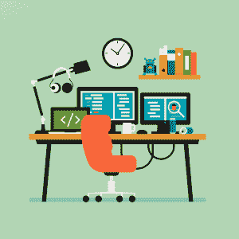

# 在重点时间段编程的重要性

> 原文：<https://simpleprogrammer.com/programming-focused-time-blocks/>

In this day and age, there are a seemingly infinite number of things that are pulling your attention to various places. With the invention of the computer and the internet, people are always trying to take your focus through texting, calling, social media, forums, and email.

你说吧，有很多方法可以让你分心。这使得专注的能力成为人们身上极其稀缺的技能，而这种能力在手中变得更加珍贵。

幸运的是，有一些方法可以提高你的注意力，比如分时段工作。作为一名程序员，在集中的时间段内工作是非常重要的，我将描述我是如何做到的，这样你就可以在今天开始用更少的时间做更多的事情！

## 为什么要全神贯注地工作？

大多数程序员在办公桌上用手机工作，一旦收到短信或电话，他们会马上回复。他们完全中断了对他们正在处理的代码的思路。

现在，回复你的家人或朋友可能对你真的很重要。你可能会坐在那里想，“现在回答有什么坏处？我只花一小会儿时间，然后从我停下的地方继续。”事实并非如此。这里发生的是你在转换任务。这带来了许多不利影响。

试图同时处理多项任务会让你的工作效率降低 40%。最重要的是，你并没有真正地一心多用；你只是在做一件事，把任务切换到第二件事，然后再切换回来。这样做增加了你在两个任务中出错的可能性，也增加了完成任务所需的时间。

对于复杂且需要更多脑力的任务来说尤其如此，这正是你在工作中为项目编程时所发生的事情。作为程序员，我们倾向于开发涉及大量数学的应用程序，而且我们是用不同的语言编写的。

如果你试图开发[任何伟大的](https://simpleprogrammer.com/the-hardest-thing-i-struggle-with/)，你将需要更深的关注，这将允许你更快更全面地提出解决方案。如果你中断了这些想法，你可能就不会想出一个如此稳健的解决方案，因为每次你的大脑转换任务时，你都必须花时间回到你之前的位置。

所以，现在你明白了，工作和社交生活之间的不断转换会带来很多不好的影响。那么，在开发世界上下一个最好的应用程序时，我们应该如何提高我们的准确性和生产率呢？

## 先决条件:设置您的环境

所以，在你开始工作之前，有些事情你应该现在就开始做。第一:排除杂念。这意味着所有让你分心的事情，所以不要抓住那些你想保留的事情不放。

例如，如果你的房间里有一台电视，你喜欢狂看《硅谷》,那么我建议你去别的地方工作。这一步的目标是让你很难分心。你不想让你的注意力容易被打断。

我抓起耳机听音乐来屏蔽外部噪音。我把手机放在我够不到的地方，并把它设置为免打扰模式或静音。我确保我看不到会让我分心的东西，比如背景中的电视或可以俯瞰外面正在运动的人们的窗户。一旦这一步完成了，你就可以继续得到你需要的东西了。

作为一名程序员，我喜欢让我的笔记本电脑至少有一个额外的显示器和一个笔记本来记录应用程序编程接口(API)或完成我可能正在努力解决的算法。此外，我确保手边有一些水和一个充电器，这样电池就不会没电了。

Really, these steps will differ from person to person based on the distractions in their environment and the materials they may need to work. I suggest listing all possible things that could distract you and remove them from your environment, and list all the things you need and grab them.

现在来谈谈如何真正度过你将要工作的时间！

## 设定一个有时间限制的目标

我遇到的一件事改变了我做事的心态，那就是 [*帕金森定律*](http://acucciniello.com/ultimate-productivity-parkinsons-law/) 。它表明你所做的工作将扩展到填满分配给它的时间。

例如，如果给你一个截止日期，在这个星期五之前完成对你的特性分支的修改，你会找到一个方法在这个时间段内完成它。我已经开始在我的生活中实现这一点，并发现它实际上是多么强大。

那么，我们如何在日常工作中运用这一法则呢？

我倾向于问自己这样一个问题:“有什么事情是[我现在](http://amzn.to/2HIJIpG)[可以做](https://simpleprogrammer.com/developers-guide-resilience/)的来让我剩下的日子过得更轻松？”问这个问题有助于你专注于一件对你一整天都有最大好处的事情。一旦你回答了这个问题，选择一个你认为可以完成任务的时间段。那么我会建议你试着减少更多的时间。

现在，带着这个目标开始工作，并努力在你分配的时间内完成任务。

假设您正在为公司的 web 应用程序修复一个 bug。由于某种原因，用户的地址显示不正确，它显示了不同的用户地址信息。

如果您对数据库(尤其是您目前正在使用的数据库)和 web 开发很有经验，那么您可能认为您可以在半小时内修复这个 bug。然后，利用你刚刚学到的知识，你把它缩短到 25 分钟。

在三分钟内，你消除了干扰，为一天做好了准备。然后你设置一个 25 分钟的计时器，然后直接开始工作。

在这段时间结束时，您可以用几分钟的时间来解决这个 bug。你注意力高度集中，从不分心，能够极快地分析复杂的情况。

## 今天就集中精力！

现在，读完这篇文章后，我希望你正在思考拿起手机并藏起来的不同方法，这样你就不会分心了。

你能想象你在没有高生产力的情况下度过的所有时间吗？你失去了 40%的时间，而且再也回不来了。不过，现在不是了！

作为程序员，在集中的时间段工作更加重要。我们日复一日地解决复杂的问题。为了能够准确有效地解决这些问题，我们必须一次专注于一个目标，及时解决它，并进入下一个困难的任务。

今天是你停止分心的一天。去建立你的成功环境，并使用集中的时间块，以便成为一个多产的程序员！