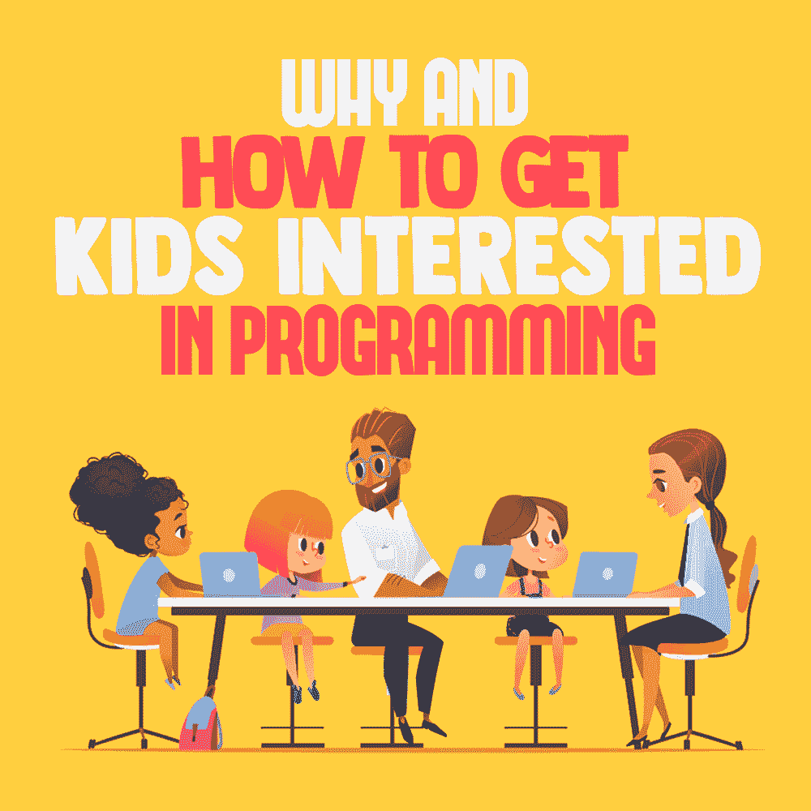

# 为什么以及如何让孩子对编程感兴趣

> 原文：<https://simpleprogrammer.com/programming-for-kids/>

For most programmers today, explaining to their grandparents what they do for a living can be an exercise in futility, as the grandparents often do not follow, mostly because older generations perceive the concept of programming as novel. However, the truth is that coding has been with us for nearly two centuries.

第一个算法是由数学家[阿达·洛芙莱斯](https://en.wikipedia.org/wiki/Ada_Lovelace)写的，他与被称为“计算之父”的[查尔斯·巴贝奇](https://en.wikipedia.org/wiki/Charles_Babbage)同时代该算法是在 1842 年至 1843 年间为巴贝奇的分析机编写的。但是由于分析引擎从未建立，算法从未运行。然而，它是一个复杂而可靠的算法，即使在现在，当编程作为一个领域自最初的日子以来在复杂性方面已经大大增长时，它仍然受到尊敬。

为了真正理解编码领域的发展方向，以及为什么我们应该把它教给我们的孩子，我们需要首先理解它有多重要。

编码很像教学，只不过你是在教一台计算机，而不是一个人，去执行一项特定的任务。为了有效地与计算机交流，你必须用计算机可以理解的语言说话，这种语言被称为[编程语言。](https://simpleprogrammer.com/learn-any-programming-language/)

这些代码看起来并不总是一样的，今天很少有人能够理解六七十年前的代码。最初，代码是以穿孔卡片上的孔的形式写出来，然后装入计算机。从那里，它继续到数字，然后是单词。

今天，计算机代码看起来几乎像我们在对话中使用的英语。这种演变不仅使程序员更容易高效地教授计算机，而且也使他们更容易首先学会如何编码。随着越来越多的人因为使用计算机语言的便利而能够与计算机交流，计算机技术和系统已经越来越成为我们生活的一部分。

目前，有许多编程语言。其中一些是为特殊目的而建造的，而另一些是通用的，可以根据偏好和任务的性质进行互换。

对于万维网来说，HTML、CSS 和 JavaScript 是至高无上的。对于统计，R、Python 和 SAS 是默认语言。AutoCAD 语言帮助工程师使用 CAD 软件进行设计，而 C++、Java 和其他语言是多用途程序，几乎可以在任何地方使用。

它已经到了这样一个地步，由于这样或那样的原因，不依靠计算机做生意几乎是不可能的。出于这个原因，程序员正在成为全世界公司的无价资产。程序员的就业市场每年都在增长。这是一种趋势，我们可以预期这种趋势将持续到未来，这意味着这是我们的孩子在成长和进入就业市场时所拥有的一种宝贵的资格。

## 编码远远超出了科技行业

当编码出现时，只有技术部门可以利用它。情况不再是这样了。事实上，许多程序员的职位空缺甚至不在科技公司。他们中的一些在医疗保健行业，一些在政府部门，一些在金融行业，还有一些在传统制造业。随着数字营销的出现，甚至营销人员也可以使用编码技能。

编码也在走一个特别的方向。随着技术的快速发展，许多软件公司都致力于让学习如何编码和有效编码变得更容易。

像 [Bubble](https://bubble.is/) 、 [Zeroqode](https://zeroqode.com/) 和 [Sparkster](https://www.youtube.com/watch?v=13h0t34Olgw) 这样的公司已经采取了重大举措，让任何人都可以轻松地使用代码构建东西。大多数情况下，只需拖放软件所需的元素，并使用常规的英语会话编写逻辑代码，就很简单了。

通过给每个人一个编码的机会，一场革命正在行业中发生，这场革命将从那些受过高等教育并因熟悉晦涩难懂的编程语言而获得报酬的 1%的人手中夺走编码。对于许多人来说，维持现状，保持编写独家俱乐部代码是一件好事。然而，对我们大多数人来说，让大众能够接触到它是最好的事情。

## 为什么我们需要吸引下一代

编码不再仅仅是软件工程毕业生的专利。很多工作都把它作为工作要求之一，薪水也高于平均水平，以体现它的重要性。全国各地也有很多帮助求职者学习如何编程的训练营。它们像蘑菇一样层出不穷的事实清楚地表明对它们的需求很大。

也有人努力在我们的学校里向年轻人教授编码。政府和私人机构正在做出许多努力来鼓励[将编码整合到课程中](https://www.nytimes.com/2014/03/24/world/europe/adding-coding-to-the-curriculum.html)。

因此，编码是一项重要的技能，可以尝试教给我们的孩子。通过让他们参与进来，我们为他们提供了一项重要的技能，他们将能够在未来使用这项技能来实现他们的梦想。趋势是，随着时间的推移，编码将成为和读写一样的基本技能。不教我们的孩子这种技能就是给他们的未来留下残疾。

那么，我们如何吸引年轻的未来程序员呢？我们如何教他们编码？以下是所有教育工作者在向年轻人介绍奇妙的科技世界时应该考虑的一些建议。

### 不要强迫任何事情

这是一个很好的规则，尤其是对年幼的孩子来说。如果你把所有的规则和协议都介绍给孩子们，他们就不会喜欢科技世界。这会让他们觉得这只是他们在学校不得不做的又一件无聊的事情。相反，向他们介绍奇妙的技术世界，然后让他们玩。

鼓励他们在开始时使用像 Scratch 这样的初学者编码语言来修补和解决问题。如果有必要，就让他们打碎东西。他们会在这个过程中学习创造新的东西。

### 好奇心是你的朋友

“Children will not decide to venture into computers because they’re convinced they’ll get great jobs out of it. They’re children and have no conception of what a great job is except what adults have told them. They’ll only try technology out if they are curious about it,” says James Carver, a tech writer at [UK Careers Booster](https://uk.careersbooster.com/).

让孩子们对技术感到好奇，他们中的一些人会用一生的时间来满足这种好奇心，这将导致他们在该领域的职业生涯。

### 早期接触很重要

项目是鼓励你的孩子在早期学习设计、编码和工程技能的好方法。技术在快速发展，基础设施变得越来越容易使用，甚至对小孩子来说也是如此。尽可能早地让你的孩子接触编码和技术的世界，鼓励他们探索他们的计算设备的基础知识，这样他们就可以对可能性感到好奇。童年早期的好奇心真的会影响他们，鼓励他们想要学习更多。

### 编程应该是有趣的

诀窍是允许你的孩子在编程时玩游戏作为学习的一种方式。他们不应该像看待其他学科一样看待它，认为它是枯燥的工作，否则他们就不会取得很大的进步。编程本来就很复杂；没有必要通过打乱教学方法来使它变得更加复杂。允许孩子们建造他们喜欢和喜欢的东西。

当你向孩子们展示编程时，你应该让它看起来像一个他们可以玩的有趣游戏，就像他们习惯的其他游戏一样。从这个意义上来说，这里有很多发挥创造力的机会。无论你做什么，记住关键词是有趣。你甚至可以从像[xpertwriters.com](https://xpertwriters.com/)这样的内容准备专家那里获得帮助，以一种孩子们会喜欢的方式为你的课程准备学习材料。

## 培养未来的程序员

通过让我们的孩子尽早熟悉编程，我们正在建设一个更光明的未来——不仅是为了他们，也是为了我们所有人。

很明显，软件是世界未来的重要组成部分。让下一代为未来做好准备是有意义的。