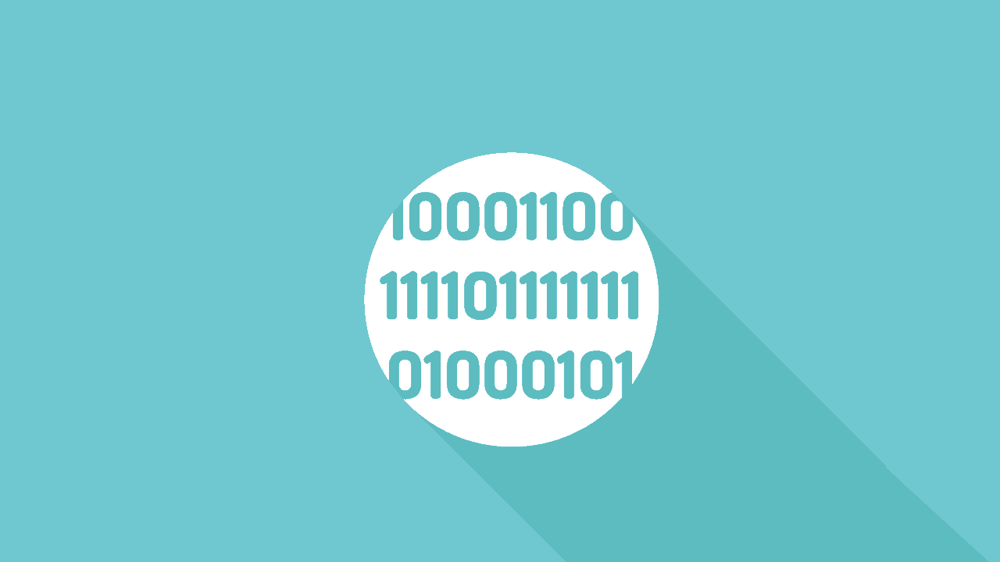

# 选择编程语言并不重要的 4 个原因

> 原文:[https://simple programmer . com/programming-language-sent-matter/](https://simpleprogrammer.com/programming-language-doesnt-matter/)

在我作为软件开发人员的职业生涯中，我为不同的项目使用过许多流行的编程语言。今天当我回头看的时候，我相信第一个(确切地说是 C)是最难的一个。我后来使用的每一种编程语言都感觉更加舒适和直观。例如，当我在 2005 年从 C 语言中学习 Java 时，我很难掌握面向对象编程(OOP)的概念(在 Java 之前我也曾在 C++中工作过，所以 [OOP 概念](https://stackify.com/oops-concepts-in-java/)对我来说并不陌生)。

现在当我开始学习一门新的语言时(最近，我开始学习 Python 和 Swift)，不到一周的时间，我就清楚地知道我需要看哪些概念来开始编程。

在这篇文章中，我将分享我在使用不同编程语言的过程中积累的智慧。我希望这将有助于初学编程的人不要犹豫选择哪种语言，并立即开始。

这篇文章还将帮助有经验的程序员认识到把一切都押在他们已经使用多年的一门语言上是多么危险，并激励他们学习新的东西。所以让我们开始吧。

## 编程是一个概念

我认为编程语言的选择不是首要问题的第一个原因是，编程实际上是一组模式，帮助我们有效地指导机器解决现实世界的问题。这是一个核心概念。如果你拿起两本不同语言的编程书籍，翻阅前五章，你一定会注意到其中的模式。我们将学习如何定义不同数据类型的变量，如何为这些变量赋值，以及如何对这些变量执行逻辑和数学运算。还会有一些课程，教你如何指导计算机通过“if”、“else”和“switch”语句做出逻辑决策，并通过“for”或“while”循环重复相同的操作。所以，当你学会第三种编程语言时，你就会知道前 10 章会发生什么。显然，会有一些你以前没有见过的语言特有的特性。但是这不应该超过学习一门新语言所需努力的 30%。

我总是建议新程序员多关注如何写出[好的算法](https://simpleprogrammer.com/2016/09/15/learning-algorithms-really-necessary/)或者伪代码。每当你有一个可以通过基于数据和计算的逻辑决策来解决的问题时，你应该考虑如果你必须用笔和纸来手动完成这个任务，你将如何完成它。然后你应该在笔记本上记下这些步骤，并头脑风暴如何安排这些步骤，这样你就可以用最少的步骤优化输出。

例如，假设您为一家保险公司工作，您需要计算向一位潜在客户收取的保险费，该客户提供了面值为 100，000 美元的“人寿保险”福利。如果您必须在不使用企业软件应用程序(使用笔、纸、计算器和参考文档)的情况下完成这项工作，您必须遵循以下步骤:

1.  根据提供的出生日期确定客户的年龄。
2.  根据年龄从产品规格表中查找保险费率(每 1000 美元面值的保险费)。
3.  将保险费率乘以要求的票面金额 100，000 美元。

如果您清楚地理解了上面提到的步骤，您将能够通过以下步骤将它们转换成您选择的编程语言的软件应用程序:

1.  通过桌面或移动用户界面(UI)捕获与客户请求相关的输入。
2.  使用适用于您的语言的标准日历功能，使用这些输入来确定客户年龄。
3.  查询企业数据库，查找基于客户年龄的保险费率。
4.  将保险费率乘以要求的票面金额，以确定所需的保险费。
5.  在 UI 中显示计算出的保险费。

所有流行的编程语言都提供了完成上述步骤的方法。所以，如果你用 Java 写了一个程序来做这件事，你认为用 Python 复制它需要多长时间？

计算机程序只是帮助我们快速地重复执行指令。但是由程序员决定他们如何编写指令，这又取决于他们编写算法的能力。如果你能从逻辑上将一个问题分解成独立的、小的、独特的步骤，那么你很有可能成为一名优秀的程序员。算法是永恒的。它们实际上驱动了每一个用任何语言编写的软件程序。如果你理解这个算法，你可以很容易地把它转换成一个运行的应用程序。

您还应该关注数据结构，并且应该很好地理解哪些算法适用于哪些数据结构。数据结构定义了数据在应用程序中的组织方式。所有种类的软件都处理或大或小的数据集，以产生有意义的结果。所以，你的程序工作的效率取决于你使用的数据结构的种类。我们常用的一些流行的数据结构是列表、映射、集合和 N 维矩阵。算法处理数据结构以产生结果。

你应该关注的另一个关键概念是设计模式。设计模式捕捉到如何通过遵循一种模式来解决具有类似挑战的编程任务，这种模式在过去被证明是成功的，并且能够在不同类型的项目中重复其成功。大多数流行的设计模式是与语言无关的，可以用任何编程语言实现。一个简单的、仍然流行的设计模式的例子是工厂模式，它用面向对象的编程语言封装了对象的创建。

《头脑优先设计模式》和《T2 设计模式:可重用面向对象软件的元素》是我最喜欢的书，它们以一种容易理解的方式解释了设计模式。

有了上面的概念，你可以在很短的时间内征服任何编程语言。对于任何语言，你真正需要学习的是特定的**关键词、语法、应用编程接口(API)**和某些概念。这些方面可以通过立即开始一个简单的迷你项目来掌握。

就我个人而言，我不喜欢“你好，世界！”项目类型；你必须选择感觉真实的东西，即使它不是大规模的。你可以简单地为自己建立一个待办事项清单软件或支出追踪软件。在最初的几天，你必须参考一本书或在线文档来了解语法和 API。然而，你写的代码越多，你需要参考的文档就越少。

## 编程是关于交流的

编程就是指导机器按照什么顺序执行什么动作来解决现实世界中的问题。因此，对于一个高效编写的软件程序来说，有效的交流比选择编程语言更重要。

根据我的经验，一个具有良好沟通技巧(口头和书面)的人很可能成为一名优秀的程序员。编程是一种向机器传达如何执行特定步骤的方式，以便软件可以实现一些定义的业务目标。程序员用编译器能理解的语言与机器对话，编译器再一次把指令转换成微处理器可读的指令。

二十年前，程序员用汇编语言编写微处理器。这是一种非常低级的语言，需要理解底层硬件架构才能给机器编程。随着编程的进步，我们创造了更接近自然语言的编程语言。我们的目标始终是让我们能够用自己觉得舒服的语言来指导机器。由于所有的编程语言都试图让代码简洁易懂，编码语法之间的差距也在缩小。这可以减少学习新编程语言的学习曲线。

Python 程序员可以编写 10 行代码来解决 C 或 COBOL 程序员需要 100 多行代码才能解决的问题。然而，一个 C 程序员通过掌握 OOP 概念可以很容易地学习 Java。类似地，一个 Java 程序员可以用不到一个月的时间轻松切换到 Python。

如果你能用 Java 指令一台机器，你肯定也能用 Python 给出同样的指令。所以你的重点应该是学习任何流行的通用语言，最好是面向对象的语言。如果你这样做了，转换到其他语言并没有你想象的那么困难。

## 没有一种编程语言是通用的

不应该专注于任何特定编程语言的另一个原因是，语言的选择可以根据您试图解决的问题类型而变化。对于一个健壮的服务器端企业软件，你可能会选择 Java 对于数据科学相关的项目，应该选择 Python 或者 R；移动开发，需要选择 Swift。这背后的原因是框架和包的可用性使得编程语言更适合某些项目。框架处理大部分样板代码，使程序员能够更专注于要解决的问题。

所以我的建议是，无论你当前的项目使用什么语言，都要掌握前面描述的基本编程概念(数据结构、算法和设计模式)。如果你能正确地做到这一点，当你改变项目、转换公司或者想从事一些个人副业时，你就能很容易地转移到任何其他编程语言。

在你着手任何新项目之前，你必须研究最适合该项目的项目。你不应该简单地去使用一种语言，因为你已经知道它，并对它感到舒适。那会导致一场灾难。

## 编程领域正在快速发展

技术发展非常迅速。一些流行的编程语言如 Perl 和 Ruby 正在走向消亡，而新的编程语言如 Swift、Kotlin 和 R 正在流行起来。当我们试图发现编程可以用于改善我们生活的新方法(例如，家庭自动化、无人驾驶汽车、机器人手术)时，我们不断创造新的编程语言(例如，R)、框架和工具，以使其更好、更快。因此，如果你想在这个时代让你的职业生涯适应未来，你必须通过学习新的编程概念(例如，深度学习)和语言来快速发展，这样你才能跟上这种快速变化的步伐，并适应未来。总是试着把更多的注意力放在基本的编程原则上，这些原则是永恒的(正如在上面的章节中所指定的)。

所以，我希望我能够说服你为什么你需要优先考虑编程概念而不是编程语言。如果你的基础很强，你将通过学习新的编程语言在这个不断变化的技术领域中生存下来。这将帮助你保持相关性，变得真正不可动摇。