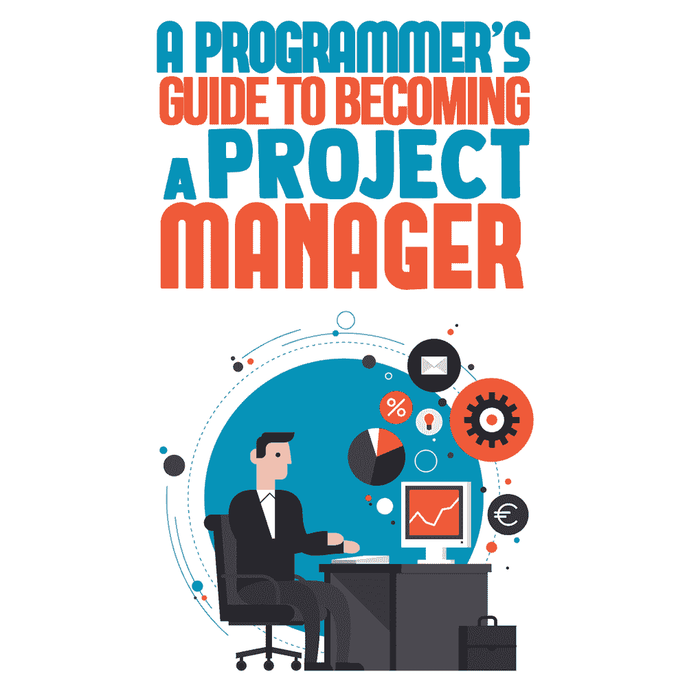

# 成为项目经理的程序员指南

> 原文：<https://simpleprogrammer.com/programming-project-manager/>

Digital project management is a growing field; therefore, many companies are in need of a good project manager (PM). If you’re a programmer, you’re already accustomed to working with digital tools, outside clients, tight-knit teams, and competing deadlines. That means you could make a great PM, if you set your mind to it and are ready for the challenge.

在一个越来越多的人选择编程作为职业的世界里，你可能正在寻找一种脱颖而出的方式。或者也许你厌倦了调试代码和优化用户体验(UX)，正在寻找一种不同的挑战。你不仅拥有成为一名项目经理的正确技能，而且你很可能比其他不像你一样拥有深度和广度的软件知识的项目经理更有优势。重塑你的编程生涯；考虑成为一名项目经理。

作为一名程序员，你可以向这个领域提供具体的可转移技能(我将在下面详细介绍)。对于如何让从编程到项目管理的跨越变得更舒适，我也有一些建议。

但首先，让我们看看几个重要的问题:什么是项目管理？跟编程有什么关系？这是一个让你感兴趣的职业发展吗？

## 为什么是项目管理？

简而言之，项目经理从头到尾指导一个项目，监督从集思广益到交付最终结果的一切。对很多不同的人来说，这意味着很多不同的事情。

您的一些主要关注点可能包括监督敏捷工作流、即时解决问题、优化 UX、报告和分析、为团队和/或新员工选择和教授项目管理软件、持续集成、网站编码、集成反馈等等。无论你在管理什么样的项目，你都可以指望其中一些对你很重要。

## 项目管理中的 IT 专业化

根据你是什么级别的项目经理，你可以期望从 44，000 美元到 135，000 美元不等。根据 Glassdoor 的数据，目前的平均年收入约为 9 万美元。这意味着在项目经理的职位上，你有足够的发展空间。

影响你薪水的一个因素是你被认为是多面手还是专家。作为一名程序员，你很可能是数字项目、软件和编码等领域的专家，这将对你作为项目经理有所裨益。你很可能拥有公司认为非常宝贵的不同软件和硬件的知识——这些信息是他们无法从书本或网上快速学到的。

考虑一下:经前综合症可能来自任何地方，无论是通信、零售管理、人文学科还是心理学研究。任何有领导欲望的人都可以成为首相。但不是每个人都可以设计软件和应用程序，为广告设计 A/B 测试登陆页面，或者从头开始编写网站代码。这些是硬技能，会让你成为受欢迎的雇员。

为什么？每个客户都有对数字工作的需求，即使只是对搜索引擎优化(SEO)专业知识或基本网站编辑的需求。你可以成为一名项目负责人，也可以承担这些任务的本质复杂性，从而让你的角色更有价值。

总体而言，金融和 IT 行业倾向于为预防性维护服务支付更多费用。这意味着任何程序员在工资谈判和期望方面都会在 IT 项目管理中占有优势。大多数 IT 项目经理(ITPMs)希望至少了解 web 设计和开发的基础知识，这又一次让任何程序员都比其他人高出一步。

## 程序员到项目经理:可转移的技能

问:为什么程序员应该考虑转向 PM？

答:因为他们已经具备了完成这项工作的条件！

作为一名程序员，你所做的、知道的和学习的很多东西对一名项目经理都是有用的。这些可取的和可转移的特质不仅会帮助你完成工作，而且在任何以项目管理为导向的面试中，它们也将是方便的话题。

### 1.产品-测试-优化反馈回路

You may be the PM on the development of a new app or for the marketing initiatives of consumer packaged goods. Either way, you are going to follow the same basic steps for achieving results: Produce. Test. Optimize. Repeat. This is a cycle that programmers know like the back of their hand.

当过渡到 DPM 职位时，试着突出你在这一过程中擅长的例子，如提前期优化或对调试的敏锐眼光。

### 2.网站编码

你读写代码的能力对任何想雇佣优秀 DPM/PM 的人来说都非常有用。即使你管理的项目不是特定于网站的，拥有一个懂 HTML5/CSS3 的人来做一些小的调整和调整在今天也是非常有价值的。

能够想象和设计一个网站是一个简单的例子，说明你如何理解在项目管理中有用的生产周期的种类。

### 3.熟悉仪表板和警报系统

仪表板和警报系统可能是你作为程序员的第二天性。然而，并不是所有的公司或品牌都熟悉这种变革性的工作组织方式。即使熟悉基本的工作流程助手，如 Asana、Slack 和 Trello，也会让你在大多数潜在雇主面前看起来像一个项目经理超级明星。

### 4.了解用户需求/UX

作为一名程序员，你需要猜测你的受众需要什么，制作它，测试反馈，然后相应地重建。有远见和必要的手段去知道不同的用户需要什么，他们什么时候需要，在什么情况下需要，这是项目管理的本质。

观众需要什么？我们如何到达那里？现在，我们如何改进？强调你在这个过程中的经历，因为它天生就让你为项目管理做好了准备。

### 5.数据分析

解读分析。汇编和组织数据。将取得的进展与目标衡量指标进行比较。作为一名 DPM/PM，您将做很多上述工作。事实上，这是你在项目管理领域衡量成功的一个关键方法。客户希望看到结果，了解分析的基本性质和收集数据的不同技术会让他们满意。

### 6.项目管理方法

许多项目管理的组织/工作流方法来自软件开发。这意味着你将熟悉*流程中的不同步骤，*即使客户和产品对你来说并不熟悉。

理解并成为工作流框架的一部分，比如瀑布、SCRUM、看板、XP、迭代开发、特性驱动开发，以及这些列出的任何组合，已经使你为项目管理做好了充分的准备。

## 如何给自己优势

毫无疑问，程序员会成为优秀的项目经理。但你如何说服潜在的雇主呢？这里有几个方法可以让你在申请项目管理职位时占得先机:

*   **可以在项目管理** **中获得** [**证书。虽然这不是至关重要的，但拥有它肯定不会有坏处，尤其是如果你已经没有太多(或任何)项目管理经验的话。如果没有别的，这表明你对这份工作很认真，而且你愿意学习。**](https://thedigitalprojectmanager.com/project-management-training/)
*   有一个利基/专长。这不仅会让你在任何工作场合都更有价值，还会更好地筛选出最适合你的 DPM 工作。选择一项硬技能和一项软技能，灵活运用它们，让你在行业中脱颖而出。有具体的例子来支持它。几乎每一次 PM 面试都会问你具体能带来什么。
*   将自己推销成一名产品营销经理或 ITPM。不要低估自己。仅仅因为你的职称现在更符合“程序员”，这并不意味着你的简历、求职信和个人品牌不应该在每个推介中都包括“项目经理”。突出你激发想法、坚持到底直到完成的方式，以及展现领导力的方式。那是给你的" PM "!
*   **温习一下** [**面试技巧**](https://simpleprogrammer.com/developers-coding-interview-mistakes/) **。无论你面试的是编程、项目管理还是编程项目管理，你都必须掌握面试的艺术。这不仅会帮助你完成任何计划中的职业转变，还会鼓励你发展一系列技能，这些技能在某个时候对你无疑是有用的。**
*   **从事你的行业。转发或回复你所在领域的时尚引领者，以显示你对流行趋势的关注。在社交媒体上与编程影响者接触(我现在就喜欢 [@codinghorror](https://twitter.com/codinghorror) 、 [@MinaMarkham](https://twitter.com/MinaMarkham) 和 [@OdeToCode](https://twitter.com/OdeToCode) )，展示你在思想领导和创新方面的参与。所有这些都让你从一个普通人变成了一个受关注的人。记住:经前综合症需要走在曲线的前面，而不是奋力追赶。**
*   **

    磨练你的“软技能”**许多编程和 IT 工作被认为是硬技能(例如，懂 C#、C++、Java 和 HTML5)，但不要忽视你的“软技能”(比如沟通、领导和创造力)。未能投资于你的软技能开发是程序员最常犯的错误之一。拥有两者的完美融合将使你成为一名出色的 DPM。事实上，如果你决定满足于目前的现状，它会让你成为一名杰出的程序员。
*   永远不要停止学习。关注项目管理博客。阅读 [PM 书籍](https://simpleprogrammer.com/get/project-management)。学习一种新的编码语言或工作流方法，这可能有助于未来的项目管理机会。做一个有激情的项目，在那里你可以测试和磨练你在朝九晚五的工作中接触不到的技能。跟上你已经熟悉的领域的发展。跟上行业新闻和更新。做一块海绵，而不是一块砖头。潜在雇主会欣赏一个自己承担培训和教育责任的项目经理。

## 作为项目经理开始你的职业生涯

无论你是想改变一下生活节奏，还是想提高某项技能，项目管理职业对任何程序员来说都是一个很好的选择。凭借您深厚的技术知识和一点人际交往技巧，您今天可以开始一份新的职业，成为一名项目经理、一名 ITPM 或一名项目经理。