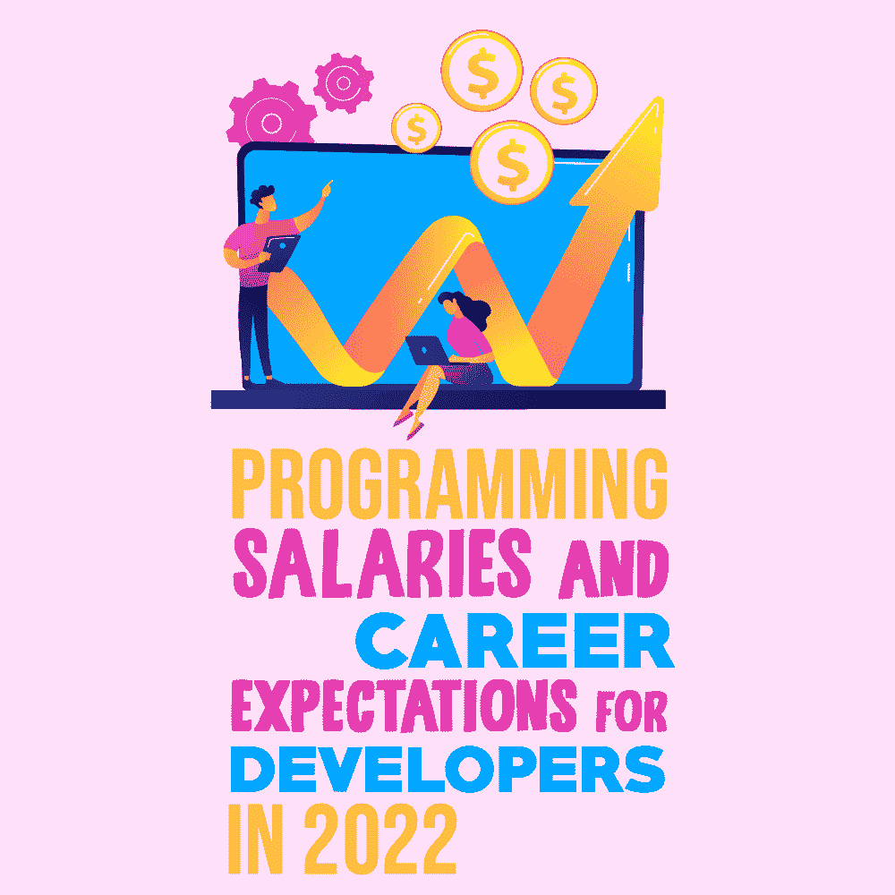

# 2022 年程序员的薪资和职业期望

> 原文：<https://simpleprogrammer.com/programming-salaries-2022/>

A tech-related career is often promising. The world is constantly evolving, thanks to new technologies like apps that make everyone’s life easier and artificial intelligence that helps many industries do their work faster.

然而，这还不是全部；技术世界非常广阔，每一种技术爱好者都有自己的空间。显然，编码是一切的支柱，这就是为什么软件程序员、web 开发人员和应用程序开发人员的工资高于技术相关领域的平均工资。

如果你是一个编程爱好者，并且想把编程作为你的职业，那么你应该做的第一件事就是了解你期望的编程薪水。在这篇文章中，我会给你一个完整的编码工资指南，让你为 2022 年的编码生涯做好准备。

## 编码员挣多少钱？

根据 Indeed.com 的数据，全国程序员的平均年薪是 58888 美元。然而，如果你专攻某个编码领域，你可以挣得比这个数字高得多。你的年收入还取决于你的公司在哪里，你在哪里，以及你的总体工作经验。

虽然初学者可能需要从较低的工资开始，但经验丰富的程序员可以期望获得更高的薪酬。

## 哪个州付给程序员的薪水最高？

根据 Indeed.com 的最新数据，以下是美国程序员薪资最高的州，以及程序员的平均年薪:

*   科罗拉多州:84963 美元
*   弗吉尼亚州:68845 美元
*   堪萨斯州:[:68822 美元](https://www.indeed.com/career/computer-programmer/salaries/KS)
*   德州:T0 美元 61.691 美元
*   纽约:60，170 美元
*   加利福尼亚:[:57073 美元](https://www.indeed.com/career/computer-programmer/salaries/CA)
*   马萨诸塞州:56921 美元
*   伊利诺伊州:53675 美元

因此，考虑到这一点，重要的问题是:成为一名程序员需要什么技能？让我们找出答案。

## 成为一名程序员所需的技能

虽然你可以参加在线课程来学习编码的基础知识，并获得更多的相关知识，但有些技能是学不到的。你需要有正确的心态和态度，才能成为一名高收入的成功程序员。拥有以下技能，从长远来看，你有更好的机会获得更高的薪水。

### 问题解决

所有的网站、软件和应用都是为了解决问题而创建的。他们帮助企业和个人更快、更有效地接触到他们的潜在客户。只有当企业能够为消费者解决问题时，它们才会繁荣。

同样，要创建软件，你需要成为一个问题解决者。有时网站或软件会运行不正常，您需要持续关注它，以便在需要时解决问题并更新软件。这将有助于软件顺利运行，并提供良好的客户体验。

### 耐心

大多数工作都需要耐心，但程序员需要额外的耐心。正如我上面提到的，将会有许多错误需要你去修复，而且问题也可能会实时发生。准备好重复做一件事，直到你达到满意的结果。

试图在所有混乱和小细节中找到正确的解决方案可能会令人沮丧，尤其是当其他团队的每个人都在看着你寻求答案的时候。耐心是在持续压力下茁壮成长并找到正确解决方案的必备素质。

### 对数学有很好的理解

虽然你不需要成为 Aryabhatta 和发明零，但你需要对数学有一般的兴趣和知识才能成为一名高效的程序员。这两者是不一样的，但它们仍然是相关的，因为大多数编程语言可能需要你进行数学思考。

如果你擅长数学，恭喜你！你可以期待比别人更快的增长和更高的薪水。

### 良好的沟通技巧

Coders can work independently—as well as from anywhere globally—and still deliver world-class, state-of-the-art software that can earn a business millions. However, a collaborative environment can deliver results much faster when it comes to development.

如果你擅长沟通，你可以毫不费力地与测试人员取得联系，快速解决问题，同时联系营销经理，询问客户体验数据。

编码不仅仅是创建完美的软件并让它运行。对于所有的反馈和更新，修复错误，测试等。，你需要[与团队](https://www.proofhub.com/articles/effective-communication)有效沟通。所以，为了一个成功的编程生涯，好好温习这些沟通技巧吧。

### 不断学习的愿望

如果你很快厌倦了你正在做的任何事情，或者缺乏天生的好奇心，在开始编码之前，请三思。为了前进，编码人员和程序员必须不断地让自己跟上最新的技术、编码语言、框架、消费者需求等。

当今世界的技术变化很快，如果一个程序员不能跟上时代的步伐，他们就会落后。没有企业希望他们的软件建立在没有人会使用的过时技术上。如果你没有能力去学习，去遗忘，去有规律的重新学习，那就打消编码的念头吧。

## 重要的技术技能

除了我上面提到的技能，还要考虑下面列出的一些技术技能和语言，因为它们在 2022 年及以后将非常重要。

*   [**算法编码**](https://www.amazon.com/dp/0262033844/makithecompsi-20) 就是写编码脚本来指示计算机做什么。算法技能在你的职业生涯中有助于成长，因为它们对处理数据库和数据管理至关重要。
*   **HTML** (超文本标记语言)是在网站应用程序上显示文本和图像内容最常见的编码语言。您可以创建段落、项目符号列表和图表，促进交互式和可导航的界面。
*   CSS 允许开发者在网站应用程序中添加字体、颜色和文本内容。对于 HTML，开发人员使用 CSS 来创建交互式界面。
*   **SQL** (结构化查询语言)是最常见的数据库之一。公司使用它来组织和存储信息，确保隐私和功能。
*   NoSQL 允许在关系数据库之间存储和检索数据。它们支持类似 SQL 的查询语言，并使用 SQL 数据库架构。
*   **数据结构**是数据库中信息的组织方法。如果算法代码描述了完成任务的过程，那么数据结构优化了信息。
*   JavaScript 允许在网页上创建一个交互式的、用户友好的功能，比如按钮、聊天和动画。
*   嵌入在 HTML 中， **PHP** (超文本预处理器)是一种服务器端脚本语言。开发人员使用它来开发静态和动态的跨平台应用程序，从而改善用户体验。
*   一个 **API** (应用程序编程接口)是连接两个应用程序的中间软件。
*   **GIT 源码控制管理**。大多数公司和自由职业者使用 GIT 作为源代码控制管理程序。它允许在一个文件夹系统中存储程序代码的不同脚本版本。开发人员用它来组织项目，跟踪代码的修改和编辑。
*   **云计算技能(GCP、Azure、AWS)** 。无论是在远程团队还是现场团队，开发人员都使用云平台。他们管理和运行公司的远程数据库。大多数公司需要编码语言和服务器管理知识来配置基于云的技术。
*   **计算机网络**要成为一名高级软件开发人员，学习操作系统和计算机网络的核心机制很重要。从内存使用和数据交换到阻塞问题，开发人员需要清楚地了解计算过程。

此外，有大量的在线课程可以帮助你学习这些特定的语言或技能。此外，还有一些像这样的好书，对你的软件开发职业生涯非常有帮助。

## 三份高薪的编码工作

虽然编码可能被认为只是创建应用程序和网站，但作为程序员，你还可以扮演更多的角色。以下是 2022 年一些热门编码工作的列表:

### Web 开发人员

平均工资:[$ 67339 一年](https://distantjob.com/blog/web-developer-salary/)

如果你热衷于创建网站，那么网络开发是有意义的。作为一名 web 开发人员，您使用不同的编码语言来构建和维护网站。

最好是专攻一种[编码语言](https://simpleprogrammer.com/programming-language-should-learn-first/)同时也懂其他语言。不时提升你的知识和技能总是让你比其他程序员更有优势。

### 软件开发人员

平均工资:年薪 116890 美元

作为一名软件开发人员，你将在评估企业或客户的需求后创建软件或应用程序。有许多类型的软件，从人工智能平台和安全应用程序到网飞等娱乐应用程序以及 Twitter 和 Instagram 等社交媒体应用程序。

对软件开发人员的需求并不缺乏。此外，几乎所有的企业都运行在软件上，许多[甚至移动到网上销售与软件相关的产品](https://simpleprogrammer.com/selling-online-products/)。

### 数据库管理员

平均工资:年薪 87049 美元

如果您喜欢处理大量数据或信息，并希望为这些数据创建存储空间，您可以成为数据管理员。

每个企业都在存储和分析客户数据，这对于企业的成功至关重要。例如，营销、销售和财务职能严重依赖数据库信息和分析。

这些只是目前需求旺盛的编码职业选择中的一部分。

## 作为一名程序员，我如何提高薪水？

A coding career can go in many different directions, depending on your specialization. Here are some ways in which you can increase your earning potential:

*   通过学习一门新的编程语言来积累你的技能。让自己跟上[最新技术和编程趋势](https://simpleprogrammer.com/2022-technology-programming-trends/)。
*   **帮助你的朋友开发他们的网站**练习编码并获得推荐。你可以把这个加到你的投资组合里。
*   寻找大公司的实习机会，甚至寻找外包给新手的创业公司。除了是一个很好的学习曲线，这将是一个很好的除了你的投资组合。
*   利用你的空闲时间阅读新技术及其制造方法。这可以帮助你提高解决问题的技巧和创新能力。
*   **参加黑客马拉松**并准备好与其他开发者交流。有很多在线社区，你可以在那里学习、成长和获得潜在客户。
*   在 Upwork 和 LinkedIn 等网站上寻找自由职业的机会，赚取额外收入。自由职业给你所有的自由和灵活性，让你按照自己的方式工作。然而，了解[作为一名自由开发者如何管理你的财务](https://simpleprogrammer.com/handle-finances-freelance-developer/)以获得成长和成功是很重要的。
*   **获得认证**因为一些公司根据程序员的资格来衡量他们。你可以寻找相关的证书或硕士学位课程，并添加到你的简历中。

## 获得你应得的编码工资

有了这些关于编码工作平均工资的信息，你就能更好地决定是否接受这份工作。让自己了解编码和编码薪资变化的最新动态总是有帮助的。

及时了解最新的编程趋势、技能和薪水，可以帮助你在科技行业更快地发展。当你知道自己的立场、期待什么，以及如何最大限度地发挥自己作为一名程序员的潜力时，你就会有动力和动力去取得成功。

有一点是肯定的:编程的世界是一个动态的世界，它给了你大量的机会来不断学习和成长。这就是为什么编码职业一定会给你带来舒适的生活和高薪的工作。万事如意！