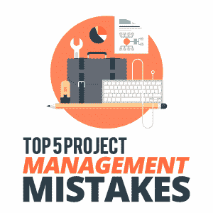

# 五大项目管理错误

> 原文：<https://simpleprogrammer.com/project-management-mistakes/>

Successful project management is within everyone’s reach.

你对管理你的编程项目越认真，它就越有可能按时完成。你对项目中的活动控制得越好，你的团队就会表现得越好。

但是有几个常见的项目管理错误会拖你的后腿。作为项目经理，你有责任避免这些错误并建立一个有效的团队。通过这样做，你和你的团队成员将会实现一个满足所有需求的项目。

我最近对信息技术(IT)公司进行了一些广泛的研究，这些公司面临着我们在项目管理中面临的同样的缺点。在这篇文章中，我将告诉你如何避免这些错误，走上更有效的管理之路。

## 1.不明确的计划或目标

项目经理需要有一个完善的计划，一个基于他们的 IT 能力和公司目标的计划。该计划应根据公司的价值观与管理层进行沟通，因为项目的未来可能取决于此。

项目计划通常从项目的起点到终点都是变化的，不是吗？然而，我注意到它为项目的生命周期提供了很好的指导。在该计划中，[项目计划](https://simpleprogrammer.com/product-roadmap-software-development-project/)必须包括一份项目范围声明，其中包含明确的目标、任务和沟通计划。计划是你项目的核心，你的主要目的是清楚地提出需求。此外，您的计划总是需要包括项目文档、可交付成果和截止日期。

如果您不能交付这些关键元素中的任何一个，项目实现就不太可行。

误导性的或不清楚的项目计划可能会被客户和管理层拒绝，从而导致失败。客户和管理层都有可能拒绝管理一个计划不明确的项目。另一方面，如果您的项目是精确的并且经过深思熟虑的，那么该项目更有可能符合项目需求。

一个好的项目计划可以简化你的管理过程，如果它是根据项目需求开发的话。因此，你的文档越全面，你的计划被接受和执行得越好的机会就越大。

您的项目计划和目标是否设置正确？

## 2.忽视对通信信道的控制

在项目的整个生命周期中，将会有几条沟通线路:与客户、不同团队之间、与供应商。为了确保跨越这些界限的轻松联系，项目经理应该建立一个固定的[沟通方式](https://simpleprogrammer.com/developer-communication-skills/)。面对面的交流有助于建立一个协作的环境，让员工参与会议和反馈循环。因此，这是与团队沟通的最有效方式。

然而，个人交流并不总是可能的。而且，也不能记录一致。

因此，沟通计划还应该包括团队成员和管理层之间的电子邮件。当然，IT 项目还应该详细描述和监控其他在线交流、电话和会议。但电子邮件链是确凿的证据，在出现问题时可以作为备份。电子邮件提供的官方确认对于负责任的 IT 团队至关重要。

例如，任何人都不应该因为一个经理碰巧在聊天中或在会议上口头提到一个项目而开始这个项目。

根据我的经验，其中一个必备条件是沟通层级。应该建立沟通流程，以便 IT 专家不会在没有监督或授权的情况下与客户交谈。

你可以用来管理沟通的工具数不胜数:微软 Office、Slack、谷歌文档、Asana 和 Trello 只是其中的几个。无论你选择什么渠道，你都应该确保它们易于理解和使用。在团队内部以及与客户沟通如何使用这些渠道。

沟通是支持有效项目管理的驱动力之一。

你们有一致的沟通渠道吗？

### 3.被忽视的 KPI 和员工绩效

Management may have the most effective project plan and communication channels, but employee performance still provides the most crucial measurement of all.

当我在 Angular 开发公司工作时，我了解到定义清晰的关键绩效指标有助于项目的进展。此外，为了提高绩效，您需要监控和分析您的结果。在软件开发中，可以记录各种度量。一些重要的关键绩效指标可以是:

*   测试阶段发现的错误数量。重要的是看他们从哪里来。追踪你的错误可以引导你找到正确的解决方案。
*   参与编写需求的人数。太多可能会导致不同的写作风格，这可能会造成混乱。
*   т初始计划被更改的次数。如果是几次，可能是核心思想中的某些东西导致了中断。复习可能是这里的关键。

即使在项目期间，许多公司也依赖标准的 6 个月或 12 个月评估，但这还不够频繁。

简短的反馈循环对于评估员工绩效非常有用。这可以采取每月 10 分钟谈话的形式，以及每三个月一次更大的目标或绩效导向的会议。这些可以帮助员工更加融入和参与项目。

通过更多的定期会议，您的 IT 人员将习惯于提出正确的问题并表达他们的意见。例如，如果你的团队中有人对工作不满意，等待标准的 6 个月或 12 个月的评估可能太长了。也许与管理层的早期会议足以回答团队成员的问题。因此，他们在未来会表现得更好，而不是静静地等待。

你团队中的每个人都发挥出了最佳水平吗？

## 4.责任应该在你身上

说到项目管理，你可能犯的最严重的错误之一就是开始领导一个项目而不对它负全责。

如果团队失败了，那么你就没有监督他们，也没有做出改变来纠正这一点。

如果有人在工作中失败了，你很可能会被指派给一个毫无准备的人。

通常，未能及时交付最终产品可以归结为你的员工所犯的错误，因为你没有对他们进行适当的监督。作为项目经理，您负责安排活动和时间表，以及委派任务。

即使工作流程看起来很顺利，也要从项目的第一天开始，直到项目结束。电子邮件、会议和培训等工具会提高你对工作的控制力。定期对话和技术检查也有助于跟踪进展。

用这种方法，应该不会有什么意外。

不要优柔寡断。作为被指派的领导，你应该是处理项目相关问题的专家。您的开发人员会向您寻求一次、两次甚至三次帮助。如果你不给他们提供相关的答案、决定和意见，下次他们就会绕过你。然后，如果他们的决定是错误的，那又是你的错。

经理应该为他们不在时的情况做好准备。在生病等不可预见的情况下，有人能带领你吗？你需要在办公室里有一个得力助手:如果你需要离开一段时间，可以和管理层打交道的人。

没有您的监督，项目会满足软件质量的正确度量吗？

## 5.成为使用工具的专家

Planning tools, presentation tools, and communication tools all speak to your preparation and confidence as a project manager.

向您的员工展示您对项目工具的了解可以真正改变他们对项目的整体态度。你在责任、任务和项目目标方面的专业知识应该成为你的团队的榜样。

作为项目经理，你负责指导方针，并以专业的方式给出反馈。

软件开发计划的工作方法是你走向成功的重要因素。确保你负责任地分配任务，并且你的沟通渠道总是畅通无阻。

你的项目管理方法应该满足客户的需求。因此，您的工具应该是最新的。这类工具的例子有 Agilean、Wrike 和 GitHub，它们总结了一段时间内的项目结果，并有助于轻松定制您的项目计划。

为了避免失败，在接受项目之前，你应该诚实地说明你的管理能力。

虽然技术工具可以成就或破坏一个项目，但我也见过领导者因为缺乏社交技能而失败。

归根结底，项目管理是关于管理技能的。所以，在开始一个项目之前，要非常清楚——对自己诚实——你是否有足够的经验来承担这项工作。

说到底，你需要有一个好的理由被选为项目经理。

你是使用工具的专家吗？

希望我从项目管理错误中学到的东西对你未来的项目有用。请在下面发表评论，进一步讨论该主题或提交任何问题！