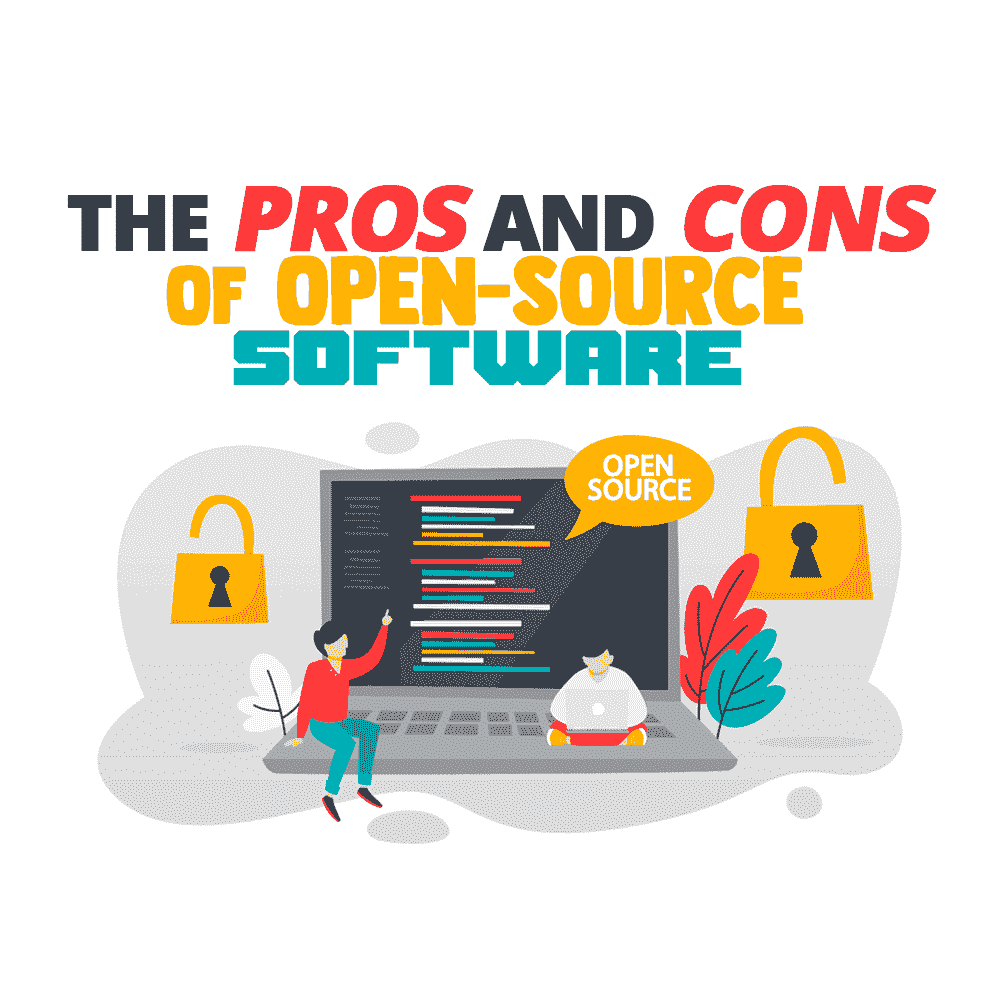
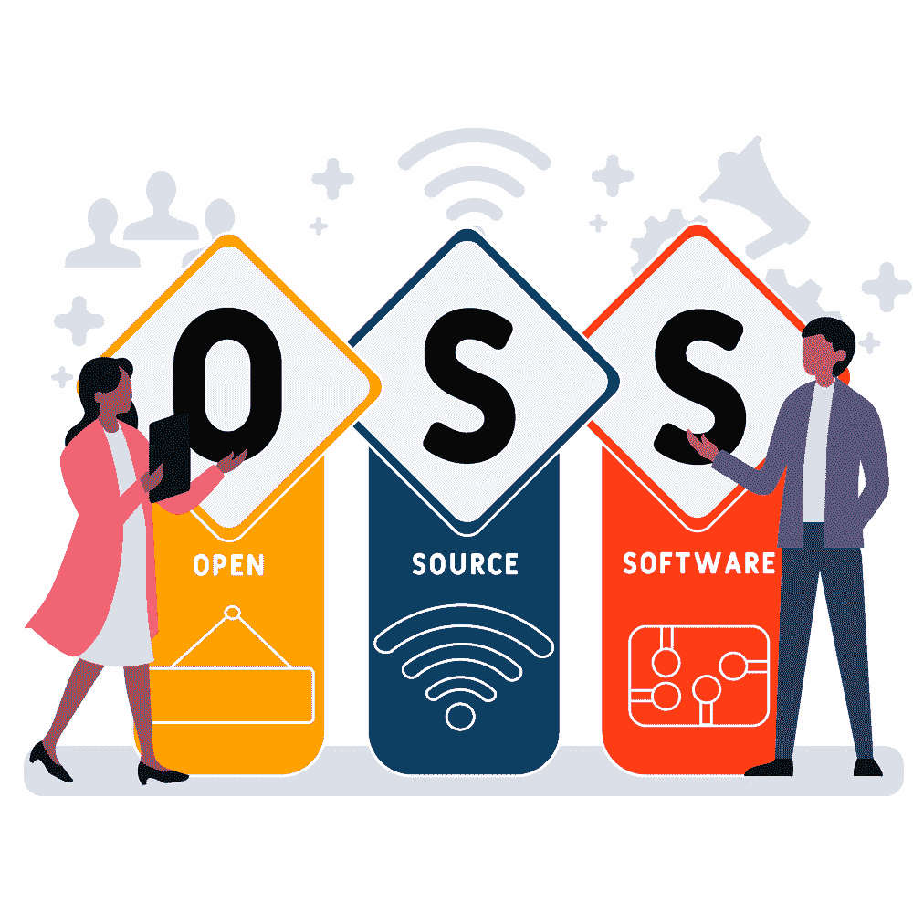

# 开源软件的利与弊

> 原文：<https://simpleprogrammer.com/pros-cons-open-source-software/>

IBM spent [$34 Billion to acquire Red Hat](https://www.cnbc.com/2019/07/09/ibm-closes-its-34-billion-acquisition-of-red-hat.html), a renowned enterprise that builds open-source technologies. Another IT giant, [Microsoft bought the code-repository GitHub](https://news.microsoft.com/announcement/microsoft-acquires-github/) for around $8 billion in stock. These acquisitions speak volumes for how the concept of open-source software has been embraced by the software development industry with open arms.

开源软件(OSS)使软件生态系统变得更好，同时它也是熟练程序员相互合作和学习的媒介。

程序员为自己的项目使用各种开源软件，他们也为许多其他 OS 做出贡献。然而，OSS 的某些方面会困扰许多开发者。

例如，一个软件工程师在他们的商业项目中依赖开放源码软件有多安全？程序员可以利用哪些不同的开源软件优势，以什么方式来创造？程序员投入时间为 OSS 做贡献有什么好处吗？

我将通过这篇博文尽我所知回答这些问题。但是首先，让我们从开源软件的清晰定义开始。

## 什么是开源软件？

你可能已经知道什么是开源软件，但是如果你刚刚开始涉足这个领域，这一部分将提供一个深入的解释。要了解什么是开源软件，首先要了解什么是开源代码。

我们知道程序员为特定的任务编写一组命令，这就是我们如何让软件做它应该做的事情。因此，编译在一起以确保软件功能的底层代码被称为该软件的源代码。

如果源代码被许可公开使用，也就是说，如果任何程序员都可以合法地查看源代码并对其进行修改，那么该软件就成为开源软件。LibreOffice 是最受欢迎的开源软件之一。

大多数开源项目通常托管在一个存储库上，比如 GitHub。因此，任何希望修改代码的人都可以从存储库中下载代码。然后他们可以提交他们建议的代码和建议的编辑。这些拟议的编辑在纳入项目之前，由 OSS 的所有者或授权的版主进行彻底审查。

这里要注意的另一件事是，所有的 OSS 都有一大堆的条款和条件在它的许可证中指定。因此，你可以修改开放源码软件或将其用于其他目的的程度因软件的不同而不同。

另一方面，一个软件应用程序的源代码被限制为只有那些被授权的程序员才能查看和编辑，这种软件应用程序被称为专有软件。微软 Office 和 Adobe Photoshop 等软件都是专有软件的例子。

## 开源软件也是免费的吗？

不一定。有一些操作系统允许你完整地使用软件，而不需要你为它支付任何费用。但是也有一些操作系统在你安装的时候以一次性付款的形式收取少量费用，或者以订阅的形式收费。

有趣的是，许多创建了自己的 OSS 的程序员也发现了一些更真实的赚钱方法。他们为企业和其他开发者提供支付咨询费的使用源代码的最有效的方式。

同样，并不是所有的专有软件都是付费的。一些开发人员或组织可能只想构建任何人都可以使用的软件，而不公开其源代码。本软件不被视为商业软件。

## 开源软件的类型

所有类型的软件都有开源项目。以下是其中一些最著名的例子:

### 用于数据库管理的开源软件

[Database management](https://www.amazon.com/dp/1337627909/makithecompsi-20) was once considered one of the most complicated aspects of building software. The likes of IBM, Microsoft, and Oracle were the companies that released proprietary and/or commercial software for database management.

然而，随着开放源码软件越来越受欢迎，许多数据库管理软件应用程序已经进入完全开源的市场。它们对于设置数据库、处理安全和备份需求等任务非常有用。

MySQL、Apache Cassandra 和 Cubrid 是一些常见的开源数据库管理系统。

### 开源操作系统

就操作系统而言，与 Windows 不同，还有其他开源的替代产品。最著名的是 Linux。除了免费之外，Linux 还是开源的，支持大量的通用编程语言。

许多开发人员喜欢 Linux，因为它在构建软件(包括其他操作系统)时提供了灵活性。Android 是使用 Linux 内核构建的操作系统的一个例子。

除了 Linux，还有其他不太流行的操作系统，比如 FreeBSD，你可以在 Gnome 2 和 KDE 桌面上使用。

我对最近建造的反应堆也有很多期望。它让你在开源环境中运行和使用 Windows 软件。这是一个很好的工作和试验场所，包括 MS 产品中的新功能和现有功能。

### 其他开源软件开发工具

令每个程序员欣慰的是，有一堆开源工具可以用来构建几乎任何类型的应用程序。首先，你有一个非常流行的开源网络浏览器— [Mozilla Firefox。](https://www.mozilla.org/en-US/firefox/new/)事实上，Mozilla 也有一款开源的电子邮件应用，名为 [Mozilla Thunderbird。](https://www.thunderbird.net/)

然后，有 [WordPress](https://wordpress.com/) 你一定非常熟悉。对于开源内容管理系统，我们现在也有相当多的选择。 [Joomla](https://www.joomla.org/) 和 [Drupal](https://www.drupal.org/) 就是同样的突出例子。

PHP 是一种流行的开源脚本语言，如果你想在你的项目中使用开源 web 服务器，你可以使用 T2 的 Apache 和 T4 的 Nginx。

然而，在我看来，最有用的是开源 web 框架。生态系统中一些最大的名字，如 Ruby on Rails、T2、姜戈和 T4 都是开源的。

同样，许多移动应用程序开发框架也是开源的。[颤振](https://flutter.dev/)和[反应原生](https://reactnative.dev/)就是两个显著的例子。

## 程序员使用开源软件的两个方面:贡献 OSS 和使用 OSS

现在让我们来看看开源软件与程序员的相关性。作为一名软件工程师，你有两种选择来使用 OSS。第一，你可以利用你现有的技能为 OSS 做贡献，甚至为社区创建 OSS。第二，你可以将现有的操作系统用于你正在从事的任何项目。

下面详细说一下各个方面。

### 首先，为什么程序员应该考虑为开源软件做贡献

大量的程序员，无论是初学者还是高级程序员，都定期为一些开源项目做出贡献。

为 OSS 做贡献的最大好处是，它**增加了程序员的投资组合，帮助他们在职业生涯中获得成功。**他们的 GitHub 档案证明了他们在发现 OSS 和为 OSS 做出贡献方面是多么积极。这种参与大大提高了他们的可信度！

第二，OSS 项目是程序员继续提高编码技能的机会。当你为 OSS 做出贡献时，你知道你的代码将会被社区的很多成员看到。所以很自然地，程序员在为 OSS 做贡献的同时养成了写更干净代码的习惯。此外，你也有机会磨练自己在各种软件项目中识别和修复 bug 的技能。

许多程序员也觉得对 OSS 做出贡献是最容易用来回报社区的方式。当你已经从这么多商业项目的开放源码软件中受益时，能够帮助其他开发者为他们的项目访问不同种类的开放源码软件感觉很棒。

最后，为 OSS 做贡献**有助于你更深入地理解软件开发的商业和其他实用方面**。例如，在你为 OSS 做贡献之前，你会考虑很多因素:

*   你应该参与什么样的项目
*   那个项目的哪些方面需要改进
*   你如何解决问题并增强项目的这些方面
*   你的贡献对其他程序员和用户的更大影响是什么

当你开始开发其他商业或专有软件时，这种方法将帮助你成为一名更好的程序员。

### 第二，为什么程序员应该使用开源软件

When source code is available for programmers to modify, there are a lot of benefits the software brings to the table.

首先，您可以灵活地编辑代码以满足您的独特需求。你不能查看专有软件的源代码，更不用说编辑了。所以程序员在使用专有软件时没有足够的灵活性。

然而，有了 OSS，你就可以利用对你有用的东西，抛弃其他的东西。因此，您可以使用一些现成的组件，而不是从头开始构建项目。如果你仅仅通过修改 OSS 的源代码就能处理好项目的其他方面，那简直是小菜一碟。

此外，通过访问源代码，**你可以更好地比较各种软件**。重申一下，不是所有的操作系统都是免费使用的。程序员经常发现自己在构建项目时不知道应该使用哪些工具或软件。如果你想使用它，大多数商业软件开发商都要求你付费。然而，一旦你真正开始使用它，你会发现这个软件并不像你想象的那样有用。

操作系统对于避免这种情况很有用。因为您可以访问源代码，所以在将软件与您的项目集成之前，您可以理解软件的所有技术细节。即使是付费的 OSS，你也可以根据代码对其功能的描述来决定是否购买。

你应该使用 OSS 的第三个原因是,**它通常更新更快，并且总是在改进。**OSS 生态系统处于不断审查和升级的状态。总会有熟练的开发人员致力于使软件更加高效、安全和用户友好。这些程序员贡献的代码也更快地得到审查。

因此，与专有软件相比，开源软件在改进和解决问题上都更快。这些不断的增强进一步使您能够访问稳定、可靠和更安全的高质量软件。

## 与使用开源软件相关的风险

在这个世界上，没有什么是不伴随着一些风险的，不管它有多好。使用 OSS 有它的优势，但是它也会给你带来一定的风险。

### 安全漏洞

当软件应用程序的源代码公开时，其安全性变得更加脆弱。黑客们总是在寻找开源软件中的安全漏洞。因为许多操作系统被许多开发者和企业跨许多系统使用，所有那些连接的项目也变得容易受到恶意攻击。

作为一名程序员，如果你为一家企业工作，你必须非常小心地使用 OSS。你的一个错误可能会给企业带来巨大的损失。这种灾难对程序员职业生涯的长期影响是不可低估的。

这就是为什么理解并遵守企业的 OSS 政策很重要。如果你工作的组织还没有这样的实践，确保你尽自己的一份力，让他们熟悉如何创建一个[开源策略。](https://resources.whitesourcesoftware.com/blog-whitesource/creating-your-open-source-policy-template)

### 不符合 OSS 许可证的风险

与开源软件相关的许可证种类繁多[！这意味着，当你决定在你的项目中使用开源组件时，你必须彻底研究和理解它的许可条款和条件。](https://opensource.org/licenses/category)

作为一名程序员(或者你工作的企业)可能会忽略这些条款和条件的一些小细节。当这种情况发生时，您和您的客户/组织将面临收到来自源代码作者的法律通知的巨大风险。

此外，如果你已经将一个 OSS 与你正在开发的其他专有软件集成在一起，你可能不得不失去你使用 OSS 创建的这个新项目的所有权。

## OSS 是一把双刃剑，所以要明智地使用它

Open-source software is truly a boon to the industry. It has always been a platform for developers to give back to the community, to work up their skills, and to establish their credibility through platforms like GitHub.

另一方面，如果程序员决定将其用于个人或商业项目，OSS 也为他们提供了巨大的好处。有许多不同类型的操作系统可以节省你大量的开发时间。

然而，并不是所有的开放源码软件都适合所有类型的项目。在你开始使用它之前，你必须完全确定操作系统的安全标准。此外，由于开放源码软件总是面临被滥用或受到恶意攻击的风险，这些软件带有非常详细和复杂的许可条款和条件。所以在你将你的项目与 OSS 集成之前，确保你养成了阅读这些 T&C 的习惯。

每一个开放源码软件都是你提高技能、进行实验、让事情变得更好的游乐场。明智地使用它，从长远来看，你肯定会用你的技能赢得它！