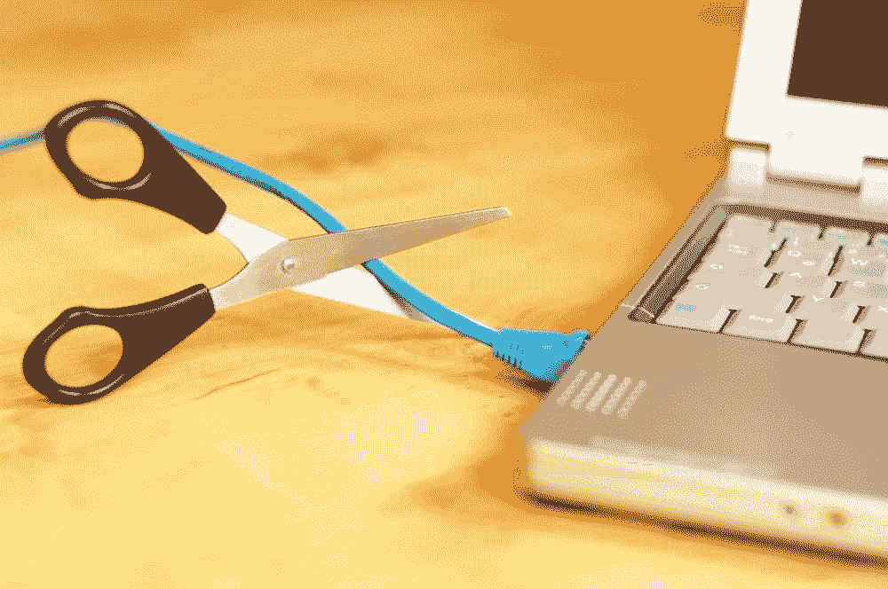

# 保护你的生产时间

> 原文：<https://simpleprogrammer.com/protect-productive-time/>

你一天只有 24 小时…1440 分钟…86400 秒。乍一看，这似乎很多。

但事实并非如此。

时间是非常有限的，它可以是你的朋友，也可以是你的敌人。你可以选择是控制自己的时间，还是让别人来控制。

这就是为什么你需要 **[保护你的生产时间](http://www.amazon.com/exec/obidos/ASIN/B00PY5X52Q/makithecompsi-20)** 。

但是为什么呢？为什么需要保护自己的时间？你是怎么做到的？让我告诉你。

我是一名. NET 开发人员，非常热衷于企业搜索，主要是 Apache Solr。这很棒，因为我花了生命中的最后几个月为四大审计公司之一构建搜索 api 库。这是一个庞大的项目，有成百上千的开发人员，与其他的相比，我的库只是很小的一部分，但它仍然是非常重要的一部分。

在这里工作时，我注意到的一件事是程序员倾向于给出不太准确的估计。为什么这似乎是一个反复出现的问题？

嗯，还有他们在估算中没有考虑到的没完没了的会议。他们有自己的过度自信——或者我喜欢称之为自我估计——并且倾向于假设功能比实际简单。此外，大多数人在早上需要一段“热身”时间来进入状态或“心流”，但之后他们会不断受到干扰。如果你想了解更多关于进入生产力区的知识，我推荐[米哈里·契克森米哈](https://en.wikipedia.org/wiki/Mihaly_Csikszentmihalyi)的书[心流](http://www.amazon.com/exec/obidos/ASIN/0061339202/makithecompsi-20)。很经典，必读。

回到估计，比方说，您估计一项任务需要 40 个小时，为了以防万一，您高估了，说需要 60 个小时。这样不行。为什么？一个很好的理由是，接下来的 20 个小时可能会被另外 10 个小时的会议和干扰填满。只要想一分钟。一天(或一小时)有多少次有人来到你的办公桌前说“嘿，你有时间吗？”在某些情况下，他们甚至不让你回答，而是坐下来或者把笔记本电脑放在你的桌子上，开始解释他们需要什么。

So let’s go back to the original question.  Are you still going to be able to be done in time?

答案通常是否定的。

所以我观察到的是，有些人在这种环境下无法正常工作，也无法兑现他们承诺的东西。

不是我。

我兑现了我的承诺。

准时。

有很小的虫子(我不能撒谎。我有虫子！).

怎么会？

是因为我的技术力量吗？

不完全是。我是一名不错的开发人员(可以自豪地说是一名 Pluralsight 作者、Syncfusion 作者、对搜索充满热情的人、演讲者、演示者和培训师等等)，但没有什么与众不同。我认识一些开发人员，他们在技术上比我强得多，但在交付方面，我可以远远胜过他们。

以下是“秘制酱”:

我做了三件事:

*   正确沟通
*   组织我自己
*   **激烈但友好地保护我的生产时间**

我非常清楚前两个，但对第三个不太了解，现在我充分意识到它的重要性，我把它作为我日常工作的优先事项。

什么时候以及如何变得对我非常明显？现在正是时候。

有一天，我正在 Visual Studio 中做自己的事情，Brent(测试人员之一)走过来问我是否有时间检查一个 bug 并解释一下。这是一个美好的时刻——我也是这么想的——所以我答应了。于是他看向他的身边，隔了大约 3 个隔间，他向 Radhika 竖起大拇指，rad hika 是另一个非常好的测试员，她对着 rad hika 微笑，脸上带着像圣诞节早晨的孩子一样的表情说“yaaaaay”。

And then it hit me.

我一直通过管理所有的干扰来保护我的时间，这样我就可以专注于工作，然后为其他人的需要安排时间。这听起来很简单，但事实并非如此。每个人都有自己在特定日期和时间的可交付成果。无论你多么希望，他们的交付物是他们的最高优先级，而不是你的。

你越优秀，人们从你身上拿走的时间就越多。我有一个朋友，同行叫他“目录”，因为他什么都知道。你认为他花了多少时间在他的可交付成果上，而不是在其他人的可交付成果上解决问题？答案很简单。他的大部分时间都花在帮助别人上，要工作到深夜才能完成自己的东西，而他帮助的开发者下午 5 点才回家。

雪上加霜的是，顶级开发人员通常会被分配更多的工作。从管理的角度来看，这有点道理。如果你有一个非常高效的开发人员，给他们分配更多的工作，整个项目将从更高的生产率中受益。问题是这只是短期思维。当你从顶尖开发人员那里挤出最后一滴可能的代码时，最终的结果通常是一个精疲力竭的开发人员或者一封辞职信。有些经理似乎根本不在乎。烧坏了？找另一个承包商或雇员，冲洗，洗涤，重复。但这是另一个帖子的讨论。

让我们回到时间。别人来到你的办公桌前询问你的时间，听起来是不是很熟悉？他们一到，你就必须帮助他们，因为“事情紧急”吗？或者“来吧，伙计，只有 5 分钟”？

大多数人类忘记或不知道的是，人类的大脑需要专注和专注，尤其是像编码或设计这样的活动。上下文切换打断了你的过程，这意味着你需要时间回到你的思考过程中。我不是专家，但我听说，在任何中断中，你至少需要 15 分钟来重新集中注意力并继续工作。因此，现实中 1 分钟的中断可能是你永远无法收回的 16 分钟。这就是为什么约翰·桑梅兹要求人们不要在他专心工作时给他发信息。

依我拙见，那对你来说不是一笔好交易。

你会戴上你的降噪耳机，在你面前挂一个大大的“请勿打扰”的牌子，然后继续编码吗？

也没那么简单。

除非你是一个人的军队产品开发单位，或者你的工作与其他人的工作完全隔离，那么你是你的团队开发的必要和有用的组成部分，并且有一组错综复杂的依赖关系不能被忽视。

那么你应该怎么做呢？让我告诉你我做了什么，还有一些我在球场上学到的技巧。

1.  关掉聊天，依靠异步通讯方式。通俗地说，像 Skype、Skype for Business、Lync、Google Chat 或类似的即时通讯应用程序会不断打破你的注意力。我确实同意聊天非常有益，特别是对于分布式团队，但是在大多数情况下，聊天可能更容易分散注意力。
    但是不要马上卸载。你可以使用“忙碌”状态，这样你就不会分心，而专注于你的工作，然后在休息时间，你可以回去，检查信息和回应。大多数应用程序还允许你设置一个特殊的信息，所以你可以添加一个短语，比如“集中工作时间”。会很快回复”让别人知道你没有无视。这是非常有用的，主要是如果你在一个经常期待即时消息回复的组织中工作。
2.  休息一下。你知道你的大脑需要休息吗？如果你想了解更多关于推荐的工作时间和休息时间来提高你的工作效率，我建议你试试番茄工作法。
3.  管理你的电子邮件，而不是让它管理你。这是另一大干扰因素:电子邮件。我们每天都被电子邮件轰炸。我的一个朋友，也是和我一起工作过的最好的项目经理，Ian，有一个个人游戏，他记录了他在某一天收到多少封与正在进行的活动有关的电子邮件。有点像对大数据进行趋势分析，但范围很小。"今天我收到了 259 封与项目相关的邮件，今天是 1.7 版本的演示日！"

如果你考虑一下一个人阅读 259 封邮件并回复它们需要多少时间，那么他会花一整天的时间只是阅读和回复，而没有时间做任何工作。

我想你们中的一些人已经计算过了，在他的具体案例中，他平均每两分钟就收到一封电子邮件。

是的，他是一个极端的例子。我注意到，你在“食物链”中的位置越高，人们就越倾向于把你加入其中。开发人员稍后可以声称“Ian 被复制了”，这可以让他摆脱麻烦(或者至少开发人员认为会)。

同样的建议也适用于电子邮件。虽然电子邮件非常重要，但作为开发人员，你的目标是在预算内按时交付工作代码。因此，请不要忘记电子邮件，但不要把它放在你的可交付成果之上。

记住，回复邮件可以让你免于被解雇，但是如果你处理得当，交付高质量的代码可以让你升职或加薪。

我建议你安排专门发邮件的时间，并让你的同事知道，这样他们就能更好地预期你什么时候会回复。

Okay. So at this point, we have covered two of the biggest distractors, IM and email. But what about the “hey do you have a minute?” cases where someone sits next to you and expects you to jump head first into their need.

不要误解我。我时常做它。这是一种冲动。你需要一些东西，而别人有一个答案。你越绝望，这种冲动就越强烈。

这是几个月前的一个例子。我已经花了大约一个小时——感觉像是度日如年——试图修改一个依赖注入场景，在这个场景中，我无法让这该死的东西工作，我知道我的团队成员 Sandeep 和 Satish，他们安静地坐在我对面的小隔间里，肯定可以提供帮助。首先，我试图自己完成这件事。仅仅在最小的问题上寻求帮助是不好的。作为一名开发人员，我通过交付来获得报酬，这包括为我在过程中遇到的问题找到解决方案。

我已经差不多解决了。我错过了一些东西。当我决定是时候寻求帮助的时候，我确实打断了萨蒂什，但是我用了一种我认为更好的方式，没有浪费他们的时间。

我等了一会儿，直到他的电话响了，他挂断后，我才相信可以寻求帮助。所以我走近他说:“嗨，萨蒂什，我对国际奥委会有个问题。有机会的话，你能帮我吗？”我也没有带笔记本电脑，因为那会增加压力。

他说:“是的，我可以，请给我 15 分钟。”大约 20 分钟后，他告诉我他可以帮忙。事实上，我错过了一些东西，我纠正了错误，继续开发，并能够在稍后签入该特性。

我的确打断了他的工作流程，但是以这样一种方式，他支配了他的时间。我请求他的帮助，但以他的条件为条件，只要他觉得时机合适。

正如我所说的，有些依赖是不可忽视的，但诀窍是尊重他人的时间，并期待同样的时间。

IM, email and one on one help can [destroy your productivity](https://simpleprogrammer.com/2015/04/06/5-ways-to-destroy-your-productivity/), but they are more manageable than the next level of interruptions that can wreak havoc on your productive time: meetings.

会议是一把双刃剑。在某些情况下，这是绝对必要的，但在另一些情况下，这完全是浪费时间。而且可能很难知道它会往哪个方向发展。因此，让我们在现实世界中一步一步来。

我参与了一个大型敏捷项目。在这种情况下，有多个团队承担不同的重点责任。一般来说，业务人员提出规格，然后流向设计人员，设计人员再将规格传递给架构师团队、开发、测试和部署。这个过程比这个稍微复杂一点，它被称为 Daikibo 或大规模敏捷，但是你已经有了大致的概念。

在这样的环境中，最重要的是要有流畅的沟通，并且下游的每个团队都完全理解需要做什么。

因此，我们开会。诚然，具体问题可以通过电子邮件、工作项目或即时消息来跟进，但有时需要召开一次会议，就像老话所说的那样，“让所有人达成共识”。

我赞扬一个运行良好、组织有序的会议，它有一个非常明确的目标，这个目标已经实现，而且只有合适的人参与。

这种情况经常发生吗？不，不是真的。

Meetings are abused continuously to levels that make my Outlook cringe in pain! I’ve already blogged a few times about this in [Pluralsight](http://blog.pluralsight.com/tips-for-meetings), and on my personal blog about how to [improve](http://www.xaviermorera.com/2015/03/five-ways-meetings-suck-and-how-to-make-them-rock/) meetings and what [hurts](http://www.xaviermorera.com/2014/07/these-5-things-are-destroying-your-meetings/) your meetings.

有时候我觉得我们好像遇到了一次会议。在我参与过的一些项目中，感觉我们开会就是为了开会做计划！永恒的似曾相识。矩阵中的一个小故障？

提高会议的效率是我打算很快在另一篇文章中讨论的主题，但现在，我对你的一般建议是，只有在严格需要时，那些对会议有价值的人，以及在不打扰那些需要不间断时间集中精力和工作的人的时候，才尽量减少参加会议。一个例子是在一天的开始，午餐时间和接近一天结束的时候。

这是一个被称为核心工作时间的概念。我看到大厅里的一个团队挂了一个牌子，很清楚地解释了这一点:“核心工作时间是上午 9 点到 11 点半。请不要打断，并期待我们的回应会有所延迟”。这能有多伟大？2.5 小时不间断工作时间。关着门却有如此高的生产力！

起初，让团队中的一部分人不立即回复你的电子邮件、即时回复你的信息或参加连续会议可能有点困难。但是这种模式有一些非常明显的好处。

首先，制造商将专注于交付。当有一个团队成员有一个紧急的高优先级项目，但他们没有完成，当你问他们为什么回答“因为我一直在 XYZ 开会和回复我的电子邮件”，你不讨厌吗这让我发疯！

但是请注意，我并不是说所有的开发人员都这样做。只有少数人这样做，但是你得到了一个潜在的借口。其余的时间，他们有时间集中精力工作。

另一个好处是，当其他团队成员知道一个人在特定的时间内不可用时，他们将习惯于提前计划，并使用电子邮件或通过工作项目中的评论进行交流。你使用哪种追踪系统并不重要，但如果你使用了一个，那就很重要了。在简单的程序员，我们使用 Trello，但我是一个大风扇吉拉作为工作跟踪系统。以至于我有两门关于敏捷的课程，都是关于 Scrum 和看板的。

核心工作时间协议将明确允许团队成员有专门用于工作的时间，这很好。但是，你必须更上一层楼，这是最难的一步:让每个人都尽可能地富有成效。

从任何角度来看，这都不是一个简单的壮举，它超越了团队层面所能做到的，因为它需要发生在个人层面。

对于一个人来说，要达到最佳的表现水平，他们需要在正确的条件下——核心工作时间是我想传达的内容之一——并有正确的心态。

如何实现这一点？有多本书和方法可以学习，以实现最大的生产力。例如，Sonmez 使用番茄工作法，他在《软技能》一书中提到了这种方法，并在最近关于他的生产力秘密的课程中公布了这种方法。

但这是另一个帖子的讨论主题，我相信在许多更简单的程序员帖子中，以及在这本书和最近发布的课程中，都会详细讨论这个主题。

我想关注的是如何在工作环境中创造合适的条件，让你为下一阶段的最高生产率做好准备。

Let’s do a quick recap of what I presented:

*   Time can be your friend, or it can be your enemy
*   你可以管理自己的时间，也可以让别人管理你的时间

*   为了能够创造(例如，在开发人员的情况下写代码)，你需要不间断的时间块

*   每次中断后，你的大脑需要一些时间来重新聚焦，进入“心流”以产生最佳结果

*   即时消息是一个持续的干扰，尽量减少使用它，并在工作时用友好的信息将你的状态设置为“忙碌”

*   安排电子邮件

*   不要打断别人，期望他们会马上帮助你；相反，礼貌地向你寻求帮助的人寻求时间表上的帮助

*   会议可以是好的，但也可以是邪恶的；因此，只邀请那些有明确议程和会议目标的人

*   核心工作时间协议可以为最佳绩效水平的蓬勃发展创造合适的条件

*   时间可以是你的朋友，也可以是你的敌人

*   有了合适的条件，进入下一个阶段取决于你

这就是我的建议。保护你的工作时间！