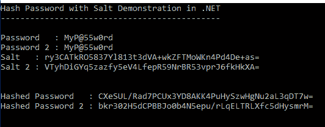
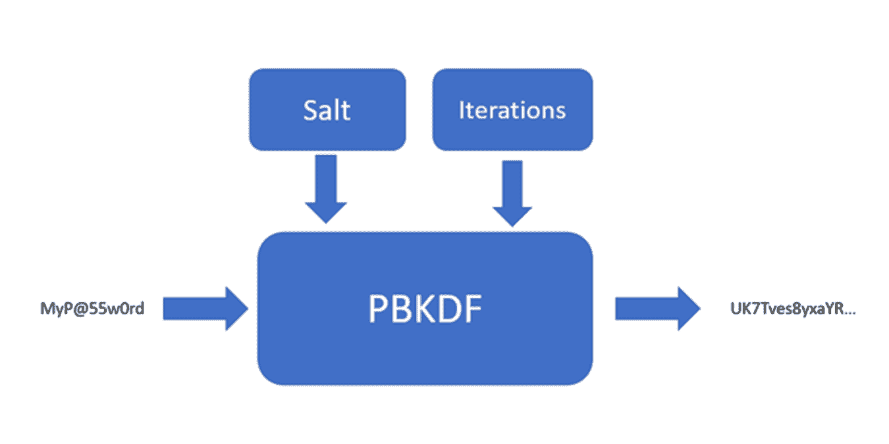
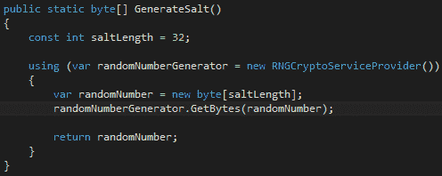
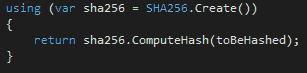
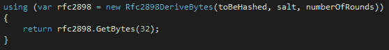

# 保护您的密码

> 原文：<https://simpleprogrammer.com/protect-your-passwords/>

最近，我在一个网站上创建了一个账户(该网站将保持匿名)。一开始一切似乎都很酷。然后我提交了我的申请，并立即收到了一条消息:“感谢注册。你的用户名是 XXXX，密码是 XXXX”。是的，网站在屏幕上明文显示了我的密码。

很糟糕，对吧？然后，更糟糕的事情发生了:我收到了一封电子邮件。你能猜出邮件里有什么吗？没错:“感谢报名。你的用户名是 XXXX，密码是 XXXX”。密码是通过电子邮件发给我的，同样是明文形式。

我同意，皮卡德上尉。

如果这个故事没有让你成为 facepalm，它应该会。现在，我们来谈谈为什么粗心的密码安全措施*真的*不好，储存密码时应该有什么政策和程序，以及如何正确保护密码。

## 如何不保护你的密码

**以明文形式存储密码。**完全错误且站不住脚的头号做法是以明文形式存储密码，如上例所示。这意味着无论用户输入什么样的密码，都将直接存储在数据库中，而不会被任何人看到。如果输入“p@ssw0rd！”作为您的密码，然后“p@ssw0rd！”是存储在数据库中的内容。如果有人进入您的数据库，他们将能够窃取任何人的凭据并冒充他们。给你一个提示:如果一个网站可以把你的密码发送给你，那就意味着它是以明文形式存储的。

允许任何人看到密码。这里有一个测试问题:应该允许谁查看用户的密码？答案是:没有人。不要欺骗自己认为系统管理员或帮助台人员需要查看密码才能完成他们的工作。这是一种非常糟糕的做法，会让你容易受到社会工程的攻击。

**加密密码而不是散列密码**。虽然有时应用程序可能需要加密密码，但这绝不应该用用户帐户的密码来完成。这样做的主要原因是，如果某个东西被加密，它就可以被解密。您希望使用散列或单向函数，使得在给定输出的情况下将输入返回是不可行的。这就引出了我们的下一点。

**使用弱散列算法或技术。**对密码进行哈希处理并不意味着它就是安全的。您使用了哪种哈希算法？你是不是只散列了一次就指望没问题了？密码哈希的一些微妙之处可能会导致弱点和危害。

不要绝望。让我们来看看开发人员如何才能做对。

## 如何正确保护你的密码

弄清楚如何正确保护您的密码的第一步是了解坏人将使用什么样的攻击来试图获取或猜测这些密码。在这种情况下，让我们快速看一下当今破解密码的一些顶级方法(更完整的列表可以在[这里](http://www.infosecisland.com/blogview/18538-Top-Ten-Password-Cracking-Methods.html)找到)。

*   字典攻击——这种攻击，顾名思义，就是利用字典来猜测用户的密码。

*   暴力攻击——这只是计算机猜测字母数字字符的每一种可能的组合，直到找到正确的密码。

*   彩虹表攻击——彩虹表是预先计算的密码哈希表。如果密码散列从数据库中被盗(例如，从 SQL 注入攻击中)，攻击者可以简单地在表中搜索被盗的散列来找出正确的密码。这些讨厌的东西就是为什么仅仅散列你的密码是不够的。

*   离线破解攻击——被盗散列的另一个副作用是它们经常被公布和公开。一旦他们出来了，有人就可以坐着使用上述技术，直到他/她找到一些好的密码来窃取。

*   基于碰撞的攻击——这种情况比较少见，也比较困难，但这是可能的，因此你应该意识到这一点。基于冲突的攻击包括试图找到一组字符，这些字符经过哈希处理后会产生与您的密码相同的输出。这样，攻击者就不必知道你的真实密码，因为如果哈希值匹配，系统就会让你进入。这就是为什么你需要选择一个好的算法来保证碰撞的几率足够低的一个很大的原因。

这些攻击可以通过两件事来缓解:长的随机密码和安全的加密存储。由您的用户来提供好的密码(您可以帮助制定策略)，但是由您来提供安全的存储。

提供安全存储的最佳方式是正确处理哈希。

### 强哈希

有效散列的第一步是选择最佳散列算法。这是密码存储架构的基础，也可以说是最重要的决定。一些散列算法已经被证明是脆弱的。MD5 就是这样一种算法。它已经被证明会产生碰撞——当涉及到安全性时，这是一个大的危险信号。反对它的另一个理由是，它是一种快速且内存高效的哈希算法。评论这一点乍一看似乎很奇怪，但是考虑一下:算法越有效，你就能越快地做出猜测。这意味着 MD5 比其他哈希算法更容易被暴力破解。

安全散列(SHA)散列族由 NSA 开发，并作为 NIST 发布的 FIPS 180 系列标准发布。这个家族由 SHA-1、SHA-2 和 SHA-3 组成。SHA-1 最近被证明有碰撞问题，从 2011 年开始被 NIST 否决。SHA-3 仍然很新，还没有广泛使用。SHA-2 是你的最佳选择，因为它的算法经受住了审查，并证明了自己的不可预测性和无冲突性。它有两种风格:SHA-256 和 SHA-512，以算法输出的比特数命名。

### 咸杂碎

我们之前谈到了彩虹桌攻击。这就是为什么在存储密码之前仅仅散列密码是不够的。加盐散列是打败彩虹表的规定方法。

salt 是一个随机值，在对该值进行哈希处理并将哈希存储在数据库中之前，它会生成并添加到用户提供的密码中。这种随机性确保了攻击者必须为 salt 和密码值的所有可能组合预先计算所有散列，这是非常困难的。

应该通过使用加密安全的随机数生成器来生成 Salts。这确保了即使两个用户提供相同的密码，他们的哈希值也会不同。在下面的例子中看看这是如何工作的:

在密码中加入这一点随机性将在数据泄露的情况下进一步保护您的所有用户。

### 基于密码的密钥派生函数

开发人员可以用来保护他们的密码的另一个伟大的工具是基于密码的密钥派生函数，或 PBKDF。PBKDFs 是很好的工具，原因有二:

1.  他们使得使用彩虹表破解密码变得几乎不可能。
2.  它们使得暴力破解密码变得非常困难，因为它们故意减慢哈希计算的速度。

PBKDFs 接受三个输入:您想要散列的密码、salt 和对密码执行多次迭代以获得最终散列。

PBKDFs 的一个巨大优势是它们本质上是可配置的。随着处理器破解密码的速度越来越快，你可以简单地增加迭代次数，以领先于坏人。

请记住，这种方法有一些缺点。增加迭代次数也会增加处理时间。这是对暴力攻击的一个很好的防御，但是如果您使用 PBKDFs 进行用户认证过程，这将意味着用户需要更长的处理时间。

你应该在安全性和可用性之间找到一个平衡点，这是常有的事。我建议将 50，000 次迭代作为基线，在您能够忍受性能影响的情况下增加。

## 如何使用。NET 来保护你的密码

现在您已经理解了可以与任何技术一起使用的高级概念，让我们来看看如何使用。NET 使开发人员能够保护他们系统中的密码。

如果您想使用。NET 框架，那么你应该熟悉这个系统。安全性。加密命名空间。我们将在这里讨论的许多工具都在这个名称空间中。我们开始吧。

### RNGCryptoServiceProvider

实现加密的第一步是选择正确的随机数生成器。随机数发生器将是加密密钥的熵的来源，也是散列的盐的来源。我们将集中讨论如何用随机数生成器创建 salt，但是同样的技术也适用于创建密钥。

中的安全随机数。NET 中，使用 RNGCryptoServiceProvider 生成一组随机的字节，然后可以将这些字节用作 salt。**请勿使用系统。随机生成安全随机数。**系统。Random 在创建时并没有考虑安全性，因此在生成随机数时有一个可重复且可猜测的模式。RNGCryptoServiceProvider 将为您提供安全盐(或密钥)所需的熵。

您可以通过创建一个实例并使用 GetBytes 方法生成随机字节集来使用 RNGCryptoServiceProvider。RNGCryptoServiceProvider 实现 IDisposable，因此请确保将它包装在 using 语句中，以确保在使用该对象时正确地处置了它。

以下是使用 RNGCryptoServiceProvider 安全生成 salt 的示例:

它只有几行代码，但是它可以在你的加密和散列的强度上产生巨大的差异。将 RNGCryptoServiceProvider 封装在一个库中，以便所有开发人员都可以将它用于所有应用程序。

### 使用哈希密码。网

系统。安全。加密技术有许多实现普通加密和散列算法的类。熟悉他们是明智的。您可以使用的类只是根据您想要使用的算法来命名。还有 MD5 类、SHA1、SHA256 和 SHA512 类等等。

SHA256 和 SHA512 是安全散列的最佳选择(以及随机 salt)。使用它们实际上非常简单。通过调用要使用的类上的静态 Create()方法来实例化一个对象，然后调用 ComputeHash()方法来获取散列。看起来是这样的:

如果您希望使用 PBKDF 存储密码。NET framework 提供了一个名为 rfc2898DeriveBytes 的类(以所使用的特定 PBKDF 的 [RFC](https://www.ietf.org/rfc/rfc2898.txt) 命名)。这是一个奇怪的名字，但用法仍然很简单:

### 安全措施

中提供的一个经常被忽略的安全功能。NET 是系统中的安全类。安全命名空间。在处理敏感数据(如密码或信用卡号)时，SecureString 类提供了基本 String 类的安全替代方法。让我们来看看这两个类有什么不同。

| **字符串** | **安全保护** |
| 内存中有多个副本 | 内存中的一个副本 |
| 未加密的内存中 | 在内存中加密 |
| 没有简单的方法来归零 | 实现 IDisposable 和 Clear()方法 |
| 不可变的，所以当改变时创建额外的并保存在内存中 | MakeReadOnly()方法来防止对字符串进行任何更改 |

不应在任何地方都使用 SecureString，但在处理内存中的任何敏感数据时，应考虑使用它。

### CryptSharp

我偶然发现了一个叫做 [CryptSharp](https://www.zer7.com/software/cryptsharp) 的有趣的库。它提供了许多很棒的工具和加密功能，如果您不想使用自己的工具(如 salt generators ),这些工具肯定会派上用场。它还为您提供了将任何散列算法与 PBKDF 一起使用的能力。NET 实现仅支持 SHA-1。如果你真的想保护你的密码，这绝对值得一看。

### ASP.NET 身份

最后一个。NET 框架的一部分，我要提到的是 ASP.NET 身份。该库包含在 Visual Studio 中 ASP.NET 应用程序的项目模板中，旨在为开发人员提供一个清晰的界面来管理身份，而无需开发自己的身份管理解决方案。

密码的安全存储被抽象掉了，这是好是坏取决于你对这类事情的看法。功能的全部范围可以是一个帖子本身。最好的起点是在官方文档网站上。

## 密码存储的最终注意事项

我知道这些信息无疑让人难以接受。但我想让你记住以下几点:

1.  **永远不要**在任何地方以明文形式存储密码。
2.  仅仅散列是不够的，因为彩虹表可以很容易地突破它们。
3.  在散列密码之前，用随机数据加盐来加强散列。
4.  防止密码攻击的最佳保护是使用 PBKDF，但是要记住这是有性能代价的。
5.  系统。加密命名空间拥有 hash 实现和一个 PBDKF 实现供您使用。
6.  不要使用系统。Random 代表随机数。请改用 RNGCryptoServiceProvider。

存储密码的想法并不一定是可怕的。理解最佳实践是第一步。从那里，你可以使用良好的判断，始终保持你的用户的最佳利益在心中。有了知识和同情心，你就能保证用户和密码的安全。