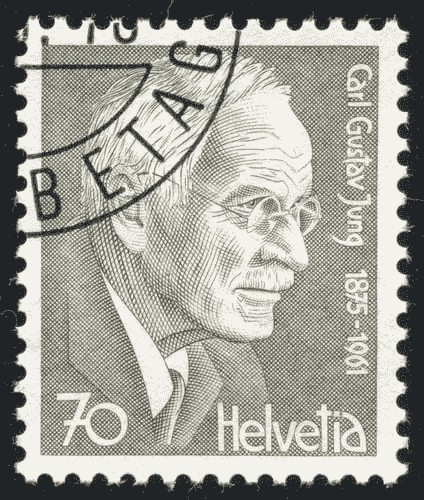
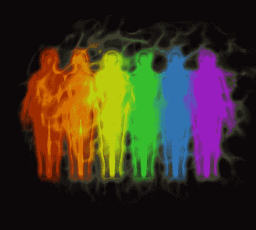

# 程序员心理学

> 原文：<https://simpleprogrammer.com/psychology-for-programmers/>

任何看过罗尼斯的两部喜剧小品《四根蜡烛》的人都会理解缺乏共识可能导致的挫折。

很多时候，我们好像在说不同的语言:我们使用相同的词语，但我们赋予这些词语的含义却大相径庭。这些差异往往只是轻松愉快、容易纠正的误解。但是沟通问题也带来了风险，即开发团队构建的产品与客户想要的根本不同。

和大多数职业一样，[开发人员拥有良好的沟通软技能](https://simpleprogrammer.com/soft-skills-for-programmers/)至关重要。为了与我们的同事和朋友有效地交流，我们需要了解他们和我们自己。

To assist with communication, having an understanding of psychology can lead to working much more effectively with others and building stronger business relationships.

心理学是我们最新的科学之一，但它是从更古老的哲学科学发展而来的。它的起源可以追溯到古希腊，有苏格拉底、柏拉图、亚里士多德等伟大的思想家。

今天心理学有几个分支，我们这里涉及的领域是分析心理学，由瑞士精神病学家卡尔·荣格于 1913 年创立。八年后，他出版了《心理类型一书，从思维、感觉、感知、直觉等方面定义了这些类型。

美国作家伊莎贝尔·布里格斯·迈尔斯(Isabel Briggs Myers)和她的母亲凯瑟琳·库克·布里格斯(Katharine Cook Briggs)以荣格的著作为基础，开发了一种将人分为不同类型的工具。这项工作花了 20 多年来发展和完善。

今天，迈尔斯-布里格斯类型指标是世界上最著名的心理测试。数百万人服用了这种药物，研究表明它是可靠的 T2 T3。这个测试把人分为:

*   **外向**或**内向**

为了增加能量，那些从他人和外部活动中获得能量的人是外向的，而内向的人从内部过程和靠自己获得能量。

*   **感知**或**直觉**

那些以文字的、实用的方式获取信息的人是感觉型的，而那些以抽象的、创造性的方式处理信息的人是直觉型的。

*   **思维**或**感觉**

有思想的人注重客观和理性，将逻辑置于情感之上。感觉型个人敏感，情绪表达能力强，注重社会和谐与合作。

*   **判断**或**感知**

那些喜欢遵循既定计划和维持秩序的人是在判断，而那些喜欢保持灵活、适应世界的人是在感知。

许多人对心理测试持怀疑或警惕态度，将它们与科学上可疑的星座和幸运饼干联系在一起；然而[心理学是一门有着丰富历史的科学](https://en.wikipedia.org/wiki/Psychology#History)。

重要的是要明白，没有最好的类型:每种类型往往有不同的优势和劣势，但它不像智商测试那样，一些人比其他人更好。同样，你的性格类型也不是一成不变的。虽然大多数人的性格类型保持不变，但如果你想改变，它完全有可能改变。

企业要求新员工参加这些测试是很常见的。它们不是用来筛选候选人的，而是用来更好地了解这个人的优点和缺点，以便经理们能够更有效地与他们共事。

The ancient Greeks taught the world that you should “[know thyself](https://en.wikipedia.org/wiki/Know_thyself).” If you have never taken a psychometric test, now is the time for your discovery!

网上有很多免费和付费的心理分析测试。

我和我的妻子都尝试了 16 种性格的测试，这与迈尔斯-布里格斯的测试非常相似，但是是免费的，不需要注册。我们每人回答了 60 个问题，并阅读了结果。虽然有一些陈述我们并不觉得描述了我们，但我们普遍对它的准确性感到惊讶。

我表现出内向、敏感、思考和判断。这种性格类型被称为“后勤人员”这在软件开发人员中相当典型，尽管有各种性格类型的软件开发人员。

## 程序员心理学

迈克尔·莱昂斯和罗布·汤姆斯特分别进行的研究一致认为，计算机专业人士比普通人更加内向。大约有二分之一到三分之二的人性格内向，而普通人群中只有不到三分之一的人内向。

迈尔斯-布里格斯对内向的定义是对思想和心理过程的内心世界比对人和事物的外部世界更感兴趣。

三分之二的人更倾向于判断 T1，而不是感知 T3，相比之下，一半的人更倾向于判断 T3。那些更善于判断的人生活在一种有计划、有秩序的方式中，而有感知能力的人更灵活、适应性更强。

同样的调查发现，80%的人更喜欢思考 T1，而不是感受 T3，相比之下，只有一半的人喜欢思考 T3。

这对编程有很多好处:我们更喜欢在逻辑和客观的基础上做决策，这有助于我们更清晰地推理和更正确地编码。

然而，相信诚实是最好的策略会无意中伤害更敏感类型的人的感情。虽然思考型的人有时会考虑情绪，但这往往只是为了确定说出我们认为需要说的话的最有效方式。

## 四种能量色

如果你对提高组织的效率感兴趣，但 16 种性格类型对你来说太多而无法整理，那么 [Insights Discovery](https://www.insights.com/564/insights-discovery.html) 发现了迈尔斯-布里格斯测试的一个令人难忘的简化。他们选择了与人际行为最相关的内向-外向和思考-情感类别，并给它们分配了颜色:

**外向思维是“火红的”**

火红色的类型是积极，肯定，大胆，自信，竞争，果断，意志坚强和要求高。

**外向的感觉是“阳光黄”**

阳光黄色的类型是社会性的、动态的、展示性的、表达性的和创造性的。

**内向的感觉是“大地绿”**

地球绿色类型是静止的、宁静的、镇定的、抚慰的、分享的、耐心的、和蔼的、关心的和鼓励的。

**内向思维是“酷蓝”**

冷静的蓝色类型是谨慎、精确、深思熟虑、质疑和正式的。

大约一半的程序员是冷静的蓝色性格类型。他们倾向于分析，避免偏见。

这四种颜色表示为一个圆，红色与绿色相对，黄色与蓝色相对。与你“相反”肤色的人往往是你最难理解和沟通的人。

使用圆形而不是正方形的原因是，即使我们和其他人有相同的能量颜色，我们都有不同程度的差异。有些人既不是很内向，也不是很外向。其他的是思考，而不是感觉。我们可以认为这些人混合了多种颜色的能量。

这导致了总共八种不同的类型，它们在团队中都扮演着非常重要的角色:

*   观察者(蓝色，内向思考)
*   改革者(洋红色，思考)
*   导演(红色，外向思维)
*   激励因素(橙色，外向)
*   激励者(黄色，外向的感觉)
*   助手(黄绿色，感觉)
*   支持者(绿色，内向的感觉)
*   协调员(青绿色，内向)

## 

我该怎么应用这个？

在生活中的几乎所有情况下，这些知识都可以在两个主要方面帮助你:

理解自己，也理解他人。

### 了解你自己

考完试后，仔细阅读你的强项和弱项。你的完整人格比任何类别都更复杂，无法精确描述，所以首先评估哪些部分最准确。

大多数心理测试包括百分比和类型。例如，创意程序员 T2 的结果包括 58%的思考和 69%的直觉。关于直觉型的信息比关于思考型的信息更能引起他的共鸣。

通读你所谓的弱点可能很难，但是能够接受并适应批评对于不断提高自己是至关重要的。

一旦你评估了你的结果，考虑是否有任何情况下你可以通过违背你的自然倾向来获得更好的结果。例如，作为一个内向的思考者，我倾向于尝试自己解决所有的难题。然而，我的结果提醒我，有时候与其他团队成员合作更有效。

你的结果也可以突出你目前没有被充分利用的优势。也许你的同事从未意识到你有这些优势。如果是这样的话，也许值得探索一下，如果你的职责改变了，你能给你的组织带来多少额外的好处。

### 理解他人

希望你能从对自己的了解中获益，并推荐给其他人。其他人是否参加测试，以及他们是否希望分享他们的结果是他们的个人决定。如果他们与你分享他们的性格类型，这可以帮助你[了解](https://simpleprogrammer.com/2015/07/07/sir-john-hargrave-is-reprogramming-thoughts-through-mind-hacking/)他们的优点和缺点，并与他们建立更牢固的关系。

Even without knowing another person’s personality type, the knowledge you gain through this process can help you identify aspects of others personality much earlier and more clearly. With this understanding you are much better equipped in all discussions with them. Certain kinds of arguments that may be very effective to your personality type will be ineffective to other personality types and vice versa.

这也会导致对单词和意思的理解增加。很可能你永远不会被问到“四根蜡烛”，意思是“叉子的把手”，但是你会开始听到其他的单词，并且在别人的语境中理解它们，而不是在你自己的语境中。在这一点上，你会有一个非常值得骄傲的沟通技巧。

感谢您的阅读，并请在下方添加评论，分享您的结果教会了您什么。在我的下一篇文章中，我将基于这些知识，涵盖创造力的重要性以及如何让你变得更有创造力。