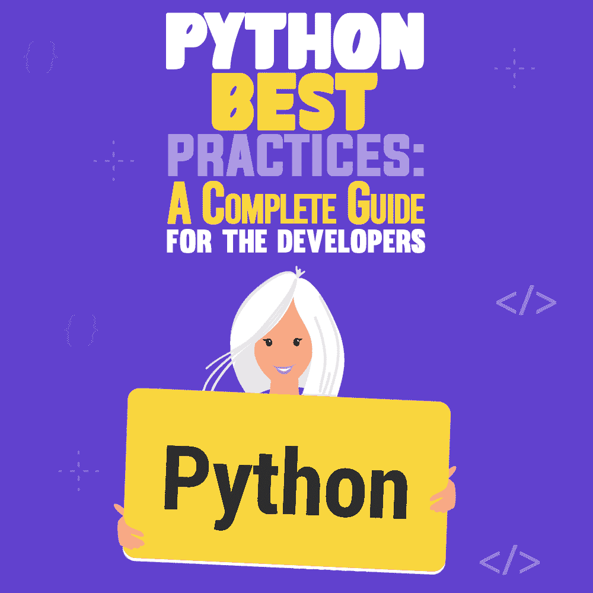

# Python 最佳实践:开发者完全指南

> 原文：<https://simpleprogrammer.com/python-best-practices/>

More than [8 million developers](https://leftronic.com/blog/python-statistics/#:~:text=There%20are%208.2%20million%20Python,7.1%20million%20of%20Java%20developers.) use Python globally, and the number is rising fast. High productivity, better portability, and vast library support are some of the top driving factors to its high adoption rate.

Python 编程语言最初是由 Guido Van Rossum 在 20 世纪 80 年代末提出的，从那以后就越来越受欢迎。

Python 被广泛应用于广泛的领域，例如 web 开发、web 抓取应用、游戏开发、商业应用和 CAD 应用等等。

Python 编程语言有无限的[优势，只要你坚持最佳实践，让你的项目发挥最大的作用。](https://www.thirdrocktechkno.com/blog/how-is-python-used-in-business)

这是学习 Python 最佳实践的最简单的方法，每个 Python 开发人员都必须知道，以正确的方式开始并有效地开发您的项目。

## 构建代码库并建立版本控制

代码库指的是归档形式的主要代码。对于 Python 开发人员来说，构建这样一个存储库是至关重要的，在这里您不仅可以保存代码，还可以保存项目的其他组成部分，比如相关的网页、文档、有用的注释等等。

例如，您可以参考 GitHub 上的[标准代码结构，如下所示:](https://simpleprogrammer.com/github-matter/)

`docs/conf.py`
`docs/index.rst`
`module/__init__.py`
`module/core.py`
`tests/core.py`
`LICENSE`
`README.rst`
`requirements.txt`
`Setup.py`

虽然 GitHub 是实现这一目的的流行选择，但您也可以选择其他工具，如 SourceForge、Launchpad、ProjectLocker 和 Bitbucket。为了更好地理解，让我们带您浏览一下 Python 项目的结构。

### 许可证

许可证是 Python 的根目录，因此在 Python 编程中起着至关重要的作用。在这个目录中，您需要为您的项目添加许可证。根据您的项目类型、目的和其他相关因素，可以有不同类型的许可证。下面提到一些最受欢迎的。

*   GNU AGPLv3
*   Mozilla 公共许可证 2.0
*   GNU LGPLv3
*   GNU GPLv3
*   带许可证
*   未获许可者
*   Apache 许可证 2.0

### 自述文件

README 是另一个重要的 Python 目录。顾名思义，在这个目录中，您需要添加项目描述，包括与您的项目相关的所有重要信息，如项目类型、目的、技术栈等。

用 Python 编写项目描述有三种形式:纯文本、markdown 和 reStructuredText。

### 模块代码

模块代码意味着包含您的实际或主要代码。这样的代码可以在子目录中，也可以在根目录中。

### Requirements.txt

尽管它不是一个强制目录，但在 Python 项目中包含它是一个很好的做法，这样可以更容易地执行这些步骤。在这个目录中，您只需要包含主要的项目需求、必备的资源以及项目高度依赖的其他相关信息。

### Setup.py

这是指用于构建各种项目模块并根据项目需求分发它们的脚本。

### 文件

它是 Python 项目的另一个重要组成部分，以可读的格式记录项目信息是一个很好的做法。

### 试验

Python 开发的项目相关测试保存在这个目录中，以便更好地工作流、跟踪和测试过程。

## 创建和维护易于阅读的文档

There will be no purpose of documenting until you ensure the format, style, and information are readable and don’t require much effort to understand. Not only is it important during the [Python project development](https://www.amazon.com/dp/0199480176/makithecompsi-20), but also afterwards as required.

这里有一些确保干净编码的工具。

**重构文本:**它允许您创建内嵌格式的文档。

**Docstrings:** 这些是在每个类、节、模块或编码方法开始时使用的字符串。

Sphinx: 这是 Python 编程文档中常用的工具。它确保简单、高效和智能的文档，并允许您以 HTML 格式导出文档。

## 采用适当的风格指南

Python 程序员常犯的一个错误是他们经常忽略规则和指导方针，尤其是样式指导方针。建议使用 PEP(Python 增强建议)标准来充分利用您的编码和软件开发。

在选择 PEP 或 Python 增强提案时，需要记住的一些要点如下:

*   对于类和异常，总是使用 CapWords。
*   对于不同的命名类别，如方法、变量、函数等，总是采用适当的约定。
*   对于私有方法，始终使用下划线，如下所示:__private_methods。
*   对于常量，使用以下格式:大写 _ _ 加 _ _ 下划线。
*   对于内部函数和受保护的方法，遵循以下规则:_ _ single _ _ leading _ _ 下划线。
*   对于任何类型的缩进，使用四个连续的空格。

## 更多地使用 PyPI

PyPI 或 Python 包索引是指由全球 Python 开发者提供的各种开源 Python 包的大型存储库。根据您的需求更频繁地使用 PyPI 是一个很好的实践，因为它让您可以轻松地搜索、查找和安装在那里共享的软件。

此外，您可以在这里轻松创建自己的包。这种实践有助于您节省时间，并专注于在更短的时间内构建更高质量的 Python 项目。

## 及时修复损坏的代码

没有及时检测和修复的破损代码可能会给 Python 项目带来严重后果，同时浪费您的时间和资源。在 Python 编程过程中，总是建议遵循“零缺陷方法”,在继续下一步之前，您必须检测并纠正任何类型的错误代码、bug 或问题。

## 确保代码的高可读性

您的代码必须具有高度的可读性，以便于其他开发人员或测试人员理解，并且如果需要的话，以后可以更容易地更新或修改。始终遵循正确的写作风格和命名约定。此外，根据需要使用适当的空格和换行符。

此外，建议在代码的复杂部分使用注释，以便更好地理解。编写可读的代码可以优化您的整体工作，并可以在许多层面上简化任务。

## 编写面向对象的代码

当用 Python 进行[编程时，你可以通过选择面向对象的代码来使整个过程更加有效。在您的 Python 项目中使用这样的代码有数不清的优势，例如易于故障排除的模块化、通过多态性实现的高度灵活性以及更好的问题解决能力。](https://www.amazon.com/dp/9351102017/makithecompsi-20)

由于 Python 是一种面向对象的语言，您可以更好地使用这些代码。

## 使用虚拟环境

最好为每个 Python 项目创建一个虚拟环境，以获得更好的流程和结果。虚拟环境提供了无限的优势，例如强大的数据安全性、高便携性、有竞争力的 IT 效率、减少的库冲突等等。

创建这样的环境将确保您在 Python 编程过程中和之后获得所有这些优势。

## Python 日志记录

在编程期间，您必须利用和采用 [Python 日志记录最佳实践](https://www.humio.com/guides/python-logging/)。Python 日志是 Python 的一个著名模块，它为程序员提供了各种独特的工具，例如在运行软件时进行跟踪和监控，定义要包含在日志中的关键信息，有效地控制发出的内容，等等。

这是 Python 最佳实践的必备指针。

## 使用正确的数据结构

很大程度上取决于您选择的数据结构的类型。在 Python 编程过程中使用正确的数据结构，这可以让您轻松地进行数据存储、访问和修改。同时，您需要关注数据结构的安全性。

Python 编程中使用的一些顶级数据结构包括字典、映射、哈希表、优先级队列、数组数据结构、记录等等。

## Python 的禅

为了总结 Python 编程的[最佳实践，这里有一个实用技巧。](https://www.amazon.com/dp/8194136334/makithecompsi-20)

你可以运行 Tim Peters 的一首诗，方法是进入 IDLE 并运行“import this”。它包含了 20 条格言来指导你编写干净、可读和有效的 Python 代码。

然而，Python 编程中只使用了前 19 条格言。有人知道为什么吗？

蒂姆·彼得斯的《Python 之禅》

漂亮总比丑陋好。

*显性比隐性好。*

简单比复杂好。

*复杂总比复杂好。*

*平的比嵌套的好。*

*稀不如密。*

可读性很重要。

特例不足以特殊到违反规则。

虽然实用性胜过纯粹性。

错误永远不会悄无声息地过去。

*除非明确沉默。*

*面对暧昧，拒绝猜测的诱惑。*

应该有一种——最好只有一种——显而易见的方法来做这件事。

除非你是荷兰人，否则这种方式一开始可能并不明显。

现在总比没有好。

*虽然永远也不会比现在的*对*好。*

如果实现很难解释，这是个坏主意。

如果实现很容易解释，这可能是个好主意。

名称空间是一个非常棒的想法——让我们多做一些吧！

在这里，每一行都有自己的含义，所有这些都是编写更好的 Python 代码的指南。例如，第一行暗示目标不仅仅是编码，而是编写干净漂亮的代码。下一行是指编写可读的、显式的代码，其中的功能很清楚。

在编写 Python 代码时，将这首诗放在面前，可以显著提高您的整体编程质量。

## Python 是高效的——如果你也是

Python programming is highly efficient if utilized in the right way. And the above guide will help you unleash its true potential by following all the best practices of the Python programming language.

基于您的项目需求或其他相关因素，您可以添加或修改许多最佳实践指针，以您自己的方式利用它们。

这将确保您的资源、时间和努力以正确的方式得到优化，并为您的项目带来最佳结果。当然，最重要的是，建议您在开始项目之前对 Python 有一些深入的[知识。](https://simpleprogrammer.com/get-started-learning-python/)