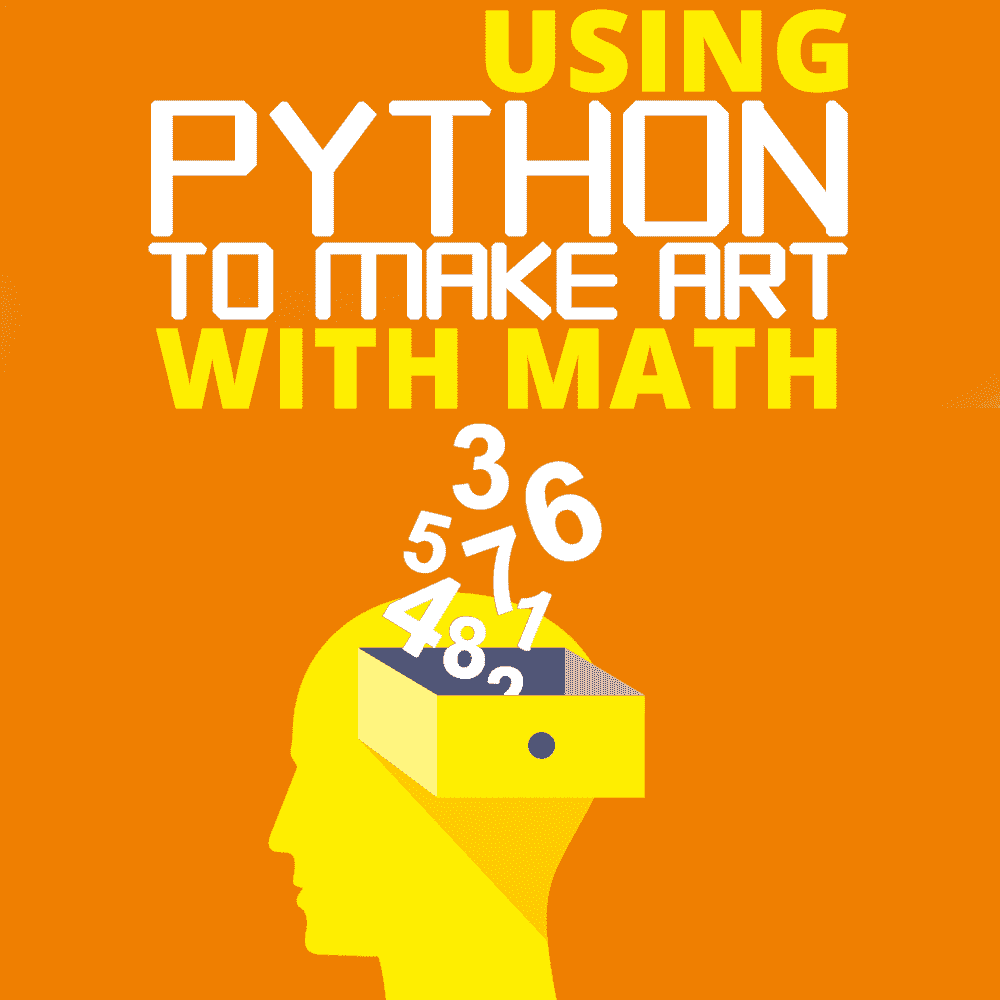
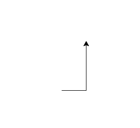
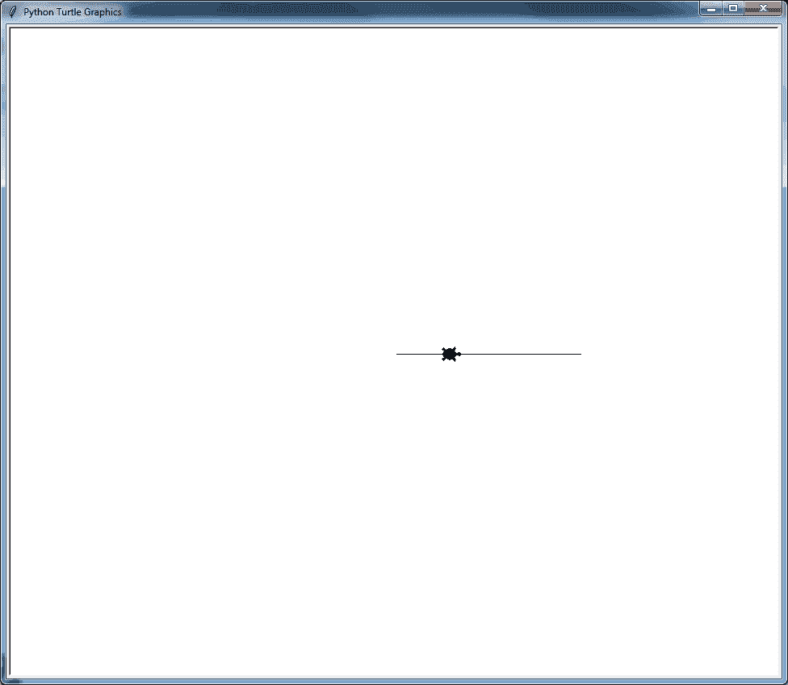
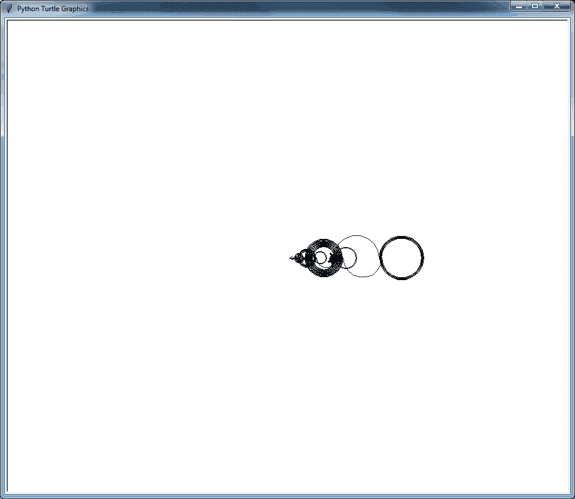
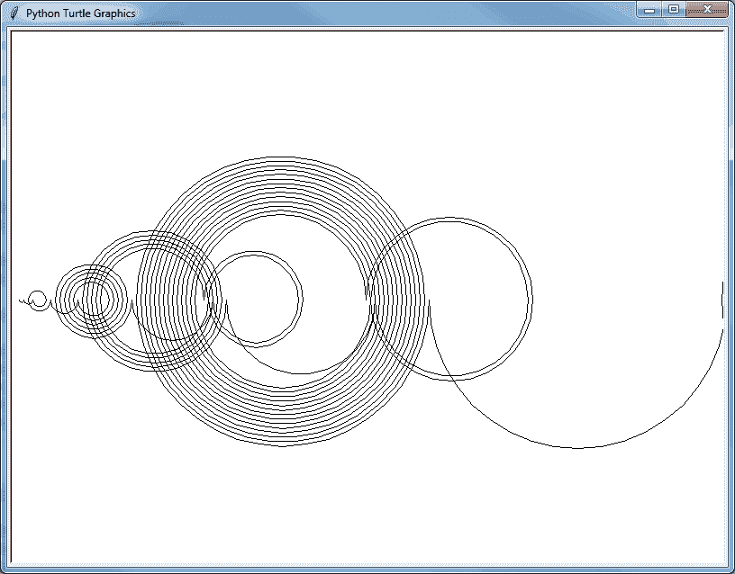

# 用 Python 制作数学艺术

> 原文：<https://simpleprogrammer.com/python-generative-art-math/>

[数学](https://simpleprogrammer.com/need-learn-math-programmer/)可以令人生畏。

根据老师和授课方式的不同，这可能是高深莫测和枯燥乏味的令人恼火的结合。

但是，数学有一种美——数字背后的智慧和逻辑的对称。我喜欢数学，我希望其他人也喜欢它。

让数学变得更加平易近人并在视觉上展示其美丽的一个巧妙方法是将它与一种叫做“生成艺术”的东西结合起来生成艺术是你创造一些通常简单的规则，这些规则通常基于数学或几何学，然后你告诉计算机处理这些规则。

由于计算机在快速处理指令方面非常出色，而且规模比人类大得多，因此创造出的设计往往比你从这些简单的规则中所能想到的更加复杂和有趣。

[这个例子](https://codepen.io/ashleymarkfletcher/full/eRrWZL)展示了一束以迷人的自然运动移动的漂浮粒子。它们四处漂浮，与其他粒子结合，并自行改变方向。这是一种“群集算法”的变体，令人惊讶的是，这种自然运动的大部分都来自于简单地让每个粒子遵循“不要碰到任何人”、“与群集呆在一起”和“与你附近的粒子大致相同的方向”的规则。

Python 是创建这些艺术作品的绝佳选择；它被数据科学家、数学家和工程师(以及许多其他人)用作处理数值计算和生成可视化的开源选项。

它也非常容易阅读和编写清晰的代码，这使它成为一种理想的语言，用于概述创建这种生成艺术所需的简单规则。med rectangle-4-multi-110 { border:none！重要；显示:屏蔽！重要；浮动:无！重要；行高:0；边距-底部:15px！重要；左边距:0！重要；右边距:0！重要；margin-top:15px！重要；最大宽度:100%！重要；最小高度:250px 最小宽度:250 像素；填充:0；文本对齐:居中！重要}

您可以用这些规则创建的最简单的数学构造之一是一个[整数序列](https://en.wikipedia.org/wiki/Integer_sequence)，它是一个有序的整数列表(整数，包括:正数、负数和零)。通常，这些整数之间的关系是以某种逻辑方式和一组规则来说明的，以便帮助人们找出模式中的下一个数字是什么。

在本文中，我们将利用整数序列的数学知识，用 Python 中的编程能力来增强它们，并使用它们来创建一些有趣而美丽的生成艺术。

这是一个有趣的练习，而且计算和代码示例非常简单，应该会吸引程序员、数学家和艺术家。

不过，这不是一篇 Python 初学者的文章，所以我假设您对 Python 的语法有所了解——或者至少愿意在学习过程中掌握它——以及如何运行 Python 程序。如果你不确定如何运行它们，并且你想在一个带有巨大的“播放”按钮的应用程序中编写代码，那么 [Mu 文本编辑器](https://codewith.mu/)对初学者来说是非常棒的。

我这次要讲的特别序列是 **Recamán 序列**。这些规则看似简单，但当数字被赋予视觉或听觉形状时，结果可能会很有趣，甚至有点吓人。

## 雷卡曼序列

规则如下:

1.  从零开始。
2.  你走的每一步都会比上一步大 1。
3.  如果有可能后退(消极地)，那么就后退。否则向前一步。
4.  只有当结果位置是正数(大于零)并且我们以前从未到过那个数字时，才允许后退。

让我们以前几个为例。

我们从零开始。

*   Zero

下一个步长将是 1。后退会使我们处于-1，这是不允许的，所以我们要前进。

*   0 -> 1

下一步的步长是 2。后退会让我们处于-1。这仍然是不允许的，所以我们必须前进。

*   0 -> 1 -> 3

下一个步长是 3。后退一步就是 0。因为我们已经到了 0(我们的第一个起点)，这不是一个有效的移动。我保证这一系列很快会变得有趣，但现在，我们向前迈进。

*   0 -> 1 -> 3 -> 6

下一个步长是 4。后退到 2 点。既然 2 是正的，我们还没看到，就可以迈出第一个合法的后退一步了！

*   0 -> 1 -> 3 -> 6 -> 2

希望你开始明白这些规则是如何运作的。现在，这是一个有趣的想法，但是我不确定我会把五个数字的列表称为美丽的。这就是我们将更加努力学习艺术和代码的地方。幸运的是，Python 在其标准库中的一个有趣而可爱的模块中为我们提供了这两个特性: **Turtle** 。

## 海龟图案介绍

海龟图形原本是标志编程语言的一个[关键特征。](https://en.wikipedia.org/wiki/Turtle_graphics)

这是一种相对简单的特定领域语言(DSL ),在屏幕上有一个化身——传统上形状像一只小乌龟——你给它指示去哪里:向前，向左，或向右。当它移动的时候，它会用尾巴画一条线，尽管你可以告诉它在必要的时候提起或放下尾巴。它甚至可以跳跃位置和改变颜色！

Python 还包括一个“turtle”库，打包在它的标准库中。让我们来看一个示例程序，看看它是如何工作的。用以下内容创建一个名为“example1.py”的文件。

查看[要点](https://gist.github.com/rpalo/0924efb98d18ad5a923fc131df72b36e)上的代码。

以下是重要的部分:

*   在第 1 行，我们导入了“turtle”模块。这将包含我们将要使用的许多功能，除非我们首先导入模块，否则我们无法使用它们。我们将通过编写“turtle.function_name”来使用这些函数，您将会看到。
*   在第 3 行，我们创建了一个窗口。这是运行代码时将弹出的窗口。它包含了我们将要画的所有东西。
*   在第 4 行，我们实际上创建了我们的海龟。我们将称他为“joe ”,并将他存储在一个变量中，以便以后可以给他命令。
*   第 6-8 行是我们给“joe”的命令。你看到的“点”语法应该已经很熟悉了。
*   第 10 行只是防止窗口在“joe”画完画后关闭。

如果您运行您的代码，您应该会看到如下所示的内容:

*附注:如果你想要真实的、老式的徽标体验，你可以在代码中添加“joe.shape("turtle ")”，就在你定义“joe”的那一行下面他是不是很可爱？*

好了，现在你已经看到了“海龟”是怎么回事，让我们回到我们正在处理的序列。

## 编码序列

像任何好的事情一样，我们肯定不会一次就得到完美的结果。我们需要做一些迭代。在这个艺术项目中，我将带你通过三关，每一关都会变得更复杂，视觉上更有趣。之后，我有一些进一步迭代的潜在想法，如果这能激发你的创意火花，你可以尝试一下。我们开始吧！

### 首次尝试

我们编写的代码将非常类似于我们用来描述序列步骤的英语。记住两条规则:有可能的时候后退，否则前进，每走一步就增加一个步长。

创建一个名为“recaman1.py”的新文件。我们将从这些基本规则开始，然后弄清楚如何让它实际工作。我要给我们的新海龟取名为欧拉，以某个家伙的名字命名。

查看[要点](https://gist.github.com/rpalo/410371b0b4e5d248485c9d02f22488c3)上的代码。

然而，当我们运行它时，它看起来并不太好。事实上，看起来有人给欧拉喝了太多咖啡。

### 

T2】

### 第二次尝试

所以，这很合理。代码看起来就像我们向某人解释一样，这很好。

不过，恐怕直线运动有点无聊。这就是我们要给我们的艺术家戴上帽子的时候(艺术家戴帽子吗？)然后想出一个更有创造性的方法，让欧拉从 A 点到 b 点。

幸运的是海龟不必直线移动！它们也可以做弧线和圆周运动。让他在数字线上从一个点跳到另一个点！为了让一只乌龟画一个圆或部分圆弧，我们将使用“circle”命令，这将使乌龟沿着一个假想中心为“半径”单位的圆，到乌龟的左边*。*

*这意味着我们必须在画之前确定海龟的方向，这取决于他是前进还是后退，使用“setheading”命令。*

*记住你可以在官方文档中找到*所有*海龟命令[，以防你好奇。](https://docs.python.org/3.3/library/turtle.html?highlight=turtle#turtle-methods)*

*查看[要点](https://gist.github.com/rpalo/3744a2a0950f08ccfb79e57b05bdd38a)上的代码。*

**

*这很好，但是在最初的一小段时间里，看起来他只是在一个地方摆动，而且线条非常接近。此外，他不会使用整个屏幕的左半部分！*

*让我们一起再做一次迭代，让它看起来更好。*

### *第三次尝试*

*这个迭代的目标是让画面更大，给他更多的工作空间。*

*查看[要点](https://gist.github.com/rpalo/6fe5d03f2b4020a05e89ed3a50bbda7b)上的代码。*

*如您所见，我们添加了一个比例因子，您可以将它调整到您认为最合适的值。我试了几个，挑了我最喜欢的，得出了这个值。我们还将他移到了屏幕的左侧，让他从屏幕的左侧开始。因为他永远不会变得消极，我们知道他只会从他开始的地方开始。*

**

## *进一步调整*

*到目前为止，我认为您已经明白了要点(双关语)，并且您有望开始看到整数序列的魔力:通过一些简单的规则(在不知疲倦的爬行动物助手的帮助下)，您可以得到一些真正有趣和迷人的结果。*

*你已经有了做更酷的事情所需的所有工具。以下是一些让你的创造力源源不断的想法:*

*   *如果你改变线条的颜色呢？如果连续改呢？*
*   *如果您将绘图倾斜一个角度以占据更多的屏幕空间，会怎么样？*
*   *如果你让多只海龟一前一后画序列会怎么样？*
*   *如果你用一点点随机性改变可预测的序列会怎么样？*
*   *如果包含用户输入(鼠标点击、按键等)会怎样？)来影响海龟的行为？*
*   *如果你做了一只乌龟，它画画却被一些非常慢的东西驱动，比如月亮的周期，会怎么样？*
*   *有没有一种方法可以将海龟与物联网项目或网络应用结合起来？*

## *序列的其他化身*

*如果你发现 Recamán 序列*特别是*令人着迷，你并不孤单。人们创造了大量不同的化身，将线条与颜色、声音等结合起来。以下是我最喜欢的几个。*

*这个略带怪异的声音版本:*

*[https://www.youtube.com/embed/ebvW-sqL5yY?feature=oembed](https://www.youtube.com/embed/ebvW-sqL5yY?feature=oembed)*

*这个关于序列的数字爱好者视频非常有趣:*

*[https://www.youtube.com/embed/FGC5TdIiT9U?feature=oembed](https://www.youtube.com/embed/FGC5TdIiT9U?feature=oembed)*

*如果你想要一个很酷的视频演示，有一个很棒的老师，并且不介意写 JavaScript，编码培训也做了几个视频:*

*[https://www.youtube.com/embed/DhFZfzOvNTU?feature=oembed](https://www.youtube.com/embed/DhFZfzOvNTU?feature=oembed)*

*事实上， [P5.js](https://p5js.org/) (及其基于 Java 的前身，[处理](https://processing.org/))都是用代码制作美术和动画的绝佳替代品；他们有专门的编辑器来帮助你，并且他们允许支持声音和其他插件！*

## *让你的海龟们准备好*

*希望这篇教程足以激发你对使用代码生成艺术的兴趣，并且希望(如果你以前是这样的话)你不再害怕将数学作为你艺术思想的来源。*

*几何，永无止境的常数，黄金比例，斐波那契螺线，分形和数论都是令人敬畏的视觉项目的金矿，只等着以编程方式生成，现在你有了所有你需要的工具来获得自己的一套海龟并开始生成！*