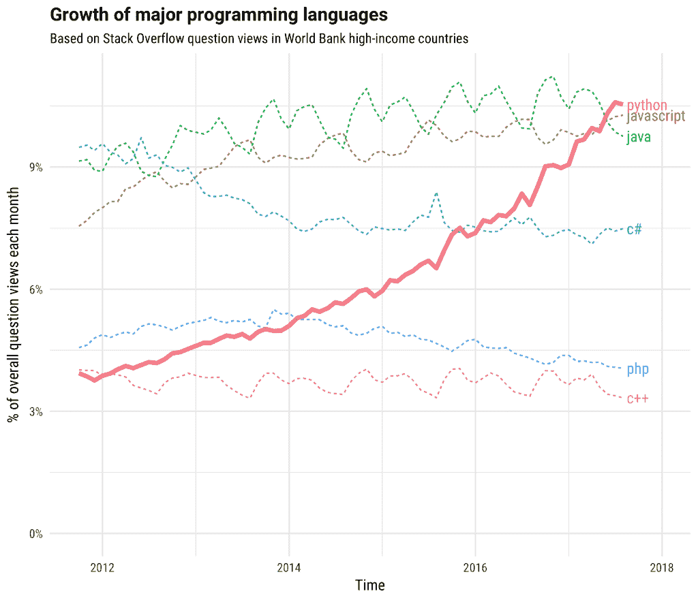
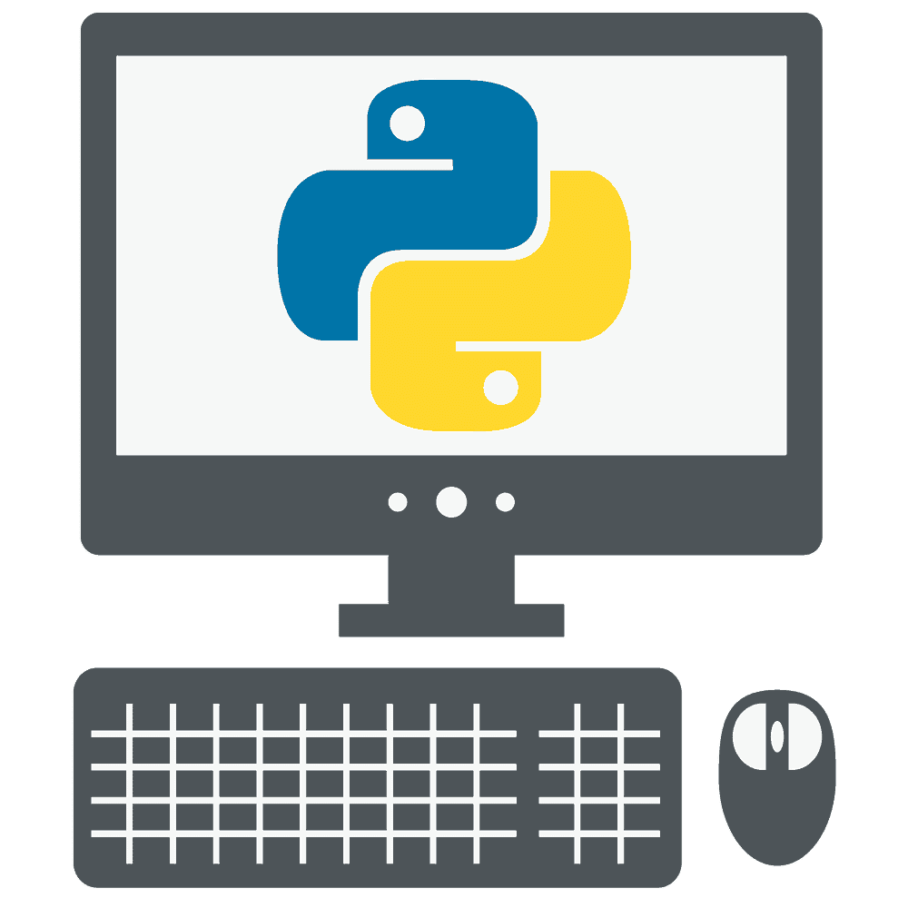

# 网络安全 Python 编程指南

> 原文：<https://simpleprogrammer.com/python-programming-for-cybersecurity/>

网络安全是保护网络、系统和程序免受数字攻击的实践。据估计，到 2019 年，这是一个价值 1120 亿美元的行业，到 2021 年[估计有 350 万个职位空缺。](https://cybersecurityventures.com/jobs/)

许多编程语言用于执行与网络安全相关的日常任务，但其中一种已经成为行业标准: [Python](https://simpleprogrammer.com/python-future-of-programming/) ，它正在主导网络安全行业。

Python 具有易于阅读和理解的语法以及广泛的应用，这使它成为任何有抱负的网络安全专业人员的通用编程语言。

根据 Stack Overflow 的数据，Python 在过去几年的发展令人难以置信，现在被认为是所有行业中最受欢迎的语言之一。

如果你是一名考虑转向安全行业的程序员，这篇文章将向你展示如何在另一个高收入、低失业率的行业中运用你现有的技能。例如，您可以通过自动化重复的过程来为您的团队节省无数的时间，或者通过创建可用于测试应用程序或系统安全性的安全工具来做到这一点。

领先的网络安全软件和服务提供商 Imperva 报告称，他们保护的 77%的网站遭到了基于 Python 的工具的攻击。作为安全专业人员，我们的部分工作是模拟真实的攻击，以确保公司在真实攻击发生时做好准备，了解真实攻击中使用的语言和库。复制这些工具是一项非常有价值的技能。

然而，并不是所有的 Python 经验在安全领域都是平等的。为了建立有效的投资组合，开发有效的软件，并正确展示您的价值，您需要专注于学习适合行业的 Python 库和框架。

因此，让我们来看看为了在这些领域取得成功，您需要了解的一些不同的 Python 库。

## 自动化工具

首先，您希望能够编写有效的 Python 脚本来自动化安全专业人员的许多日常任务。

Python 因其简单易学的语法和广泛的库而被广泛应用于安全工作中，这赋予了它很多功能。虽然可以使用其他语言来执行这些任务，但我建议学习 Python。这是该行业大多数人将使用的技术，协作非常重要。

许多安全任务要求您在成百上千个终端上应用相同的操作。例如，让我们看看配置管理。这是为系统定义一个安全模板的实践，包括机器上允许什么服务，什么端口将被打开，防火墙规则等等。

自动化这些流程的能力不仅可以减少时间，还可以减少错误。高达 90%的安全事故是由人为[错误](https://www.infosecurity-magazine.com/news/90-data-breaches-human-error/)直接导致的。从安全的角度来看，你越能摆脱对人类参与者的依赖，就越好。这就引出了一个问题，我怎样才能学会像这样自动化流程呢？

### Boto3

Boto3 是用于 Python 的亚马逊网络服务(AWS)软件开发工具包(SDK)，它允许程序员编写可以与亚马逊简单存储服务(S3)、亚马逊弹性计算云(EC2)和亚马逊虚拟私有云(VPC)等 AWS 服务交互的脚本。

使用 Boto3，您可以按需启动和停止服务器，取消不符合组织安全标准的实例，执行更新和补丁管理，等等。熟悉这个 SDK 对于任何使用 AWS 的专业人员来说都是非常有价值的。

### 正则表达式

Regex 代表正则表达式，这是一个允许您在文本块中搜索特定模式的工具。这是一个非常有用的功能，用于在调查过程中或从互联网上搜集信息时从日志文件中提取信息。

通过将这个库与其他标准 Python 库相结合，可以创建一些非常有用的程序。例如，您可以使用 regex 搜索日志文件并定位 IP 地址，这样您就可以确定某人是否能够侵入您的网络，他们执行了什么操作，以及此事件发生的时间。

### Pyautogui 和 Web 浏览器

Pyautogui 允许您的脚本控制鼠标和键盘功能，让您模仿智能用户行为。web 浏览器模块允许您启动一个新的浏览器到指定的 URL。

您可以在程序中使用它们来自动执行任何需要您访问网站和执行任何功能的操作，例如填写 web 表单、下载文件等。这可用于自动化需要您登录到网页并发布信息的功能。

例如，我见过一个 Python 脚本，它可以自动测试网页的 XSS 脚本漏洞。XSS 是一种网络攻击，它试图将 javascript 代码插入输入表单，并让代码在网站上运行。

这些库也可用于自动执行其他例行任务，这些任务需要您登录、转到 web 浏览器并在网页上执行操作。

### Pyperclip

This library gives you the ability to access the clipboard directly from your Python scripts. While this can be done with the pyautogui library, pyperclip makes this process much simpler and adds flexibility to your scripts.

这对于任何包含大量文本的脚本都特别有用。例如，假设您正在扫描整个 pdf 以查找姓名、地址和电话号码。只需突出显示 pdf 文本并将其复制到剪贴板，pyperclip 就允许您在脚本中将其用作输入，从而节省大量时间。

### 骗子

这个库致力于产生可以用来测试你的程序的假数据。这对于确保您编写的任何脚本或工具都能够按预期执行操作非常重要。

例如，如果您有一个提取 URL 的脚本，您可能希望生成一些包含该信息的假文本，并测试您的程序以确保您的脚本可以有效地找到它。Faker 可以生成随机数据，如姓名、地址、电子邮件、国家、文本、网址等。

## 笔测试

Python 编程在网络安全中的另一个重要应用是在渗透测试领域。渗透测试是尝试侵入网站、应用程序、设备或网络以测试实体安全性的过程。

为了有效地执行这些测试，许多专业人员创建了他们自己的工具和脚本，这些工具和脚本完全按照他们对测试的需要运行，这就是了解 Python 变得非常有用的地方。

Python 在这一领域主要用于开发用于执行攻击的定制脚本和工具。如果你想在这方面取得成功，知道如何编写有效的脚本以及如何阅读和理解他人编写的工具对你来说将非常有价值。这里有一些你需要熟悉的关键库。

### python 地图

Nmap 是一个使用非常广泛的端口扫描器。端口扫描是检查计算机上打开了哪些端口以及该计算机上正在运行哪些服务的过程，以便您可以开始确定该计算机如何容易受到黑客攻击。

Python Nmap 库使您可以通过 Python 脚本轻松利用 Nmap 功能，从而加快扫描目标计算机漏洞的过程，并在扫描中为您提供更多定制。该库允许您分析 nmap 扫描结果，执行自定义扫描，并将 nmap 结果导入其他工具。

### 窝

Socket 是一个底层的网络接口库，它允许你建立客户机-服务器连接。在网络安全环境中，这一点非常重要，因为它允许您使用特定的协议连接到指定端口上的任何机器，并向该机器发送数据。

这可用于机器的端口扫描，以及向机器发送数据或从中提取信息。数据泄漏发生在 pen 测试的后期，称为利用。任何需要通过网络接口进行通信的项目都可能使用 Socket。

### Scapy

Scapy 是一个包操作库，可以伪造和解码跨许多不同网络协议的包。

在网络安全中，有些情况下您需要监控通过计算机网络发送的数据包。这可能是为了确定是否有人入侵了您的环境，查看机器上正在运行哪些端口和服务，或者对网络问题进行故障排除。

不管是什么原因，这个库非常适合执行数据包分析，并且可以提供与 Nmap、Wireshark 和 tcpdump 等流行工具相同的功能。

### 要求

请求是不言自明的。它允许程序员通过他们的脚本发送 HTTP 请求。HTTP 请求对于 pen 测试活动非常有用，因为它允许创建定制的有效负载和针对 web 应用程序的攻击。

请求可以实现与 burp suite 等工具相同的功能，但可以根据您的需求进行更多定制。Imperva 的研究人员发现，Requests 是基于网络的攻击中最常用的 Python 库，在 89%的基于 Python 的[攻击](https://www.i-programmer.info/news/216-python/12185-python-popular-with-hackers.html)中使用。

### 美味的汤

这个库专门帮助渗透测试的信息收集阶段。

Beautiful Soup 允许您解析 HTML 和 XML 文件中的数据，让您自动执行数据采集任务。在渗透测试的开源智能阶段，数据搜集非常重要，因为这个阶段致力于找到尽可能多的关于测试目标的信息。

出于这个原因，您可能想要创建脚本来自动化这个阶段，在 Github 等地方搜索以找到关于您的目标公司的信息。这些信息可能包括 IP 地址，或者用户 id 和密码，这些信息经常被开发人员无意中提交给公共存储库。

## 额外资源

Each of these libraries adds important functionality, but to get proficient with writing scripts related to security, it’s best to learn them in a structured way.

当谈到**自动化工具**时，我强烈推荐这两个资源，因为它们涵盖了日常任务自动化中使用的所有核心 Python 库，并且它们指导您完成几个项目，您可以将这些项目放入您的文件夹中，以向招聘人员展示您的知识。

*   [Automatetheboringstuff.com](https://automatetheboringstuff.com/):这本*免费的*电子书将带你浏览所有这些库以及更多与使用 Python 自动化日常工作任务相关的内容。这是迄今为止我发现的最全面的指南，附带练习、项目和演练。
*   Google 的自动化与 Python 专业证书 : Google 有一个速成课程向你介绍这种语言，并带你了解 IT 专业人员自动化的重要方面。

当你正在学习 Python 时，我强烈建议你保留在这些课程中编写的所有代码，并在文件夹中使用它们。一个简单且免费的方法是通过 Github 组合。

这些课程中的每一门都附带了一些您可以进行的实践项目想法，但是您想要展示的一些关键技能是读写文件、从文本中提取信息以及通过应用程序编程接口(API)与在线服务进行交互的能力。

如果你对[学习](https://simpleprogrammer.com/get-started-learning-python/) Python 直接用于**笔测试**感兴趣，这里有一些好的起点。这些书详细介绍了如何使用 Python 完成特定于安全的活动，如安全自动化、开发用于安全测试的 Python 安全工具以及计算机取证活动中使用的 Python 脚本。他们也很受安全社区的尊重，这证明了他们的质量。

*   *[暴力 Python:](https://www.amazon/dp/1597499579/makithecompsi-20) 黑客、法医分析师、渗透测试员和安全工程师的食谱*

*   *[黑帽 Python:](https://www.amazon/dp/1593275900/makithecompsi-20) 针对黑客和 Pentesters 的 Python 编程*

*   *[灰帽 Python:](https://www.amazon/dp/1593271921/makithecompsi-20) 面向黑客和逆向工程师的 Python 编程*

对于任何有抱负的安全专业人员来说，编程能力都是一项宝贵的资产，尤其是如果您对安全工程师或渗透测试员等技术角色感兴趣的话。

## Python 在网络安全中至关重要

Python 是网络安全领域最流行的编程语言，展示你用这种语言编程的能力可以大大提高你获得工作的机会。

为了构建一个强大的编程组合，您需要重点展示您可以使用 Python 自动完成日常任务，以及创建用于测试 Web 应用程序、网络和计算机系统的安全工具。

网络安全是收入最高的技术行业之一，而且预计只会增长，为那些合格的人提供了一个巨大的机会。