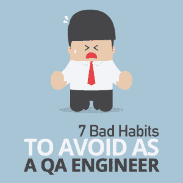

# 作为质量保证工程师应该避免的 7 个坏习惯

> 原文：<https://simpleprogrammer.com/qa-engineer-habits/>

Most people would agree that software quality is important. We have seen the results of buggy software in all kinds of situations: from Mars probes malfunctioning and chemotherapy machines administering lethal doses of radiation, to telecommunications systems experiencing a cascade failure. It would seem logical to assume that software testers would be much-valued members of a development team. Yet sadly, that is not always the case.

一些软件开发人员、产品所有者和经理认为质量保证(QA)工程师是那些想成为开发人员但缺乏成功所需的技能或勇气的人。不幸的是，有一些测试人员符合这种描述，但是大多数测试人员是真正关心他们测试的产品质量的人。

那么，为什么测试人员的名声如此之差呢？通常，这是因为他们在职业生涯中养成的坏习惯。

本文将概述 QA 工程师应该积极避免的七个习惯以及取而代之的好习惯，以确保 QA 工程师在做高质量的工作，并赢得同行的尊重。

## 坏习惯 1:测试你不懂的东西

我们都遇到过这种情况:JIRA 董事会上有一些模糊的故事，涉及一些遗留的后端代码，没有人完全确定这些代码做什么或者如何改变它。负责这个故事的开发人员已经做了足够的研究来修复代码，但还没有在故事中加入任何关于它如何工作或有什么变化的细节。开发人员对你说，“只要在这个服务器上运行这个请求，如果你得到这个响应，那么问题就解决了。”

这个场景的问题是:你如何知道开发人员是正确的？如果问题没有解决，生产出现故障，您的经理会带着问题回来找您。你真的想让你的唯一反应是“开发人员告诉我这样做，它的工作，所以我把故事完成”？

**好习惯:**提问。请你的开发人员向你解释这个特性是如何工作的，以及对它做了什么改变。

不断问一些澄清性的问题，直到你真正明白发生了什么。在这样做的时候，你可能会提出开发人员没有想到的问题，让他们回去改进他们的工作。

软件开发人员在不断地学习，你也应该如此。收听[播客](http://testinginthepub.co.uk/testinginthepub/)，阅读[博文](http://thethinkingtester.blogspot.com/)，跟上最新的技术趋势和测试策略。

## 坏习惯 2:只测试故事告诉你要测试的东西

我们的开发故事通常包含验收标准(AC ),它准确地概述了新特性或修复应该如何表现。这些通常由产品所有者编写，有时由开发人员编写。AC 是有帮助的，当然比完全没有 AC 要好，但是它们通常只包含“快乐之路”的场景。

即使当开发人员编写 AC 时，他们也可能不包括可能隐藏 bug 的测试场景，这不是因为他们试图欺骗，而是因为他们可能没有想到这些场景。测试人员通常会认为开发人员知道的最多，并且只测试 AC。这意味着可能有未测试的关键区域和未检测到的错误。

**好习惯:** [跳出框框思考。](https://www.amazon.com/dp/B01D33OG6E/ref=dp-kindle-redirect?_encoding=UTF8&btkr=1)作为质量保证工程师，我们的技能之一是能够思考什么可能出错；我们需要在我们测试的每个故事中使用这种技能。

在你在 AC 上签字之前，问问你自己，“我还能想到在这里测试什么吗？我错过了什么吗？”这通常会帮助您在其他人没有想到的地方找到 bug。

## 坏习惯 3:假设奇怪的行为是正确的行为

Often, when we are testing a new feature, we run across behavior that doesn’t make sense. Perhaps it’s an odd page refresh or a navigation to a place we weren’t expecting. Or perhaps a button appears where we weren’t expecting one.

当我们在截止日期前进行测试时，很容易过于关注故事的情节，以至于奇怪的行为被抛到脑后。我们可能会告诉自己，“当这个故事结束时，我会问开发人员这个问题，”(然后我们忘记了)，或者我们说，“嗯，我肯定她知道她在做什么；它很可能就是这么做的。”

好习惯:听从你的直觉。如果行为很奇怪，终端用户也很有可能会觉得奇怪；他们甚至会觉得很沮丧，以至于停止使用该应用程序。

我们需要记住，我们的最终用户是我们的客户。我们是确保他们对我们的应用程序有良好体验的最后一道防线。如果你的直觉告诉你有些事情不太对劲，记录你的测试并说出你所看到的。

## 坏习惯 4:追逐兔子洞里的东西

这与坏习惯 3 相反；有时候，QA 工程师太专注于寻找应用程序的每一个错误，不管有多小，以至于他们最终陷入“分析瘫痪”,并使他们团队的进展停滞不前。

我记得我问过一位 QA 工程师同事，她在职业生涯中发现的最喜欢的 bug 是什么。她兴奋地告诉我一个 bug，涉及到多次点击一个按钮，在一对页面中前后导航，然后快速滚动，所有这些都在一个特定的浏览器中完成。

虽然我确信追踪这个 bug 很有趣，但是它涉及了用户永远不会做的行为，而且这个 bug 本身并不是特别有害。我想知道，在她试图重现这个模糊的问题时，她还能发现多少其他真正的问题。

**好习惯:**关注真实世界的用例。请永远记住，我们的重点应该是确保我们的软件能够很好地为我们的用户服务，并且能够很好地保护我们的软件免受恶意用户的侵害。我们不仅仅是为了狩猎的乐趣而寻找虫子。

如果你发现自己掉进了兔子洞，问问自己，你的时间是否可以更好地用于测试更现实的用例。

## 坏习惯 5:为了自动化而自动化测试

学习了如何编写自动化的 QA 工程师发现自动化很有趣。解决一个技术挑战并自动观察您的测试运行时，会有一种紧迫感。

但是自动化并不总是答案。当我们有一个新的特性要测试时，花时间去了解这个特性是很重要的，就像最终用户实际使用这个特性一样。当我们在完成之前就开始自动化时，我们可能会结束自动化测试，而这些测试并没有很好地运用这个特性。

我们也可能错过关键功能。例如，如果我们有一个按日期范围搜索的新搜索特性，一个自动化工程师可能会花费所有的时间来弄清楚如何使用 Selenium 测试软件选择日期，而从来不会注意到输入的开始日期可能在结束日期之后。

好习惯:花时间做手工的、探索性的测试来了解一个特性。询问有关如何使用该功能的问题。想想你的终端用户会怎么做。找到尽可能多的 bug。然后，开始考虑[你应该如何自动化它](https://joecolantonio.com/testtalks/)。

## 坏习惯 6:创建复杂而古怪的测试

当我第一次学习如何用 Selenium 自动化用户界面(UI)测试时，我将它们自动化为手动测试。我的测试有很多步骤和隐式等待。测试的步骤越多，某个测试步骤失败的可能性就越大，从而导致整个测试失败。隐式等待是不可靠的，因为等待一定的秒数并不能保证元素在这段时间内出现并可点击。

因此，我的测试非常古怪。

每天早上我上班时，我都会检查哪些测试失败了，然后重新运行所有失败的测试。然后我会修补第二次失败的测试，看看我是否能让它们正常工作。这是对我时间的极大浪费。

好习惯:记住自动化的目的是让你的工作更容易，让你有时间做更多的探索性测试。

自动化测试应该简单，每个测试只检查一件事。看看你的 UI 测试，看看是否可以用 API 测试来代替自动化。应用程序编程接口(API)测试比 UI 测试更快更可靠，因为它们不依赖于浏览器的响应。当需要 UI 测试时，一定要使用显式等待，而不是隐式等待，以减少碎片。

## 坏习惯 7:接受糟糕的用户体验

Sometimes, when we are working on a deadline and have many stories to test, we look only at the functionality of a feature. If the feature works and has no bugs, we call it done and move on.

但是记住最终用户是很重要的。如果用户不明白该在页面上做什么，或者发现他们必须点击几次才能完成某件事，他们会很沮丧，不想使用这个产品。

最近，当我被要求填写一份调查时，我看到了一个这样的例子。我被问到的问题需要很长的答案，但调查领域太小了，我一次只能看到一行，这使得我很难输入和校对我的条目。我敢肯定，测试产品的 QA 工程师验证了该字段可以输入，条目可以保存，但他们没有考虑到使用起来会有多困难。

好习惯:在测试你的应用程序时，永远要想到你的最终用户。从您的产品负责人那里了解预期的工作流是什么，并运行这些工作流。问问你自己，如果你是最终用户而不是测试人员，你会怎么看待产品的行为。如果这种行为让你感到沮丧，倡导改变这种行为。

## 记住你为什么要测试

在我们作为测试人员的日常工作中，很容易被截止日期和技术挑战分散注意力。我们非常擅长关注软件的细节，这也是我们擅长发现 bug 的原因。但是我们绝不能忘记我们公司存在的原因:创造人们会使用的软件。

我们所有任务的最终结果必须是保证用户能够直观、安全、方便地使用我们的产品。当我们始终关注我们团队交付的产品的质量时，我们赢得了作为高效 QA 工程师的声誉，以及我们的开发人员、产品所有者和领导者的尊重和信任。