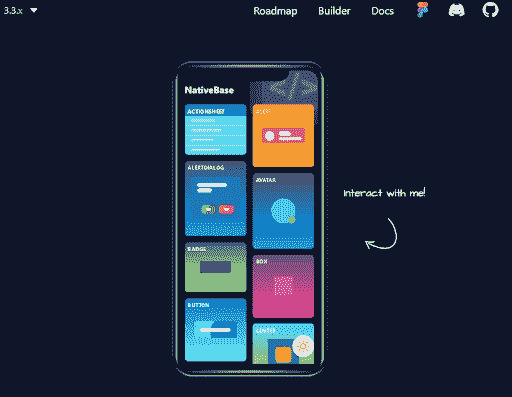
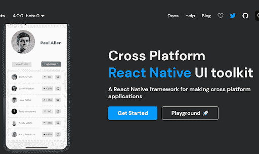
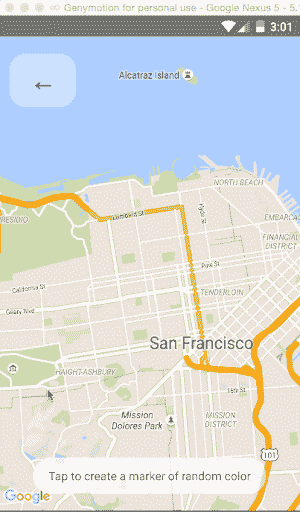

# 开发人员应该知道的 5 大 React 原生 UI 组件库

> 原文：<https://simpleprogrammer.com/react-native-ui-component-libraries/>

也许你知道，React Native 是一个开源的 UI 框架，用于构建在线移动应用。毫不奇怪(考虑到移动应用的流行)，React Native 近年来变得非常受欢迎。它允许开发人员使用一行代码为许多平台(如 Android、Windows 和 iOS)创建应用程序。

因为 React Native UI 组件库通过其直观的特性节省了大量的时间和精力，React Native 每天都在社区中获得越来越多的认可，吸引着世界各地的开发人员。

你有没有考虑过 React 本地库是如何在它们的进程中如此高效的？您想知道如何在您的应用中使用它们的组件吗？如果是这样，这篇文章是给你的。我将向您展示一些[最佳 React 原生 UI 组件库](https://blog.logrocket.com/react-native-component-libraries/)，它们可以在您的下一个 React 原生应用程序开发项目中提供帮助。

## 什么是 React Native？

React Native 是一个由 Meta platforms，Inc .开发的开源 UI 框架，其使用的一个例子是 Oculus，React Native 帮助开发虚拟现实应用程序。它允许开发人员使用 React 框架和原生平台特性来创建适用于 Android、iOS、macOS、Web、Windows 等的应用程序。

全世界有数百家公司成功地采用了这种模式，包括微软、优步和脸书等知名公司。Instagram、脸书和 Skype 都是世界上最受欢迎的 React 本地应用。

在相对较短的时间内，React Native 已经上升到移动开发选项列表的顶部。

## 顶级 React 本机组件库

通常，当[创建 React 组件](https://www.amazon.com/React-Components-Christopher-Pitt-ebook/dp/B01BSTEDJ0/)时，您必须根据您将要使用的平台规则调整它们并设置样式。这就是 React Native 使用其特定框架创建移动应用程序的便利之处，因为它同时使用 React 和自己独特的原生功能。以下是一些可以与 React Native 一起使用的最佳 UI 库的列表:

*   本地基地
*   本土元素
*   戏弄者
*   反应原生地图视图
*   反应本机用户界面库

上面提到的 React 本地组件库由于其独特的功能理所当然地获得了巨大的流行。现在，让我们具体了解一下这些库都提供了什么。

### 本地基地

使用原生基础库作为构建块是开始构建您的应用程序的一个极好的方式，因为它为您提供了许多跨平台的 React 原生组件和其他工具，可以帮助您构建有创意的应用程序。这包括使用 React Native 和 JavaScript 功能制作的组件，能够定制一些特性。

这是一个很大的优势，一个人可以得到一个原生的基础库。您可以简单地利用任何具有原生基础的原生第三方工具，这有助于您构建智能应用。为了让你的应用程序吸引人，你甚至可以使用初学者工具包和可配置的主题布局。

随着更多的功能和显示被添加到应用程序中，主题变得更加昂贵。不过，通过使用相同的 JavaScript 代码库，您可以获得原生外观并增强应用程序的功能。你甚至可以为 iOS 和 Android 应用应用不同的、特定于平台的设计。

### 反应本地元素

这个跨平台的 UI 工具包集成了材质设计和 React Native。它是最简单、最容易开始的框架之一，GitHub 上有超过 100k 个 stars。这个工具包库没有遵循显式的设计方法，而是使用标准化的固有组件提供了更基本的结构。这意味着您可以更加灵活地个性化组件。

应用中使用的任何组件都可以使用自定义属性和 React 本机核心 API 功能的组合进行自定义。头像、定价、徽章、覆盖图、分隔线、社交图标按钮等都包含在这个库中，以帮助开发者构建出色的应用。React Native Elements 完全用 JavaScript 开发，提供了高度的可定制性。

### 戏弄者

Teaset 是一个 React 原生 UI 框架，拥有 20 多个 JS(ES6)组件，专注于内容呈现和动作控制。这是一个小型组件库，包含了制作一个完全可操作的 React 本地应用所需的一切。Teaset 的组件具有传统的 Android 应用程序外观，这增加了它在开发者中的价值。

Teaset 本身是一个非常简单且功能强大的 React 原生库。这个库的目的是保持对应用程序内容的关注，而不是它的外观。

### 反应原生 Mapview

React Native Mapview 是一个独特的库，可用于创建具有 iOS 和 Android 功能的惊人应用程序。React 本地地图组件允许用户定制组件，这些组件提供简单的、类似 React 的 API 来调整地图功能。“Mapview”组件的设计使得普通地图元素(如标记和多边形)可以轻松通过。通过这样做，可以通过 API 以声明方式直观地控制地图功能。

更改地图查看区域、在地图上放置组件以及修改标记和地图设计只是可用功能的一部分。如果需要，你可以放大坐标，甚至制作动画。

Mapview 可以使用动画 API 来操纵地图的中心和焦点。这有助于检查并为道具赋值。通过为其提供动画区域，除非指定了自定义标记，否则将显示默认标记。

### 反应本机用户界面库

Wix 产生了 React 原生 UI Lib 组件库，它包含了你在其他库中找不到的不同的异常特性。这个 UI Lib 包括相同的特性，比如主题和其他相关组件。

其中包括 20 多个定制组件，其中一些组件，如抽屉，可以轻松整合，提供无缝体验。它还支持之前和最近的 [React Native 0.65 版本](https://reactnative.dev/blog/2021/08/17/version-065)，甚至包括定制的动画元素，如图形卡扫描仪和移动图片。

这是另一个用户界面框架，支持从右到左的创作，并提供其工具的完全可访问性。

## 挑选最好的 React 原生库

所有 React 本地库都有独特的特性，使它们彼此不同。这些库可以帮助您更快、更有效地开发应用程序，消除重新构建的需求并减少出错的机会。有了这些库，你可以[简单地构建 React 原生应用](https://www.amazon.com/Fullstack-React-Native-beautiful-JavaScript/dp/1728995558/)。

在本文中，我介绍了可以在很大程度上增强用户体验的五大库。在考虑任何 UI 库之前，您必须拥有与 React 原生项目相关的所有必要信息。

不过，值得一提的是，React 原生环境是巨大的，随着社区继续发布新工具来改善开发人员的体验，它只会变得更大。您可以咨询 React Native App 开发公司以获取更多信息，并帮助选择最佳 React 原生库。