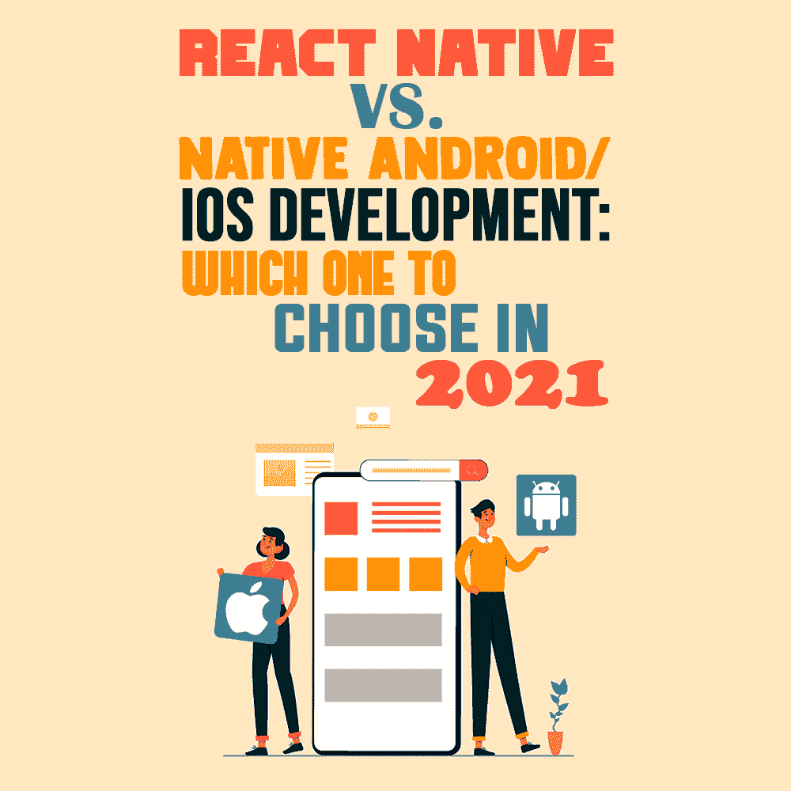

# react Native vs . Native Android/iOS 开发:2021 年选哪个

> 原文:[https://simple programmer . com/react-native-vs-Android-IOs-development/](https://simpleprogrammer.com/react-native-vs-android-ios-development/)

According to [Statista](https://www.statista.com/statistics/271644/worldwide-free-and-paid-mobile-app-store-downloads/), there were 204 billion mobile app downloads in 2019 alone. Given all the time people spend on their phones, the idea of building a mobile app to grow your business is luring every modern entrepreneur.

当涉及到构建移动应用程序时，人们面临的一个困境是，是构建一个可以在 Android 和 iOS 上运行的应用程序，还是两个不同的应用程序，每个平台一个。

选择 React Native 还是选择原生 Android/iOS [应用开发](https://www.resourcifi.com/blog/app-development/?utm_source=SimpleProgrammer)将取决于你想从移动应用中获得的效用。在本帖中，我将与你分享你需要知道的一切，以正确理解每个选择的后果。

## 理解方法:自然反应

React Native 由脸书开发，允许同时为 Android 和 iOS 构建移动应用，也就是 T2 的跨平台开发。因为你不必为不同的平台重新设计整个应用程序，所以你可以看到 React Native for business 如何成为企业家的显而易见的选择。选择 React Native 有以下主要好处。

### 这既省时又省钱

当您不必为两个不同的平台从头开始重新设计 UI 和 UX，并且可以为另一个平台重用代码时，您就自动节省了时间。简而言之，如果你选择 React 原生开发而不是原生应用开发，那么你只需要雇佣原生 Android 和 iOS 编码所需开发人员的一半。

这节省了时间，因为当需要在多个开发人员之间进行协调时，可能会发生时间泄漏，这在 React 本地开发人员没有任何人需要跟上或等待的情况下不会发生。

此外，当你能够构建一个可以同时在两个操作系统上使用的应用程序时，因为能够重用代码，所以[应用程序开发成本](https://simpleprogrammer.com/app-development-pricing-2021/)必然会显著降低(大约 25-30%)。因此，如果你试图开发一款应用，但预算有限，你可以选择 React Native developer。

### 热重装

想象一下，如果您可以实时监控代码，而不必等待应用程序构建和代码编译才能进行更改。这正是 React Native 所发生的事情，相比之下，原生 Android 或 iOS 开发中，开发人员必须在每个阶段进行协调，以确保他们在同一页面上，只有在这之后他们才能前进。

看到编码实时发生的能力在许多不同的方面帮助你，从能够做出必要的改变，到维护更多的责任。

### 在 iOS 和 Android 上都有相同的体验

如果你的目标是构建一个能在 Android 和 iOS 平台上提供相同体验的应用，那么选择 React 原生开发解决方案将会实现这一目标。

使用单独的框架来构建单独的本地应用程序以提供相同的体验肯定是非常耗时的。话虽如此，公司(预算紧张)通常会先在 iOS 上发布应用。其中一个原因可能是普通的 iOS 用户比普通的 Android 用户花更多的时间在应用上。

Clubhouse 是一个最近的例子，它是一个只接受邀请的社交媒体平台。

## 理解方法:本地应用程序开发

不管是好是坏，整个世界都围绕着两个移动操作系统:Android 和 iOS。原生应用在某种程度上与 React Native 相反。这里的应用程序在 Android 和 iOS 上都是独立构建的，UI 和 UX 开发必须在两个平台上分别进行。

Android 使用 Java 或 [Kotlin](https://www.amazon.com/dp/1530075610/makithecompsi-20) 作为其主要编程语言，而 iOS 使用 Swift 作为其原生 iOS 应用开发的编程语言。但是为什么会有人想要为两个不同的平台拥有两套独立的代码呢？让我们找出答案。

### 更好的性能

当你比较本地应用和跨平台应用时，差异归结为运行速度和整体性能。React 原生应用尽管可能很好，但缺乏原生应用框架所能提供的性能增强能力。

当运行繁重的动画和构建游戏时，本机应用程序可以提供帮助。

### UI/UX 可能性

自定义用户界面和 UX 的方式是无穷无尽的。

与 React Native 相比，一个原生 Android 或 iOS 应用程序能够实现更复杂的 UI 界面和设计，在 [Adobe XD](https://gfxmaker.com/adobe-xd/) 上创建，并具有动画效果，从而变得更加用户友好。这有助于用户更快地理解应用程序的导航。

### 整合能力

当你看到像优步这样的应用程序时，你会意识到一个应用程序可能经常需要集成，如 GPS 的谷歌地图，众多的支付网关应用程序，电话和短信等手机应用程序，等等。如果您的应用程序需要这样的集成，您可能希望使用原生应用程序开发，因为它能够处理繁重的工作。

然而，不仅仅是这样。不同的手机有不同的操作系统，你不能让一个 React 原生开发者集成 Android 应用，并期望它在 iOS 中也能发挥同样的作用。因此，如果你计划在你的应用中使用大量的集成，只有在有单独的原生 Android 和 iOS 开发时才有意义。

### 易于启动

一个最容易被忽视的因素是，当启动你的原生 Android 或 iOS 应用程序时，几乎没有任何问题。这主要是因为原生应用开发者在开始工作之前会遵循各自操作系统的指导方针。

React 本地开发人员可能需要找到并编辑与特定操作系统一致的代码和特性。

## 哪个更好？

Well, it entirely depends on who you are and what you are looking for. But, in a nutshell, here are some factors that can push you in either direction.

### 预算

如果你没钱开发原生应用，你绝对可以尝试 React 原生开发，看看效果如何。如果你没有意识到你的选择的后果，那么你可以联系应用开发公司，他们中的大多数会很乐意给你建议。

### 必需品

也许你有预算，但你觉得在进行集成、繁重的设计或遵循指导方针时没有任何可能的复杂性，在这种情况下，你肯定可以选择 React Native。

在任何其他情况下，特别是如果你认为应用程序很复杂，那么为了仍然提供高性能，你需要使用原生 Android 和/或 iOS 开发。

### 你多久需要它？

如果你急着推出这款应用，那么你绝对可以选择 React Native。毕竟，无论我们如何将它与原生应用程序开发解决方案进行比较，它都是一个非常可靠的选择。React Native 可以帮助你在 Android 和 iOS 上快速启动应用。

然而，如果应用程序很大，你就不应该进行原生应用程序开发，因为如果你急于推出它，你最终会牺牲质量。

### 您服务的独特性

如果你的市场是未开发的，那么你肯定应该开发本地应用程序，主要是因为你的竞争对手很快就会赶上来，通过提供你没有的东西迅速进入你的市场。但幸运的是，他们永远无法达到你的性能水平，因为为了建立一个快速的应用程序，他们必须在 React Native 上完成。

此外，在原生 Android 和 iOS 应用程序中融入新功能和更新代码行很容易，因此您不必担心落后。类似地，如果你的市场已经饱和，你正在进入这个市场，你也可以选择 React Native。

## 当你知道为什么时，选择会更容易

选择往往看起来令人生畏，尤其是当它们涉及重要的商业决策时。选择构建应用程序的路径无疑是一个涉及许多参数的选择。

然而，当你用知识武装起来时，选择会更容易，希望这篇文章给你提供了必要的信息，可以让你的任务不那么令人生畏。

每种方法，原生 Android/iOS 的 Reach Native，都有自己的优点和缺点。正如我向您展示的，前者通常提供了灵活性，并且节省时间和成本，而当需要考虑性能和集成可能性时，后者是更好的选择。

如果你还不确定，不要犹豫去咨询行业专家。如果你准备好开始你的移动应用程序开发，你可以[雇佣 React 本地开发者](https://www.resourcifi.com/hire-react-native-developer/?utm_source=SimpleProgrammer)并开始行动！