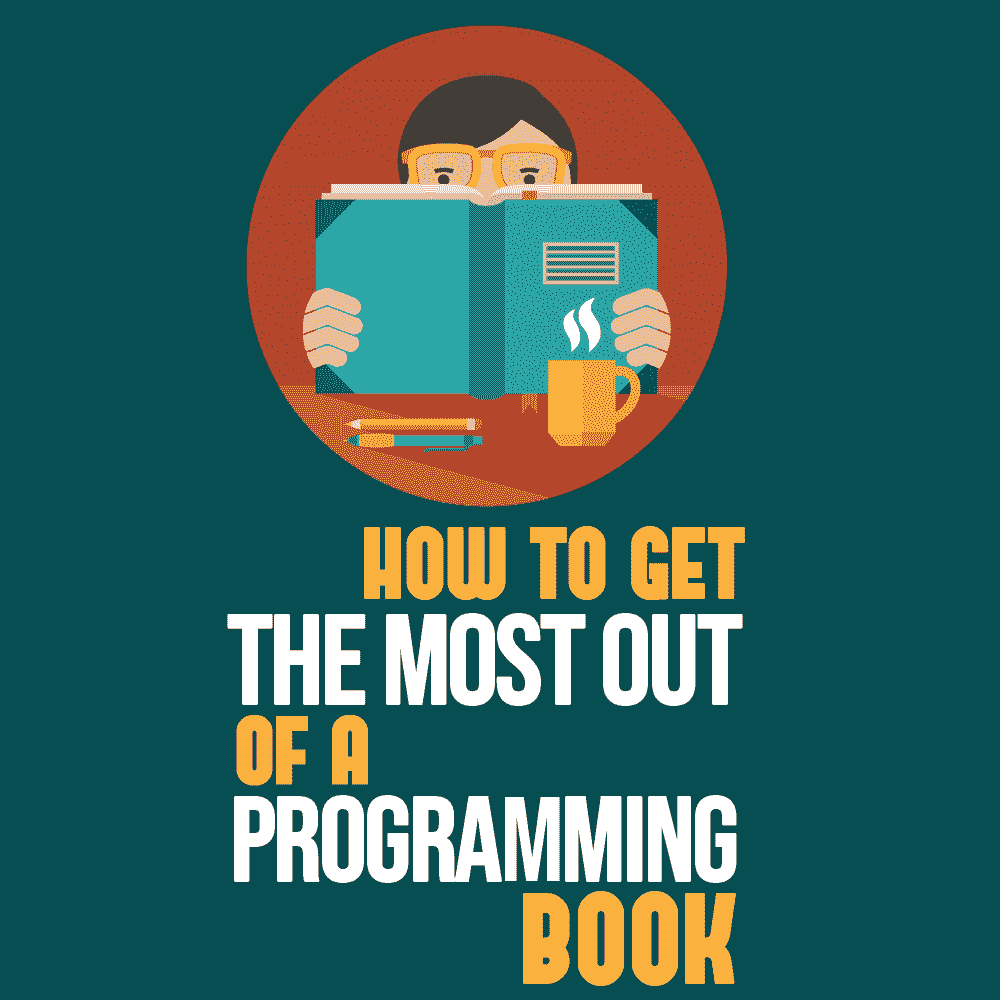
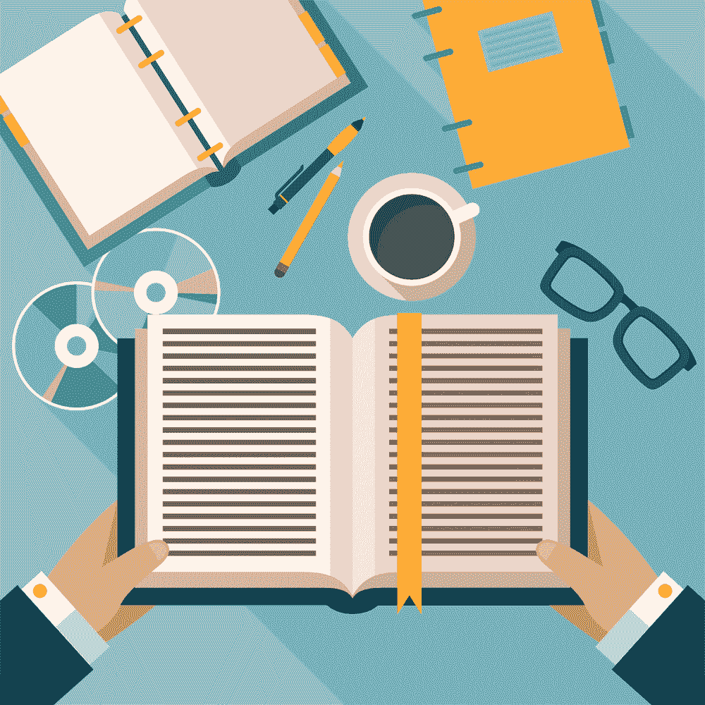

# 如何充分利用编程书籍

> 原文：<https://simpleprogrammer.com/reading-a-programming-book/>

<figure class="alignright is-resized">

</figure>

作为软件开发人员，我们的主要资源是网络。为了了解某个应用程序编程接口或语言特性，我们不得不查阅标题为“完全参考……”的厚厚的手册的时代已经过去了。我为此感到高兴！

然而，有些主题最好在一本书里传达。

一本书可以从头到尾涵盖一个主题，而网络资源通常非常专业。它可以讲述一个连续的故事，而网络资源往往是支离破碎的。书是一种特殊的东西，我们有意识地为它留出时间，而我们经常只是随意地消费网络资源——毕竟，我们已经为这本书付了钱。

因此，为了学习编程语言、软件架构风格或敏捷方法的概念，你可以买一本书。你可能会保持动力，最多在几周内通读一遍，并在日常软件开发中应用你所学到的东西。

但是老实说。你有多经常读一本书的前几章却忘了它？几个月后，你在一个角落的一堆灰尘中重新找到了这本书，你为没能度过难关而感到难过。

所以我们来谈谈如何养成读书的习惯，以及如何在读书的同时获得最大的收获。

## 选择合适的书

时间是宝贵的，你想把它花在有价值的事情上。

在买书之前，你应该确定你真的想读它。这是一个你需要学习以更好地工作(或者得到一份更好的工作)的话题吗？是关于你好奇的事情吗？书名和内容实际相符吗？其他读者对此有什么看法？
T1。med rectangle-4-multi-110 { border:none！重要；显示:屏蔽！重要；浮动:无！重要；行高:0；边距-底部:15px！重要；左边距:0！重要；右边距:0！重要；margin-top:15px！重要；最大宽度:100%！重要；最小高度:250px 最小宽度:250 像素；填充:0；文本对齐:居中！重要}

这些问题最好由已经读过这本书的同事或朋友直接回答。错过了这些，你可以在网上查阅书评。然而，不要仅仅满足于亚马逊书评。

有一些博客提供更详细(有时更诚实)的评论。还有为程序员整理的书单，[，就像约翰·桑梅兹最近编辑的那本](https://simpleprogrammer.com/best-programming-books-2019/)。你能挖掘的资源越多，你对这本书的描述就越好。

当然，你也可以直接买书自己看。然而，你可能会陷入动机陷阱。如果你买的每第二本书都不符合你的期望，并且在第一章之后你就停止阅读，你的“耻辱之堆”将会增长，你可能会失去阅读更多书籍的动力。

连续几个月或几年阅读能促进你职业发展的书籍不是很棒吗？想象一下你将获得的知识！所以，一旦你手中有了一本书，让我们看看如何在短时间内看完它。

## 了解你的阅读速度

像许多其他事情一样，通读一本书的最好方法是计划好它，并养成习惯。然而，在计划一项任务之前，你需要知道它需要多长时间。

读一本书，一章，一页需要多长时间？据说一个成年人的平均阅读速度在每分钟 200 到 250 个单词之间。当然，如果你读的书不是你的母语，或者本质上是非常技术性的，这可能会有所不同。

但是谁愿意用一本书的字数来衡量阅读速度呢？要找到你对某本书的真实阅读速度，我建议用每页的分钟数来衡量你的实际阅读速度。

计划一些时间阅读第一章，或者前 20 页左右。测量一下所花的时间，然后用它除以你看完的页数。结果就是你手中拿着的书的个人阅读速度。

不要试图通过查看你读前一本书的速度来推断你读一本书的速度。可能变化很大。在读约翰的书《[软技能:软件开发人员的生活手册](https://simpleprogrammer.com/get/softskills)》时，我测了一下自己的阅读速度，大概是每页 1.5 分钟。

目前，我正在读乔治·费尔班克斯写的“[刚刚够用的软件架构:风险驱动的方法](https://simpleprogrammer.com/software-architecture)”，这本书每页花费我 2.5 分钟多一点的时间。每本书的写作风格、内容和字体大小都不同。

每页多一分钟或少一分钟，看似不长，但乘以一本书甚至一章的页数，这就是很多时间了。

在安全的地方记下你的阅读速度。我一般写在便利贴上，放在第一页(封面内；否则，它会丢失)。这样，我可以在任何时候计划我的阅读时间时参考它。

电子书呢？每页几分钟的方法在这里不适用，因为每个电子书阅读器都有不同的页面大小，你甚至可以改变字体大小。然而，电子书阅读器通常会提供一个位置指示器，你可以用它来代替页码来衡量你的速度。如果你的电子书阅读器有一个封面，你甚至可以在里面贴上便利贴。

## 计划你的阅读

<figure class="alignright is-resized">

</figure>

现在你知道了这本书的阅读速度，你就知道要花多少时间了。

就像健身、写作或刷牙一样，一旦你建立了一种节奏并养成了习惯，阅读就会非常成功。

以我的经验，建立习惯最好的方法就是做周计划，这本身就是一种习惯。我每个周末都会花一个小时来计划下周的个人任务。这些包括写博客、准备演讲、读书等等。

对于你正在阅读的每一本书(是的，一次可以有多本)，计算你想在一周内阅读的章节的页数，然后乘以你的每页阅读速度。

这样，你就知道每章要花多长时间。然后在你的日历或你使用的任何计划工具中为这些章节留出时间。如果这本书的章节太长，你也可以留出 20 页左右的时间。

我更喜欢在一次会议中通读一整章，以尽量减少上下文切换和碎片。
T1。leader-2-multi-119{border:无！重要；显示:屏蔽！重要；浮动:无！重要；行高:0；边距-底部:15px！重要；左边距:0！重要；右边距:0！重要；margin-top:15px！重要；最大宽度:100%！重要；最小高度:250px 最小宽度:250 像素；填充:0；文本对齐:居中！重要}

但是在你的时间表中，你应该把这些时间段放在哪里呢？即使你的日历在工作日肯定排满了，也不要把你的阅读时间推到晚上。

根据我的经验，在一整天的编程、会议和办公室政治之后，集中阅读是不可能的。你可能读完了一本书，但你会记得你读过的内容吗？

相反，试着将阅读习惯融入你的工作日。早上花半小时阅读，下午多工作半小时。你甚至可以和你的老板谈谈，让阅读时间成为你工作描述的一部分。毕竟你读书是为了提高专业技能。试着在你和老板的下一次年度评估中解决这个问题。

现在的问题是完成你的计划。一旦你这样做了一两个星期，你就会养成一种习惯，甚至会觉得一旦打破了这种常规，你就会错过一些东西。

不要跳过每周计划！由于假期和休假，在写这篇文章之前，我跳过了我的周末计划，我已经知道我不会在这个星期阅读一页。

## 坚持你的知识

一旦你下定决心要读一本书，你会想确保坚持阅读时获得的知识。否则，当初为什么要读书？您希望能够向您的同事讲述这些内容，并在您的软件开发中应用您所学到的内容。

坚持学习知识的第一步是做笔记。就像你在学校做的那样，用项目符号写下你觉得最有趣或对你来说是新的概念。

另外，记下你在其他书中读到的概念或者你在软件项目中遇到的情况。将新获得的知识与过去的经验联系起来是一个很好的方法，可以让它在你的大脑中扎根。

做笔记有多种方法。就我个人而言，我喜欢对一本书的每一章都使用便利贴(如果章节真的很长，也可以用两个便利贴)。阅读一章时，我会写下有趣概念的要点。写完这一章后，我在这一章的最后一页贴了一张便利贴，供以后参考。

然而，与学校不同的是，你不是为了考试而学习。你不想进行暴食症式的学习，在这种学习中，你会忘记你后来学到的东西。你希望知识与你同在。

坚持知识的最好方法是重复。和不同的人谈论它。与同事或在 Twitter 上开始对话。或者干脆留出另一段时间来再次检查你的笔记。

更好的是，把它写下来。我喜欢在博客上回顾我读过的书。这样，我就被迫重温我记下的笔记，并把它们组织成我自己的思路，这样在将来更容易记住它们。

更进一步，你可以将你所学的信息数字化，以供将来参考。这对以后的研究或者写作项目会有很大的帮助。

Citavi 是一个支持做笔记和交叉引用的工具。它的目标是那些必须连接不同来源的信息来撰写自己的论文的研究人员，但它也可以用作个人的知识主体。

## 你的下一本书是什么？

<figure class="alignright is-resized">

</figure>

阅读一本书，如果做得好的话，是拓宽你的知识的一个很好的方式，不仅可以跨越许多软件开发主题，如软件架构或敏捷方法，还可以涉及生产力和职业建议等主题。

事实上，你付钱买一本书，并且通常在没有电子邮件和电话等干扰的情况下阅读，这使它成为一次鼓舞人心的经历，带来你否则会错过的想法和知识收获。

今天就挑选一本书，按照上面的简单步骤去做，确保你能从中获得最大的收获！