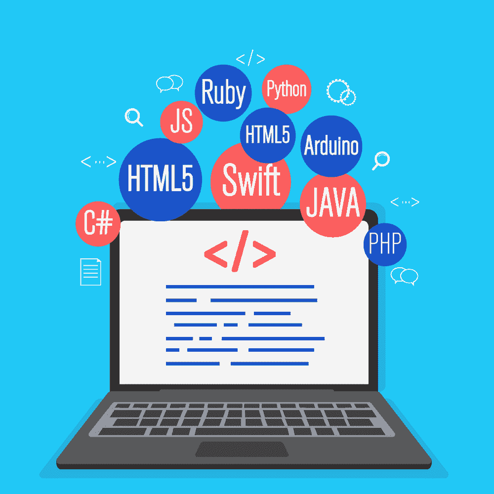

# 2021 年值得成为软件开发人员的 6 个理由

> 原文：<https://simpleprogrammer.com/reasons-to-become-a-software-developer-2021/>

Are you someone who loves tech and wants to make a living from it? Do you want a job that pays well and offers tons of opportunity for growth? If so, then you should consider becoming a software developer.

很多人想知道，在 2021 年，学习如何编码是否仍然值得。有很多关于就业市场及其走向的问题。毕竟，疫情改变了生活中所有的工作领域。

现在的世界看起来与去年大不相同。

许多人开始担心未来。然而，我现在可以告诉你，没什么好紧张的。软件开发人员会留下来，他们的薪水也一样。

没有必要担心编程的未来。与 10 年前相比，现在程序员有更多的机会。如果你目前正在寻找成为一名程序员，你没有做出错误的选择。

本文将列出 2021 年值得成为软件开发人员的六大理由。

## 1.软件开发人员的工作无处不在

看看你周围，告诉我你有多少电子产品。然后告诉我有没有需要软件才能运行的？很可能他们都是这样。

这意味着软件开发者已经开发了你使用的几乎所有东西。

如果你今天打了一个电话，看了《网飞》,或者读了一本电子书，你已经从软件开发人员的工作中受益。如果你去了自动取款机，在健身追踪器上数了数你的步数，或者进行了网上预订，你就使用了软件。

甚至制造业、运输业、工程和金融服务业都使用软件。在现代经济中，软件开发无处不在。

这个世界需要优秀的程序员。

软件工程师[几乎可以在任何科技公司找到工作](https://simpleprogrammer.com/finding-a-job-during-pandemic-for-programmers/)。招聘开发人员最多的四家 T2 公司分别是亚马逊、IBM、U.S. Bancorp 和摩根大通。亚马逊向程序员支付大约 12.2 万美元的底薪。他们希望他们的员工懂 Java、C++和 C。

由于金融业对软件开发人员的需求，银行榜上有名。随着区块链的崛起，学习如何编码比以往任何时候都重要。

美国消费者新闻与商业频道估计，区块链开发商的年收入约为 15 万至 17 万美元。

这是软件开发中薪水最高的行业之一。

### 但是(AI)不会抢走我的工作吗？

我可以看到为什么有人担心人工智能(AI)的崛起。甚至比尔·盖茨也预计人工智能最终会写出比人类更好的代码。

现在，虽然他的说法很可能是真的，但仍然没有什么可担心的。

目前，人工智能能够编写自己的代码。然而，它并不是完全独立的。AI 仍然需要人类的帮助来编写它无法编写的软件。让开发人员夜不能寐的真正问题是，当他们不再需要我们时会发生什么？

Towardsdatascience.com 在他们的一篇文章中谈到了人工智能带来的潜在失业问题。他们提到，人工智能很可能在未来开始自己编写复杂的代码。但这并不意味着程序员会失业。

相反，人工智能实际上可以帮助创造新的就业机会。

更有可能的情况是，软件开发人员将不得不适应。适应变化不应该是什么新鲜事，因为这个行业总是在发展。

所以，不，人工智能不会取代编程工作，而是会改变行业，甚至创造新的工作岗位。

## 2.你可能会为自己工作

人们往往会忘记，除了朝九晚五的工作，还有其他机会。软件开发人员有机会成为个体经营者。许多程序员最终成为了成功的自由职业者。

自由职业最大的好处是，你不必每天早上醒来就去上班。

[自由职业者](https://simpleprogrammer.com/start-freelance-programming-career/)

享受随时随地工作的自由(当然，只要你能上网)。

你可以旅行，看到朝九晚五不可能看到的东西。你真的有在世界任何地方生活的自由。

再也不用住在租金昂贵的大城市了。然而，一些自由职业者的工作要求你居住在公司所在的州或国家。所以有时候确实取决于客户的个人需求。

然而，大多数自由程序员可以住在税收和租金更低的州。当然，你仍然要向老板汇报，并且有截止日期。但这肯定比住在纽约或洛杉矶这样昂贵的地方要好。

### 2021 年如何成为自由程序员

成为自由程序员有很多方法。自由职业者要么从零开始，要么利用以前的经验获得客户。

我希望你看看你现在的简历，问问自己“我会雇用我吗？”

如果答案是否定的，那么你需要一份更好的简历。许多软件开发人员利用他们以前朝九晚五的经验开始自由职业。

这绝对是一个不错的开始方式。但是如果你没有任何开发经验，那就只能走传统路线了。这包括获得作品集、社会证明和个人网站。

首先，你需要向客户展示一系列作品。使用你开发的任何网站、应用程序或游戏。

第二，通过免费编程获得一些社会证明。推销你的服务，并主动为他人的网站、博客或应用程序编码。然后让他们给你推荐。

最后，你需要一个网站。把网站想象成向客户展示的专业名片。在上面张贴你的联系信息、推荐人和作品集。

之后，推销并试图找到你的第一个客户。

## 3.成为软件开发人员不需要学位

在我在这篇文章中提到的所有事情中，[不需要学位](https://simpleprogrammer.com/programming-job-without-a-degree-how-to/)是最好的。

为什么这么问？

嗯，这是因为目前美国的学生贷款危机。

学位变得如此昂贵，大学毕业生正在努力偿还债务。做程序员最大的好处就是你不需要程序员！

然而，有学位有帮助吗？

嗯，是的，绝对是。大学学位可以帮助你在竞争激烈的人群中脱颖而出。有些公司甚至要求有学位。但这并不意味着没有办法绕过这个要求。

例如，还记得我之前说过的关于自主创业的话吗？自由程序员不需要任何学位。

他们唯一需要的东西是:

1.  投资组合。
2.  最重要的是，他们必须**知道如何编码**。

客户不关心你在哪里上学。他们只想让你做好工作。

甚至一些传统的朝九晚五的工作也不再需要学位了。像谷歌，苹果，甚至 IBM 这样的公司已经不在乎学位了。

事实是，大多数公司更关心技能。

但要想在没有学位的情况下在谷歌这样的公司找到工作，你仍然需要经验。

获得这种体验的最好方式是自由职业。你可以按照我之前说的做，开始免费工作。然后在建立投资组合后获得一些客户。

自由职业的经历会让你开始申请更传统的朝九晚五的工作，比如谷歌的高薪工作。

### 大学之外的选择

不上大学也有很多自学的方法。

例如，你可以阅读书籍，参加在线课程，找一个家庭教师，或者创建自己的网站。

最简单的入门方法就是看书。购买教授特定语言的书籍。掌握 HTML、JavaScript 和 CSS 等基础知识。然后继续学习更高级的语言。

以下是今年要自学的一些最有价值的编程语言:

*   Java Script 语言
*   计算机编程语言
*   C/C++
*   爪哇岛
*   r 语言
*   迅速发生的
*   锈

2021 年，这些编码语言将被用于开发视频游戏、区块链、应用程序、网站和其他软件。

未来对视频游戏、区块链、应用程序和网站的需求将会增加。所以现在学习这些语言会给你一个好的开始。

同样，课程在学习代码时提供了大量的价值。

They provide in-depth college-level education at a fraction of the price. If you struggle with learning from books, courses are the way to go. [EdX](https://www.edx.org/learn/computer-programming) is a programming course that even offers certification in specific topics. Certificates can look good on your resume.

此外，在线导师是另一个很好的学习资源。他们可以给你一对一的体验，这是在别处很难得到的。你甚至可以在当地找到程序员来直接帮助你。

但是，最后，最好的体验还是动手。没有什么比学习如何开发自己的网站或应用程序更好的了。

没必要发疯创造下一个优步。博客甚至个人网站都可以。拥有自己的平台证明你知道如何编写代码，而不仅仅是在某个学位或证书课程中睡觉。

## 4.做一名软件开发人员很有趣

如果你喜欢谜题和游戏，软件开发将会是一场爆炸。事实是编程可能很有趣。软件开发感觉就像你在解决一个视频游戏中的难题。或者它甚至可以像试图破解一个数学难题。

对于喜欢电子游戏的人来说，也有很多好处。

如果你是一个游戏玩家，编程将会有趣 10 倍。现在，您可以制作自己的游戏，而不是玩别人的游戏。但是，游戏行业的工作时间长、期限紧吗？

当然，但是任何工作都是如此。

你不能指望一些随机的办公室工作比开发一个游戏更好。你可以影响它的外观、感觉和播放。

对我来说那听起来像是一个好时间。

### 软件工程师做什么让它变得有趣？

比尔·盖茨曾经说过:

“保罗和我，我们从未想过我们会从这件事中赚很多钱。我们只是喜欢编写软件。”

作为一名软件开发人员，你会从这种工作中获得成就感。想象一下试图修复一个讨厌的 bug 或小故障。花几个小时去做这样的事情可能会令人沮丧。

但是你获得的肾上腺素会让你感觉不可战胜。

就像我之前说的，作为一名软件开发人员意味着你要解决难题和创造东西。有大量的挑战和问题等着你去解决。一开始，工作听起来可能并不有趣。

但是你从中获得的满足感是无价的。

[Money.usnews](https://money.usnews.com/careers/best-jobs/software-developer) 根据向上流动、压力水平和灵活性对软件开发人员的工作满意度进行评级。向上流动性高，而压力水平一般，灵活性高于平均水平。

任何工作都会有压力，这并不奇怪。向上流动对那些想要升职的人来说是个好消息。

然而，高于平均水平的灵活性是一个很大的积极因素。这意味着人们对软件开发职业的灵活性感到满意。

程序员可以休假在家工作。

自由开发人员可以在沙滩上或他们的后院工作。

现在，朝九晚五的工作方式甚至可以实现远程工作。新冠肺炎正迫使许多公司做出改变。许多开发人员可能再也不会回到办公室。

有时候，工作之所以有趣，是因为它给了你多少离开工作的自由。

不是每个人都有这种奢侈。

## 5.你创造性的一面会蓬勃发展

你是一个能在创造性的工作环境中茁壮成长的人吗？

如果你打算成为一名软件开发人员，这是个好消息。有创造力的人在这个领域前所未有的繁荣。你为什么认为像比尔·盖茨和史蒂夫·乔布斯这样的人被认为是我们这个时代的达芬奇和米开朗琪罗。

It’s because software development has turned into an art.

打开你的第一部 iPhone，玩着它，感觉很神奇。这些应用程序、外观、音乐、游戏，都太棒了。我肯定 15 世纪的人们看到《蒙娜丽莎》时会有同样的反应。

每次微软更新他们的软件，人们更关心的是它看起来如何，而不是它如何工作。作为一名软件开发人员，你可以完全控制这些小工具的外观。

如果你很有创造力，并且想要炫耀它，那么你的编码技能可以做到这一点。

以下是最有创意的软件开发工作:

*   **前端开发人员**——通过 HTML、CSS 和 JavaScript 等代码执行的人。前端开发人员最能表达他们的创造力。代码也不太难，所以很容易上手。
*   **博客作者/数字营销人员**——博客作者和数字营销人员无时无刻不在接触编程语言。知道如何编码让博客和营销人员的生活变得更加美好。你也可以更好地控制你的网站或你的客户的网站的外观和感觉。
*   网络开发人员显然，这份工作需要很多创造力。如果你想成为一名网站开发者，客户会雇佣你来让他们的网站看起来更漂亮。所以你的创作技巧可以通过向他们展示你的艺术才能而大放异彩。
*   视频游戏开发人员——这可能是最受欢迎的创造性编程工作。视频游戏开发商处于游戏世界的前沿。他们可以决定游戏角色的样子，甚至行为。你可以通过人工智能设定他们的个性，让他们成为人类。这项工作需要很好地理解 C++和其他一些语言。

## 6.作为一名软件开发人员，你会赚很多钱

最后，在 2021 年成为一名软件开发人员的最大好处就是钱。程序员现在比以往任何时候都挣更多的钱。对该职业未来的发展也有所期待。SmartAsset.com 表示，软件工程师的平均工资是 92660 美元。

美国总体中等工资约为 46440 美元。

软件开发人员的收入远远超过美国的平均收入。SmartAsset 还提到，拥有计算机科学学士学位的人的失业率仅为 3.6%。这使得在经济衰退期间失业的可能性大大降低。

只要看看疫情期间发生了什么。软件开发人员大多保住了他们的工作，并且可以在家工作。

此外，[美国劳工统计局](https://www.bls.gov/ooh/computer-and-information-technology/software-developers.htm)(bls.gov)列出了 2019-2029 年软件开发人员的就业前景为 22%。这远远高于 3.7%的平均增长率。

这证明了这个职业将变得多么有价值。另外，随着对软件开发人员需求的增加，工资也会增加。

### 软件开发人员工资明细

作为一名软件工程师，你有很多赚钱的选择。最入门级的职位是初级软件开发人员。

根据 Payscale.com 的说法，初级软件开发人员的收入在 4.5 万到 8 万美元之间。这远远高于美国大多数入门级别的工资。

但也要看你在哪里工作。

如果你在一家科技巨头公司找到工作，你可以期待赚更多的钱。

亚马逊或谷歌的入门级开发人员每年可以赚 10 万美元以上。那种钱可以帮你还贷款，甚至买房子。

同样，自由程序员的平均起薪约为 58，000 美元。自由职业者的收入取决于客户的数量和质量。

然而，请记住，你也将是自雇。你的税会更高，也不会有什么好处。

那些费用将不得不从你的口袋里掏出来。

## 底线

最后，在 2021 年成为一名软件开发人员是一个好主意。数据显示，软件工程师挣钱多，未来对这份工作会有需求。

它也很有趣，为人们提供了一个创造性的出口。

Remember to be passionate about the work you do. Developers can find their passion through the result of their work. Treat it like a piece of art, and have fun with it on the way.

此外，有很多在家工作和自己当老板的机会。这意味着没有通勤和想住哪就住哪的自由。

另外，大学并不是找工作的必备条件。你可以在日常工作之余自学。开始建立一个文件夹，学习雇主需要的现代编码语言。

之后找工作应该没问题。

2021 年是成为软件开发者的大好时机。而且这种情况可能会持续很多年。