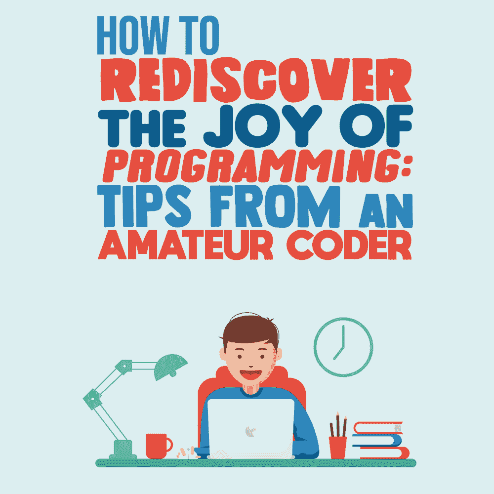

# 如何重新发现编程的乐趣:来自业余程序员的提示

> 原文：<https://simpleprogrammer.com/rediscover-joy-programming/>

The word “amateur” usually carries negative connotations, but its etymology—from the Latin “amare”—refers to love. As an amateur coder, I’m someone who programs for the joy of programming.

可以说，所有程序员都是这样开始的——学习如何编码，因为这是他们喜欢的事情。毕竟，很少有人投入时间、精力，甚至金钱去做他们讨厌的事情。

但是成为职业程序员的陷阱来了。

很快，无论你是自由职业者还是为公司工作，你都会意识到，做你喜欢的事情变得越来越少，做别人喜欢的事情变得越来越多。如果你幸运的话，这两者经常会重合。但是不太常见。

毕竟，今天的许多专业编程本质上都是条块分割的。几个朋友为 80 年代的家用电脑编写 48K 游戏的浪漫日子已经一去不复返了。今天，专业程序员通常只处理最终产品的一小部分，缺乏清晰的全局观。

所有这些对于在编程中寻找乐趣来说并不太好，尤其是当你开始玩代码时的那种乐趣。“你好，世界！”

我是一名业余程序员，尽管从技术上讲，人们可以提出反对的理由。我的一些 Android 应用程序包含广告，这意味着我确实看到了我的编码和收入来源之间的联系。

然而我认为自己是一个业余爱好者；只为编程的乐趣而编码的人。正如我在为乐趣而编程和将编程作为可能的收入来源之间平衡一样，我相信任何程序员——包括有经验的全职专业人员——都可以重新发现这种编程乐趣。

最终归结为三点:**态度**，看到**更大的画面**，有**的远见**。让我们仔细看看它们。根据我的建议，你也可以成为“业余爱好者”——重新爱上编程的人。

## 没有正确的心态就没有快乐

你有没有告诉别人你感觉有点沮丧，然后他们告诉你“振作起来”？很烦人，我知道。“哦，我怎么从来没有想到这一点！啧啧，谢谢提示！”

别担心，我不是这个意思。拥有“正确的心态”，或者我之前提到的“T0”态度，并不是在某个晴朗的早晨神奇地决定你会发现编程的乐趣，委婉地说，即使是在一个你觉得不那么热衷的项目上。

更确切地说，我所说的“正确的心态”指的是*理解什么让你快乐*。

这听起来是如此的不言而喻，甚至有些愚蠢。然而，我的经历——不仅是作为一名教育家和作家，而且在生活中也是如此——告诉我，许多人并没有真正问自己那些困难的问题。

他们过着自动驾驶的生活，那些有固定工作的人尤其容易受到这种前景的影响。我们是习惯的动物；我们不喜欢问自己这样的问题，因为…我们可能会回答它们。

也就是说，我们可能会发现我们不喜欢当前情况的某些方面，这意味着我们必须以某种方式改变它。

在我们重新发现编程乐趣的背景下，您必须问自己这些困难的问题。你最喜欢什么？是解决问题吗？创造解决方案？也许你是那些设法在代码本身中发现审美美的人之一。

对我这个业余程序员来说，这是这些和其他东西的结合。有时候，我只是喜欢给自己挑战，也许是在我目前理解的极限，然后感受到实际工作的回报。

在其他场合，它是关于制作相对简单但有趣的东西——比如我的 [JavaScript“星座”生成器](https://blog.homeforfiction.com/2019/11/10/javascript-horoscope-generator/)，它组合来自一个数组的句子来创建完全通用但似乎可信的“预测”，并在这个过程中揭示算命的方法。

无论你编码的乐趣来自哪里，你都必须关注它的本质和形式。一旦你(重新)发现了这一点，你就为下一步做好了准备。

## 大局

As I mentioned in the introduction, the [contemporary reality of professional programming](http://www.amazon.com/exec/obidos/ASIN/0999081411/makithecompsi-20) is such that, more often than not, a professional programmer lacks a clear view of the bigger picture. If you’re lucky, your work is appreciated and your contribution valued.

也许你会因为自己解决了整体中的一小部分而受到表扬。这并不意味着你不应该着眼于更大的图景，在可能的范围内。

除了与同事之间的问题或源于缺乏软技能的类似问题之外，人们在工作中不开心的最常见原因之一是他们个人所做的事情与集体所做的事情之间的脱节。

顺便说一下，我不是第一个注意到这一点的人。员工对产品的疏离感是一个有近 200 年历史的概念。

换句话说，要重新发现编程的乐趣，你真的需要看看你自己的贡献是如何与你和你的队友以及你可能不知道的其他团队所做的事情联系起来的。由于我们已经看到的原因，这并不总是容易的。关于左手不知道右手在做什么的说法在专业编码的环境中是最好的(或者最坏的，如果你喜欢的话)。

此外，根据您工作的具体情况，您甚至可能不被允许完全知道您正在准备的代码最终是什么。没关系。尽可能多地发现。在可行的范围内，看看它们是如何联系在一起的。

最终，*明白*你在做什么。例如，如果你自己的编码乐趣来源于寻找解决方案，试着找出你的贡献是如何帮助解决一个问题的。

这不仅帮助你重新发现编码的乐趣，而且[让你更有效率](https://simpleprogrammer.com/flow-state/)——如果你能掌握你的代码实际上是如何实现的，你可能会有新的能量。

作为一名业余程序员，我有时会因为缺乏知识而止步不前，或者至少放慢速度。我有时会因为这个原因放弃项目，让我告诉你，看不到最终产品的感觉很糟糕。我真的讨厌它。

你可能认为一个专业的程序员不能放弃，你不会错的。工作就是工作，必须要做，对吧？

啊，但是有个问题。

### *大局*大局

除了“更大的图景”，我们还有“*更大*更大的图景。”把它们看作嵌套函数:你的大图根据你输入的内容——参数——返回结果，但是围绕它有一个更大的结构，即*大图*大图。

简单来说，如果更大的图景是你对超出你直接关注的工作的看法——不管多么有限或片面，那么*更大的*更大的图景是你对工作之外的看法**总的来说**。

这是许多专业人士经常忘记的另一件事:工作不是生活的全部。

很难继续做你每天已经做了八个小时或更多小时的事情。我能同情。作为一名职业作家和编辑，在一天的文字工作结束后，很难写——甚至读——任何有趣的东西。

但是因为你的专业而放弃你的“业余”编程——你曾经热爱的——永远不会有好结果。在这种情况下，很少有什么事情比讨厌自己所爱的东西更令人失望的了。

尝试做一些与工作无关的编码。它不必是什么大事，也不必占用你太多的时间。可能每个周末都要花几个小时来组装一个手机应用程序。或者可能是你和其他人一起做的一些小的[开源项目](https://simpleprogrammer.com/why-contribute-to-open-source/)。

这完全取决于你喜欢什么。这是唯一的要求:你对它充满热情。工作场所和任务来来去去；体验和个人实现是永恒的。

所有这些将我们带到了重新发现编程乐趣的最重要的元素:有远见。

## 编码与生活中的远见

我在求职面试或性格测试中看到的最愚蠢的问题之一是，“你认为自己五年后会怎么样？”

好吧，如果 2020 年的前六个月还没有让人们相信生活会出乎意料地颠倒过来，我不知道还有什么可以。

当然，在我们的生活中有某种常规和连续性是必要的。有一些大概的想法和提前计划同样重要。但是*确切地说*因为生活是不可预测的，所以理解我们的优先事项变得更加重要。

在我们重新发现编程乐趣的背景下，预见并不是试图找到一个愚蠢问题的答案，“你认为自己五年后会怎样？”

更确切地说，远见意味着问自己:“你希望五年后的自己会是什么样子？”

你可能会认为这是一些语言上的诡计，然而有一个微妙但重要的区别。

你看，一旦你把意志放入图片中——“你希望在哪里”——还有另一个隐含的问题:“你现在**需要做什么**才能成为你以后想去的地方？”

这让我们回到前面的两个部分，态度和更大的图景，有效地将它们结合成一个大问题:“你最喜欢编码的什么，它如何丰富你的生活*甚至超越专业编程的界限*”

对我来说，作为一个业余程序员，它的一切都是丰富的，因为我不必做任何我不想做的事情。我没有要遵守的最后期限，也没有期待结果的经理。当然，你自己的情况可能不同，记住，这类问题很难。

说到底，现在的问题是你的现状是否与你开始这段旅程时的设想一致，你自己还是一个业余程序员。

如果不是，那你该怎么办？

显然，无论是我还是任何人都无法给你一个答案。这是只有你能做的事。但是我可以告诉你:当你回首往事，意识到你没有做你想做的事情时，一定很失望。

## 问正确的问题，答案会变得更容易

As an amateur coder, I can work on anything I like, for as long as I like, and even abandon it in the middle if I lose interest. As a professional programmer, you don’t have the same kind of latitude.

但是你仍然可以重新发现编程的乐趣，只要你问自己那些困难的问题。

你喜欢编码的什么？是什么激励你不仅学习编码，而且把它作为职业？

然后问题变得越来越难。你的工作是如何让你体验到编码的乐趣的？到底有没有用？如果没有，你能做些什么呢？

大多数人寻求答案，但重要的是正确的问题。

一旦你确定了你想从编码中得到什么，那么你就可以开始考虑如何放大它。

有时它会发生在你当前的职业环境中，有时它会发生在职业环境之外——例如，作为一个兼职项目——同时仍然在你当前的工作场所继续。

有时候，体验编程的快乐与你目前的工作不相容。

接下来做什么取决于你的优先事项和整体生活状况。对一些人来说，试图找到平衡更容易，对另一些人来说，最好重新考虑事情，甚至做出彻底的改变。

我们每个人都是不同的人，我们处理问题的方式也不同。但是请相信我:一旦你提出了正确的问题，答案会变得出乎意料的简单！