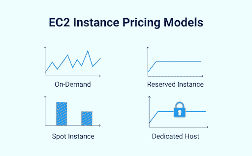

# 如何降低云成本:DevOps 工程师的建议

> 原文：<https://simpleprogrammer.com/reduce-cloud-costs/>

You might already know that enterprises can [save 30-50%](https://www.forbes.com/sites/quora/2019/12/20/how-much-money-can-businesses-save-by-moving-to-the-cloud/?sh=14621cccef43) by moving their infrastructure to the cloud. But have you ever wondered why costs for [cloud computing](https://www.amazon.com/dp/1119546656/makithecompsi-20) are increasing over time?

根据 IDC 的数据，2021 年第四季度，用于云基础设施(包括专用和共享环境)的计算和存储基础设施产品的支出同比增长 13.5%，达到 211 亿美元。2021 年全年，云基础设施支出总计 739 亿美元，比 2020 年增长 8.8%。

IDC 还预测，到 2025 年，全球“全云”支出将达到 1.3 万亿美元。“可能的原因是，企业越来越多地将云服务用于新计划或替换其整个现有系统。因此，在传统 IT 解决方案上的支出被重新分配到云上，由于越来越偏好“云优先”的解决方案，导致了云的转变。

然而，组织正在努力控制支出，公共云支出有时会超出预算。这使得处理**云成本优化变得前所未有的重要。**

随着云服务数量的增加，拥有一支专业的开发运维团队并遵循开发运维实践可以创造奇迹，从而降低软件开发、部署和维护的成本。

在这篇博文中，我整理了一些关键 DevOps 实践的列表，可以帮助您避免不必要的开支和云成本。

## 可以降低云成本的关键开发运维实践

Flexera 的一份 [2020 年报告指出，降低云成本已经成为 73%企业的首要任务。此外，报告还提到，组织通常会平均超出预算 23%。](https://resources.flexera.com/web/pdf/Flexera-State-of-the-Cloud-Report-2022.pdf?elqTrackId=f3bb660986704d2980404386aa003141&elqaid=6925&elqat=2)

由于多种原因，例如过度调配的资源、不必要的容量以及对环境的不可见性，云账单正在飙升。

DevOps 和云计算在构建标准化和一致的构建-测试部署环境中发挥着关键作用。这些实践通过消除浪费、识别管理不当的资源以及为更高折扣预留容量，帮助企业降低总体云成本。这样，它们有助于在云性能和速度之间取得平衡。

记住以上内容，让我们更仔细地了解一些关键实践，以帮助您降低云成本。

### 技巧 1:利用第三方服务

一旦你分析了项目需求，你就可以选择第三方服务，如果它们是你的企业可以承受的。这样做有助于减少运营开销并节省大量资金。以下是您的第三方服务提供商如何帮助您实现这一目标。

一些云提供商，比如 Azure、 [AWS](https://www.amazon.com/dp/1788294459/makithecompsi-20) 和 Google Cloud，提供了可以在开发过程中利用的服务。例如，[亚马逊 RDS](https://aws.amazon.com/rds/) 提供托管数据库服务，该服务提供出色的功能，例如:

*   监视
*   多区域设置
*   支持
*   缩放比例
*   信赖

从头开始构建这样的服务需要更高的预算甚至更多的时间。如果项目已经在进行中，那么 DevOps 团队将审计正在使用的基础设施资源和服务。之后，如果还有降低成本的方法，可以有一些关于调整或使用新服务的建议。

**Pro 提示:**说到成本效益分析，你可以开始使用第三方服务来节省成本，减少运营开销。

### 技巧 2:资源代码优化

主要目标是使用最优定价类型的云资源，这允许用户以较低的成本获得最大的效率。现在，问题出现了:DevOps 团队如何帮助您实现这一点？

从快速交付时间到卓越的客户体验和早期缺陷检测，企业可以利用雇佣 DevOps 团队带来的多种好处。云提供商提供各种计算和存储资源，具有不同的支付选项和层级。

例如，[基于 AWS 的服务](https://simpleprogrammer.com/cloud-computing-aws-developer-tools/)提供名为 [EC2](https://aws.amazon.com/ec2/pricing/) 的计算资源，允许用户选择不同类型的实例。它包括专用的、按需的、现场的或保留的。为特定案例选择正确的实例类型可以显著优化成本。

[图像来源](https://www.msp360.com/resources/wp-content/uploads/2017/10/EC2-Instance-Pricing-Models.png)

*   **按需实例:**使用时，按小时付费。这非常适合具有短期、不规则工作负载且无法中断的应用程序。它也适合在 EC2 上测试和开发应用程序时使用。
*   专用实例:它们运行在专用于特定客户的硬件上，并且是最昂贵的。如果您要处理敏感的工作负载，并且安全性和合规性至关重要，您可以选择此选项。
*   **现货实例:**它们是低成本的选择。如果不需要服务的高可用性，最好使用 spot 实例。使用这种箱子可以打九折。
*   **保留实例:**与按需实例定价相比，此选项提供高达 72%的大幅折扣。如果需要预留容量，可以投资于预留的情况。

此外，您可以查看一些[云成本优化](https://www.simform.com/services/cloud-assessment-cost-optimization/)实践，如下所示:

*   使用折扣和删除未充分使用的实例
*   如果超过预定的花费阈值，则设置警报
*   搜索在不同地区或可用区域托管是否可以降低成本
*   将不常访问的存储移动到更便宜的层

### 技巧#3:改变软件架构

您可以通过简单地调整架构和软件代码来节省大笔资金，例如，通过使用 PaaS(平台即服务)、运行时、容器管理和无服务器的按执行付费环境而不是虚拟机。

另一方面，您也可以使用容器，因为它们包含根据请求激活的微服务，并在不再需要时从虚拟内存中卸载。

### 技巧 4:订阅

虽然大多数云服务是基于使用的，但是一些云服务提供商提供了另一种使用选择:特定时期的订阅。如果使用得当，它可以帮助许多企业节省资金。

### 技巧 5:基础设施和 CI/CD 流程自动化

CI/CD 自动化消除了在开发、测试和部署阶段手动管理服务器、操作系统、数据库连接、存储和其他基础架构元素的需要。

DevOps 团队可以通过进行基础架构审计和规划来了解需求、潜在风险和机会，从而帮助您实现这一目标。团队准备核心基础架构资源，如配置、计算资源等。

一旦基础设施资源准备就绪，服务集成通常从准备管道配置开始。在大多数情况下，DevOps 团队分析需求并建议最合适的服务交付方法 Docker 容器或 Amazon Lambda 是最常见的。

关于成本优势，基础架构即代码使其用户能够使用基于模板的解决方案，不再花费宝贵的开发时间来手动配置 IT 基础架构。此外，工程师更专注于开发额外的服务和功能，而不是交付和部署它们的方式，从而节省了大量时间和金钱。

## 使用这些建议来降低你的成本

在这篇文章中，我与你分享了一些来自 DevOps 的技巧，可以帮助你的组织花费更少，充分利用其资源。通过实施这些云缩减技巧，您可以在降低**云成本的同时扩大云计算的范围。**

但是，请记住，如果您滥用资源，潜在的节约将会受到影响。因此，企业在将基础设施迁移到云的同时，需要认识到拥有一支 DevOps 工程师团队的重要性。

要确定适合您需求的策略，请考虑您企业的规模和个人需求。外包 DevOps 工程师团队通常是最佳选择，可确保高效管理您的云预算。