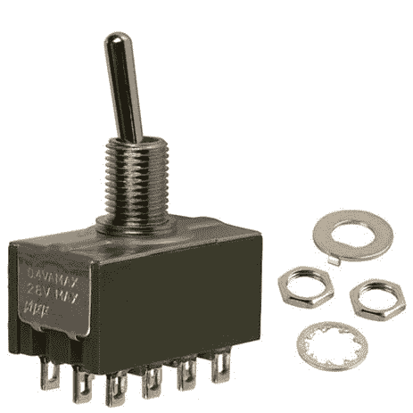

# 重构切换到类

> 原文：<https://simpleprogrammer.com/refactoring-switches-to-classes/>

我之前讲过几次重构 switch 语句。

*   [Switch 只是一个花哨的 If Else](https://simpleprogrammer.com/2010/08/12/switch-is-just-a-fancy-if-else/)
*   拉下开关:是狂欢的时候了
*   [重构开关高级](https://simpleprogrammer.com/2010/10/19/refactoring-switches-advanced/)

我甚至创建了一个[默认字典](https://simpleprogrammer.com/2011/08/14/making-switch-refactorings-better-defaultable-dictionary/)，用于将 switch 语句重构为动作字典。

这一次，我将讨论当 switch 语句对同一组数据进行操作，但在不同的情况下有不同的操作时的重构开关。

## 首先让我们回顾一下

当我之前谈到重构开关时，我们主要是在代码中的某个地方处理单个开关语句。

如果您只有一个 switch 语句，或者有多个 switch 语句根据数据做同样的事情，那么使用字典仍然是一个很好的方法。

但是，在某些情况下，您会在不同的上下文中打开相同的数据。在这些情况下，您将需要执行不同的操作。

让我们看一个例子。

在这个例子中，我们打开相同的枚举，但是我们在代码的不同位置这样做。

在这里使用字典并不合适，因为我们需要多本字典。

我们仍然不想让它保持原样，因为代码相当混乱和脆弱。

## 关注点分离

问题是包含这些 switch 语句的代码承担了太多的责任。它被要求为我们的每一个角色类类型处理逻辑。

我们需要做的是改进代码，将枚举重构到它们自己的类中。每个 switch 语句都将成为一个方法，由我们基于枚举的类来实现。

如果我们使用 Java，我们可以使用 Java 的枚举实现，它允许在枚举上使用方法。如果我们使用像 C#这样的语言，我们仍然需要将枚举值映射到每个类。

让我们从上课开始吧。

首先，我们需要一个基类或接口。

现在我们可以创建实现这个接口的类，它包含每个 switch 语句中的逻辑。

接下来，我们可以将枚举映射到类。

如果我们愿意，我们也可以去掉枚举，只创建适当的类。这将取决于您现有的代码看起来像什么。

## 没有开关了！

现在，让我们来看看在我们有交换机的两个位置，我们最终得到了什么。

如果我们想添加一个新的角色类类型，我们只需添加一个实现了 *CharacterClass* 接口的新类，并在我们的字典或角色初始化代码中放置一个映射。

如果我们最终在逻辑中的其他地方发现不同的字符类类型应该有不同的行为，我们只需向我们的*字符类*接口添加一个方法，并在实现*字符类*的任何类中实现它。

我们的代码更容易维护，也更容易理解。