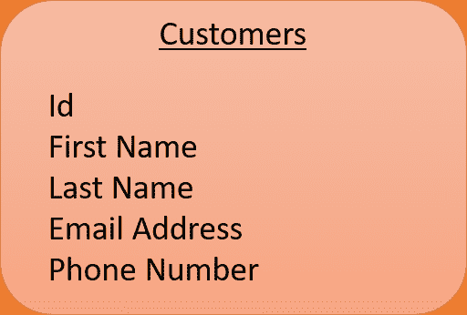
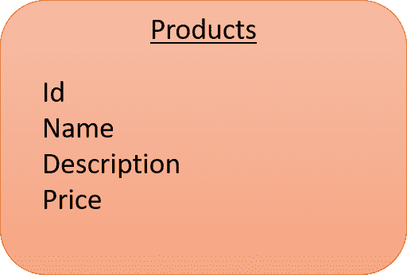
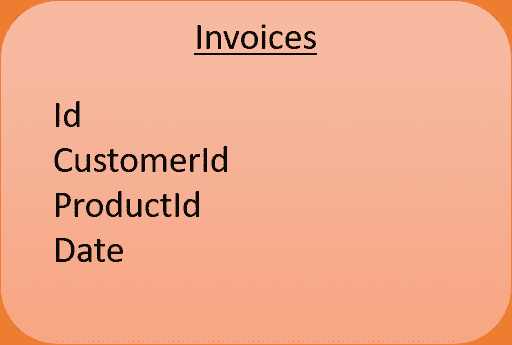
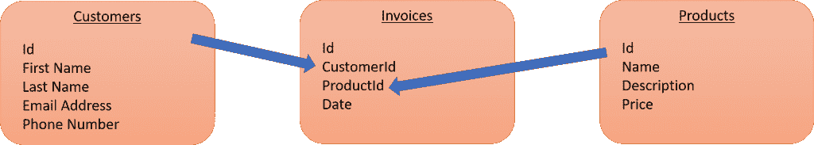

# 忙碌的开发人员的关系模型

> 原文：<https://simpleprogrammer.com/relational-model/>

Data is here to stay and growing at an unprecedented rate. Every day, [2.5 quintillion bytes of data are created](http://www.iflscience.com/technology/how-much-data-does-the-world-generate-every-minute/). By 2025, it’s estimated that the world’s output of data [will increase by 163 zettabytes](https://www.forbes.com/sites/andrewcave/2017/04/13/what-will-we-do-when-the-worlds-data-hits-163-zettabytes-in-2025/#20e02f35349a) per year (one zettabyte equals one trillion gigabytes). That is a ton of data.

开发者[依赖数据](https://simpleprogrammer.com/algorithms-data-structures-web-developers/)，每天都在使用。数据驱动业务，并最终驱动软件。了解它是如何存储的将有助于您构建更好的软件。开发者不需要什么都懂，但是要懂基础。

大多数数据库都是使用所谓的**关系模型**构建的。关系模型指的是如何在数据库中逻辑地组织数据的基本理论。关系模型侧重于减少数据重复和提高可靠性。

让我们看看什么是关系模型，为什么开发人员应该关心它，以及它如何为他们工作。

## 建立关系

关系模型以保存数据的表为特色。名称的“关系”部分来自于模型中的记录是如何链接在一起的。

每个表都与其他表有关系，通常以某种方式显示所有权。例如，一张发票与一个客户和一组产品有关系。

让我们看一个类比来帮助说明关系数据库是如何工作的。想想你厨房里的盘子和银器。你有地方放你的盘子、碗和杯子。你把你的银器和刀、勺、叉分放在各自指定的位置。

那么是时候请人来吃晚饭了。你去橱柜拿一个盘子。你拿出勺子、刀子和叉子。你把它们连接在一起，创造一个地方设置。然后你为每个人做同样的事情，填满餐桌。

关系模型以同样的方式工作。不同的相关实体存储在不同的表中。它们之间的关系允许您将记录连接在一起，以便检索完整的“位置设置”。回到发票示例，您可以通过将客户和他们购买的产品结合在一起来创建发票。

基于支持业务的实体，关系模型为您提供了为应用程序构建丰富数据模型的工具。

## 为什么开发人员需要了解关系模型

你可能会坐在那里读这篇文章，说“是啊，那又怎么样？”虽然你可能不是数据建模专家，但你需要理解数据库如何工作。它帮助你成为一个更好的开发者。

在当今的 DevOps 世界中，你可能需要成为一名“全栈”开发人员，学习和使用比开发应用程序代码更多的技能。有些公司，尤其是创业公司，要求开发人员懂得如何写代码和建立数据库。

构建良好的关系模型可以减少保存数据所需的空间。您的数据模型也对应用程序的性能有很大影响。构造不良的数据模型会导致应用程序出现重大的性能问题。不要因为缺乏理解而导致重大问题。

当您很好地了解关系模型并有效地使用它时，它会帮助您的应用程序更顺利地运行。您还可以更好地构建代码用来从数据库中检索数据的数据库查询。

学习这些技能会让你成为更好的开发者，更有市场。因此，让我们练习构建一个有效的关系模型。

## 建立模型

在这里，我们将为发票构建一个关系模型。发票是一个很好的起点，因为它们既简单又能很好地说明创建一个好模型的明确概念。

关系模型的核心是减少数据的重复。你保持一个记录，它是一个实体真相的来源。然后，您可以在需要的地方引用该记录，而不必重新编写相同的信息。让我们看看它是如何工作的。

首先，为将收到发票的客户创建一个表。你需要知道与顾客相关的你所关心的领域。我们会保持简单，只有一个名字，电子邮件地址和电话号码。

Id 字段是唯一标识每个记录所必需的。这样，如果数据库中有两个约翰·史密斯，计算机就会知道你需要哪一个。

没有产品就没有发票，所以接下来让我们创建那个表。

用关系表建模数据的有趣部分是在表之间建立关系。但是，我们不能简单地把客户和产品直接加一个关系。为什么不呢？

顾客可以从你这里购买许多不同的产品。客户可能在某一天购买了几件产品，然后第二天又回来购买更多产品。此外，一个产品可以被多个客户购买。

在关系建模中，这被称为多对多关系。我们需要一个介于两者之间的表格，告诉我们随着时间的推移，客户与产品的关系如何。这个新表就是发票表。

我们还想减少存储发票所需的空间。我们不想在顾客每次购买产品时都重复他们的姓名、电子邮件地址和电话号码。

我们可以利用 **[参照完整性](https://en.wikipedia.org/wiki/Referential_integrity)** 的力量来做到这一点，这是一个 id 可以用来引用数据库中一个且只能引用一个实体的原理。然后，该 id 可以单独存储在不同的位置，并用于引用记录，而无需复制该记录中的数据。

我们马上就能看到它的样子。在此之前，让我们创建发票表。

在这里，我们看到引用完整性和数据大小的减少合二为一。对于每条发票记录，我们都有一个 CustomerId 来保存单个客户的标识符。我们有同样的产品。现在，当我们需要收回客户的发票时，我们可以将发票记录与客户和产品记录结合起来，形成一幅完整的画面。

这类似于我们的厨房示例，其中我们将盘子、刀、叉和勺子连接在一起，创建一个完整的餐具。整个模型现在看起来像这样:

假设我们有一个名为 John Smith 的客户，其 id 为“1”我们有一个名为“链锯”的产品，id 为“5”发票记录将有自己的 id，CustomerId 字段为“1 ”, product id 字段为“5 ”,以及交易日期。

当我们需要查看发票时，我们可以转到 customer 表，查找 id 为“1”的记录，并找到 John Smith 的信息。然后可以将数据传递到用户界面进行显示。

## 建立你的人际关系

发票的例子很简单，但是说明了关系模型的强大功能。链接在一起的几个较小的表更容易理解。不会不必要地复制数据。轻松维护数据完整性。

为了帮助你的第一个模型，这里有一些提示:

*   为有意义的事物建模。不要让你的模型过于复杂。
*   考虑应用程序中的“实体”。在上面的例子中，用户、产品和发票都是实体。每个实体都应该成为一个表。
*   仅存储业务运行所必需的属性。大型数据库表会占用太多空间，并且随着时间的推移很难管理。

数据是软件的心脏。在当今世界，软件是商业的核心。学习如何有效地使用关系模型，每个企业都会重视你的技能。

现在出去建造你的下一个模型吧！