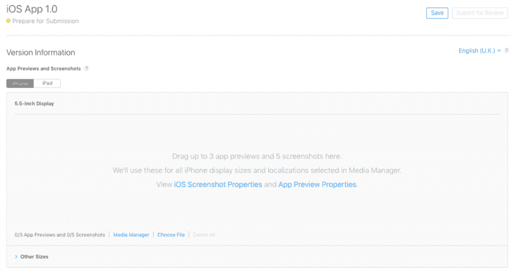
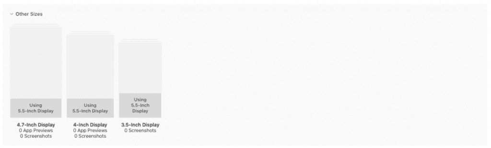
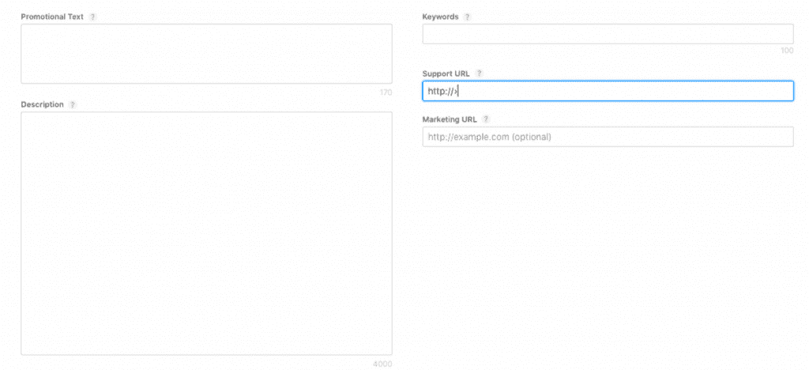
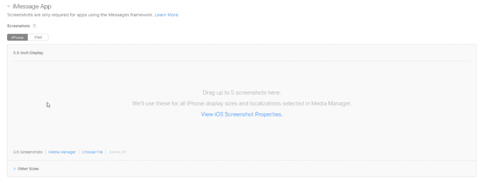
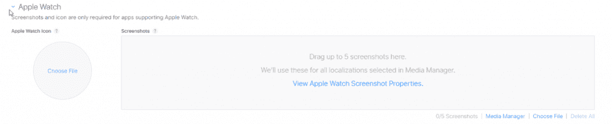
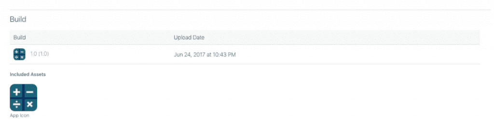
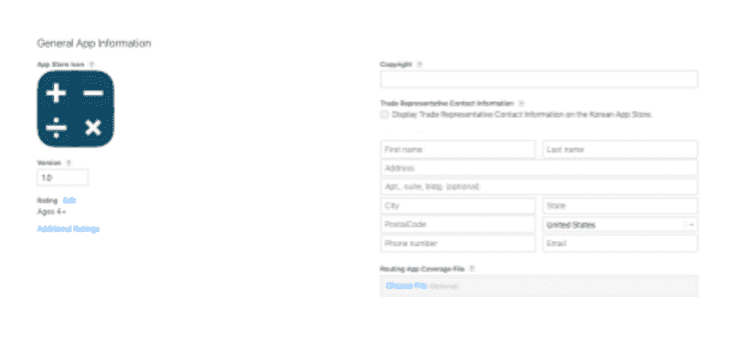
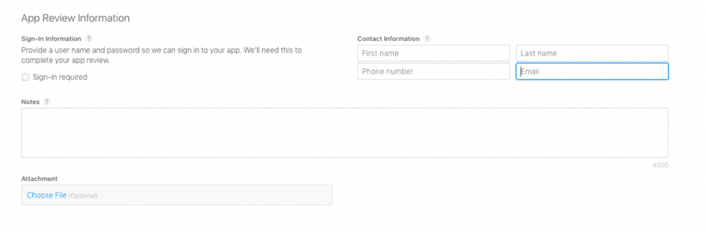
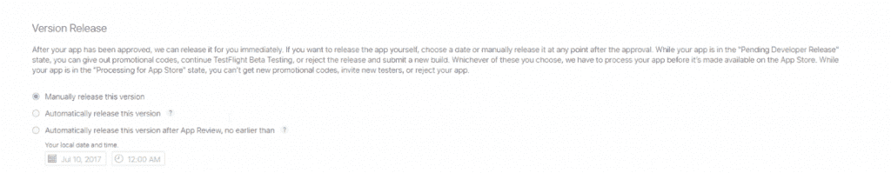

# 将你的应用程序发布到商店第 3 部分

> 原文：<https://simpleprogrammer.com/releasing-apps-style-part-3/>

在本系列关于如何将应用发布到应用商店的前两篇文章中，我讨论了配置应用商店页面前两个屏幕的重要性。

在[将你的应用以风格发布到商店第 1 部分](https://simpleprogrammer.com/2017/06/09/app-store-style-part-1/)中，我逐步介绍了应用信息屏幕，以及为什么每个设置(例如，标题和类别)对于帮助吸引更多用户访问你的页面很重要。

在[将你的应用以时尚的方式发布到商店第二部分](https://simpleprogrammer.com/2017/06/28/app-store-style-part-2/)中，我讨论了你的应用的价格和位置如何影响你的销售，以及你如何利用这一点来帮助在较小的受众中试用你的应用。

在这篇文章中，我们将讨论在你最终将你的应用提交给苹果审查之前，在你计划重要的发布日期之前，你需要配置什么。

我们将按照当前出现的顺序讨论这个屏幕的每个部分，这样你就可以从上到下同时通读这篇文章和这个屏幕，而不必来回跳转。

我们走吧！

## 版本信息

这一部分让潜在用户先睹你的应用。当然，图标可能会吸引他们，但你需要在这里有你最好的图片。如果你的图片质量不高，他们不会说服观众下载你的应用程序。

### App 截图

对于当前一代的苹果产品，如果你的应用在 iPhone 上运行，你必须提供适合 5.5 英寸显示屏的截图。苹果公司的指导方针规定“截屏必须是 JPG 或 PNG 格式，并且是 RGB 颜色空间。应用预览必须是 M4V、MP4 或 MOV 格式，并且不能超过 500 MB。”

在本节中，您将上传 iPhone 和 iPad 的屏幕截图。如果你的应用同时支持 iPhone 和 iPad，你需要添加至少一个 iPad 的截图。iPhone 最多允许五张截图，iPad 最多允许五张截图。

阅读 [iOS 截屏规范](http://help.apple.com/itunes-connect/developer/#/devd274dd925)了解创建 iOS 截屏时需要遵循的指导原则的更多信息。

### 屏幕截图选项

在这一部分管理截图时，您有几个选项可用。

**媒体管理器**

此选项允许您上传每种 iPhone 或 iPad 尺寸的单独截屏集。您还可以通过选中每个设备部分旁边的复选框，让任何一个设备使用默认的 5.5 英寸显示屏屏幕截图。

这样做的好处是，如果你对不同的设备有不同的设计，你可以在商店里展示给你的用户。一个小小的缺点是，收集截图并将其格式化为正确的大小可能需要多一点时间。但是如果你费尽心思去创造新的设计，为什么不付出额外的努力来确保它们被尽可能多的人看到呢？

关于媒体管理器的更多信息，请阅读这篇本地化文章。

**选择文件**

此选项允许您从文件系统中选择要用于截图的图像。

**全部删除**

此选项将删除您添加到 5.5 英寸显示屏部分的所有屏幕截图和任何应用预览文件。这将使您不必逐个删除它们。如果你已经更新了你的应用程序的图形并且想要全部改变它们，能够一次移除所有东西将是有用的。

### 应用预览

应用预览是用户在 App Store 上观看的短视频，让您演示应用的特性和功能。您只能预览一次应用程序。

这个预览视频是一个很好的营销工具，但是如果你不能创建一个高质量、有效的视频，可以与你的应用程序本身的辉煌相媲美，就不要这样做。如果用户对视频不感兴趣，他们可能会忽略你的应用。

如果你真的想制作一个视频，但没有大量的预算来雇人，请你自己做，只有当你知道你可以制作出一些壮观的东西。如果视频质量低，这表明你的应用程序也可能质量低。这是你最不想看到的。

对于那些预算不多的人来说，一个办法是在五月找承包商。大多数工作从 5 英镑开始(额外的服务可能会提高价格)，如果你不满意，你可以在费用中获得一些免费的修改来调整你的项目。记住细节决定成败。你提供的细节越多，你的第一个版本越有可能接近你乐于使用的版本。

除了高质量和制作精良，它最重要的是要短小。时间就是金钱，所以确保你的明星特征在你的视频中迅速展现出来。15 到 30 秒应该是你的目标范围。如果你认为你的视频可能太长了，在你花时间减少长度之前，在几个人身上试一试，听听他们的意见。

阅读[应用预览规范](http://help.apple.com/itunes-connect/developer/#/dev4e413fcb8)，了解创建应用预览时需要遵循的指导原则的更多信息。

### 其他尺寸

当您添加 5.5 英寸显示屏的 [iOS 截图](http://help.apple.com/itunes-connect/developer/#/devd274dd925)时，这些截图将被调整大小并用于其他尺寸:4.7 英寸显示屏、4 英寸显示屏和 3.5 英寸显示屏。同样，这里的好处是，如果你有不同设备的不同设计，你可以在商店向你的用户展示。

要将自定义截图添加到其他尺寸部分，请转到媒体管理器。

### 促销文本

如果你是商店的新发布者，等待你的应用被审查可能需要一周时间。

但是，推广文本会直接更新到您的应用商店页面，绕过提交流程。它可以让你快速通知你页面的访问者任何当前的应用程序功能。

对于使用 iOS 11 或更高版本设备的用户，此文本会出现在 App Store 上您的描述上方。

### 描述

在图片之后，描述为用户提供了对你的应用及其特性的最深刻的理解。

用你的应用程序拥有的每一个令人惊奇的小功能来让读者超载并不是最好的策略。给某人太多的信息可能会让他们在读到结尾时感到厌烦(如果他们中途没有失去兴趣并转向其他东西的话)。

给他们太短的东西可能不会引起他们足够的兴趣去下载你的应用程序并自己去看。

你需要找到一个平衡点，在这个平衡点上，你可以用简短有力的方式传递最好的信息。列出你最好的特点来吸引那些浏览者的注意。

此描述也将用于您的 Apple Watch 应用程序，因此您可能希望尽量简短。这真的取决于你是否介意让用户在他们的 Apple Watch 上滚动阅读完整的描述。

你还需要在描述你的应用时考虑周全。在你的描述中使用你认为潜在用户会搜索的关键词，使你的应用更有可能出现在他们的搜索结果中。

### 关键词

该字段类似于描述，您可以用关键字填充它。然而，与描述不同的是，你可以输入你不会用来描述你的应用程序的词，但用户可能会用它来搜索。例如，Google Sheets 应用程序在其描述中不包含“数字”或“计算”一词，但随着用户熟悉将这些词与该工具相关联，他们可能会在搜索该应用程序时使用它们。

请确保在此字段中至少添加一个关键字，以提高你的应用在搜索结果中列出的几率。用逗号分隔关键词。(不用加空格！你只是在浪费宝贵的角色。)

为你的应用选择相关的关键词已经变得和为你的网站选择关键词一样重要，一样是一门艺术。正因如此，选择你的关键词现在有了自己的名字: [App store 优化](https://en.wikipedia.org/wiki/App_store_optimization)或者 ASO。像 [Google Trends](https://trends.google.co.uk/trends/) 和 [Google Keyword Planner](https://adwords.google.com/home/tools/keyword-planner/) 这样的工具将帮助你找出用户搜索最多的术语，这样你就可以找到相关的关键词添加到你的应用程序中，以确保它出现在最多的搜索结果中。

ASO 可能非常复杂；最佳关键词取决于你的应用。我建议你花一点时间尝试使用我上面描述的工具来选择最好的关键词。

### 支持 URL

在 App Store 上您的描述下方可以看到该 URL，它告诉用户如果他们需要您的应用程序的支持信息，可以去哪里。

### 营销 URL

在描述下面也可以看到，这个 URL 告诉用户去哪里访问，以获得关于你的应用的营销信息。例如，您可能想要提供关于应用程序功能的更深入的信息，为什么和如何制作它的背景，关于您与应用程序的任何信息，等等。

## iMessage 应用程序

iMessage 应用程序允许您创建一个应用程序扩展，让您的用户可以在“信息”中与您的应用程序互动，从而扩展您的应用程序的功能。用户可以通过创建和共享内容、添加贴纸、付款等方式进行互动，而无需离开他们的对话。

iMessage 框架在 iOS 10 或更高版本中可用。

您可以在此处将屏幕截图添加到您的 iMessage 应用程序扩展，方法与上面详述的 iPhone 和 iPad 版本相同。

阅读 [iMessage](https://developer.apple.com/imessage/) 页面，了解有关 iMessage 的更多信息。

## 苹果手表

自 2015 年 4 月发布以来，苹果的可穿戴设备 Apple Watch 越来越受欢迎。通过开发一个与 Apple Watch 兼容的应用程序，你可以向更广泛的人敞开心扉。

由于 Apple Watch 的显示屏比普通的手机显示屏小，你需要设计一个大小合适的图标，但也要与其他设备上的应用程序相结合。在此部分上传您的图标。

在本节中，您还将添加 Apple Watch 应用程序的屏幕截图。Apple Watch 最多可以有五张截图(就像 iPhone/iPad 部分一样)。同样,“媒体管理器”、“选择文件”和“全部删除”选项也是相同的。如前所述，Apple Watch 的描述没有单独的部分，因为它共享为 iPhone 和 iPad 定义的描述。

阅读 [Apple Watch 截图规格](http://help.apple.com/itunes-connect/developer/#/devd274dd925)页面了解更多信息。

## 建设

“构建”是您使用开发工具生成的应用程序文件。在这一部分，您实际上传的版本将成为您的应用程序的公共版本。您可以使用 Xcode 6(这是声明的当前版本)或更高版本来创建构建。如果你不熟悉 [Xcode](https://developer.apple.com/xcode/) ，这是一款被称为集成开发环境(IDE)的软件，可用于开发 Mac、iPhone、iPad、Apple Watch 和 Apple TV 的应用程序。

现在，您可以使用许多不同的开发工具或 ide 来创建您的 iOS 版本。一旦你创建了你的版本，你需要把它上传到 iTunes Connect。iTunes Connect 是苹果为开发者提供的管理应用程序的门户网站。

上传你的构建的最简单和最新的方法是通过[应用加载器](http://help.apple.com/itc/apploader/e3) 3.0(这是当前声明的版本)或更高版本。应用程序加载器是一个简单的图形用户界面，它连接到您的 iTunes 开发者帐户，允许您上传新版本或将新的应用内购买项目添加到项目中。

创建发布版本后，从应用程序加载器中选择这个 IPA 文件，它将验证您的应用程序是否已正确配置为上传。如果您提供的信息有任何问题，我们会向您显示这些详细信息，以便您进行修复。上传后，您会在 iTunes Connect 的“构建”部分看到它。

这个部分还显示了从您上传的构建文件中提取的构建版本以及您上传文件的日期。

如果您在构建中包含了任何资产，这些资产也会被提取出来并显示在这里。例如，如果您包含了您的应用程序图标，您会看到它显示在左侧版本号的上方。

## 一般应用程序信息

### App Store 图标

这个图标是用户将接触到的应用程序的第一部分内容，所以你需要确保它的高质量。你可能还想确保图片代表了你的应用程序的核心功能，这样观众会直观地知道这个应用程序是关于什么的。

例如，谷歌文档的应用图标是一个上面有线条的文档。大多数软件用户会将这张图片与一个文件、一张带有文本的纸或文档联系起来，这就自动暗示了该应用程序的功能。把你的应用图标和应用功能联系起来，会降低准入门槛，帮助你留住用户。

此处上传的图标将在 App Store 上使用。它必须是 JPG 或 PNG 格式，最低分辨率至少为 72 DPI，并且在 RGB 颜色空间中。它不得包含层或圆角。你的应用图标也必须是 1024 x 1024。

更多信息请参见 [App 图标规格](http://help.apple.com/itunes-connect/developer/#/devfe70bee7b)。

### 版本

这是您要添加的应用程序的当前内部版本号。建议编号格式遵循[标准软件惯例](https://en.wikipedia.org/wiki/Software_versioning) [(](https://en.wikipedia.org/wiki/Software_versioning) 通常为“major.minor”)。

### 评级

此部分与您的应用程序的年龄分级有关，而不是用户提供的娱乐标签。系统会自动为您计算评分，以确保所有应用都得到客观评分。为了让你的应用程序自动评级，你通读一个类别列表，并在每个选项中选择无(你的应用程序中没有这种情况)、不频繁/轻微(你的应用程序中只有一些情况)或频繁/强烈(你的应用程序中有很多这种情况)。

一旦您输入了所有类别的选项，系统将根据您的回答计算适当的年龄分级。

### 版权

这是对您的应用程序拥有专有权的人(或实体)的名称。获得权利的年份放在该名称之前。

### 贸易代表联系信息

本节概述了您的应用程序的贸易代表联系人的详细联系信息。是为韩国 App Store 提供附加信息。如果你是一个业余爱好者或个人创业者，这里会提供你的联系方式。如果没有，你应该列出谁处理你的业务的外部沟通。

如果您希望此信息出现在韩国应用商店上，请选中文本“在韩国应用商店上显示贸易代表联系信息”旁边的框

如果您在此字段中提供了您的详细信息，您的信息将显示在韩国应用商店中。如果你不想在商店里显示你的联系方式(这是完全可以理解的)，你可以选择省略你的联系方式。这不应该阻止你在韩国应用程序商店中使用你的应用程序，但是你应该与苹果代表再次确认。

默认情况下，您的联系信息放在这些字段中。如果您删除了您的详细信息，您可能会发现他们会默认使用您的真实联系信息。删除您的详细信息的唯一方法是在这些字段中添加类似“无地址”的内容。同样，我不确定这将如何影响你的提交和在韩国应用商店的显示，所以你应该向苹果代表寻求建议。

如果您不想让您的应用程序出现在韩国应用程序商店中，您需要在上一个屏幕“定价和可用性”的“区域”部分中禁用该应用程序

### 路由应用覆盖文件

如果您想要指定应用程序支持的地理区域，可以通过提供 GeoJSON 格式的文件并在此部分上传单独的 GeoJSON 文件来实现。

### 游戏中心

此选项包括 Game Center 中的应用程序。如果您已将使用 Game Center 功能的功能添加到您的应用中，一旦您启用此选项，与 Game Center 相关的构建属性将被提取并显示在此处。

## 应用审查信息

### 登录信息

如果你让用户选择使用特定的社交媒体渠道登录你的应用程序，苹果将需要一个社交媒体帐户来测试这一点，进入你的应用程序，并测试其功能。

为了继续审核过程，您要绑定到应用程序的任何社交媒体帐户的用户名和密码凭据在整个审核过程中必须有效且处于活动状态。如果不是，你的应用将被拒绝，你必须重新开始。

如果您想要用户登录您的应用程序，请选中“需要登录”复选框，并在隐藏栏中提供用户名和密码。

### 联系信息

如果应用程序审核团队在此过程中有任何问题或需要其他信息，您需要提供联系人的联系信息。

### 笔记

此部分可用于提供关于您的应用程序的任何附加信息，这些信息可在审核过程中有所帮助。包括测试您的应用程序所需的任何信息，例如特定于应用程序的设置。在这里提供这些可能会加快你的审查。

## 版本发布

应用程序获得批准后，如果您选中“自动发布此版本”选项，Apple 可以立即发布应用程序然而，大多数不是业余爱好者的出版商通常有一个刻在石头上的完整发行时间表的营销策略，以便他们可以为他们的产品建立预期。

如果这种计划是你想要的(尽管可能规模较小)，你可能想要选择“手动发布这个版本”要将应用程序的发布延迟到批准后的某个日期，您可以选择选项“在应用程序审核后自动发布此版本，不得早于[提供您选择的日期]。”

您的应用程序在 App Store 上发布的最早日期取决于您当前所在的时区。如果在此日期之前应用审查流程未完成，该版本将在获得批准后直接可用。因此，如果你想保持对你的应用程序发布的控制，请确保在提交审查和获得批准之间留出充足的时间。

提交应用程序后，它将被设置为“正在处理应用程序商店”状态。当你的应用程序处于这种状态时，你不能获得新的推广代码，邀请新的测试人员，或者拒绝你的应用程序。不过，你可以上传一个新版本，以防你错过了一些小而重要的东西。

在获得批准后，应用程序将进入“等待开发者发布”状态。一旦处于这种状态，您就可以生成并发布推广代码，继续 beta 测试，或者拒绝发布并提交新版本(因为，您知道，意外可能会发生)。

## 原来如此！

我已经和你分享了我到目前为止学到的关于如何创建一个优秀的应用商店页面的一切。

将此页面配置为高质量将使您在竞争中领先。你将为你的页面带来更多的流量，你的应用程序的下载量也会增加。但是行动是最重要的。确保你尽快把学到的东西付诸实践。

一旦你的页面上线，通过查看你的页面周围的分析来检查你的页面做得如何是很重要的。

苹果和谷歌在搜索结果中列出你的应用程序时使用的算法一直在变化，以确保没有一个出版商保持领先。

因为这个事实，你将需要相应地调整你的页面内容，以确保你保持高浏览量和下载量。

从这里航行并不容易，但是你已经做得很好了。

祝你获释顺利！