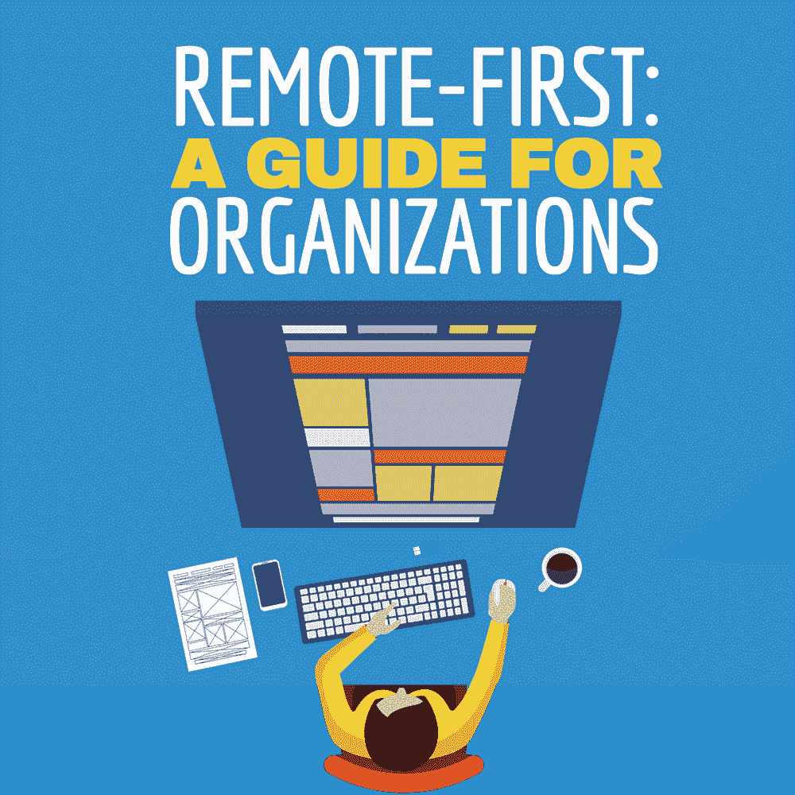
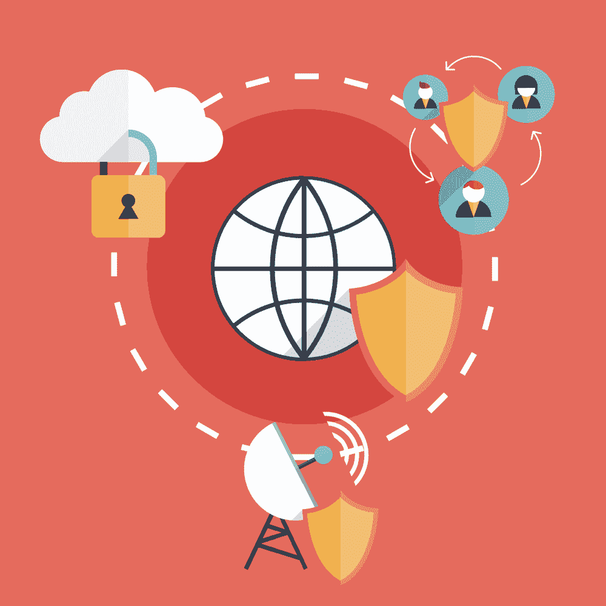

# 远程优先:组织指南

> 原文：<https://simpleprogrammer.com/remote-first-guide/>

*这是即将出版的书*“远程工作-完全指南”*中的一章，我们将首先在简单程序员上出版这本书。你可以用会员优惠价买到这本书，只要点击这里。*

When you finally convince management to let you work remotely, you’ll probably inspire other employees to try to [work remotely,](http://www.amazon.com/exec/obidos/ASIN/9082854120/makithecompsi-20) as well. Depending on the size of your organization, this may make things interesting, to say the least.

随着一个组织拥有越来越多的远程员工，其运作方式将会发生巨大变化。拥有足够多远程员工的组织通常会发现，变得远程化会创造大量机会来重新设计他们的内部流程。以有组织的方式应对这一挑战是一个好主意。

虽然我们之前已经讨论了如何让你的老板让你在家工作，但我们还需要关注另一个方面。如果管理层真的同意利用远程工作人员，他们需要知道一些事情。

允许远程工作是一个有点吓人的过程，因为在这个过程中有很多未知和惊喜。因此，当管理层有一系列要考虑的事情时，事情就简单多了。这使得更容易快速做出决策，并有助于避免伤害团队士气或生产力的简单、可预见的错误。你最不希望的事情就是你的公司落后于竞争对手，但同时，你的公司今天还得继续运转。

在这篇文章中，我将向你展示如何从管理的角度为远程工作做准备，这样你的公司就可以成为迫使每个人做出反应的领跑者。

## 为什么远程优先？

远程工作的人数持续攀升。在未来，不仅公司将被期望至少允许一些远程工作，而且关于如何进行远程工作的期望将继续变得更加复杂。

简而言之，现在就开始围绕远程工作构建基础架构的组织将在几年内领先于竞争对手。此外，拥有可靠的远程工作实践将有助于他们在今天争夺员工。

在许多领域，工资是资产负债表上最大的支出之一。此外，好帮手的价格持续上涨，尤其是当公司需要在办公室附近雇佣帮手的时候。一家能够有效雇佣和留住远程员工的公司，比那些不能或不愿这样做的公司具有显著优势。

如果你想让你的公司在一个越来越遥远的世界里保持高效，那么“先从遥远的地方开始”会有所帮助远程优先是一组组织过程和原则，它将优先级放在异步通信流和独立于位置的过程上。

通过远程优先，你不仅可以让你的公司成为远程员工更好的工作场所，还可以改变你的组织流程，帮助你的现场员工和卫星办公室的员工(或拜访客户)。

即使您的公司不打算定期允许员工在家工作，这些流程更改中的许多都是有用的，因为这些流程是在假设资源(如网络连接、员工等)不会总是完全可用的情况下构建的。这些策略之所以有效，是因为它们比没有这些假设的策略更接近现实。

在本指南的其余部分，我们将讨论您的组织需要具备的一些原则，以便真正利用远程工作人员。只要您做好相应的规划，远程工作人员就可以成为您组织的一大优势，而不仅仅是一种组织怪癖。

## 远程优先是什么意思？

远程优先听起来像一个噱头。正因为如此，当我们使用这个术语时，我们需要清楚地表达我们的意思。

远程优先的定义很简单，但并不总是容易实现。简而言之，这意味着远程员工不是事后才想到的。流程是在假设不是每个人都是面对面的，甚至不是在同一个时区的基础上建立起来的。

“远程优先”尊重个人的工作方式、残疾和个人时间表，而标准的朝九晚五的工作方式则不然。该战略旨在包容那些生活状况不允许他们通勤上班的人。

CircleCI 有一篇关于这个话题的精彩博客文章，建议了几个项目来展示真正的远程优先战略在实践中是什么样子的:

*   默认视频会议
*   可访问的、结构化的和记录的团队会议
*   文档，文档，文档(又名，没有什么是口碑或记忆)
*   没有走廊谈话(除非你记录下来)
*   一起计划-时间

这些概念是很好的起点，我会用我自己的一些想法来阐述它们。

然而，当考虑所有这些要点时，出现了一个一致的主题:您不能以一种将远程工作人员(或那天只是外出的工作人员)置于不利地位的方式参与流程。

相反，你要为所做的每一个决定建立书面记录，并确保员工尽可能获得面对面的机会。

以上与“远程友好”形成对比，这是另一个你会在使用中看到的术语。远程友好型公司允许一些员工至少在某些时候远程工作。这基本上是它所能保证的。他们不会为了确保这些员工成功而对内部流程做出重大改变。

这实际上意味着，虽然这些公司有远程员工，但这些员工几乎肯定会前往办公室开展某些活动。

此外，这往往意味着远程员工在了解办公室情况的能力方面处于明显的劣势。他们经常被走廊谈话中决定的事情弄得措手不及，或者在他们听不到发言人的电话会议上。远程友好对于典型的远程工作者来说只是勉强友好。

然而，还是有希望的。当一个组织允许一些员工远程工作时，他们就有了一个良好的起点，开始向真正的远程优先组织转变。很少有公司(尽管数量正在增加)一开始是完全远程的组织，大多数公司似乎是在作为一家远程友好型公司花费大量时间后才实现这一目标的。

在一个正在运营的企业中改变流程不是一项快速或简单的任务。相反，它通常是一系列“足够好”的妥协，推动组织走向最终目标。这些变化在大多数组织中不会在一夜之间发生，因为组织的使命就是它的使命。

远程优先(Remote-first)是(并且应该永远是)仅次于组织的主要目的。如果一个组织忘记了它的主要目的并实施远程优先最终导致裁员，那么这样做对它没有任何帮助。因此，这个过程需要时间。

远程友好型组织和远程优先型组织之间有一个连续体。在此过程中，需要分阶段进行某些组织变革，以实现持续改进。这些定义如下:

*   **远程敌对**–组织不允许任何远程工作，包括在紧急情况、恶劣天气事件等情况下。生产率往往以“座位上的屁股”来衡量。
*   **阶段 1**–组织允许在特定条件下进行远程工作，但不允许重复进行。远程工作的能力随时都可能被剥夺。
*   **阶段 2**–组织允许一些员工定期远程工作，但不允许任何人一直远程工作。远程工作的能力可能会因为管理层的一时兴起而被剥夺，或者如果远程员工在某种程度上让组织的其他人感到厌烦。
*   **阶段 3**–组织允许一名或多名员工始终远程工作，但没有改变沟通流程以适应这些人。远程工作人员可以被告知要么到办公室来，要么随时提交辞呈。
*   **阶段 4**–组织修改其会议、评审和其他协作的流程，以适应远程工作。仅限远程办公的员工有专门为他们设计的会议，但他们的项目管理却没有。
*   **阶段 5**–组织修改其流程规划和项目管理方法，以适应远程工作。但是，入职后可能需要一段时间，员工才能获准远程工作或获得所需的一切。
*   **第 6 阶段**–组织已经修改了其入职流程，假设新员工将远程办公。然而，没有采取任何措施来确保团队的凝聚力。
*   **第 7 阶段**–该组织确实是偏远的，并且有定期召集员工以确保团队凝聚力的实践。

如您所见，真正成为远程优先组织的旅程并不短。如果您一直在跟进，您的组织可能已经进入第 2 阶段，甚至可能处于第 4 阶段或更晚。然而，在第二阶段之后，真正困难的工作开始了。

一般来说，大多数组织目前还没有达到第 7 阶段(尽管他们可能仍然有许多这些特征)。在任何组织中，在一个或多个利益相关者开始反推之前，您通常只能推动远程工作到此为止。如果你不是首席执行官，在进入下一步之前，你需要非常小心地进行政治试水。

在每一步，你可能都需要一个新的策略来继续前进。如果你只达到第 3 或第 4 阶段(甚至只是第 1 阶段)，也不要气馁。对你的团队来说，每一步都是一个进步，并且能够被利用来采取下一步。

整个过程可能需要数年才能完成。例如，下面是一些您可能希望在每个步骤中强调的好例子:

*   **远程敌对**–强调业务连续性和员工保留(人们不想因恶劣天气而损失病假)。
*   **第 1 阶段**–强调远程工作以达到特定目标或鼓舞员工士气。
*   第二阶段——强调扩大招聘范围，如果你在高物价地区，招聘成本可能会更低。如果你在一个更不景气、成本更低的地区，只需提到更大的招聘群体。
*   **第 3 阶段**–强调提高远程员工和办公室员工的生产力(由于更少的阻塞和中断),将流程转变为异步且记录良好的流程。
*   第 4 阶段–强调项目管理需要摆脱微观管理和打断会议日程，以提高生产率和评估质量。项目经理经常想从员工那里得到时间估计，但又如此频繁地打断他们，以至于员工无法猜测一项任务需要多长时间。
*   **第 5 阶段**–强调，由于远程工作是一种选择，员工应在假设他们将在家工作的情况下接受培训，以降低他们过渡到远程工作的成本和风险。提及由于流程设计时已经考虑到了远程员工，入职流程最好从员工最终可能远程工作的角度来处理。
*   **第 6 阶段**–强调一些面对面的团队时间将改善协作，使某些培训情况更容易，并更容易留住员工。
*   第七阶段——这是你最终想要达到的目标。您的目标是确保管理层不断认识到远程工作对您的组织的价值。这里的目标是确保管理层对拥有远程工作人员感到满意，这样他们就不会突然决定强迫每个人都回到办公室。

在每个阶段，你都需要做一些具体的事情来帮助你过渡到下一个阶段。当你取得一些初步的成功后，让你的团队远程化的最大障碍就会出现。

问题不仅仅是高层管理人员可能不愿意与你合作(他们可能会)；问题是，在这个过程中，你的策略必须不断发展。当许多经理发现自己处于完全不同的情况时，他们会尝试上次奏效的方法；不要这样。

因为远程工作在每个阶段都代表着你的业务流程中如此(潜在)深刻的变化，你会发现探索新的机会比一遍又一遍地尝试同样的论点更成功。

## 会议需要如何进行

远程工作时，会议可能是最令人头疼的事情之一。远程会议有四种常见的反模式，对于远程员工来说，这些反模式非常烦人且效率低下。

这些反模式不仅使远程员工更难完成工作，而且还会产生令人讨厌的副作用，将远程员工变成二等、不知情的员工。

首先，对于远程团队成员来说，随意安排(或完全临时安排)的会议极难组织。他们可能不在座位上，通常很难快速确定他们是否在座位上。因此，由组织混乱的经理快速安排的会议经常会干扰远程工作人员。

虽然像这样的会议也会对现场工作人员造成干扰，但这些工作人员通常会在远程工作人员之前发现这些会议，并且他们不会有太多的技术问题风险。

虽然建议远程员工尽可能确保他们的设备在一天中保持工作，但事实是会议软件似乎总是有一些需要克服的怪癖。让远程员工提前几分钟参加会议更容易，这样他们可以在其他员工加入通话之前确保系统为他们工作。

如果您没有给远程员工足够的时间来确保他们的设备在会议开始前工作，这通常会导致远程员工完全被排除在重要会议之外，从他们的同事那里获得不正确的信息，或者让管理层怨恨他们，因为这降低了经理在没有事先计划的情况下就开始会议的能力。

根据长期的经验，我可以告诉你，临时会议是你作为远程员工遇到的最糟糕的会议之一，因为在会议开始之前，你通常没有时间停下工作，喝更多的咖啡，甚至去洗手间。

Second, meetings that are scheduled with half the team in a conference room while the remote employees listen in on a speakerphone are also not particularly good for the remote employees.

许多会议室的音响效果很差，尤其是如果管理层更关心空间的外观而不是功能的话。木地板，墙壁没有吸音材料的会议室很常见。

扬声器电话拾取房间里的每一个杂散噪音，而不能拾取语音也是一个巨大的烦恼。当我在有这种会议室的公司远程工作时，我甚至懒得去注意会议。在这种音质下，像有人在电话旁涂鸦这样简单的事情意味着我无论如何也听不到任何有用的东西。

如果我真的听到了什么，我经常只能听到靠近电话的人的声音，或者在房间远端大声讨论一些不相关的事情。这是个普遍问题。

第三，不尊重员工时间的会议是远程员工的祸害。虽然他们也浪费了办公室人员的时间，但这些人显然参加了会议。远程工作人员不在，即使他们也在那里。

远程办公人员通常被期望通过实际完成工作来证明他们的效率，因此浪费性的会议对他们尤其有害。虽然这种动态听起来没那么糟糕，但从长远来看，它可能会导致远程员工工作时间过长，工作/生活平衡不佳。

当与浪费性会议通常会出现的所有问题(糟糕的管理，缺乏明确的方向，不一致的优先事项)结合在一起时，它会很快导致精疲力竭。

我已经离开了两份持续浪费我时间的部分远程工作，因为我发现自己由于效率低下而工作得更多。到两份工作结束时，我在远程工作时损失的时间比我每天开车去办公室的时间还要多。

第四，许多会议组织者没有考虑到远程员工的日程安排。在某些情况下，这意味着远程员工发现自己要么在工作日真正开始之前，要么在工作日结束之后，还在开会。

会议安排的方式也可能会使接孩子放学和履行其他义务变得困难。虽然这也可能是办公室的一个问题，但抱怨这种不体贴的计划的远程员工更有可能被视为只是在发牢骚。

当雇主一直不让你带 7 岁的孩子去繁忙的高速公路旁的公交车站时，这仍然是一个主要问题，但因为许多经理认为你远程工作是“幸运的”，他们可能认为你没有权利抱怨。

虽然这种会议并不总是可以避免的，但通常可以计划好，让每个人都能参加，并且不会给任何人带来不必要的负担。

因此，考虑到有远程员工参与的会议的四种最常见的反模式，确定大多数有远程员工的公司应该如何进行会议是非常简单的。一些通用的指导方针可以极大地帮助你的团队。

除非情况紧急，否则在任何会议前至少提前一小时发出警告。也要给你的远程员工时间做准备，记住，你试图联系他们的大多数方式都有潜在的延迟。

如果你一年中遇到了几次以上的紧急情况(而且你不在活跃的战区)，它们就不是紧急情况；他们是管理上的失误。解决它们，防止它们再次发生。是的，这种说法很直白，但是如果你不解决这个问题，最终你失去的不仅仅是你的远程员工。

让远程员工**将事情放在他们的日历上**。例如，让他们记下他们的空闲时间，或者他们什么时候需要去公共汽车站接他们的孩子。不要把事情安排在这上面或者离它们太近。

**允许人们拥有工作/生活平衡**，包括远程员工。不要将你的远程员工视为二等公民，因为他们关心的事情比办公室里的人要少。

**解决您的音频问题。**如果你的会议室容易产生回音，这就需要纠正了。请记住，虽然远程员工的幸福可能不是你的首要任务，但会议室糟糕的音响效果也会让你在任何陷入电话会议的战略合作伙伴、客户或投资者面前看起来像个业余爱好者。

会议应该限制在一定的范围内，一般只有几个人参加。一个人讲话，其余的人听着，直到轮到他们讲话。如果你在一个会议上有很多附带的对话，要么是你的会议对象不对，要么是你的会议范围不对。

不管怎样，你的远程员工听不到他们想听的，而且你可能也给你的现场员工制造了麻烦。对于有听力问题的员工，或者患有使他们更难集中注意力的疾病的员工来说，尤其如此。

**避免与不相关的团队频繁召开状态会议**。这包括日常站立。如果团队成员不在同一个项目上工作，会议的大部分内容对其他团队的人来说都是浪费时间。此外，确保人们将无关或多余的讨论带出会议，这样他们就不会浪费每个人的时间。

对于现场工作人员来说，有一种激励去详细谈论他们项目中无用的琐事，只是为了看起来很忙。对于远程工作人员来说，这只会浪费他们更多的时间。更喜欢帮助那些把事情做好的人，而不是那些仅仅示意把事情做好的人，你会成为一个更好的管理者。

注意时区。通常没有充分的理由让西海岸的人参加上午 11:30 的会议，仅仅是因为东海岸的人认为下午 2:30 的会议比较方便。虽然你可能偶尔会这样做，但无论你是否有意，这样做都会在你的员工中建立一种等级制度。

会议通常应该**被认为是耳机优先，**而不是椅子优先。我的意思是，你应该假设会议将使用网络摄像头和耳机进行，办公室里的人坐在椅子上是第二个想法，而不是相反。

这样的策略不仅会让你远离不利于远程团队的会议，而且还会迫使你提前做好充分的计划，以便会议开始时你的远程团队做好准备。作为副作用，现场团队成员最终会有更好的会议。

作为一名经理，也可以试着在家工作。你会很快发现一系列需要改进的事情，以帮助你的团队。你会发现，员工不会告诉你他们心里想的所有事情，但是如果你能够模拟他们的经历，你通常可以学到很多东西。

一旦发现远程员工有问题的地方，让他们参与解决。远程员工倾向于避免投诉，因为他们害怕投诉会导致他们失去远程工作的特权，所以确保他们明白事实并非如此非常重要。

当与远程人员进行会议时，黄金法则适用。不要让您的远程员工处于您在现场不想处于的境地。这需要一些思考，但是为远程工作的现实做一点准备将在很大程度上帮助你为你的团队安排有效的会议。

## 项目规划如何变化

当您的组织开始有更多的远程工作人员时，您会发现项目管理风格必须调整以适应新的现实。如果您希望您的组织能够有效地管理远程工作人员，那么也必须改变一些常见的项目管理模式。

我们已经详细讨论了会议反模式，在项目管理中也有类似的动态。这可能并不奇怪，因为许多会议对于成功的项目管理是必要的。然而，如果远程团队的项目经理想要成功，他们需要处理一些事情。

首先，项目经理通常应该避免在最后一刻询问状态更新。对于远程团队，尤其是分布在广阔区域的远程团队，试图在最后一分钟发现项目状态注定会失败。你不仅会扰乱你的团队，而且你可能要等很长时间才能得到回复，尤其是当你的团队成员的当地时间远远超出正常工作时间的时候。

You need to either collect project status information once a day during a recurring quick morning meeting, or you need to make sure that your team has appropriate tools on hand to be able to make project status information available to you without you having to contact them.

如果你一直用一个不支持多并发用户的桌面工具来管理所有的东西，这对你来说就不太好了。一般来说，你将不得不开始使用在线工具，允许其他团队成员更新他们的任务，并且不浪费他们的时间在项目管理的细枝末节上。

虽然许多在线工具确实允许远程工作人员保持他们的状态最新，但太多的工具都是内置的，以至于更新时间太长。在极端情况下，这往往意味着员工会推迟更新他们的状态，当你需要时，你将无法获得你需要的信息。

我曾经为一家公司工作，该公司在他们内部构建的一个缓慢、容易出错的桌面应用程序中管理所有的 bug 跟踪和项目跟踪。十多年来，每当管理层需要更多信息时，他们就通过添加更多输入字段来解决问题。

我一个月最多更新两次我的任务清单，因为它浪费了太多的时间，以至于不值得去做，直到人们真的对此感到不安。

当我主要被评估完成实际工作的能力，而不是我填写愚蠢的表格来通知项目经理，以便他们知道当我们没有满足另一个截止日期时应该责备谁的能力时，这尤其不值得做。我向你保证，如果你以同样的方式管理事情，你也会在自己的团队中培养同样的心态。

正如我之前提到的，当你为一个远程团队处理项目进度时，你主持会议的方式必须改变。如果您正在管理从事不同项目的人员，这意味着您需要为那些项目的团队召开单独的会议。

太多的项目经理犯了强迫每个人都参加同一个会议的错误，即使会议的大部分时间对大多数人来说是浪费，只是因为这对项目经理来说更容易。虽然现场工作人员可能会很忙，但远程工作人员不太可能会注意。

记住，他们知道他们的评估不是基于会议出席率——他们仍然需要证明他们的工作效率。不要以一种使他们的目标与你的目标相反的方式安排你的会议。

然而，除了改变你与团队的互动，团队也需要改变他们作为项目经理与你互动的方式。假设你有好的系统，让你的团队不需要过多的努力就能让你跟上时代，你有权利确保他们这样做。

确保这一点的最好方法之一是确保团队知道保持软件最新意味着你不会打扰他们(并且你也将帮助保护他们免受管理的干扰)。不要试图把这个工作流程作为让你的生活更轻松的一种方式来推销，而是把它解释为让 T2 的生活更轻松的一种方式。

项目经理(以及一般的经理)也会发现，他们必须培训自己的经理如何与远程团队互动。这可能是一个棘手的平衡行为，就像大多数工作情况一样，你会发现自己处于管理层和团队之间。

像团队一样，管理层可以被训练成适当地互动，确保系统到位，在他们需要时给他们所需的信息，而不必与你互动。

如果您确保您的团队有效地报告了项目状态和进展，请尽量确保管理人员可以尽早轻松地获得这些信息。这可能像每天发送一封包含项目状态的电子邮件一样简单，也可能像在项目管理系统中显示这些信息一样复杂。

你可能也应该避免给管理层太多详细的信息，尤其是如果你的团队正在做一个技术项目，而你的经理不是技术人员，因为太多的技术细节会让一些经理要求更多的细节。如果他们问了，他们可能不会问你——相反，他们会直接打扰你的团队。

如果管理层开始打断您的团队，团队最终会认为在项目管理系统中保持最新不再值得他们花费时间，这使得您的工作更加困难。虽然一般来说，我不推荐守门行为，但这是您可能应该参与的一个地方，只是为了保持一切顺利运行。

从经理的角度来看，很难判断远程团队在做什么。直接联系团队成员获取信息也是非常诱人的(尤其是如果团队给出了太多的技术细节)。这对管理层来说是浪费时间，对团队来说也是干扰。一般来说，管理层只想要显示团队正在实现目标的概要细节。

这意味着绝对有必要让管理层获得一个不同于您所使用的(或者开发人员所使用的)项目状态视图。忽视这一点，后果自负。虽然有现场工作人员的正常项目管理通常也是如此，但远程工作人员增加的复杂性意味着，如果您不希望管理层干扰您的团队，您必须正确处理这一点。

例如，在之前的一份工作中，我们都使用相同的内部项目管理系统(我使用这个术语是因为你可以想象到它的松散程度)来跟踪团队正在发生的事情。每个人都有相同的界面，所以当开发人员必须为其他开发人员提供细节时，这意味着上层管理人员也能看到这些细节。

这导致了一些有趣的问题。例如，一个开发人员放入一个条目，列出了他用来跟踪应用程序所需细节的 HTTP 头。一位高级经理看到了这个条目，并开始单独给开发人员打电话，试图弄清楚为什么我们还没有从 HTTP 转换到 HTTPS。

事实是，他不需要这些细节，也不了解正在发生的事情，因此无法做出有效的反应。由于缺少单独的报告供他阅读，导致团队的大多数人浪费了数小时的时间，因为他召集了一次紧急会议来讨论支付卡行业(PCI)合规性。

相信我，你不希望这种事情发生，因为即使有干扰，他仍然希望团队按计划进行。

## 内聚力

当管理一个远程团队时，你必须确保保持团队的凝聚力。虽然这在办公室环境中也很重要，但一旦团队开始在不同的办公室工作，许多因素会使凝聚力变得更加困难。

这里有一些事情可能会让运行分布式团队的任何人感到惊讶。这些事情并不是不可预测的。让他们意想不到的是，他们没有被不习惯完全远程环境的人预料到。

*   不太了解对方的员工更容易被冒犯。他们也不了解他们的同事，所以他们更容易以不友好的方式曲解电子邮件、会议上的评论和其他互动。
*   员工可能不知道他们的同事一天都在做什么。虽然我们经常认为管理层可能认为员工在远程办公时工作不多，但我们很容易忘记他们的同事也可能形成类似的错误印象。这可能会在团队中产生摩擦。
*   作为远程员工，人们通常根据我们的成就来评判我们。我们的现场团队成员通常根据他们的存在和成就的外观来判断。这会导致同事的最佳利益和我们自己的最佳利益没有太多重叠的情况。
*   当人们远离办公室时，正常的人际交往就不会发生。虽然在一些办公室，这实际上可以减少冲突和沟通失误，但这也往往意味着团队不能很快或很好地团结起来。因此，团队成员和管理层需要采取有意识的行动来促进团队成员之间的积极互动。
*   远程员工很容易觉得他们不是团队的一部分。这会让他们更有可能决定离开。我拒绝了报酬更高的工作机会，因为我真的很喜欢我的团队，我相信很多人也这样做过。如果我被孤立和远离，不同工作的金钱和福利可能会动摇我。
*   压力过大的远程员工可能不愿意与同事或经理谈论此事。这可能意味着问题会在看不见的情况下恶化，即使它们本可以很容易地得到解决。像这样的情况通常只有在事情已经无法挽回的时候才会被注意到。

为了有助于团队凝聚力，如果可能的话，你需要让每个人一年至少去几次办公室。当然，支付酒店房间、每日午餐和航班的费用很昂贵，但与上述问题可能导致的人员流动和争吵的成本相比，这笔费用微不足道。

Aim for a few days at a time, and make sure that you have at least some activities planned that aren’t work-related. Also, make sure that when the remote employees return home, they get a few days off (or at least a reduced workload). Remember that travel is tiring and also interferes with everything at home. After a weeklong trip, your employee is probably a day or two behind on home obligations.

虽然这并不能解决所有问题，但可以让一些事情变得更简单。首先，它使团队成员人性化。他们不只是在某个地方的聊天频道上以数字化身的身份体验他们的同事，而是将他们的同事体验为真实的、有血有肉的人。

这里有一个很容易被忽略的动态；随着交流方式变得越来越有限，它们也变得越来越刺耳和刺耳。两个愤怒地向对方按汽车喇叭并举起拳头的人，如果他们在一个允许他们像人一样说话的环境中相遇，可能根本不会发生冲突。类似的事情也发生在专业环境中的团队。

让你的团队团结起来，可以让他们进行更多复杂的人际互动，这将使他们在以后更有能力与彼此进行良好的沟通。

此外，将员工聚集在一起可以让你观察他们。大多数人都没有意识到他们在社交场合“泄露”了多少信息。通过在社交场合观察员工，你可以很快确定哪些员工关系融洽，哪些不融洽。

在任何规模的团队中，即使几个小时的互动也会让你知道谁不喜欢谁。此外，也许更有用的是，观察这种互动还会让你知道组织中的哪些人可以充当团队中派系之间的桥梁。

当你需要帮助来解决团队中的问题时，你可以向这些人求助。他们通常对某些性格冲突和人际冲突发生的原因有独特的见解，而且他们也处在那些冲突可能困扰他们的位置。

如果你正在寻找可以提升的人，这些是最好的选择，因为他们巧妙地避免了在你的团队发生冲突时偏袒任何一方。

## 办公室津贴

当与远程团队合作时，至少为团队成员使用的一些设备付费是很重要的。拥有一个高效的远程办公室并不便宜。远程工作人员使用的计算机可能要花费几千美元，桌子、显示器、椅子和其他设备也是如此。

虽然您的一些远程员工可能愿意购买他们自己的设备，但他们中的许多人不愿意花足够的钱来确保他们有合适的设备。

在我工作的一家公司，办公室没有为远程员工支付任何设备费用。以下是我注意到的一些事情。

许多远程员工的电脑速度极慢。该办公室授权了一个特定的 VPN 客户端，并希望完全控制连接到其网络的任何机器。结果，年薪六位数的员工买了 400 美元的笔记本电脑，这样他们就可以在家工作了。没有人会让你的信息安全主管控制他们的游戏电脑。

生产力的流失是惊人的，在一年的时间里很容易就会比仅仅购买像样的笔记本电脑花费更多。当设备故障发生在关键时刻时尤其如此(如果你的生产力足够低，那么所有时间都是关键的)。

许多远程工作的员工也没有投资**适当的网络基础设施**。因此，他们中的许多人在家庭办公室工作，使用廉价的互联网连接和无线路由器。

虽然你可能不会因为某人喜欢像 [Max Headroom](https://en.wikipedia.org/wiki/Max_Headroom_(TV_series)) 这样的 20 世纪 80 年代电视角色的口吃抖动动作而做出判断，但当你的质量保证(QA)分析师由于不稳定的互联网连接而在视频会议上表现出同样的行为时，这个前提就不适用了。

同一办公室**没有提供电话**。这意味着当办公室出了问题时，你可以通过私人手机联系。除了不方便和非常烦人之外，这还导致一些人大部分时间都把他们的手机保持在“请勿打扰”模式。

事实证明，当人们外出吃午饭、夜深人静时睡觉，或者周六早上和孩子一起看电视时，他们讨厌被下班的人打电话。如果你打员工的私人手机，你很容易激起这种怨恨，即使你不是故意的。

背部、颈部、肩部和臀部的问题在这个团队中也很常见。这往往会导致更多的缺勤和更多的抱怨*在*工作期间，其中大多数我都乐于倾听……这些痛苦是次优工作条件的结果，通常包括在厨房柜台上放一台便宜的笔记本电脑，然后试图在上面工作八小时。

如果你希望通过让你的团队在他们自己的设备上远程工作来节省购买设备的钱，你将会得到一个粗鲁的觉醒。虽然税法理论上允许远程员工注销他们的一些费用，但实际上，大多数会计师不允许他们这样做。

这种行为很容易引发审计，通常不值得麻烦。因此，员工很容易为了减少开支而偷工减料。你可以预期这些“节省”的大部分负面结果会落在你身上。

虽然您可以通过允许员工远程工作来节省与员工相关的开支，但您可能不应该试图在员工用来完成工作的工具上节省任何资金。这往往适得其反，同时让你看起来很廉价。实际上没有任何好处。

你的员工可能在家里也有一些他们想要使用的像样的设备。例如，我几乎总是在家里有一台像样的电脑和一张桌子来做合同工作，所以雇主为我购买这些东西通常是浪费时间(除非他们想通过域策略来控制计算机，在这种情况下，他们需要提供一个)。

然而，直到最近，我一直倾向于购买更便宜的办公椅；对于雇主来说，这将是代表我进行的一次非常好的购买。

因为你永远不知道员工能为自己提供什么硬件，所以最好的策略是为办公设备提供津贴，并让员工列出他们打算提供什么设备(如果有的话)以及他们计划用津贴购买什么。

虽然你可能需要准备好为你的员工推荐合适的设备，但这种方式可以让员工处理他们家庭办公室的特殊情况。

这可能是任何事情，从空间限制，要求他们有一个不寻常的桌子，到需要一个更好的显卡，因为已经有一个大型的多显示器设置，这就是我；我喜欢它的设置，除了当我不得不为我需要驾驶它的所有硬件买单的时候。

津贴也让员工更容易个性化他们的工作空间。这通常会让家庭办公室感觉不那么孤立。

虽然我通常会指出一些支持这种说法的研究，但我真的没有。然而，我可以说，我和我的一些朋友已经注意到了这种影响。至少，这是一个有趣的现象，可能也适用于你的员工。就我个人而言，我相信能够在你的工作环境中做出至少一些选择有助于你更加依恋它。这种控制感能让人更快乐(或者至少让他们更满足)。这让他们在工作中更快乐，更有可能以积极的方式与同事交往，从而减少他们的孤独感。

## 处理时区差异

当与跨越多个时区的远程员工打交道时，事情会变得非常有趣。虽然一个时区的差异可能没什么大不了的，但更大的时间差异可能会对团队造成相当大的破坏。

一旦您的员工分布在三个或更多时区，一些问题就变得很明显。以下是您在分布式组织中经常观察到的一些情况:

*   每增加一个时区，你就失去了两个小时的时间，每个人都可以不受干扰地参加会议。你最东边的人会对晚开会感到恼火，因为这会让他们晚回家；你最西边的员工会对早开会感到恼火，因为他们强迫他们早些开始。
*   如果您的员工分散在四个以上的时区，您会发现某些团队成员的理想会议时间与其他团队成员的理想午餐时间一致。
*   如果你的员工分布在六个或更多的时区，你会发现他们只是因为沟通问题而根据地理位置进行划分。如果这种脱节发生在一个团队中，你会经常发现这个团队由于人际争吵而出现绩效问题。
*   巨大的时区差异导致断开连接。如果团队之间出现了脱节，只要需要一起工作的团队成员在相同的时区，您就可以在很大程度上避免这个问题。
*   如果你的员工在 10 个或更多的时区之外，会议对每个人来说都是可怕的，因为每个人都醒着的唯一时间也是完成工作的可怕时间(在清晨或傍晚)。

从上面的观察中，出现了一些规则，它们通常会帮助您避免与时区相关的问题。

Any group of people separated by more than a few hours will generally function poorly as a team, simply because of the communication issues arising from vastly different schedules. Don’t try to make them into a team unless it is absolutely necessary.

如果你只是需要轮班(例如，在支持和其他面向客户的角色中)，确保你有一个将工作从一个团队“移交”到下一个团队的流程。这应该是一个相当正式的过程，在一个班次结束和下一个班次开始时进行。尽量确保覆盖范围至少有一些重叠，以便您的员工有时间进行沟通。

如果利用得当，位于不同时区的小组会非常有用。虽然您可能不希望一个软件开发团队相隔很远，但是让一个 QA 团队在与您的开发团队完全不同的时区工作会非常有帮助。

这样的安排允许开发团队进行部署，而不用担心他们会在 QA 测试时破坏东西，这也意味着开发人员在早上返回工作时会得到 QA 反馈。如果你把握好时机，这样的互动会是一件美好的事情。

您组织中的任何一个团队都不应该经常因为与远程团队(或远程团队成员)开会而中断自己的个人时间或午休时间。这种动态几乎总是最终导致怨恨，人们可以很容易地假设一个团队与另一个团队相比是管理层的“最爱”。最好是尽量避免。

如果你有一个分布在很广区域的团队，这可能意味着管理层将会在讨厌的时间开会。虽然这很不幸，但也没办法。

有人需要与另一个团队沟通，这个人很可能在他们之上的管理层级中。然而，如果你以一种假设所有的交流都是异步的方式来构建你的交流系统，经理们至少可以使这些交流尽可能高效。

最后，广泛分布的团队的挑战意味着你可能想要避免它们，除非你有一个很好的理由去拥有它们。超过四个小时的时差是周期性的痛苦，而 10 个小时或以上的时差几乎总是痛苦的。除非你有一个很好的理由，否则你通常最好避免这种情况，即使你在这个过程中节省了一点钱。

## 公平对待远程员工

如果您还有一个现场团队，公平对待远程员工可能会很困难。不仅现场员工更容易被管理层注意到，而且他们在办公室的信息不对称方面也处于更有利的位置。这似乎是一件微妙的事情，直到你成为它的接受者。

与在办公室的人相比，远程员工所能行使的权力有着不言而喻的差异，尤其是如果管理层也在办公室的话。

如果办公室员工定期吃午餐，并与管理层进行社交活动，这一点尤其正确。当人们考虑远程员工是否受到公平对待时，往往会想到这一点。

然而，许多其他更微妙的事情可能会发生。例如，有时，远程员工生活在他们周围没有人从事相同职业(甚至说相同语言)的地方。

在为一家只有几个远程员工的公司工作时，以及几个部分时间远程工作的员工，我注意到一些有趣的事情。我的一个远程同事在我们早上的站立会议上非常健谈，这稍微惹恼了团队的一些其他成员，并使会议比他们需要的更长。

当我想到这一点时，我意识到这位员工在一个相当偏远的地方工作，周围的人大多不是程序员(而且大多不会说英语)。在我们都努力在晨会之外与他交谈后，情况有所好转。

如果你不注意，这种情况可能会发生，而且对远程员工也不公平，就像管理层因为距离近而偏袒特定的人一样。

公平对待远程员工通常意味着你必须花费更多的时间和精力来确保他们的需求得到满足，而不是花在办公室员工身上。

首先，有一个明显的沟通障碍，让你无法及早发现问题。此外，远程员工通常被认为是“幸运的”，因为他们可以在家工作。这经常被当作一个借口来打消他们的其他顾虑。

小心不要认为你的远程员工是幸运的，并尽你所能确保你的其他员工不会做出他们的同事也是幸运的反应。

他们只是在一系列不同的环境中工作——没有人说办公室员工是“幸运的”，因为他们的工作不是在他们的房子里的专用房间里进行的。如果你稍微想一想，每种工作情况都有利有弊。

将“运气”作为允许在家工作的解释，会损害团队士气，如果你想对远程员工公平，最好避免这种做法。当然，由此得出的推论是，如果你不想公平对待你的远程员工，问题往往是自限性的，因为他们会选择去别的地方。

除了社会动态的差异之外，其他情况也有助于确保您的远程员工感受到重视和公平对待。不要认为这些事情是你“不得不做”的事情，而是机会。

当你为在现场的员工买午餐时，试着**也为你的远程员工**做同样的事情。虽然这需要更多的工作，但也需要您与远程员工协调这项福利。他们会注意到额外的努力。

确保当你为现场团队安排事情时，你**也考虑到远程员工的时间安排**。您可能会想当然地认为您的远程员工拥有更灵活的时间表，但事实可能并非如此。

这种假设甚至可能是准确的，但是稍微考虑一下不仅会让员工知道你关心他们，而且会让他们的生活更轻松。

确保你定期**与你的远程团队成员保持联系**，就像你与办公室里的人保持联系一样。即使只是简单的聊天和寒暄，也要抽出时间来确保与远程团队成员进行非正式的交流。

虽然你可能不认为这种闲聊是有价值的，但它通常可以让你和远程员工传达有用的信息，否则可能无法沟通。许多人际交流在非正式的环境下更有效，尤其是一对一的交流。

请注意，您的远程员工可能与您的现场员工有**不同的优先级**。虽然加薪、晋升管理层或更引人注目的工作的前景可能会激励现场员工，但远程员工可能不会从这些激励措施中找到多少动力。虽然加薪、头衔的提升和更多的责任对办公室的员工来说听起来不错，但它们可能会带来额外的负担，而远程员工对此毫无兴趣。例如，被提升到管理层可能意味着处理更多的人事问题，而不仅仅是完成一项任务。类似地，加薪可能会带来一些期望，因此不值得这么麻烦，尤其是对那些经济上已经有保障的人来说。我曾在几家公司工作过，那里提供的加薪和头衔都很少，我期望一个人能为他们每周工作 60 个小时。如果有人已经试图脱离普通的办公室环境，一个旨在迫使他们更多地融入其中的激励结构不太可能激励他们。

您需要根据远程员工的动机修改您使用的激励措施。实际上，您也应该对您的现场员工这样做，但是在考虑远程员工时，出错的可能性更小。

最重要的是，无论何时你和远程团队一起做任何事情，花一些时间考虑远程团队成员会如何看待这件事。很容易忘记这样做，但是你这样做是在冒险。

请记住，远程团队成员可能有不同的目标，并受到不同的激励，在您开始改变任何事情之前，请将这一点考虑在内。

## 当办公室“停机”时

最终，除非您的公司在可用性和正常运行时间上花费过多的时间、金钱和精力，否则从远程位置连接到您的系统将会出现问题。这对于无法连接至关键系统的远程员工来说尤其困难，而办公室人员却可以。这种情况几乎不可避免。

要了解当远程员工无法连接到办公室的系统时如何对待他们，请考虑一下，如果您的系统在云中，远程员工可以访问它们，而办公室的人不能，会发生什么情况。

你会责怪办公室职员“不得不进来并试图在别人的大楼里工作”吗？你会告诉他们，他们可能是“白痴，只是不知道足够的网络知识来保持系统运行”吗？你会坚持让他们在互联网重新开始工作以赶上进度后再留下来吗？

你可能害怕这些建议。关于如何对待现场员工，有很多不言而喻的社会规范，这些规范主要是从多年来现场员工受到虐待时的真实世界经验中收集的。

Most of our safety regulations and discussions of the rights of employees came about due to “bad things” happening in an on-site environment. Remote work is something new, and we as a culture have not really made enough similar mistakes in regard to remote workers.

因此，在与远程员工互动时，社会规范并没有很好地建立起来。虽然你可能不同意上一段中的每一个建议，但类似的方法通常适用于远程工作人员，大多数人甚至不眨眼。这不是他们的错——只是历史还没有赶上我们，留给我们的本能反应产生了不好的结果。

当无法联系到办公室，并且这不是远程员工的错时，责怪他们没有任何意义。同样，如果公司没有为互联网连接和用于连接的设备付费，最好是开始这样做，或者接受员工可能已经利用他们拥有的资源尽了最大努力。

这往往意味着，除非远程员工疏忽(或故意)导致失败，否则你真的不应该责怪他们。这也意味着你不应该把他们当成是错的。

要求远程员工在下班后工作以赶上设备故障可能不是一个好主意，这给人的感觉好像是你在责怪他们，不管你是不是有意的。

拥有远程工作人员是对未来的投资。这是为您的员工创造更好、更灵活的工作环境的投资。如果你随后将设备和网络故障归咎于员工，而他们无法预防(或者他们无法承担预防成本)，那一切都是徒劳的。

## 安全问题

安全也是任何雇主关心的事情。无论是窃取商业机密、破坏网络资源，还是出于不当目的使用关键基础设施，几乎每个雇主都认为安全是一个需要有效处理的关键问题，以免企业被下一个随机出现的黑客摧毁。

在许多环境中，员工花费大量时间进行培训，以避免产生安全问题。雇主处理安全问题的方式可能简单到要求所有员工签署健康保险便携性和责任法案(HIPAA)弃权书，也可能复杂到具有密集的审计流程并要求对员工进行持续培训。

不管怎样，如果你没有考虑过安全性，你可能应该停止阅读并去处理它——如果不认真对待安全性，你就不可能有一个可持续的远程团队(尝试安全性是危险的)。

我怎么强调都不为过:如果你现在不担心安全问题，那是因为你没有注意到。如果你是一名安全专家，这一点更是如此。大规模数据泄露是常有的事，会造成数百万或数千万美元的损失。忽视安全就像忽视互联网本身一样过时。如果你这样做，你的企业将无法生存。

如果前面的段落让您感到害怕(或者如果它们强化了您已经知道的东西)，那么您可能想知道当您有远程团队成员时，您应该如何处理安全性。在考虑自己办公室的安全性时，您可能会感到相对安全，但是远程员工增加了另一个需要考虑的方面。

当你的普通程序员在一个小隔间里在一台主要由你的 IT 部门控制的机器上工作时，对于远程工作者来说，情况就有点不同了。你在 IT 室的用户体验设计师没有一台很可能在闯入时被盗的电脑，很可能也不会允许他们的孩子使用他们的工作电脑。对于您的远程员工，您有类似的保证吗？

如果你像大多数雇主一样，你可能会对这种情况造成的缺乏控制感到有点不舒服。如果一台电脑不总是在你的监管之下，你根本无法控制它。因此，您只能在有限的程度上信任这样的机器。

此外，如果有问题的计算机不属于你的公司，而你又不能对它实施安全策略，那么你相信它就是疯了。在办公室环境中，这意味着你不能相信你的一个同事(或销售人员，*咳* *咳*)随便带进办公室的笔记本电脑。

在远程环境中，如果你不给员工提供他们自己的电脑，这意味着你可能**永远**无法完全信任他们试图使用的任何机器。

虽然这听起来很残酷，但还是有好消息。许多项目是使用不完全可信的机器进行的。这种模式在分布式软件团队中非常常见，尤其是在开源社区中。为了从团队成员那里获得好的结果，绝对信任机器并不总是必要的。

如果您认为远程计算机不一定可信，那么您的过程将需要更改以适应这种情况。如果您的组织存储了任何敏感数据，那么您可能应该有适当的流程来假设任何一台机器都可能受到危害。

本质上，由于远程工作人员而产生的大部分安全考虑实际上是您应该已经在处理的事情。拥有远程员工会迫使您在法规遵从性要求迫使您这样做之前这样做。

但是，对于远程员工来说，有一些问题需要您使用强大的安全策略来处理。你不仅要尽最大努力防止这些问题，你还需要适当的过程来定期审计，以确保这些问题没有发生。

当安全策略被忽略或规避时，您还需要为不可避免的情况准备好程序。即使您为员工提供公司电脑，以下这些事项也是真实的。

### 被盗设备

你的员工的车或家可能被盗，公司的笔记本电脑或其他设备都在。这些设备可能被盗。如果他们有未加密的静态敏感数据，那么这种小盗窃可能会构成严重的数据泄露。

一般来说，您的员工不应该在他们公司的笔记本电脑上保存敏感数据。然而，在某些(极少数)情况下，这可能是必要的。在这些情况下，您需要确保员工只保留他们绝对需要的数据，并在他们不再需要这些数据时尽快将其删除。

类似的担忧也存在于办公环境中。然而，办公室，尤其是位于城市昂贵地段的大公司办公室，遭遇盗窃的可能性远低于住宅或汽车。

因此，您需要采取额外的步骤来确保在远程员工将要使用的任何设备上应用(并保持)安全策略。这不仅仅局限于电脑。如果被盗，平板电脑、手机、外部硬盘驱动器等也可能导致数据泄露。

至少，您需要确保设备需要身份验证才能使用，对其静态内容进行加密，并对其应用适当的补丁程序管理，以便某人无法利用已知漏洞进入被盗设备。

您还需要确保员工及时报告失窃的设备。令人惊讶的是，许多组织都有一种非常以责备为导向的文化，当员工没有报告问题时，他们会感到惊讶。

### 本地网络安全漏洞

Another major risk for remote employees is that their home computer network security may be compromised. Whether it’s because of their activities on their own computers, or because someone else in the building is not being careful, there is always the possibility that someone’s home network is insecure.

您需要确保用于连接到您网络的任何设备都有相当严格的防火墙策略，对病毒和其他恶意软件进行本地扫描，并且该设备与您办公室之间的通信是加密的。

### 在计算机上进行的非法和不专业的活动

当员工在家工作时，计算机总是存在被用于非法或非专业活动的风险。这可能是从网上购买毒品，到色情(合法或非法)，到软件盗版，到对他人的骚扰和威胁。

虽然这些东西在办公室也可能是一个问题，但当有人在家里有公司设备时，风险更大。人们在家里做一些在办公室里不会做的事情，通常会感觉舒服得多。

除了这种行为的极端负面结果之外，这还可能给公司带来问题，因为参与这些行为的人往往会因为访问不可靠的网站而在他们的计算机上留下大量恶意软件。

这也是完全有可能的，尤其是在特别恶劣的行为的情况下，它甚至可能导致执法机关扣押计算机作为证据。如果员工在公司内部基础设施上做了违法的事情，情况会变得越来越糟。

为了保护公司，您需要监控公司拥有的任何机器上的计算机使用情况，即使它没有连接到您的网络。特别是，您需要寻找表明机器被滥用的行为模式。

然而，你必须在不损害员工有效工作能力或打击士气的情况下做到这一点。这是一个很难保持的平衡，坦率地说，我见过很少有公司做得很好。

内容过滤器和定期扫描恶意软件会有所帮助，但最有帮助的是在雇用员工之前对他们进行审查。除此之外，您的主要目标是尽早发现未经授权的行为，并在发生时限制涉及的系统。

### 未经授权的人使用的计算机

当你把电脑送回家给员工使用时，你可能不希望他们的配偶、孩子或陌生人使用这台电脑。这些人不仅有可能搞乱机器，而且很有可能敏感或专有数据就在计算机上(或者将来会在计算机上)。

这使得允许员工的家人和朋友使用电脑变得非常危险。即使他们不打算做任何邪恶的事情，这样的情况只需要安装一个键盘记录器。键盘记录程序通常作为恶意软件的有效载荷混入，也可能由员工家中的恶意成员(或碰巧来访并看到未锁定工作站的邻居小孩)故意安装。一旦发生这种情况，机器就不再安全了。

因此，您需要确保您的员工明白，他们可能会因为允许未经授权的人员使用公司设备而被解雇。您还需要确保在计算机上有适当的策略，使其在空闲一段时间后锁定(或注销)。

此外，您还应该定期执行密码重置，这样员工的家人就不会只记住一次密码就能访问机器。此外，您需要进行彻底的恶意软件扫描，以防有人在未经授权的情况下登录到机器上。

### 电脑损坏/坏掉

当员工在家工作时，电脑中的某个组件总是有可能损坏。虽然电脑维修很烦人，有时还很贵，但这还不是最大的问题。最大的问题是数据丢失的可能性，特别是如果员工没有定期备份他们的数据。

虽然我没有在远程员工身上经历过这种情况，但我亲眼目睹了这种情况有多糟糕。我和一个家伙一起工作，他不擅长把他的东西保存在可以备份的服务器上。相反，他将所有内容都保存在本地文件系统中。

幸运的是，他的硬盘就在一个重要的截止日期前坏掉了。该公司不得不花费数千美元来恢复前几个月编写的关键代码。

他们无法恢复一切，项目启动日期最终推迟了几个月，让该公司失去了两个客户(这是一种每年至少花费约 20，000 美元的产品)。

与敏感数据在计算机故障期间丢失相比，计算机故障的代价很低。为了防止这种情况发生，您需要就机器上的存储位置达成一致，并且这些位置上的数据需要定期备份到您控制的服务器上。

此外，如果有办法做到这一点，您还需要定期检查，以确保人们最近更新了内部系统。如果他们没有，管理层需要知道。没有理由因为硬盘崩溃而丢失昂贵的数据。

### 内部数据泄露和数据外泄

最后，如果您有远程员工，您需要非常小心任何敏感数据的访问权限。这可能需要比简单的数据更改审计权限更多的权限。毕竟，拥有远程员工意味着某人家里有一个屏幕，上面有你的数据。

即使数据没有进行数字复制，也可以进行手动复制。更糟糕的是，没有太多的方法可以阻止有人从系统中手动复制敏感数据——你只能希望你能很快抓住他们。为此，您需要对敏感数据的访问进行全面彻底的审计跟踪。

这意味着每次数据被访问时，即使它没有被更改，您也需要知道是谁做的。此外，如果可能，您需要严格限制谁可以访问敏感信息。如果一个人的工作不需要访问生产数据，他们就不应该有。

这可以是任何东西，从计算机代码到商业秘密，甚至是客户名单。您还应该记录任何访问敏感系统的失败尝试，并在出现此类尝试时向系统管理员发出警报。这些做法将使你更有可能在某人造成严重伤害之前抓住他。

此外，确保任何被解雇的员工对系统的访问权被迅速撤销，并且他们正在使用的硬件被迅速归还给办公室。对退回的硬件要特别小心，不要认为你可以信任它。

这位前雇员完全有可能在归还机器之前安装了键盘记录器或其他恶意软件。一个完整的操作系统安装可能是一个很好的做法。

处理数据泄露和避免数据泄露本身可能是本书的主题(事实上，的确如此)，但是这些通用指南应该足以为您指明正确的方向。

## 远程优先很难，但值得努力

如果你正计划让[远程员工](http://www.amazon.com/exec/obidos/ASIN/B00VDQ280A/makithecompsi-20)进入你的组织，你应该考虑到这些员工是在与现场员工完全不同的假设和问题下进入你的组织的。

因此，作为雇主或经理，您必须以不同于现场员工的方式考虑远程员工，同时试图平等对待他们。很难做到这两点，但如果您想从远程工作人员那里获得任何好处，这是必需的。

记住，你的竞争对手最终会接受远程工作。趋势明显指向这一方向，远程员工的数量也在不断增加。

如果你设法有效地建立你的远程团队，它可以帮助你在市场上与你的对手竞争。然而，要想真正具有竞争力，你必须彻底改变与员工合作的方式，以获得竞争优势。

这样做会改变你的整个业务，而忽视趋势会削弱你的业务，并最终杀死它。做好这件事是值得的。

