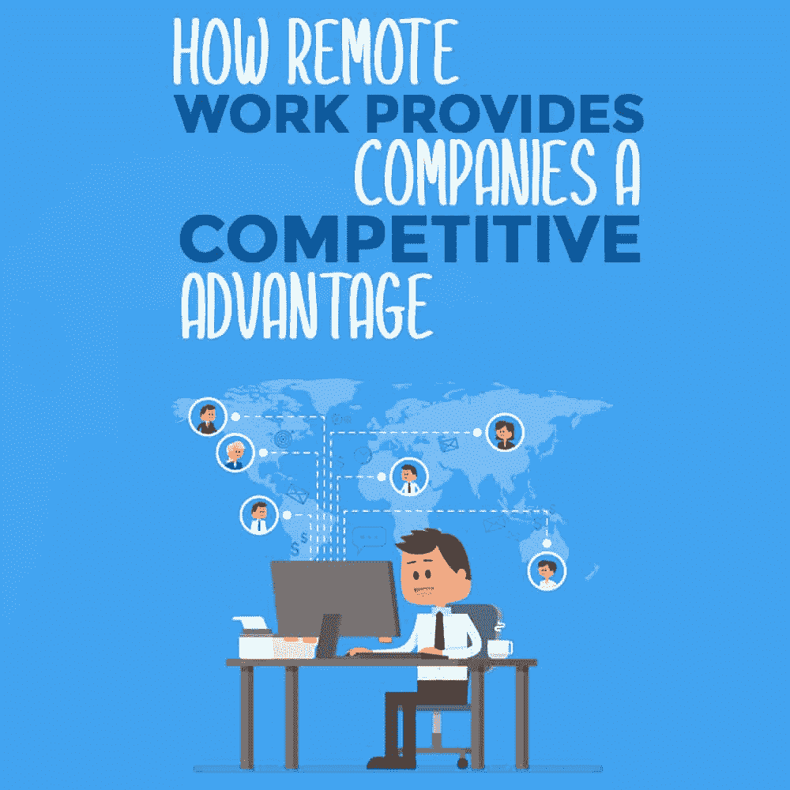

# 远程工作如何为公司提供竞争优势

> 原文:[https://simple programmer . com/remote-work-companies-advantage/](https://simpleprogrammer.com/remote-work-companies-advantage/)

*这是即将出版的书*“远程工作-完全指南”*中的一章，我们将首先在简单程序员上出版这本书。你可以用会员优惠价买到这本书，只要点击这里。*

虽然远程工作对于开发人员和其他 IT 专业人员来说是一笔极好的交易，但是你永远不要试图通过兜售它对你的好处来推销它。这是一个灾难的处方，而且几乎从来没有工作。

我曾经和一个家伙一起工作过，他试图说服管理层让他在家工作，因为这将减少他的儿童保育费用和通勤时间。他不仅没有说服管理层接受这个想法，还激怒了他们，以至于他们从来不允许他在家工作。

当我建议同一家公司应该允许我在家工作，这样我就可以在没有干扰的情况下更有效率，第二天我被允许这样做。

基于一个想法对你的帮助向他人推销它是非常困难的，但是当你谈论它将如何帮助他们时，就容易多了。

如果你想让管理层相信远程工作是一个好主意，你需要了解它在日常实践层面和战略层面上能为公司做什么。允许员工远程工作为公司提供了巨大的价值和灵活性。

换句话说，如果你能证明这对另一方有帮助，他们更有可能与你合作。远程优先(甚至仅远程)工作区的特征确实可以纠正工作场所中的许多问题。

这些问题大致分为三类。在本系列的第二部分中，我们将讨论这些问题，以及如何使用远程工作来缓解这些问题。根据这些问题的影响，尝试考虑您自己的公司是否可以从远程工作中受益。

当然，有些事情可能不适用于你目前的工作环境。您必须确定哪些是相关的，哪些是不相关的，这样当您试图说服管理层让您远程工作时，就可以向他们提出这些问题。

## 远程工作有助于解决三个问题

远程工作可以帮助解决的第一类问题是获得和留住更多熟练员工的问题。

如今，如果你问大多数公司的招聘经理，招聘新员工和留住现有员工变得越来越难。此外，由于某些类型的 IT 专业人员(尤其是软件开发人员和安全专业人员)相对稀缺，公司被迫为相同的人才支付更多的费用。

当你在市场上的唯一筹码是价格时，击败竞争对手的唯一方法就是竞价战。这很昂贵，而且这是一场向过度支付帮助的竞赛。

远程工作帮助解决的第二类问题是组织的灵活性和弹性。虽然拥有单一位置有助于我们之前亲切地概述的“协作”类型，但它也带来了一些负面影响。

首先，要求每个人都在办公室意味着当人们不能到达办公室时，工作就无法进行。交通、恶劣天气和个人问题可能意味着当人们不在办公室时，公司不能有效地应对问题。根据公司所处的位置，这对业务连续性来说意味着巨大的风险。

<figure class="alignright is-resized">

</figure>

最后，远程工作还可以显著降低成本。办公空间不便宜。公司不仅要租用他们使用的空间，而且他们的员工也必须住得足够近，以便每天通勤。

后者意味着员工还必须支付足够的薪水，以便住在昂贵的办公场所附近。这是一个经常被忽视的隐性成本。

现在让我们仔细看看这些问题。

正如我们之前看到的，其中一些可能与您的情况相关，而另一些则不相关。识别它们并将你的努力集中在相关的事情上会大大增加你与管理层达成一致的机会，并且以对公司有利的方式达成一致。

实际上，你需要找出哪些问题在讨论中给你最大的筹码，然后从那里开始。

## 招聘和保留

失去员工是非常昂贵的。虽然很难获得准确的数字，但更换一名软件开发人员或其他 IT 专业人员的成本很容易就达到五位数，这还不算寻找、面试和聘用新开发人员所需的金钱和时间。

当你考虑到周转的机会成本时，就更糟糕了。对于 It 专业人员来说，频繁地更换工作也是很常见的，所以任何降低这种更换频率的事情都会构成一个显著的商业优势。

根据 [2017 年远程工作状况报告](https://www.prnewswire.com/news-releases/companies-that-support-remote-work-experience-25-lower-employee-turnover-300530612.html)，允许远程工作的公司员工流动率降低了 25%。

远程工作不仅仅是完成工作的另一种方式，它还是一种有效的招聘和保留工具，使雇主能够在工资和福利之外进行竞争。

同一份报告指出，完全远程的公司(没有公司总部的公司)能够比其他公司快 33%地填补职位空缺。

此外，2017 年的报告显示，经理们认为他们的远程和现场员工表现相当。虽然“仅仅”同等的表现听起来并不特别令人信服，但请记住，现场员工经常坐在昂贵的房地产中，持续耗费公司的资金。

做*同样的*工作要花费*更多*的钱。

在许多情况下，远程员工代表着相同工作量下的显著成本节约。这种节约通常意味着你可以雇佣更多的人。

虽然关于留住员工的讨论通常围绕着员工自愿离职寻找更好的工作，但情况并非总是如此。有时，员工会因为自己或家人的健康问题而不得不离开。在这些情况下，远程工作的机会可能意味着他们可以保住目前的工作，而不是因环境所迫而辞职。

## 更大的招聘群体

<figure class="alignright is-resized">

</figure>

除了更容易招聘和留住员工之外，远程工作还大大增加了允许远程工作的公司以给定价格提供的劳动力资源。

例如，考虑许多大城市的典型软件公司。他们通常会在一个相当昂贵的地区设立办公室总部(这样员工在晚上离开办公室时就不会遭到抢劫)。

他们设法雇用的任何员工都必须住得足够近，以便能够通勤到办公室，而且他们的工资必须足够高，以支付得起这样的费用。虽然在几乎任何一个大城市都有很多人符合这些标准，但是能够支付类似薪水远程工作的人要多得多。

因为招聘和留住员工是经营企业的一个非常昂贵和耗时的部分，所以任何降低招聘成本或增加潜在员工数量的事情都是一个重要的商业优势。这在工资高、当地人口对技术不是特别了解，或者糟糕的通勤和交通堵塞导致出行困难的地区尤其有用。

## 组织弹性

这个星球上大多数有人居住的地方至少有一些极端天气、地质或社会事件会干扰工作。虽然人们可以预见其中的许多问题(例如飓风)，但许多其他问题往往很少或根本没有警告他们即将对您的业务造成干扰。

龙卷风、地震、森林火灾、暴雨和大雪，甚至社会动荡似乎经常会突然出现。如果它们发生在工作日，这些事件通常意味着人们无法到达办公室，不得不提前离开，甚至在途中受阻。

例如，我目前住在田纳西州的纳什维尔。虽然在我们的记忆中没有发生过任何大地震，也没有受到沿海飓风的影响，但我们对发生在更北部的那种冬季天气毫无准备。

当降雪量不到半英寸时，这里的学校就会停课，而 2 英寸的雪会使许多道路无法通行，因为人们没有在雪中驾驶的经验。

当你将这一点与我们的丘陵地形和“雪”真正成为“冰”的趋势结合起来时，一场小型冬季风暴就可以使城市的部分地区陷入瘫痪。然而，这样的事件通常不会糟糕到意味着电力不工作。能够在家工作的员工通常很少受到干扰。

此外，我们还会周期性地遇到洪水问题。在某些情况下，洪水泛滥相当严重( [2010 年是特别糟糕的一年](https://www.tennessean.com/story/news/local/2015/04/30/nashville-flood-20-things-to-know/26653901/)，市中心大部分地区被洪水淹没，许多地区停电数日)。在这种情况下，许多远程员工无法在家工作，但可以在亲戚家或咖啡店工作。

在某些情况下，比如我的一个客户，远程员工能够保持关键系统运行，直到洪水退去。远程工作有助于在组织中建立一定程度的冗余,因为它改变了人们与关键系统互动的方式。

在我的客户的案例中，远程工作人员是他们将许多东西(包括源代码控制)转移到云中的原因。这种向云的转移意味着当洪水进入服务器机房时，大多数关键基础设施都不存在了。

如果你的团队是分布式的，它将改变你的组织资源的管理方式。这些变化的一个意想不到的影响是，组织对当地条件下的灾难和其他问题更有弹性。

此外，如果您的团队分布在更广的地理区域，一些本地中断可能根本不会影响一些远程团队成员。

## 降低办公空间成本

<figure class="alignright is-resized">

</figure>

流行的隔间大小为经理 9 英尺乘 12 英尺，高级职员 8 英尺乘 10 英尺，普通职员 8 英尺乘 8 英尺，辅助人员 6 英尺乘 6 英尺。

分别是经理 108 平方英尺，高级职员 80 平方英尺，普通职员 64 平方英尺，后勤人员 36 平方英尺。虽然这凸显了一般人在空间上的差距，但也很容易计算出员工在现场的住宿成本。

例如，在我住的地方附近的一个科技密集区(纳什维尔附近的布伦特伍德)，商业办公空间的成本大约是每平方英尺 27 美元。考虑到这一点，我们可以计算出每种类型的工人的花费，仅仅是他们的座位和工作区域所需的空间。我们可以考虑以下数字，仅针对隔间空间:

● **经理隔间:**9 ' x 12 '或 108 平方英尺。按照当地的价格，一个月就是 2916 美元，就为了这个小隔间。

● **高级职员:**8’x 10’或者 80 平方英尺。按当地价格计算，每月 2160 美元。

● **普通员工:**8 英尺 x 8 英尺，也就是 64 平方英尺，或者每月 1728 美元。

● **支持人员:**对于他们得到的 36 平方英尺，每月 972 美元。

除了小隔间占地面积的价格相当惊人之外，工人们还需要一些其他东西来完成他们的工作。这些包括浴室、会议室、走廊、厨房和用餐区等公共区域和停车场。

根据你办公室的位置，只需要减少几个隔间就可以轻松支付另一个支持或开发人员的工资。如果你设法将你的足迹减少一半，这将对你公司的底线产生巨大的影响。

办公空间的成本很少被考虑到应有的程度。让员工留在现场工作不仅成本高昂，而且办公空间很少按月出租。

更确切地说，办公空间倾向于在合同基础上租赁更长的时间。如果你公司的市场形势发生急剧变化，这些长期租赁合同会带来很多令人头疼的问题。

想象一下，如果你愿意，一家公司的产品突然开始热销。该公司需要在不到一年的时间内将规模扩大一倍，而不仅仅是增加人员。

如果你幸运的话，你可以在附近租到额外的办公室。如果你运气不好，你可能会被迫搬到一个更贵的办公室，被迫解除租约，或者不得不将一家公司分在两个地方。通常，这是三者的某种结合。

反之亦然。我曾为一家拥有巨大豪华办公室的公司工作，这家公司突然面临剧烈的市场变化。他们不得不解雇了将近一半的员工，但是他们的租约又延长了几年。办公空间租赁是该公司继续失去市场份额的主要因素之一。

最终结果是以极低的价格清算资产，并解雇其余的工作人员。办公空间租赁的不灵活性对一家公司来说可能是一种生存威胁，通常人们意识到这一点时已经太晚了。

## 工资套利

除了办公空间的成本和招聘过程的好处，远程工作更容易以更低的成本招聘到开发人员。你办公室附近的开发商很可能愿意以更低的价格工作，仅仅是为了能够避免通勤。

如果你在一个有严重交通问题的大城市或者远离廉价住房，这一点尤其正确。员工成本的降低可能会抵消较低的薪水。

根据你所在的位置，你可能会发现许多员工的工资在其他城市甚至是你自己国家以外的地方要便宜得多。

举个例子，一般的高级 C#/ASP。纳什维尔的 NET 开发人员预计每年可以赚 10.4 万美元，而孟菲斯的一名类似的高级开发人员每年可能只能赚 9.6 万美元(数据来自 Indeed.com)。

虽然 8000 美元的价格差异可能看起来不算多，但结合办公室租金的成本节约和更大的招聘池，差异可能是巨大的。此外，这些数字是大城市的数字——一旦你进入小城镇，工资水平通常会低得多。

我见过与我同级的高级开发人员，在一个小得多的城镇做着非常相似的工作，却比我少挣 25%。即使薪水较低，他们的生活质量仍然比我在大城市的生活质量要好。

然而，当一家公司需要为远程员工提供住宿时，允许员工在家工作的住宿也可以让员工在几乎任何地方工作。这可以显著降低工资成本，特别是当你的流程足够灵活，允许在生活费用低得多的遥远国家工作时。

虽然很难在远距离和多个时区协调团队，但节省的成本通常是值得的，特别是如果远程员工为团队带来了您否则不会拥有的技能或知识。如果管理得当，远程工作环境可以让你建立一个团队，这在你目前的位置是不可能的。

<figure class="alignright is-resized">

</figure>

允许远程工作也允许生活困难的人仍然可以被你的公司雇佣。无论一个人正面临严重的残疾，限制了他们的驾驶能力，有一个生病的孩子，或者处于其他生活状况，使他们无法从事大多数工作，远程工作对许多人来说都是一种真正的祝福。

虽然你可能不应该仅仅因为某人的生活状况而付给他低工资，但你可能会发现，即使你付给他们有竞争力的工资，你的钱也会得到更好的结果。当你给某人一个别人没有的机会时，它通常会产生一种你必须经历才能相信的忠诚。

我见过那些生活环境阻碍了大部分工作的人完成了绝对非凡的工作。如果你想找到一个好方法来雇佣非常忠诚的员工，只需要看看那些处境艰难的人就行了。雇佣一个对你来说“只是另一个雇主”的人，与雇佣一个在没有人给他们机会的时候给他们机会的人，是有很大区别的。

在社会层面上，远程工作为许多人摆脱贫困和苦难提供了机会。这可能包括地球另一端的人，也可能包括街上的人。虽然许多公司吹嘘他们有能力让世界变得更美好，但让你的员工在家工作是实现这一目标的一种方式。

## 远程工作到底是什么

在一天结束的时候，我们中没有人真的那么在乎我们得到多少报酬。我们关心的是工资能为我们做什么，以及我们能用这些钱为自己创造什么样的生活。如果一百万美元只能买一块糖，几乎没有人会去买彩票。我们薪水的数字并不重要，重要的是这个数字允许我们创造的选择。

每个人对自己生活的完美版本的愿景是不同的，但几乎每个愿景都需要时间、注意力和金钱来完成。当一家公司为某人创造了一个创造更美好生活的机会时，员工会注意到。

作为一家远程公司，你不仅仅是“又一份网络开发工作的技术公司”，而是为你的员工提供更好、更灵活的生活。在潜在员工看来，这将使你的公司从另一个工作选择变成一个不可思议的机会，给他们一天的时间。

此外，一旦他们成为雇员，这种福利会让他们更快乐、更健康，并为他们的工作感到自豪——除非你真的搞砸了。虽然你无法真正量化员工(及其家人)的善意，但它对团队士气有着不可思议的影响。

远程工作改变了员工和潜在员工评估公司的方式。虽然在一个“酷”的行业工作并拥有顶级的工资水平很好，但大多数公司都在“无聊”的行业，工资水平接近平均水平。

如果你不想让你的开发团队不断地在价格上竞争，远程工作是一个胜过竞争对手的好方法。随着这种做法越来越被接受和普遍，你的竞争对手也会这么做。让你的竞争对手对你做出反应比你被迫对他们做出反应要好得多。

## 远程工作…也适用于公司

允许您的员工远程工作有许多正当的商业理由。除了在招聘和保留员工方面的巨大优势之外，远程工作还能让组织更有弹性。

远程工作还可以降低办公空间成本，减少公司在工资上的支出，更容易与其他公司竞争，而不是简单地砸钱解决问题。远程工作将就业从“仅仅是一份工作”转变为为员工创造更美好生活的一种方式。

虽然允许员工远程工作并不是所有公司的最佳选择，但如果它适合您的公司，它可能会成为一个巨大的游戏规则改变者。允许它的好处可能比最初看起来更有价值。

