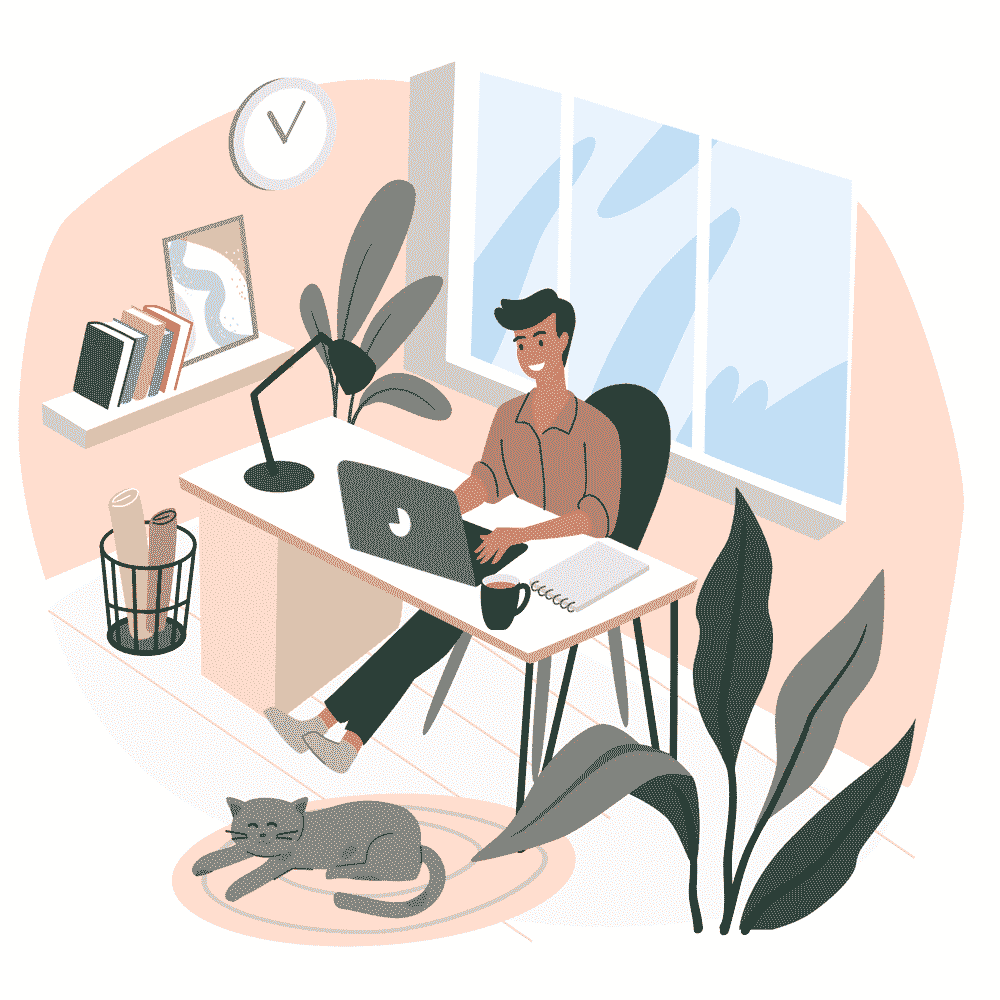

# 保持健康、高效和联系的远程工作习惯

> 原文:[https://simple programmer . com/remote-work-habits-healthy-productive/](https://simpleprogrammer.com/remote-work-habits-healthy-productive/)

Remote work habits that allow you to stay connected, sane, and productive are essential for anyone looking to maintain a good quality of life while working remotely. For programmers, it’s particularly vital because we’re often introverts who don’t always thrive in an open office environment. Showing you can be productive from a remote office encourages employers to keep this working model.

此外，即使你与此相反，喜欢在人们周围工作，但现在发现自己远程工作，实践正确的习惯可以帮助你保持联系，富有成效，并感觉自己是团队的一部分。

如果做得好，远程编程工作不一定是孤立的。这里有一些习惯来启发和激励你从职业和个人两方面寻找改善生活的方法。

## 预先计划好你第二天的待办事项

作为一名程序员，你可以通过在前一天晚上创建一个待办事项列表来提前计划你的一天。这将有助于确保你在整个工作日都是高效的，因为这迫使你考虑哪些事情需要优先处理。提前计划可以带来更大的灵活性，因为如果事情出乎意料地发生，你可以根据需要改变你的优先级。利用[的免费工具和服务](https://simpleprogrammer.com/16-free-tools-for-developers/)让你的生活变得更轻松…

确保计划好一天，但不要太具体，否则会产生不必要的压力，让你不知所措。换句话说，不要安排你一天中的每一分钟。相反，制定一个宽松的日程，这样，如果在工作过程中发生了一些事情，你的日程安排就有了回旋的余地。包括你一天中最重要的三项任务，然后加入一些你也能完成的杂事。

## 根据优先级对任务进行排序

对于在家工作的程序员和其他远程工作者来说，最大的问题之一是很难确定哪些任务是优先的。高优先级的任务很容易迷失在低优先级项目的海洋中。要解决此问题，您可以采取以下措施:

*   将任务分为三类(高、中、低优先级)
*   使用时间追踪工具[追踪你的时间](https://simpleprogrammer.com/why-programmers-should-track-their-time/)并监控你在每项任务上完成了多少工作。这将让你看到你最有效率的时间在哪里，这样你就可以花更多的时间在更重要的事情上。你还会注意到你用更少的时间完成了更多的工作。
*   跟踪社交媒体和娱乐网站消耗了你多少时间，努力减少每天/每周/每月花在这些网站上的时间(取决于什么对你有效)。

记住，整理任务将帮助你避免在被大量任务压垮时出现的最后一刻的压力和恐慌。你不希望自己面对编程焦虑或抑郁。想办法计划好你的工作日程，这样你就能按时完成任务。

## 放松你的思想，确保你有足够的休息

花太多时间在屏幕前工作很容易导致倦怠、抑郁和对工作的总体不满。获得睡眠是你能为自己做的最好的事情。当你对自己的工作充满热情时，这可能会很难，但每周抽出一些时间休息、提神和锻炼将有益于你的心理健康和生产力水平。

无论你选择什么样的放松方式，最重要的是确保它能帮助你保持专注和专注。你的幸福是最重要的，所以请不要忘记这一点。

## 建立舒适的远程工作环境

确保您的远程工作环境尽可能舒适。远程工作并不意味着你应该在床上或者拥挤的咖啡馆里工作。你想要创造一个没有干扰的环境，并且给你适当的隐私空间。虽然你不能总是这样做，但尽量遵循这些建议。

*   在没有人打扰你的时候，设定专门的工作时间
*   找出哪种办公桌最适合你——是立式办公桌还是坐姿办公桌
*   如果你长时间坐着，买一把符合人体工程学的椅子
*   找出最适合你工作的照明——自然的还是人工的？
*   包括任何让你感觉你在工作区的东西——可以是一些很酷的音乐、舒缓的乐器或者你最喜欢的电影配乐
*   身边放一瓶水；或者咖啡，如果它对你有帮助的话，但是不要着急
*   准备好你需要的办公桌必需品——笔和笔记本等。
*   买一棵自动浇水的植物，让它陪你在办公桌上
*   花时间区分工作和不工作。在家工作时，界限可能会变得模糊。当你结束一天的工作后，散散步，给朋友打个电话，或者甚至用你最喜欢的香草来放松。

## 参加健康活动来刺激你的身心

冥想和练习瑜伽是迄今为止最有效的减压、改善情绪、提高注意力和思维敏捷度的活动，更不用说提高灵活性了。在家工作有时会让人感到孤立，所以这是一个很好的方法，让你不用离开你的房子或家庭办公室就可以通过正念练习与你的内在自我联系起来。

每天花一些时间冥想或者做几个瑜伽姿势。不要担心你看起来怎么样。只要专注于你的呼吸，让自己活在当下。这将导致更多的清晰度，创造力和生产力。

就像任何运动一样，你必须从慢开始，逐渐增加到更长的时间。不要忘记健康饮食。以健康的早餐开始您的一天。为了让你的大脑以最佳状态运转，你需要在一天中给它正确的营养。你不应该不吃饭，尤其是当你在家工作的时候。

## 寻找保持联系的简单方法

When working remotely, it’s easy to lose touch with your team. Develop a routine to stay connected, even if it is just a 15-minute conference call every day or an hour of pair programming on Fridays. Staying in the loop will also help you build rapport and relationships within your company—something that can be difficult for remote workers who are not physically present at their desks.

定期与家人和朋友通话也很重要。如果你很难保持联系，尝试视频聊天或屏幕共享，这样更容易沟通。使用社交媒体作为一种方式来跟踪每个人都在做什么，即使这可能会分散注意力。你不想错过你周围的人生活中发生的事情。请记住，通过改变你的远程工作习惯，你可以[实现长期的积极增长](https://www.miamihypnosisandtherapy.com/2020/01/09/how-to-change-your-habits-for-long-term-positive-growth/)。

## 关键是保持职业和个人生活的平衡

总之，远程工作有很多好处。对许多人来说，它确实让生活变得更健康、更有效率，而且比呆在办公室里要轻松得多。不幸的是，坏习惯会悄悄靠近你，对你的健康、生产力和与周围世界的联系产生负面影响。关键是保持两个世界之间的平衡。

你希望保持职业生活，在不牺牲个人时间的情况下完成工作，允许在生活的其他领域有创造力、灵感和动力。这可能是和孩子在一起或者做运动的家庭时光。往前走，给自己一些时间去做你喜欢做的事情，因为这最终会有助于你的工作和生产力。