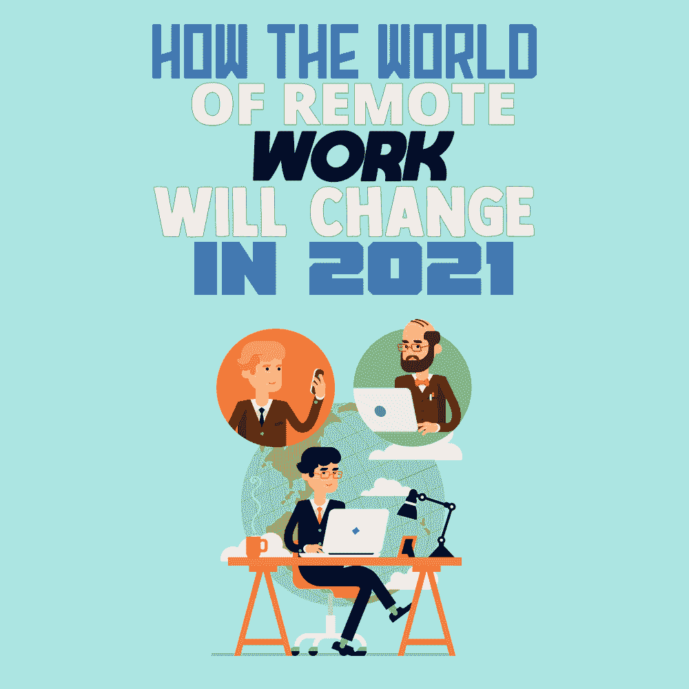

# 远程工作的世界将在 2021 年发生怎样的变化

> 原文：<https://simpleprogrammer.com/remote-work-model-2021/>

A quick look at history will show us how radical changes were often preceded by challenges. Throughout time, we can see that reforms in conventional systems were mostly tied to the occurrence of momentous events.

在远程工作的情况下，催化剂是**新冠肺炎**。虽然在家工作在组织中不是一个陌生的概念，但这是一种通常不被采用的模式。有些人把它作为额外津贴，而有些人把它作为最后的手段。但是没有人会想到有一天它会成为一种正常的工作模式。

2020 年 4 月，摩根士丹利的首席执行官詹姆斯·戈尔曼说:“*如果你在三个月前说我们 90%的员工将在家工作，公司将运转良好，我会说这是一个我不准备接受的考验，因为在这方面犯错的负面影响是巨大的。*

尽管面临诸多挑战，但世界各地的组织都很好地应对了远程工作。随着疫情的危险开始消退，我们可以期待工作文化发生什么变化？

## 远程工作将持续存在

Gartner 进行的一项研究发现，82%的组织计划在 COVID 后部分在家工作，47%的组织计划永久在家工作。

因此，可以肯定的是，远程工作不会很快消失。

大公司已经介入了这场游戏。虽然 Twitter 告诉员工他们可以无限期地在家工作，但脸书也对他们适应远程工作直言不讳。

脸书的首席执行官马克·扎克伯格说:“*我认为在我们的规模上，我们肯定会成为最具前瞻性的远程工作公司，但我们会以一种有分寸的、深思熟虑的和负责任的方式来做这件事，并随着时间的推移分阶段进行*”

但重要的是要看到远程工作的能力在很大程度上取决于工作的环境。需要与人、设备或机器频繁互动的工作，如实验室活动、农业、制造和销售，不能远程工作。相比之下，与 IT 相关的工作，如编码或测试，可以继续远程工作，而不会失去效率。

虽然远程工作将继续存在，但它不会完全取代传统的办公室设置。我们将看到一个结合了远程和现场模型的模型，即混合工作空间模型。

## 走向混合动力

新冠肺炎带来的前所未有的环境让大多数人经历了一次自我反省的旅程。在工作场所的场景中，员工和雇主都在反思他们多年来一直严格遵循的传统办公室文化。他们发现还有其他同样有效的工作方法可以采用。

一些员工发现远程工作非常方便，因为它具有灵活性、位置独立性和自由度。一些组织认为，不需要办公空间和减少相关费用非常有益。

总之，它导致的结论是，不会有 100%的转移回办公室。员工将会把他们的时间分配在家里和办公室。混合工作模式是建立在这个基础上的战略。

在这种模式下，员工可能只需要每周去办公室几天。这些可能是面对面的会议、团队建设活动或需要面对面互动的合作。对于执行个人工作，远程工作日将是首选。

向这种混合工作环境的过渡需要更多的管理。在混合工作模式下，建立个人关系和发展办公室文化将面临挑战。缺乏持续的共享空间来鼓励交流会被感觉到；然而，通过适当的规划，使用物联网等数字转换技术；5G，；和卓越的领导技能，它可以变得高效和成功。

## 重新定义工作空间

就物理办公空间而言，混合工作模式意味着什么？远程工作的增加意味着对大型办公空间的需求减少。企业已经在缩减办公空间，以减少与房地产相关的支出。

强调混合工作模式的工作空间趋势正在受到关注，这就是**中心辐射型**办公室。这种模式有一个*中心，*一个为定期会议和讨论而设计的中央办公空间，以及几个位于不同位置的被称为*辐条*的小型办公空间，以执行组织的管理职能。

这种模式深受雇员和雇主的欢迎，因为它对双方都有好处。对于雇主来说，运营成本的降低很大程度上是因为小型办公室可以远离主流位置。对于员工来说，这种分布式办公模式意味着在他们居住的地方附近有一个工作场所，这减少了他们的旅行和相关费用。

由于枢纽将是员工偶尔聚会的地方，他们的设计将更加注重创造一个协作空间，而不是采用典型的隔间设置。由于大部分个人工作将由员工在家完成，这种开放空间将是枢纽的理想选择。

而家里的工作空间呢？既然在家工作似乎是一个长期的前景，如果你还没有在家里建立一个专用的工作空间，那最好是这样。有助于改善你的家庭工作空间的一些建议是:

*   选择一个远离电视、儿童游戏区等干扰的地方。
*   把你的工作空间和放松空间分开。避免在床上或沙发上工作。
*   确保你的工作场所有适当的照明，以减少眼睛疲劳。
*   摆放合适的桌椅，帮助你在工作时保持姿势，为身体提供良好的支撑。
*   确保您的工作场所附近有电源插座，并且有良好的互联网连接。
*   用植物、工艺品、图钉板或任何你喜欢的东西来个性化你的工作空间。

如果你觉得在家里维护工作空间有困难，有几本书和网上资源可以帮助你。 [*《在家工作:在家工作时如何高效、精力充沛、&专注*](https://www.amazon.com/dp/B08SVRR7PM/makithecompsi-20) 这本书将帮助你在保持心理健康的同时成功有效地在家工作。

## 细化工作管理

Whatever we say or do, work from home cannot equal an office environment. Reduced social interaction can take a toll on employees’ mental health. Therefore, in the remote work setup, it is essential to create more opportunities for **collaboration** and engagement.

多个行业的组织都在利用[物联网](https://mindster.com/iot-app-development/)与员工保持联系。这确实有助于提高生产率和工作质量。但重要的是要明白，这不仅是关于使用最好的技术，而且是关于提供同理心的领导。

组织的人力资源部门必须做出更大的努力来维持一个员工的福利被放在第一位的环境。他们还必须完善几个管理流程，如员工招聘和绩效评估。

远程雇佣是一种越来越流行的趋势。

组织已经迅速采用虚拟招聘。通过语音和视频电话面试候选人，评估候选人的社交媒体平台以评估他们的才华等。将成为招聘的正常程序。

远程工作也影响了员工的**绩效评估**。将来，我们将会看到定期进行绩效评估，而不是一年一次或两年一次。这种持续的反馈将有助于管理者引导员工朝着正确的方向前进，而对于员工来说，这将有助于他们更好地管理自己的工作职责。

组织也将更加关注工作的数量和质量，而不是花费在工作上的时间。重点将放在绩效上，而不是保持严格的工作时间表。

组织将不得不重新定义他们的绩效指标，并重新思考他们如何设定和实现目标。他们应该熟悉[远程工作资源](https://simpleprogrammer.com/remote-work-resources/)以使每个人的远程之旅成功。完善工作管理流程对于适应远程工作趋势至关重要。

## 远程工作有效吗？

根据在不同组织中进行的几项研究，远程工作并没有对工作效率产生负面影响。员工的生产力保持不变，在某些情况下，在转移到远程工作后，甚至*增加了*。

到目前为止，远程工作肯定是有效的。这很有挑战性，但是通过正确的学习和计划，你可以[培养远程工作的好习惯](https://simpleprogrammer.com/remote-working-habits/)来帮助你保持高效和多产。

远程工作的未来将要求在工作空间的前景、文化、管理和操作方面进行一些改变。它要求重新思考、重新设计和重新评估长期建立的流程。

但俗话说，变化是唯一不变的。