# 学习自动化测试的最佳在线资源

> 原文：<https://simpleprogrammer.com/resources-to-learn-automation-testing/>

我花了很多年做软件测试自动化。那些年里，我列出了一个帮助我提高技能的我最喜欢的资源清单。下面是列表。大多数学习测试自动化的资源都集中在 Selenium WebDriver 上，因为它是当今最相关的技术。然而，一些通用资源也可以用来提高您的测试自动化技能。

这里有很多资源，所以我提供了一个目录来帮助您导航到您想要的位置。

1.  [在线视频教程](#a-1)
2.  测试自动化框架
3.  [实践测试自动化的网站](#a-3)
4.  [电子学习平台](#a-4)
5.  [书籍](#a-5)
6.  [博客](#a-6)
7.  [网络研讨会/视频](#a-7)
8.  [幻灯片/演示文稿](#a-8)
9.  [拆掉](#a-9)

## 在线视频教程

* * *

#### selenium 2 web driver Java 基础知识

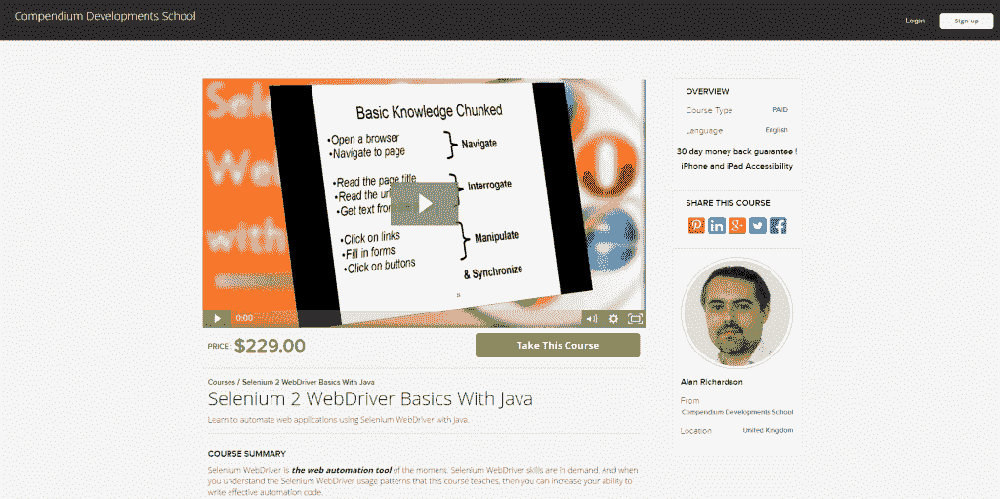

理理察逊

Selenium WebDriver | Java | $229

有大量的 Selenium WebDriver 课程。大部分都是彻头彻尾的垃圾，但是艾伦的课程就是牛逼。他将向您介绍 Selenium Webdriver 的许多不同方面，例如:

*   如何处理 iFrames
*   如何编写测试
*   如何执行用户交互
*   如何调用 JavaScript
*   如何使用标签
*   等等，从基础到高级

我还是会时不时的回去看看，看看还有什么可以学习的。

#### 使用 C#完成 Selenium web driver–构建框架

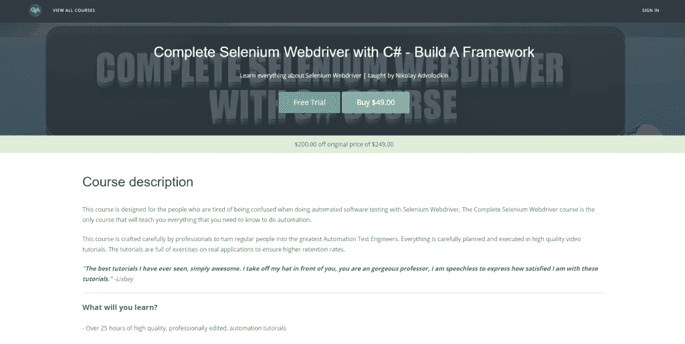

尼古拉·阿德沃洛德金(我)

selenium web driver | c# | Visual Studio | MS Test | $ 49

是的，这是对我的课程的一个无耻的宣传，但老实说，这是一门很棒的课程。它有一个 4.4 / 5 的评级和两千多名学生。您将学习的一些主题包括:

*   如何从头开始编写您的第一个自动化框架
*   自动化测试最佳实践让你在工作中表现出色
*   页面对象模型，创建自动化测试框架的最有效方法
*   完成 C#初学者课程，让你高效地编写框架
*   Visual Studio 和 MSTest 框架
*   如何在敏捷生命周期中作为自动化测试员工作

此外，还有一个免费的试用版，你可以从中发现你将真正学到的一切。

#### 惠普 QTP /惠普 UFT 教程

QTP 教程

惠普 QTP |惠普 UFT | VBscript |免费和付费

如果你真的想提高你的 QTP(又名 UFT)技能，那么这个网站有所有最好的视频。

您可以从 600 多个视频中了解到的一些主题包括:

*   基础
*   如何识别物体
*   API 测试
*   如何创建关键字驱动的框架
*   如何用数据驱动你的测试
*   如何在没有消息框的情况下调试代码

## 测试自动化框架

* * *

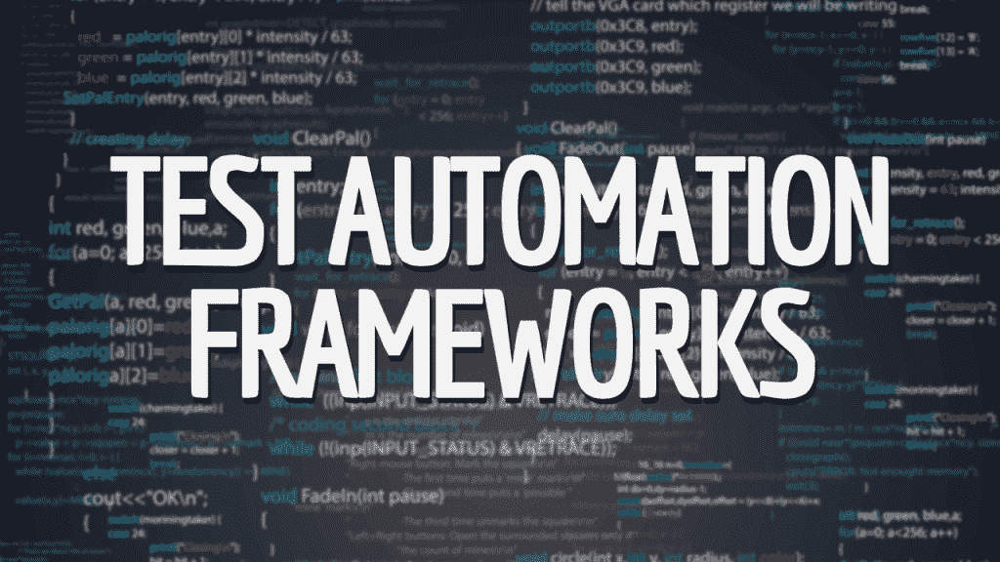

你知道世界上有大量不可思议的代码已经被开发出来了吗？您并不是第一个尝试并构建企业级测试自动化框架的人。人们已经这样做了几十年了。这将是我在多年开发中发现的所有自动化框架的列表。大部分是 Selenium WebDriver，因为这是我目前正在使用的。看看所有的东西，为你的努力收集一些想法。

#### Selenium WebDriver 框架–终极质量保证

Selenium WebDriver | C# |页面对象模型

这是我通过完整的 Selenium Webdriver 课程教授的开源框架。它是轻量级的，易于使用，并且基于页面对象模型，易于维护。[分叉或下载](https://github.com/nadvolod/LightPomFrameworkTutorial)为你未来的框架获得一些新的想法。

#### 自动化地球框架——安东·安杰洛夫

selenium web driver | Test Studio | c#

Anton 有大量有用的代码，您可以查看。他将不同的设计模式应用到他的代码中，向您展示它的外观。例如，您可以看到如何使用策略设计模式、外观设计模式、页面对象模型和高级页面对象模型。您可以在其中循环，并决定您想要重用的内容。

#### SpecFlow BDD 自动化

Selenium WebDriver | BDD | C# |验收测试

SpecFlow 是为数不多的 C# BDD 框架之一，这自然使它成为非常理想的候选框架。这个框架帮助您使用业务可读的规范来构建验收测试。因此，这些测试对于开发人员、测试人员和业务人员来说是可读的。理论上，这些测试可以代替需求，因为它们是活的文档。

#### 假人自动化测试框架

Selenium WebDriver | GUI 测试| RESTful 测试| SauceLabs

这个框架是我在业界见过的功能最丰富的框架之一。它帮助您构建 GUI 测试、RESTful 测试、针对 Windows 应用程序的测试，并在本地或云中运行所有这些。我花了很多时间看这段代码，学到了很多东西。

创建者有一些非常好的策略来做非常可读的测试。此外，他创建了很棒的日志、截图和视频记录来帮助调试失败的测试。遗憾的是，我无法让它持续运行，但这是一个很好的起点。

#### gauge–ThoughtWorks 测试自动化

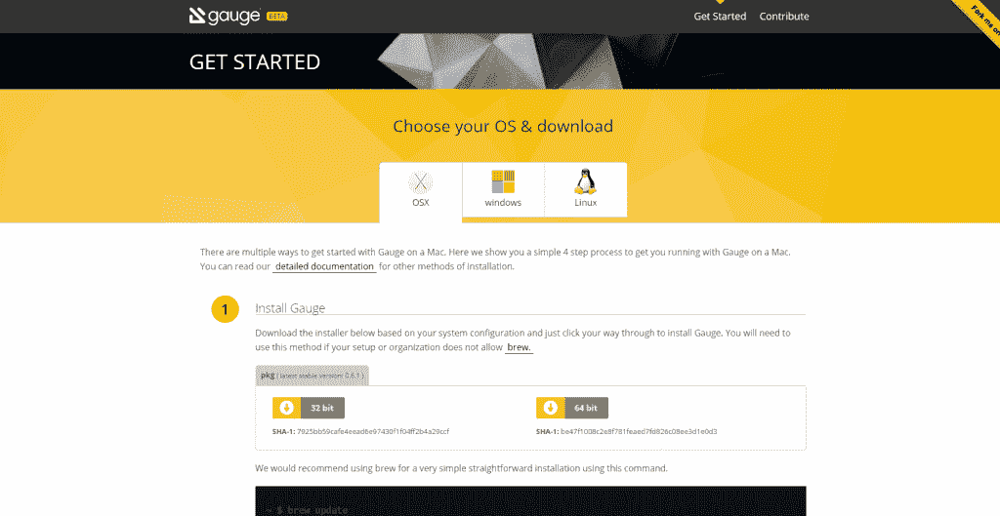

Gauge 是一个测试自动化框架，由创建 Selenium WebDriver 的人设计。虽然我自己没有探索过它，但它看起来确实很有趣，因为它是由 Selenium 的人创建的。他们似乎确实创造了改变世界的资源。这是我将来要看的资源，你也应该看。

#### 红杉总部

测试自动化|关键字驱动| C# | Java | Python

这是一个开放源代码的关键字驱动框架，允许用户构建关键字驱动的操作，以便通过简单的用户界面创建他们的测试。它们具有与源代码控制、持续集成以及许多其他功能的集成能力。我不太喜欢关键字驱动的框架，但是如果它们合你的胃口，那么你应该看看 RedwoodHQ。这里有一些很棒的链接可以帮助你开始:

*   [快速入门指南](http://www.manula.com/manuals/primatest/redwoodhq/2.0/en/topic/quick-start-guide)
*   [文档](http://www.manula.com/manuals/primatest/redwoodhq/2.0/en/topic/documentation)
*   [发行说明](http://www.manula.com/manuals/primatest/redwoodhq/2.0/en/topic/release-notes)

#### 宁静

自动化框架| BDD | Java

Serenity 是一个 BDD 框架，可以与 Java 和 Selenium WebDriver 一起工作。Serenity 还提供以下功能:

*   提供 web 驱动程序管理
*   截图
*   并行运行测试
*   促进吉拉一体化

我没有亲自使用过它，但是我知道有些人使用它，他们都说宁静是很棒的东西。它没有与我的 Visual Studio 集成，这让我有点嫉妒。

#### 机器人框架

自动化框架| ATDD | Python | Jython | Iron Python

Robot framework 是用于验收测试和验收测试驱动开发(ATDD)的通用测试自动化框架。该框架利用关键字驱动的方法进行测试。此外，它的测试功能可以使用 Java 或 Python 进行扩展。

#### BDD Selenium 框架–Alister Scott

selenium web driver | BDD | spec flow | c#

如果您正在寻找使用 Selenium WebDriver 和 C#构建行为驱动的开发测试，那么 Alister 有您想要看到的代码。他利用 SpecFlow 框架来运行他的测试。我总是建议您查看所有代码，以便从其他人那里获取知识。

## 实践测试自动化的网站

* * *

#### QTP 教程的测试自动化实践页面

练习不同识别技术的自由场所，例如:

*   使用 html id 与元素交互
*   利用 html 类与你的元素交互
*   填写不同的表格
*   练习注册电子邮件列表
*   自动化登录场景

#### 糟糕的情人节

另一个免费网站是我从一本名为 [Selenium Design Patterns](https://www.amazon.com/gp/product/1783982705/ref=as_li_tl?ie=UTF8&tag=qtptunet-20&camp=1789&creative=9325&linkCode=as2&creativeASIN=1783982705&linkId=603c0073d17dc2daf2020872b8d93988) 的书中得到的。这个网站是一个网上商店的模拟器，在那里你可以购买不同种类的商品。您可以尝试自动化以下项目:

*   慢速 AJAX
*   慢速动画
*   第三方链接
*   信用卡交易
*   在线商店结账场景

#### 戴夫·海夫纳的实践网站

Dave 设计了一个极好的地方来实践不同种类的测试自动化场景。您可以尝试自动化的一些场景包括:

*   A/B 测试
*   基本认证
*   文件上传
*   挑战 DOM
*   iFrames
*   慢速连接
*   动态内容
*   盘旋
*   重定向链接

#### 假冒的在线投资网站

这是一个在线投资网站，您可以在这里练习不同的自动化技术，如用户创建和货币交易验证。我是从《软件测试设计从业者指南》一书中得到这个网站的。请使用授权码 1111111，您将能够注册该网站并登录以练习您的自动化软件测试。

## 电子学习平台

* * *

这些网站包含许多非常有用的课程。有些是付费的，有些是免费的。看一看，搜索你想要的主题。

#### Udacity

软件测试|编程| Git |免费和付费

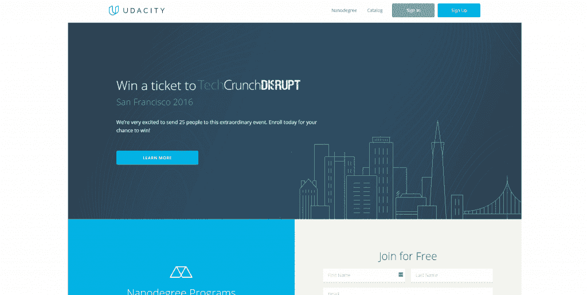

这是一个很棒的网站，有非常高质量的视频。视频是录制的，因此您可以在视频过程中根据页面上绘制的内容进行交互式测验。教师可能会要求您找出问题的正确解决方案，写下四个答案选项，然后您可以与用户界面交互来选择正确的选项。我最喜欢的两个免费课程是[软件测试](https://www.udacity.com/course/software-testing--cs258)和[如何使用 Git 和 Github](https://www.udacity.com/course/how-to-use-git-and-github--ud775) 。

#### Coursera

在线大学|免费和付费

他们的座右铭是“参加顶尖大学的免费在线课程”。所以，你可以在网上上真正的大学课程。大多数是完全免费的。唯一的问题是你实际上必须参与课程，因为他们有很难的开始日期、作业和测验。您可以参加的一些课程包括:

*   [软件安全性](https://www.coursera.org/learn/software-security)
*   [敏捷测试](https://www.coursera.org/learn/agile-development)
*   [掌握软件工程面试](https://www.coursera.org/learn/cs-tech-interview)
*   [评审&软件改进指标](https://www.coursera.org/learn/reviews-and-metrics-for-software-improvements)

#### 多元视觉

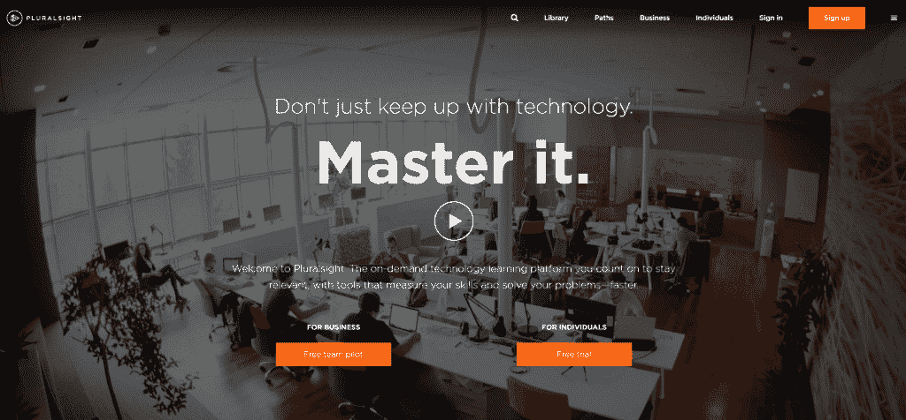

这是一个顶尖的网站，有一些最好的专业人士教授很棒的主题。这些专业人士包括约翰·桑梅兹、亚伦·弗罗斯特和斯科特·艾伦。你可以通过观看视频教程来学习不同的编程语言，如 Java、C#和 Python。您还可以学习自动化工具，如 Selenium WebDriver、编码 UI、NUnit、Visual Studio Test 等等。所有的视频教程都附有代码和注释，你可以用它们来提高你的记忆率。我最喜欢的课程包括:

*   [使用 Selenium 和 SpecFlow 进行自动化业务可读 Web 测试](https://simpleprogrammer.com/selenium-specflow-automated-business-readable-web-tests)
*   [使用 Selenium 进行自动化 Web 测试](https://simpleprogrammer.com/selenium)
*   [惠普统一功能测试 API 测试快速指南](https://simpleprogrammer.com/api-testing-hp-unified-functional-testing)
*   [用 Selenium 创建自动化测试框架](https://simpleprogrammer.com/automated-testing-framework-selenium)

## 书

* * *

如果你想掌握[自动化测试](https://simpleprogrammer.com/ultimate-automation-testing-guide/)，你必须阅读，因为书中有丰富的信息。我读过很多这样的文章，每一篇都为我的自动化武器库增加了一件额外的武器。

#### 硒设计模式由马頔科瓦连科

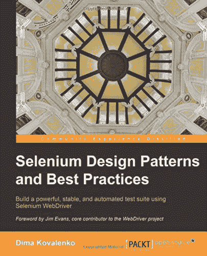

马頔的《Selenium Design Patterns》是一本很好的书，无论你使用什么工具，它都会教你一些非常有价值的自动化设计模式。您将了解到:

*   密封设计模式
*   页面对象模式
*   意大利面反模式
*   还有更多

#### 快速测试专业不插电由塔伦拉尔瓦尼

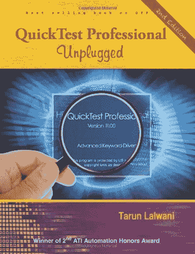

这是一本关于 QTP 的书，也被称为 UFT。这本书非常适合任何水平的自动化工程师。此外，由于 UFT 仍然使用 VBscript，这本书在今天的行业中仍然是相关的。涵盖的几个主题包括:

*   数据表
*   行动
*   QTP 环境变量
*   实用程序对象
*   检查站
*   描述性编程
*   在 QTP 调试
*   正则表达式
*   文档对象模型

当我和 UFT 一起做自动化测试时，我总是会回头参考这本书，看看是否有对我有帮助的金块信息。

#### QTP 描述性节目不插电

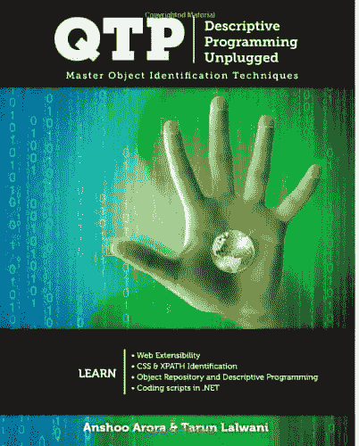

这本书为 QTP/UFT 公司提供了如此多惊人的代码和见解。通过阅读这本书你将节省的时间将使你成为公司的一名宝贵的员工。从经验上讲，我相信在 QTP/UFT 自动化公司工作的人中，超过 75%的人对本书中的概念了解不到 5%。比其余的更有价值！

以下是您将要学习的一些主题:

*   描述性编程
*   视觉关系标识符
*   子对象
*   文档对象模型
*   Web 表格
*   本地化技术和设计模式
*   使用 XPath 的对象识别
*   使用 QTP XML 或
*   测试 Web 服务

#### Dorothy Graham 和 Mark Fewster 的测试自动化经验

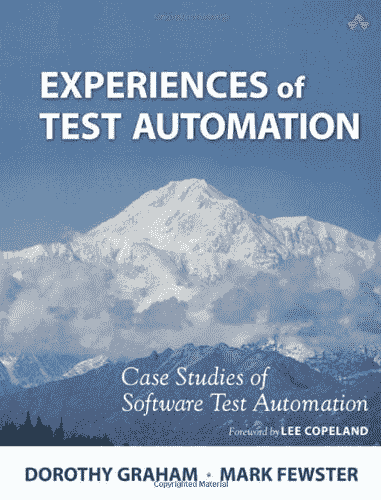

这是测试自动化的一个极好的资源。Dorothy 和 Mark 有丰富的经验，可以帮助你在处理测试自动化时克服许多障碍。您将学到一些有价值的技术，包括如何确定自动化的优先级、自动化什么、如何自动化、管理问题和技术问题。您还可以学习数据库自动化、生产中的回归测试以及复杂政府系统的自动化测试。有趣的是，即使在今天，我仍然看到人们犯很多错误，这些错误可以通过阅读这个资源来克服。

#### Lisa Crispin 和 Janet Gregory 的敏捷测试

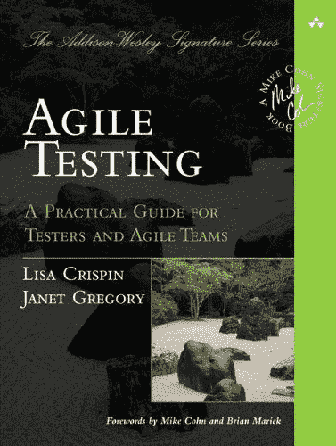

我最初拿起这本书是为了成为一个更好的测试者。虽然我还在读这本书，但我已经了解了一些有价值的信息。您将学习的一些内容包括:

*   如何克服测试自动化的障碍
*   如何让测试人员参与敏捷开发
*   测试人员和 QA 经理适合敏捷团队的地方
*   雇佣敏捷测试人员时要注意什么
*   如何从传统周期过渡到敏捷开发
*   如何在短迭代中完成测试活动
*   如何使用测试成功地指导开发

#### 重构:改进现有代码的设计

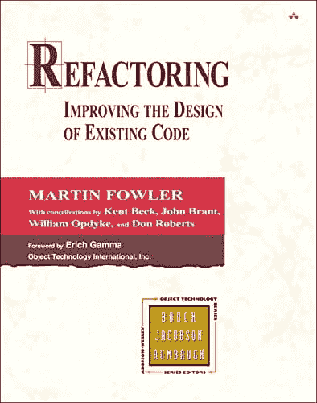

我不在乎别人说什么。一个好的测试自动化工程师是一个好的程序员。现在，我们可能永远不会为谷歌开发谷歌 Chrome，但我们应该有能力理解好代码并编写好代码。我们应该有能力设计一个可维护的、健壮的、灵活的测试自动化框架。当我们面对一个不好的问题时，我们应该有能力重构它。

#### 干净的代码:敏捷软件工艺手册

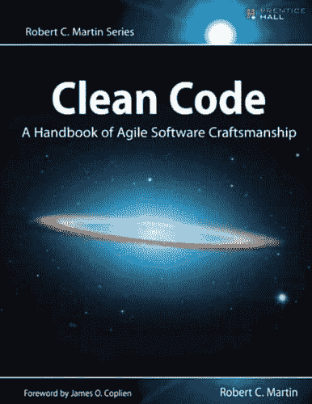

我刚刚开始阅读 Bob 叔叔的这本书，我真的很兴奋能够浏览它并提高我的编码能力。这本书承诺，只要你尽职尽责并实践他所宣扬的一切，你的代码就会变得非常棒。此外，鲍勃叔叔讲最好的故事。涵盖的一些主题包括:

*   如何写出有意义的名字
*   如何写出好的函数
*   如何处理评论
*   如何处理对象和数据结构
*   如何进行适当的错误处理
*   如何编写单元测试

#### xUnit 测试模式:重构测试代码

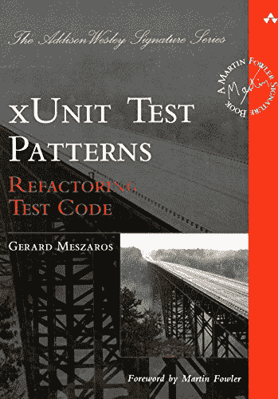

虽然我没有读过这本书，但它肯定在我的清单上，因为它被多个权威机构列为“必读”书籍之一。这是封面上的一小段:

“自动化测试是敏捷开发的基石。有效的测试策略将更积极地交付新功能，加速用户反馈，并提高质量。然而，对于许多开发人员来说，创建有效的自动化测试是一个独特而陌生的挑战。“xUnit Test Patterns”是使用 xUnit 编写自动化测试的权威指南，xUnit 是当今最流行的单元测试框架。敏捷教练和测试自动化专家杰拉德·梅萨罗什描述了 68 种经过验证的模式，这些模式使测试更容易编写、理解和维护。然后，他会向您展示如何让它们更强大、更可重复，并且更具成本效益。”

## 博客

* * *

#### JoeColantonio.com

自动化测试| QA |开发

毫无疑问，Joe 是测试自动化中我最喜欢的思想领袖之一。Joe 不断提供关于各种不同主题的高质量内容。例如:

*   [学习测试自动化](https://www.joecolantonio.com/category/software-test-automation/)
*   [了解配对测试](https://www.joecolantonio.com/2016/07/21/pair-testing-free-testers/)
*   [了解安全测试](https://www.joecolantonio.com/2016/07/19/3-free-api-security-tools/)
*   [学习 QTP / UFT](https://www.joecolantonio.com/2010/08/12/quicktest-object-recognition/)
*   [学习移动测试自动化](https://www.joecolantonio.com/category/mobile-testing/)

这是我一般 QA 学习的默认博客。我强烈建议你去看看。

#### 终极质量保证-尼古拉·阿德沃洛金

Selenium Webdriver |自动化测试|质量保证|软件测试

这是我的大本营，在这里我谈论与 QA 相关的一切，重点是使用 Selenium WebDriver 的自动化软件测试。我有帖子和实际的视频教程，教你一步一步。以下是一些你可以学习的例子:

*   [用 C#课程完成 Selenium Webdriver】](http://courses.ultimateqa.com/courses/selenium-with-c)
*   [酱实验室和浏览器栈简介](http://courses.ultimateqa.com/courses/parallel-testing-tutorial)
*   [Selenium Webdriver 用户交互](http://courses.ultimateqa.com/courses/selenium-webdriver-user-interactions)
*   [常见的 Selenium Webdriver 错误及其修复方法](http://ultimateqa.com/common-selenium-webdriver-errors-fix/)
*   [如何使用 Selenium Webdriver 使用 iFrames】](http://ultimateqa.com/working-selenium-webdriver-iframes/)

#### 简单的程序员——John Sonmez

IT |开发|生活技能|软件测试

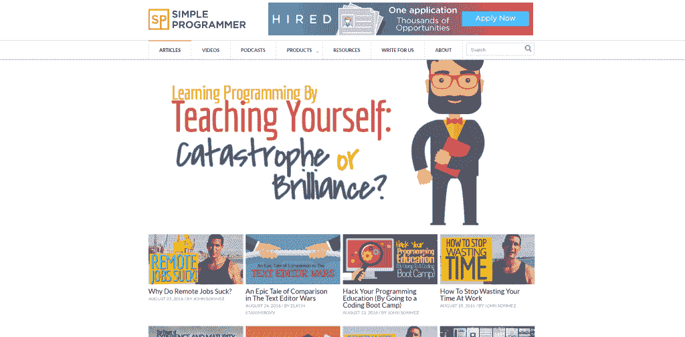

我一定要把这个网站放在这里，不是因为我是它的作者，只是因为它包含了有用的信息。例如，您可以了解:

*   [如何从初级编程走向高级编程？](https://simpleprogrammer.com/2016/07/14/move-beginner-advanced-programming/)
*   [应该先学什么编程语言](https://simpleprogrammer.com/2016/08/01/learn-programming-language/)
*   [Selenium Webdriver 教程–主同步](https://simpleprogrammer.com/2016/05/04/selenium-webdriver-tutorial-master-synchronization/)
*   [测试的正确测试用例设计-第 2 部分-边界值分析](https://simpleprogrammer.com/2016/02/12/proper-test-case-design-for-testing-part-2/)

去那里搜索一个话题。你一定会找到一本好书。

#### 让地球自动化——安东·安杰洛夫

测试自动化| c# | Jenkins | Visual Studio | TFS | Telerik 测试工作室

安东提供高质量的内容，帮助我成长为一名测试自动化专家。他涵盖了一系列与测试自动化相关的令人惊奇的主题。例如:

*   [引人注目的周日会有他最喜欢的帖子集](http://automatetheplanet.com/compelling-sunday-07082016/)
*   测试自动化设计模式的完整系列
*   [大量关于 C#和 Visual Studio 的文章](http://automatetheplanet.com/category/series/c/)
*   [深度覆盖 Selenium Webdriver](http://automatetheplanet.com/category/series/webdriver/)
*   [用 Jenkins 测试自动化](http://automatetheplanet.com/category/series/jenkins/)

#### 元素硒–戴夫·海夫纳

Selenium WebDriver | Ruby

对于 Selenium WebDriver 来说，这是一座真正的信息金矿。忘记它只和 Ruby 在一起；那无关紧要。如果您想学习如何使用 Selenium WebDriver 执行令人印象深刻的任务，请浏览文档并欣赏代码。这里有几个例子:

*   [如何使用 Selenium Grid](http://www.elementalselenium.com/tips/70-grid-extras)
*   [如何使用 Safari](http://www.elementalselenium.com/tips/69-safari)
*   [如何使用 JMeter 和 Selenium 进行负载测试](http://www.elementalselenium.com/tips/68-load-testing-revisited)
*   [如何测试破损图像](http://www.elementalselenium.com/tips/67-broken-images)

#### 测试疯狂

软件测试

test since 是一个很棒的博客，它有一堆有用的测试自动化思维导图。我最喜欢的一些思维导图是:

*   [安全测试](http://apps.testinsane.com/mindmaps/Uploads/Web%20Security%20Testing%20Part%20I.png)
*   [跨浏览器测试](http://apps.testinsane.com/mindmaps/basics-of-cross-browser-testing-get-started)
*   [移动测试](http://apps.testinsane.com/mindmaps/Mobile-Testing-In-a-Nutshell)

## 网络研讨会/视频

* * *

#### 构建可扩展的自动化框架

测试自动化|可扩展性

这是一个来自 Telerik 的很棒的网络研讨会，作者 Peter Kim，深入探讨了如何构建一个可扩展的测试自动化框架。他教授了一种非常有趣的技术，通过一个 XML 文件来控制他的所有对象，因此，无需修改代码就可以从外部配置他的测试。

#### 获得正确的测试自动化

测试自动化技术

这个视频是泽法关于测试自动化最佳技术的演示。由于本次网上研讨会的嘉宾，演示非常精彩。戴夫·海夫纳、[乔·科兰托尼奥](https://www.joecolantonio.com/)和[约翰·桑梅兹](https://simpleprogrammer.com/)三位有影响力的人物在这里分享了他们的经历。它们涵盖了从基本的 Selenium Webdriver 技巧到帮助提高测试稳定性的高级主题。

## 幻灯片/演示

* * *

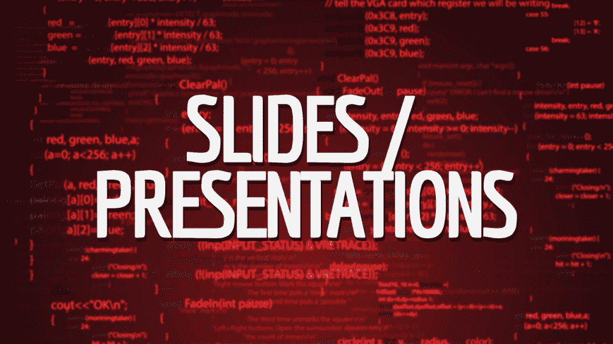

#### 2016 年及以后的测试自动化趋势

测试自动化|趋势|框架|语言

Joe Colantonio 讲述了 IT 行业的最新趋势，以便您可以为自己的职业生涯做出更好的决定。主题包括哪些测试自动化工具正在发展，您应该学习什么编程语言，什么开发方法将主导未来，以及测试驱动程序开发的未来，这些只是这个优秀的幻灯片分享提供的一些见解。

#### 管理企业移动应用的持续交付

持续集成|自动化测试

我们这里有一个关于持续集成的极好的幻灯片演示和一个实现它的好方法。Sauce Labs 讨论了源代码控制、构建工具、CI 工具、自测构建等等。

#### 优化 Selenium 测试设计的三种方法

测试设计| Selenium 网络驱动

这是一个很棒的幻灯片，描述了页面对象模型、关键字驱动框架和行为驱动开发的优缺点。

## 拆毁

* * *

我希望您真的喜欢所有这些有用的自动化测试资源。

它们是我多年来发现的最好的一些，我想与你分享。请在下面的评论中告诉我你的想法。下次见，我的朋友。