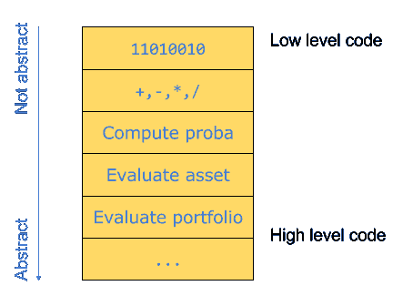
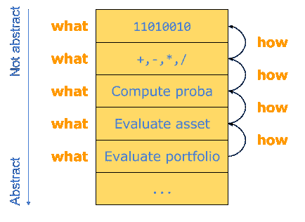
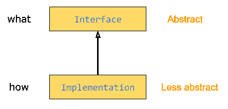
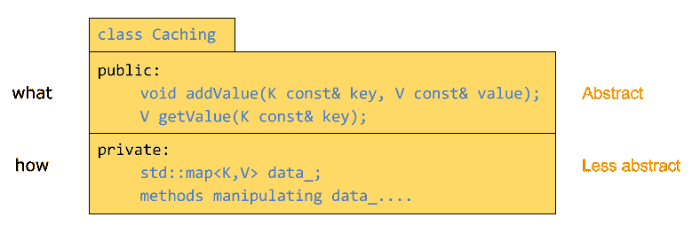

# 尊重抽象层次

> 原文：<https://simpleprogrammer.com/respecting-abstraction/>

作为软件开发人员，我们学习了许多好的实践，并努力将其应用到我们的代码中。

例如，我们学习了变量和函数的良好命名、封装、类内聚性、多态性的使用、简洁、可读性、代码清晰性、表达性和许多其他原则的重要性。

如果你始终如一地部署所有这些实践，你实际上在做一件事:**尊重抽象层次**。正如我们将在本文中看到的更详细的内容，抽象的特征在于特定的一段代码打算做什么，而不是它是如何实现的。

这是管理所有这些的**一个原则**,因为它自动应用了上面提到的所有最佳实践。当你遵循它时，你会发现自己自然而然地用高质量的设计编写代码。

从长远来看，一个好的代码设计是有回报的，因为设计良好且富有表现力的代码是可管理的。这对于长期项目、由几个开发人员组成的团队以及大型工业项目至关重要。

这个首要原则是基于简单的概念，但我花了多年的实践和研究才意识到这是最核心的概念。

为了证明这一原则的关键重要性，我将定义抽象层次，展示许多代码的最佳实践如何等同于尊重它们，并最终推导出一种提高给定代码的表达能力的技术。

## 什么和如何

首先，“抽象层次”是什么？当您查看调用堆栈时，这个概念很容易理解。让我们以一个处理金融产品的软件为例。用户有他想要评估的资产组合；投资组合的价值是它包含的所有资产价值的总和。

可以通过以下方式自下而上读取该调用堆栈:

*   要评估一个投资组合，每一项资产都必须被评估。
*   为了评估一项特定的资产，假设必须计算某种类型的概率。
*   为了计算概率，有一个模型可以进行像+、-等数学运算。
*   而这些初等数学运算最终都是送到 CPU 的算术逻辑单元的二进制运算。

很自然的会认为这个栈顶的代码是**低级代码**，朝向底层的代码是**高级 cod** e .但是什么级别呢？它们是抽象的**级别**。

尊重抽象层次意味着一段给定代码中的所有代码(给定的函数、接口、对象或实现)都处于相同的抽象层次。换句话说，如果在一个给定的级别上，没有任何代码来自另一个抽象级别，那么抽象级别是受尊重的。

一个给定的抽象层次的特征是**在其中做了什么**。例如，在堆栈的底层，评估一个投资组合。在下一个级别，评估资产，等等。

当我们从一个较高的抽象层次转移到一个较低的抽象层次时，较低抽象层次中任务的执行就是**我们如何**实现更抽象的层次。在我们的例子中，评估资产是通过计算概率来完成的。我们用初等数学运算(较低抽象)计算概率(较高抽象)，等等。

因此，当你设计或编写代码时，不断问自己的关键问题是:"**根据什么**我在这里编码？"

## 一个原则来统治他们

我认为尊重抽象层次是编程中最重要的原则，因为它自动暗示了许多其他的最佳实践。让我们看看几个众所周知的最佳实践是如何尊重抽象层次的不同形式。

### 多态性

也许当你读到抽象的时候，你首先想到的是多态。事实上，多态性包括提供接口或抽象类来操作单个概念的解耦实现。

多态性由分离的抽象层次组成。

事实上，对于一个给定的接口(或抽象类)和具体的实现，基类是**抽象的**而实现是**不太抽象的**，因为基类描述了**作为接口做什么**，而实现代码描述了**如何做**。

请注意，派生类仍然有点抽象，因为它没有用 0 和 1 来表示，但与基类相比，它处于较低的抽象级别。基类代表**接口提供什么**，派生类代表**它是如何实现的**:

### 良好的命名、封装和内聚性

让我们以一个负责维护值缓存的类为例。这个类允许你用 k 类型的键添加或检索 V 类型的值。

它是通过一个地图<k>实现的:</k>

现在想象一下，我们希望界面能够一次提供全部结果。然后我们向接口添加一个方法。我们如何命名这个方法？第一种尝试可能是“getMap ”,因为它有效地提供了将所有键与缓存中的值相关联的映射。

但是正如你可能注意到的，“getMap”是**而不是**一个**好名字**。这不是一个好名字，因为——在缓存接口的抽象层次上——“Map”是一个术语，表示**如何**(注意它出现在图的底部),而不是**什么**，所以“Map”与其命名的事物不在同一抽象层次上。称之为“getMap”会将几个抽象层次混合在一起。

例如，一个简单的解决方法是将其称为“getAllValues”。“值”是与缓存接口的抽象级别一致的术语，因此是一个比“映射”更具适应性的名称。

您可以通过给出与使用它们的抽象层次一致的名字来完成**良好的命名**。这也适用于变量名。因为命名定义了抽象的层次，因此是一个非常重要的话题，我们将在后面的阶段有一个关于它的专门的帖子。

但是首先向类的外部提供结果的映射难道不是违反了封装吗？事实上，封装是对访问对象内部实现数据的限制。

实际上，答案取决于结果容器的概念在逻辑上是否是类抽象的一部分。如果容器的概念被视为实现，那么暴露它的细节会破坏封装。如果在您的设计中缓存负责同时提供所有结果，那么公开容器的概念(可能带有只读属性)不会破坏封装。

因此，打破**封装**意味着提供超出接口抽象层次的信息。

现在假设我们在缓存类中添加了一个新方法来对值进行格式化:

这显然是一个坏主意，因为这个类是关于缓存值，而不是格式化它们。

这样做会破坏班级的凝聚力。就抽象而言，尽管缓存和格式化没有什么如何的关系，但它们是两种不同的抽象，因为它们是针对不同的事物。

所以**内聚**包括在给定的地方只有一个抽象。

### 简洁、可读性、表现力

让我们深入到函数(或方法)层面。

继续金融例子，让我们考虑金融指数，如道琼斯指数或 S&P 指数，其中包含苹果、波音或卡特彼勒等股票集合。

假设我们想写一个函数，在对数据库做了一些检查后，触发保存数据库中的索引。具体来说，我们希望只保存有效的指数，这意味着，比如说，有一个 id，在市场上被引用，并且是流动的。

函数实现的第一次尝试可能如下:

我们可以反对这个实现，理由是它有一个复杂的布尔条件，可以分组并从代码**简洁**和**可读性**的函数中取出:

当我们考虑这个修复时，它实际上是推出了如何将索引视为有效的**的实现(具有 id、引用、液体),并用保存所依赖的**(有效)来替换它，这与保存函数的抽象级别一致。

在这一点上要注意的一件有趣的事情是，尊重抽象层次超越了代码的简洁。事实上，即使有效仅仅意味着拥有一个 id，我们仍然会修复**。**

这不会减少代码中输入的字符数量(甚至会稍微增加)，但是这可以通过尊重抽象层次来提高代码的清晰度。

最后但同样重要的是，还有**表现力**，这是我的网站 [Fluent C++](http://www.fluentcpp.com/) 的重点。

假设我们想从索引中删除一些无效的组件。

第一次尝试可能会编写一个 *for-loop* 来完成这个任务，但是在 C++中最好的解决方案是使用 C++标准模板库(STL)的 remove_if 算法。STL 算法说**它们做什么**，而不是手工制作的 *for 循环*，显示**它们是如何实现的**。通过这样做，STL 算法是一种提高代码抽象层次的方法，以匹配调用站点的抽象层次。

我认为表达性是代码中要争取的首要特征。对于长期的或工业强度的项目来说尤其如此，因为表达性代码是可管理的，因为它告诉我们它意味着做什么。

在表达性代码中，可以发现并修复错误，添加新功能，并调整性能。通过使用表达性代码，项目中的新开发人员可以相当快地达到速度，快速前进，并从他们的努力中获得满足感。

## 将晦涩的代码转化为有表现力的代码:提高抽象层次

不幸的是，所有的代码都没有表达能力。例如，您的系统中可能有遗留代码(许多公司都有)，这些代码晦涩难懂，浪费了开发人员的精力和动力。

一种技术来源于对抽象层次的尊重，它允许你将一段晦涩的代码转换成一段优雅而富有表现力的代码。

在许多晦涩难懂的代码中，较低级别的代码位于栈的较高级别中间——抽象级别一直不受重视。

问题在于描述**如何**执行动作的代码，而不是描述**执行什么动作的代码。为了改进这样一段代码，你需要**提高它的抽象层次。****

为此，您可以应用以下技术:

确定代码做了什么，并在每一项上贴上标签。

这具有显著提高代码的[表达能力的效果。让我们用一个例子来说明。下面的例子是用 C++写的，但是这种技术并不特定于一种语言，这就是它如此强大的原因。](http://www.amazon.com/exec/obidos/ASIN/020161622X/makithecompsi-20)

让我们考虑一个应用程序，其中用户可以计划一次穿越该国几个城市的旅行。如果两个城市足够近(比如不到 100 公里)，他会直接从一个城市开到另一个城市；否则，他会在两个城市之间的路上稍作休息。用户不会在两个城市之间停留超过一次。

我们以城市集合的形式规划了路线。

你需要写一段代码，计算出司机需要休息多少次，以便有效地安排他的时间。

现有的类 City 表示路径上的一个城市。它可以提供它的地理属性，其中包括它的位置，由类 location 表示。并且位置本身可以计算到地图上任何其他位置的行驶距离:

下面是一个函数的可能实现，用于确定驾驶员需要休息多少次:

这段代码并不是从某个特定的代码库中获取的，但是我综合了我在产品代码中看到的或者从互联网上得到的不同技术，以便制作一个真实的例子。

这段代码的问题是，它没有说明它打算做什么；相反，它邀请读者去搞清楚其中发生了什么——这段代码没有表达能力。让我们使用前面的准则来提高表达性:也就是说，让我们**确定代码做了什么事情，并用一个标签替换每一个。**

让我们从迭代逻辑开始:

也许你以前见过这种技术的应用。这是一个操纵集合中相邻元素的技巧。it1 从起点开始，it2 在遍历过程中一直指向 it1 之前的元素。为了用某个东西初始化 it2，我们首先将它设置在集合的末尾，并检查 it2 是否不再位于循环体的末尾，以实际开始工作。

不用说，这段代码不太容易表达。但是现在我们已经确定了**它意味着做什么:它的目标是一起操纵**连续的**元素。**

让我们处理下一段代码，条件是:

就其本身而言，更容易理解代码意味着什么。它决定了两个城市的距离是否比最大距离更远。

让我们用变量 nbBreaks 来完成分析:

这里，代码根据条件递增变量。这意味着**计数**满足**条件**的次数。

总之，功能:

*   一起操作**个连续的**元素。
*   确定城市距离是否比最大距离**远。**
*   **计数**满足**条件**的次数。

一旦这个分析完成了，我们就真的很接近把这个晦涩的代码变成一个有意义的代码了。

指导方针是在代码所做的三件事情上各加一个标签，以隐藏实现代码。在这里，我们将执行以下操作:

*   为了操作**连续的**元素，我们可以创建一个我们称之为“连续的”组件，它将把一个元素集合转换成一个元素*对的集合，*每对都有一个初始集合的元素和它的下一个元素。例如，如果 route 包含{A，B，C，D，E}，则连续的(routes)将包含{(A，B)，(B，C)，(C，D)，(D，E)}。在 C++中，这被称为范围适配器。你可以在这里看到我的实现。创建一对相邻元素的适配器最近被添加到流行的 [range-v3](https://github.com/ericniebler/range-v3) 库中，名为 [sliding](https://github.com/ericniebler/range-v3/blob/afd3c77dabdf9816ffb7e266a8d9d55b86005834/test/view/sliding.cpp) 。
*   为了确定两个连续的城市之间的距离是否大于 MaxDistance，我们可以简单地使用一个函数对象，我们称之为 **FartherThan** 。我知道 C++11 的函子大部分已经被 lambda 代替了，但是这个函子比 lambda 有一点优势，因为它可以完全隐藏 computeNumberOfBreaks 函数的实现代码。这也可以用 lambda 来实现，但是需要做更多的工作(正如这篇[关于用 lambdas](http://www.fluentcpp.com/2017/01/19/making-code-expressive-lambdas/) 让代码更有表现力的帖子所示)。所以在这里，让我们继续使用函子来说明这一点:

*   为了计算一个条件被满足的次数，我们可以使用 STL 算法， **count_if。**

下面是通过用相应的标签替换代码获得的最终结果:

(注意:本机 count_if C++函数在集合的开头和结尾使用两个迭代器。这里使用的方法简单地调用本地方法，使用传递范围的开始和结束。)

这段代码展示了它的功能，并且比最初的代码更具表现力。最初的版本只告诉读者它是如何工作的，剩下的工作留给读者去做。

上述技术可以应用于许多不清楚的代码片段，将它们变成非常有表现力的代码。所以下次当你偶然发现你想重构的晦涩代码时，考虑一下识别代码做了什么，并用标签替换每一个。

你会对结果感到惊讶。

不过，标记关注的是代码本身。如果你想学习一种有趣的方法来编写干净的代码，你绝对应该看看 John 关于如何编写干净代码的帖子。

## **长期代码**

遵循尊重抽象层次的原则将有助于你在设计代码时做出正确的选择。这将使您的代码更具表现力和健壮性，使其成为您的代码线和公司未来的资产，而不是负担。

如果你在设计你的代码时考虑这个原则，并且不断地问自己这个问题，"**根据什么**我在这里编码？"，您的代码将自然地流动，很好地执行其功能，并且对于必须使用它的其他程序员和开发人员来说是一种享受。

作为开发人员，表达性代码一般就是我们所说的“漂亮”代码。正如 John 在关于干净代码的优点的文章中所强调的，拥有开发者认为漂亮的代码是软件公司应该追求的。通过**识别代码做什么，并用标签**替换每一个，我们知道如何提高抽象层次，以使代码更具表现力。

正如我在整篇文章中指出的，许多最佳实践依赖于尊重抽象层次。

请继续关注，因为在接下来的几周和几个月里，我将继续发表文章解释如何从抽象层次中获益。