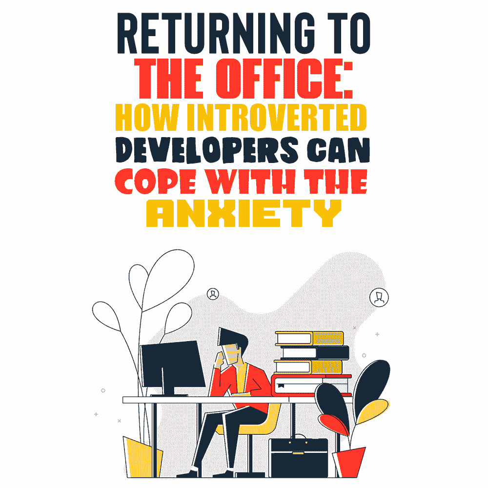

# 重返办公室:内向的开发人员如何应对焦虑

> 原文：<https://simpleprogrammer.com/returning-to-office-anxiety/>

For most people, the end of the lockdown seems like the light at the end of the tunnel. But while some are busy celebrating the return to normal (regardless of what “normal” looks like for them), others are stuck trying to cope with something entirely different—a strong sense of anxiety over returning to the office.

众所周知，现代工作场所，有些人会说，整个世界都倾向于外向的人。毕竟，你不需要走得比苏珊·凯恩的 TED 演讲更远就能提醒你，我们倾向于给人们施加多少压力，让他们变得“外向”、“善于交际”和“团队合作”。(苏珊·凯恩也是《T2》《T3:内向者在不停说话的世界中的力量》《T4》《T5》的作者，这是内向者和任何与他们一起工作的人的必读之作。)

但对于更多内向的专业人士来说，这种压力意味着什么呢？在新冠肺炎之后，内向的开发人员重返办公室意味着什么？

无论你是一名喜欢独处的程序员，还是一名雇用多元化员工的人，知道如何应对现代工作场所的挑战是当今世界的一项基本技能。尤其是如果你(或你的团队)的经历涉及到对即将重返办公室的焦虑。

闲话少说，让我们来谈谈从在家工作(WFH)到全职办公室工作的转变。这里有一些让这种转变尽可能无缝和无压力的建议。

## 对远程工作和现场工作的看法

毫不奇怪，当 2020 年 3 月向 WFH 转移时，有很多组织反对。由于对员工绩效的控制有限，以及重组带来的一系列障碍，领导者们努力建立能够让公司照常运营的制度。

尽管如此，远程工作对专业开发人员来说并不是什么新鲜事(或挑战)。在新冠肺炎·疫情之前，大多数程序员已经有了一些使用 WFH 的经验。在 2020 年之前，多达 7%的 IT 员工已经在远程工作了 10 年。

然而，随着世界通过锁定(及其*许多*迭代)变得强大，组织变得习惯于远程工作的想法。事实上，WFH 进行得如此顺利，以至于相当一部分雇主和雇员表示[希望在疫情结束后继续这一做法](https://wfhresearch.com/)。

尽管如此，仍有很大一部分企业主希望回到现场工作。对于发现自己在远程环境中茁壮成长的开发人员来说，这可不是什么好消息。

现在，他们对 WFH 的偏爱可能源于内向的性格或实际原因，如在家更容易处理医疗状况，或者两者兼而有之。不管怎样，处理这种情况的唯一方法是发展一种健康的方式回到办公室。这样做的第一步肯定是一段时间的自省，这将使他们能够确定他们焦虑的原因。

## 害怕回到办公室

麦肯锡发布的一项调查调查了与新冠肺炎疫情相关的恐惧和焦虑。结果很能说明为什么人们对回到现场工作感到不安。根据数据，人们对回到办公室最常见的恐惧包括

*   工作生活平衡差(45%的调查参与者)。
*   患病几率增加(44%的人)。
*   对福利的关注减少(42%的工人)。
*   失去灵活性和控制力(39%的专业人员)。

当然，重要的是要记住，任何一个对回到办公室感到焦虑的人都可能有一系列的原因让他们产生这种感觉。不过，麦肯锡报告中列出的四个要点是一个很好的起点。因为，归根结底，应对焦虑(对任何事情)的最佳方式是**识别其触发因素**。

因此，如果你是一个内向的开发人员，对即将到来的变化感到焦虑，试着停下来想一想。是什么让你对现场工作感到不安？

是因为你担心你的健康吗？你害怕失去对时间和身体状况的控制吗？还是你知道没有办公室的干扰你会工作得更好，你会因为在饮水机旁聊天而感到筋疲力尽，或者你只是在家工作效率更高？

一旦你清楚地知道是什么在困扰你，是时候开始解决你压倒一切的担忧了。

## 控制环境和划定界限

根据科学研究，不确定性是焦虑的主要诱因之一。原因是它削弱了我们管理未来情况的能力。考虑到这一点，在这个充满挑战的时期，人们对回到办公室感到不安也就不足为奇了。

当然，改变工作环境意味着每个人将不得不放弃一些对他们周围环境的控制。但这并不意味着他们必须做与他们的性格类型相冲突的事情。相反，这意味着他们将不得不找到一种方法来控制他们能够控制的事情，并接受他们不能控制的事情。换句话说，就是**划清界限**。

例如，你可能对回到办公室感到焦虑，因为你认为自己是一个内向的人。当你独自一人的时候，或者你对社交分心感到不舒服的时候，你会做得最好。如果是这样的话，你将不可避免地再次适应和一大群人在一起。

这并不意味着牺牲你的舒适。相反，这意味着必须定义你愿意容忍的事情，并为你不愿意容忍的事情找到解决方案。例如，这可能是使用降噪耳机来淹没分散注意力的办公室闲聊，或者当你天生害羞时[学习如何社交](https://skillcrush.com/blog/networking-tips-for-introverts-in-a-new-industry/)。

但是，如果你发现你的焦虑源于更根深蒂固的东西，比如对你目前的职业道路不满意，或者工作场所有毒的公司文化，那么你可能不得不做出更大的改变。这些变化可能意味着接受你目前的工作场所可能不适合你。

## 减轻焦虑的影响

One of the main things to keep in mind about [dealing with anxiety as a programmer](https://simpleprogrammer.com/getting-rid-anxiety-programmer/) (regardless of its cause) is that it isn’t just a constant feeling of worry. When left untreated, it can also have serious long-term health consequences. These can include

*   患冠心病的风险增加。
*   与[胃肠疾病](https://onlinelibrary.wiley.com/doi/full/10.1111/j.1751-2980.2012.00581.x)的因果关系。
*   [免疫功能减弱](https://pubmed.ncbi.nlm.nih.gov/3047704/)。
*   患抑郁症的风险增加。
*   可能的认知障碍如[记忆功能下降](https://academic.oup.com/acn/article/17/1/57/2143?login=true)。

然而，内向的开发人员的问题是，他们天生更容易焦虑。此外，由于他们孤僻的天性，他们可能很难向同龄人寻求帮助。如果你觉得自己属于这一类人，你能做的最好的事情就是**开始更加关注自我保健**。

首先，这意味着养成健康生活方式的基本习惯。试着保证充足的睡眠，健康饮食，定期参加体育活动。

其次，一个焦虑的人的日常自我保健应该包括压力管理和放松技巧。无论是冥想，从像 *[这样的书中学习正念，整理你的思绪](https://www.amazon.com/dp/1535575085/makithecompsi-20)* ，做呼吸练习，写日记，还是培养一种爱好，这些活动都应该提供一个喘息的机会，让你从导致焦虑发作的担忧中转移注意力。

最后(也许也是最重要的)，一个有效的焦虑管理程序应该包括某种形式的治疗。有些人可能觉得和朋友讨论自己的感受更舒服。然而，其他人更喜欢专业人士的帮助。

如果你处于这种情况，要知道无论你选择这两个选项中的哪一个，你肯定会发现谈论你的担忧会带来缓解。此外，它可能会帮助你从不同的角度看待重返办公室的好处。

## 考虑找到一个中间立场

现在，你可能觉得只有你一个人对回到办公室感到焦虑。但是你必须记住，相当多的人也在和你一起迎接即将到来的变化。这意味着你肯定不是唯一一个对再次作为一个大集体的一部分工作感到担忧和怀疑的人。

这就是为什么应对你的焦虑的最好方法不会是对你的恐惧感到内疚(无论它们与社交、健康还是只是你的日常事务有关)。相反，首先要接受你的感觉。然后设法找到有效的方法来防止它们伤害你的身体和情绪健康。

解决办法可能在于发展一套正念程序，要求你的上司实施混合工作模式，或者去接受治疗。你可以选择你认为最适合你的方式。