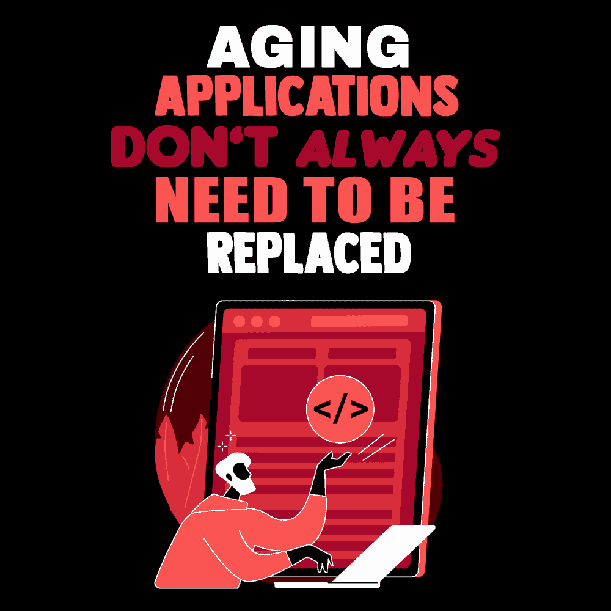

# 老化的应用程序并不总是需要更换

> 原文：<https://simpleprogrammer.com/rewriting-aging-applications/>

So, you just learned the hot new technology that promises blazing performance and a beautiful, intuitive UI—at the same time reducing bugs and making your application scale infinitely. And you have this application that has been around so long that no one remembers the faces that go with the names on the original commits. It is practically begging to be replaced and sent to the app retirement home.

我们都感受到了这种诱惑，但尽管这是一种强大的诱惑，但在你一头扎进漏洞之前，你应该仔细考虑用完全重写来替换应用程序是否是谨慎的做法。毕竟，在创造这个产品上已经投入了很多时间，并且需要更多的时间来取代它。

除了开发人员的时间之外，用户也花时间学习如何使用软件，并对它感到舒适。当你推出新的应用程序时，你必须考虑到这一点。需要创建培训课程或教程，更不用说解释为什么新应用比旧应用更好的营销材料了。

事实是，替换老化的应用程序通常非常昂贵。有时候，最好是给他们整容，或者想办法逐渐取代他们，而不是一下子全部换掉。在本帖中，我将向您展示重写与维护老化应用程序的利弊。我还将提出在两者之间达成妥协的第三种选择。这样，当您决定哪个选项最适合您和您的需求时，您将得到一些指导。

## 重写的理由

从头开始重写应用程序是最令人兴奋的选择。你有一片绿地，可以随心所欲地进行建筑和设计，同时使用最新的技术来帮助你。如果可以选择，大多数开发者会选择这条路线。毕竟，你花了很多时间来跟上最新的技术趋势；你不想学以致用吗？

当然，除了“开发人员感到无聊”之外，还需要有其他理由来证明完全重写的合理性。除非一个 app 精心维护，否则在某个时候必然会有一些偷工减料。一个硬编码的值在这里，一些意大利面条式的代码在那里，在你知道它之前，逻辑变得难以理解，没有人知道事情是如何继续工作的。

一旦开发人员开始更替，内部专业知识不再处于以前的水平，这就变得特别成问题。这将导致更多的时间花在修复错误上，而更少的时间用于新功能工作。

进行全面重写的另一个原因是，应用程序已经不能满足业务需求了。用户界面可能很难使用，后端处理请求的速度很慢，导致失去商机。业务可能已经发生了变化，应用程序存在的最初理由已经不再有效。

在某个时候，所有这些问题都会累积起来，很明显，重新开始是值得投资的。

## 维护当前应用程序的情况

仅仅因为一个应用程序已经存在了一段时间，并不意味着它需要被搁置。如果它仍然做得很好，并且代码相当容易使用，那么在可预见的未来，它没有理由不能继续这样做。也就是说，[需要做出努力](https://simpleprogrammer.com/deal-with-legacy-code/)来保持这种方式，比如定期的框架和软件包更新，以及对[的持续警惕，以保持高水平的代码库质量](https://www.amazon.com/dp/0131177052/wwwerobillarc-20)。

如果应用程序仍然有许多用户，大多数开发者将没有兴趣学习如何使用一个新的应用程序。大多数情况下，人们不喜欢变化。

多年来，开发人员一直在为该应用添加功能，因此有一个庞大的代码库。任何新应用程序的开发和测试都将花费大量时间，并且您不希望错过任何在用户群中受欢迎的功能。

对应用程序进行完全重写需要投入大量的时间和金钱，而这些时间和金钱可以用来开发新产品。有没有[手机 app](https://mobcoder.com/blog/iphone-app-development-advantages/) ？[说西班牙语的客户](https://www.motionpoint.com/blog/10-great-reasons-to-translate-your-website/)可以用他们的母语浏览你的网站吗？这些新产品可以通过吸引新客户来帮助扩大你的业务。

## 妥协

There is a middle ground between replacing the application by totally starting over and simply leaving the app in maintenance mode. You can slowly replace the old app piece by piece. This works especially well if you want to move from a [monolithic architecture](https://microservices.io/patterns/monolithic.html) to a [microservice architecture](https://microservices.io/patterns/microservices.html).

使用 *[领域驱动设计](https://www.amazon.com/dp/0321125215/wwwerobillarc-20)* 中描述的原则——特别是有界上下文的概念——你可以将复杂的领域分解成一个有界上下文的网络。一旦您确定了这些有界的上下文，它们就可以告诉您如何构建您的微服务。

一次拆分一个应用程序，可以在不显著改变用户工作方式的情况下替换老化的应用程序。测试也将更容易，因为 QA 团队可以一次专注于应用程序的一个领域。

你也可以给用户一个新应用的印象，而不必通过更新 UI 和重新换肤来替换整个东西。一个干净、现代的用户界面可以改变用户对应用程序的感觉。如果他们在等待的时候看到一些漂亮的东西，他们不会介意缓慢的性能。

## 一个老化的应用程序仍然可以完成它的工作

无论您如何选择替换老化的软件组合，您都必须花时间计划一个有效的行动过程。此外，仔细考虑你的决定将如何影响所有相关利益方。

做出错误的决定会让你倒退几年，所以一定要诚实地看看现有的应用程序是否仍然在做它的工作，开发人员的努力是否可以更好地用于其他项目，以及当前的应用程序维护起来有多困难。一个额外的考虑是，应用程序可以被逐段替换，还是需要从头开始全部重写？

正如我们在这篇文章中看到的，重写和维护一个老化的应用程序各有利弊。还有一个中间地带。了解每个选项为您提供了什么，您就可以决定针对您的特定情况的最佳行动方案。