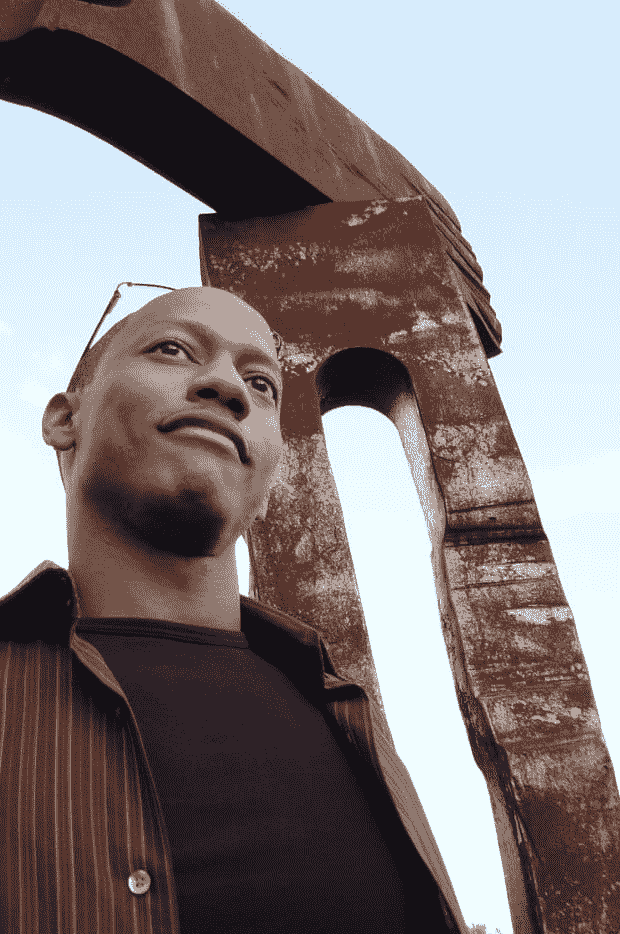

# 雷纳德·阿道夫将喜剧与科技结合在一起

> 原文:[https://simple programmer . com/reyna LD-Adolphe-is-mixing-comedy-with-tech/](https://simpleprogrammer.com/reynald-adolphe-is-mixing-comedy-with-tech/)

我一直想和雷纳德·阿道夫谈谈，因为他正在做一些有趣的事情。我知道这会是不同的事情，我非常感谢他接受了采访。

Reynald 是一名. NET 开发人员，在网站咨询和开发方面有 10 多年的经验。他一直对单口喜剧感兴趣，并找到了一种将娱乐融入科技环境的方法。

他作为喜剧演员的生活，他是如何开始的，以及科技娱乐的发展方向只是我们谈论的一些事情。总的来说，这是一次有趣的面试，一定不能错过。我不想破坏细节，所以请查看雷诺·阿道夫的 **[视频采访。](https://www.youtube.com/watch?v=jQwDY2wxWSs)**还有，看了他整理的 Q & A 在这里分享。

## 你是喜剧演员，还是开发商，还是什么？我是说，他们太不一样了。

Reynald Adolphe 是一名拥有 10 多年经验的. NET 开发人员。他是一名演员、作家、喜剧演员和企业家。

当人们惊讶于我同时拥有这两种兴趣时，我觉得很有趣。如果一个老师也打网球，他们会不会感到奇怪，并说，等等，教数学和打网球是如此不同。你不应该在业余时间帮助孩子们娱乐吗？或者帮助外国人学习，因为那是你应该做的——你知道，当一名老师！呆在你的车道上！

我是文艺复兴时期的人。我以前不喜欢这样，因为专注于一个兴趣更容易，但我开始学习&喜欢我兴趣的多样性。老实说，我希望更多的人也这样做。关键是要知道如何为每一个兴趣设立目标，制定计划，并使之发生，这样你才不会掉进把自己稀释成平庸的陷阱。对我来说，我的兴趣包括单口喜剧，制作喜剧事件，编写/拍摄剧本，并且仍然与技术有关。我从来不想成为一名饥饿的艺术家，而作为一名开发者让我免于饥饿。同时，我不想忽视喜剧，所以我仍然参与其中。最近，我发现了一种在 meetup 活动(又称用户组)中将两者结合起来的方法——[C # Entertainment](http://www.meetup.com/CSharp-Ent/)。

## 什么是 [C#娱乐](http://www.meetup.com/CSharp-Ent/)？

这是我创办的一个 meetup.com 组织，它让你的传统科技演讲变得不同。我想和主持人、开场者(音乐家)、演讲者一起做一些技术讲座。网络话题，见面/问候/吃饭环节，专业喜剧演员结束演出，DJ 从头到尾保持活力。美好时光！也许我会像 a70s 综艺节目一样复古——现在是 C#舞者！

## 你会为 Java 或 Python 这样的语言成立另一个小组吗？

是的。正在努力。首先，我希望 C#有一个坚实的追随者，因为它还年轻，但是人们喜欢它。这只是大量的工作，我正试图建立一个团队，使它成为一个自我维持的事件。获得人才很容易，但获得营销团队要难得多。一点都不性感。如果是的话，他们会拍营销电影，我们会有营销粉丝。

## 你在哪里表演？

我在洛杉矶，所以大部分俱乐部都在那里。我更专注于为我制作的活动表演，比如在 C#娱乐公司或我的[职业单身喜剧之夜](http://www.meetup.com/Professional-Singles-Comedy-Night/)——我经营的另一个聚会团体。最近，我一直在关注一个正在发展中的个人秀。当我可以努力创造自己的机会时，我不喜欢乞求喜剧俱乐部给我舞台时间。如果我做对了，他们就会来找我。请在 Twitter @reynaldadolphe 上关注我，了解即将举办的活动。

## 你还在做什么项目？

技术方面:我正在构建一种新的学习编码的方式，并将开始将其应用到我未来制作的课程中。这叫有氧编码。我对此很兴奋。敬请关注。

娱乐明智:我的独角戏“兼职”，是一个特别的喜剧综艺节目，也是一个需要编写/制作/拍摄的专题节目。几年前我为一些节日写过/拍过一个试播集，所以现在我对这个专题准备得更充分了。明白我为什么用文艺复兴这个词了吗？

## 你有什么科技视频吗？

我将开始发布截屏来微调 C#的有氧编码版本。然后，我给 Angular 做一个。不知道先看哪个，但是订阅我的 youtube 频道([youtube.com/c/ReynaldAdolphe](https://www.youtube.com/c/ReynaldAdolphe))。我最近成为了 Lynda.com 的一名作家，所以我的第一门课程将很快推出。直到 2015 年 10 月的某个时候才能公布书名。如果你稍后读到这篇文章，请联系我，并通过以下链接获得试用:【Lynda.com/trial/ReynaldAdolphe

## **如果从头开始，你会做些什么？**

**老实说没什么。我没有什么遗憾，但被问到时，我脑海中经常会浮现出三个遗憾。1)我从未申请哈佛，因为我认为我没有机会，尽管我申请的所有常春藤联盟都录取了我。2)我会学习计算机科学，以便一出校门就进入科技行业，以便更早起步 3)早些时候，我会更加努力地加强与行业相关的技术技能，而不是将自己局限于我工作所需的技能。我过去常常做那件事，但是不再做了。当人们过得舒适时，他们往往会忘记为自己的最大利益着想。你总是希望自己的价值很高，这样别人才会想要你，尤其是如果你现在的雇主不重视你，或者至少表现出来。然而，好的老板会这样做，并且口头上/财务上让你知道。如果你是自己的老板，这条规则仍然适用，所以要知道如何欣赏自己。善待自己。我想这是我希望自己早点做的第四件事——通过度假、旅游和 T2 放松来获得更多的乐趣。我总是担心“成功”，而不是享受这一刻。不过，我现在知道了。这些天我不那么担心了。我在这方面并不完美，但我做得更好。我在做我喜欢的事情&钱从两头来。**

## **有什么书推荐？**

**[4 小时工作制](http://www.amazon.com/exec/obidos/ASIN/B006XZ1XZ2/makithecompsi-20)–蒂莫西·费里斯**

**[如何停止担忧，开始生活](http://www.amazon.com/exec/obidos/ASIN/0671733354/makithecompsi-20)——戴尔·卡内基**

**[艺术之战:赢得内心创意之战](http://www.amazon.com/exec/obidos/ASIN/1501260626/makithecompsi-20)——史蒂文·普雷斯菲尔德**

**[如何赢得朋友并影响他人](http://www.amazon.com/exec/obidos/ASIN/B003WEAI4E/makithecompsi-20)——戴尔·卡内基**