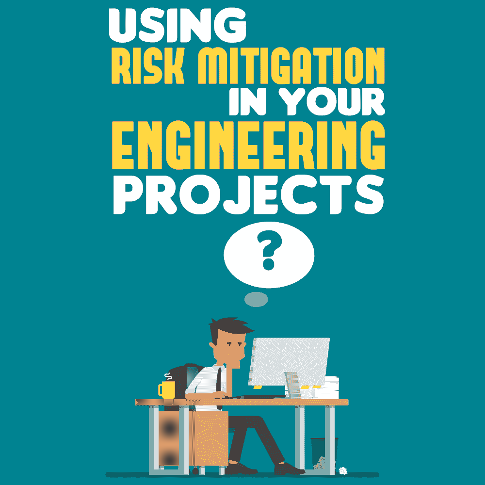

# 在您的工程项目中使用风险缓解

> 原文：<https://simpleprogrammer.com/risk-mitigation/>

<figure class="alignright is-resized">

</figure>

忽视常见的项目风险可能会导致灾难。如果任其恶化，一开始看似微不足道的风险很容易发展成威胁。理想情况下，有必要分析每个项目带来的风险，并寻找降低风险的方法。反过来，项目团队可以对更好的目标一致性、简化的决策过程、低风险的项目和高参与度感到放心。

风险缓解是通过消除或减少威胁可能造成的影响来处理威胁的计划。它采取谨慎的措施来减少系统开发生命周期(SDLC)中风险和灾难的负面影响。

在软件工程中，风险[是危及软件项目成功的行为或情况](https://simpleprogrammer.com/risk-management)。它们会对任务的预算、范围和时间表产生负面影响。

为了避免任何项目挫折，您应该注意工程项目中出现的常见风险，并在进行过程中减轻它们。

## **工程项目中的风险类型**

许多威胁会危及软件开发项目的成功。软件项目中的示例风险包括:

*   管理层未能防止延误和挫折，导致未编入预算的支出。
*   管理层在管理项目时使用了不合适的项目管理框架。
*   项目设计不符合用户要求和 IT 部门的质量标准。
*   SDLC 文档忽略了数据安全性等关键方面。
*   信息系统缺乏控制措施来保证有效和准确的交易处理。

SDLC 的任何阶段都可能出现故障。让我们来看看软件开发中常见的一些错误原因。

### **日新月异的技术**

技术变化很快，软件开发人员必须适应。随着时间的推移，行业采用了新的开发平台、工具、技术、标准和协议。这些变化使得软件开发变得非常不可预测。

在工程领域，不断的培训对于降低新技术带来的风险至关重要。项目失败有时是由于错误地采用了未经验证的工具。
T1。med rectangle-4-multi-110 { border:none！重要；显示:屏蔽！重要；浮动:无！重要；行高:0；边距-底部:15px！重要；左边距:0！重要；右边距:0！重要；margin-top:15px！重要；最大宽度:100%！重要；最小高度:250px 最小宽度:250 像素；填充:0；文本对齐:居中！重要}

这同样适用于选择要利用的应用程序和系统架构。在错误的环境中编码可能意味着项目即将失败。广泛的咨询可以帮助团队为项目选择最合适的平台。

### **需求变化**

工程项目从捕捉所有用户需求开始，同时牢记系统特性、功能和服务。需求收集通常是乏味冗长的。

例如，一些利益相关者可能有个人议程，他们会忽略任何可能阻碍他们计划的事情。此外，用户需求可以在产品的原型和集成阶段发展。

在整个软件开发过程中，调整可能是必要的。然而，用户需求中的一些变化不会自动转化为功能需求。这种差异会导致项目失败。

### **性能测试不足**

企业中的大多数应用程序都可以由不同级别的用户访问，这取决于他们是管理层、员工还是供应商。要记住的一个基本要素是数据安全性，尤其是当第三方是最终用户的一部分时。

有漏洞的软件产品会使组织容易受到网络犯罪的攻击。在整个项目中测试产品对于确保所有模块按预期运行是至关重要的。

### **组织问题**

项目管理是生成成功软件产品的核心。团队领导必须计划开发团队的需求，以及客户的期望，以便有效地执行项目。经理必须找到与项目的各种任务相匹配的人才。

如果项目经理沟通有问题，开发人员可能会误解项目的范围。团队最终可能会错过最后期限，或者开发出不符合客户期望的产品。必须有关于利益相关者参与和信息共享的政策，以避免误解。

## **如何降低软件工程中的风险**

<figure class="alignright is-resized">

</figure>

项目经理应该在问题变得不可避免之前识别并解决风险。保持工程任务运行的最有效方法是监控威胁和降低风险。

主动的风险管理减轻了您的压力，增加了项目成功的机会。它包括识别、分析和应对项目生命周期中的风险因素。作为项目规划过程的一部分，它侧重于控制未来可能事件的发生或影响。

您可以通过六个步骤来降低软件项目中的风险。

### **1。风险跟踪**

在软件工程项目开始之前，识别所有可能的风险，并阻止它们变得复杂。一个理想的方法是根据易变性、复杂性和你对它的了解来评估你计划开发的每一个特性。

风险管理的要点是从项目的开始到结束跟踪风险。除了拥有风险跟踪机制之外，项目经理应该随时了解他们在项目中的位置。

易失性的水平指出了一个特性改变的可能性，而完整性指的是你在开发它的过程中走了多远。相对复杂性是构建一个特性的难易程度。

您可以测量这些参数，并按如下方式为其赋值:

*   波动性–低(L)、中(M)或高(H)
*   完整性–完整(L)、不完整(M)或未知(H)
*   复杂性–简单(L)、标准(M)或中等(H)

通过对正在进行的项目中的每个特性进行这些度量，您可以估计所涉及的平均风险。总体风险分值将为低、中或高。

### **2。优先顺序:首先是风险最高的领域**

有了每个功能的风险分数，首先处理风险最大的步骤。通过这样做，您将防止项目的某些部分滞后太多。

在这个阶段，您需要强调可能的技术和用户体验挑战。您可以通过在[风险评估矩阵](http://reciprocitylabs.com/resources/what-is-a-risk-assessment-matrix/)中可视化高风险步骤来注意到它们，并在整个项目开发过程中跟踪它们。

风险矩阵通过将事件发生的概率乘以其对组织的影响来提高风险可见性。因此，低风险是一种即使发生也几乎没有影响的情况，反之亦然。该工具使开发团队能够优先考虑最具威胁性的事件，从而保护整个项目。
T1。leader-2-multi-119{border:无！重要；显示:屏蔽！重要；浮动:无！重要；行高:0；边距-底部:15px！重要；左边距:0！重要；右边距:0！重要；margin-top:15px！重要；最大宽度:100%！重要；最小高度:250px 最小宽度:250 像素；填充:0；文本对齐:居中！重要}

作为项目经理，您可以要求开发团队使用时间盒研究潜在风险的解决方案。一次专注于一个问题可以让团队更快地解决问题，而不是停留在有多个问题的僵局中。

当风险变得势不可挡时，灾难通常会发生，企业无法决定优先考虑什么。为了加快解决过程，让不同的人处理他们最了解的风险领域。

对于设计和用户体验挑战，理解用户想要什么是至关重要的。考虑采访他们，观察他们如何与产品互动。

当你在一个你不了解的领域发展业务时，这种学习方法非常方便。它提供了帮助团队关注对最终用户重要的东西的见解。

### **3。敏捷开发方法**

这种软件工程方法允许软件的开发和测试在整个 SDLC 的迭代中同时进行。它将项目分成更小的块，以允许[快速识别不可预见的风险](https://simpleprogrammer.com/effective-communication-agile-teams/)并迅速采取行动。

如果您无法预测每个风险，请将更多资源分配给项目中最不确定的部分。当您可以预测项目中的风险时，请关注风险最低的基本功能，稍后再处理风险较高的部分。

您可以启动一个最小价值项目(MVP ),以满足客户在处理无人值守部分时最迫切的需求。

### **4。风险规划和沟通**

为了更方便地降低软件开发风险，总是要有一个计划来降低项目的风险，并将其传达给你的客户。这可能意味着对所有你不知道的事情保持透明。通过开放，开发团队以及其他涉众了解风险和缓解方法。

使用问题和风险日志跟踪风险发生的频率以及它们引发问题的频率。突出项目状态报告中的主要威胁，以便您的团队了解可能遇到的情况。透明度通常会建立信任，客户可以相信你会处理好可能发生的事情。

### **5。关于开发流程的对话和反馈**

<figure class="alignright is-resized">

</figure>

项目经理需要对项目团队成员有同情心。当你向你的团队展示你的关心时，你变得平易近人。因此，任何有问题妨碍他们表现的人都可以向你提出这个问题。通过提供解决方案，您可以降低许多与人员相关的风险。

一个开发人员可能必须同时为 iOS 和 Android 项目编码。为了保持可交付产品的预期质量，他们必须是灵活的程序员。如果没有，你可能要为每个人重组你的团队，以最大限度地发挥可用的才能。

### **6。评估团队温度**

随着项目的进展，您应该跟踪开发团队对任务的感受。开发人员的心情可以说明他们的恐惧(如果有的话)，这可能意味着要解决的风险。

通过倾听项目团队和客户对项目状态的看法，你可以感受到团队的热情。

例如，团队对他们的工作和整个项目满意吗？如果没有，了解他们的恐惧是什么，并解决问题。两分钟的调查可以提前发现即将到来的风险，让您及时减轻风险。

如何处理风险会改变项目的范围、预算和进度。评估项目特性并在开发过程中与各种风险承担者互动有助于风险缓解过程。

## **IT 项目中的风险缓解策略**

您可以根据威胁的性质和可用的预算，使用不同的策略来降低项目风险。工程中最常用的缓解策略是转移、回避、控制、接受和监控。我们来细说一下。

### **风险转移**

在风险管理中，项目所有者将风险承包给最适合处理风险的一方并不罕见。然而，这可能是一个复杂的过程，因为你不能转移未量化的风险。在大多数情况下，第三方同意为他们认为适当的奖励承担风险。

你必须[量化你的风险](http://broadleaf.com.au/resource-material/quantifying-risk-in-business-and-projects/)以便与你的承包商达成一个合理公平的价格。当你和第三方看到签订合同的价值时，风险转移最有效。在软件工程中，您可能会将项目风险转移给另一家开发公司或保险公司。

### **风险规避**

软件项目中的另一个风险缓解策略是避免。它可以采取消除的形式，即改变或消除导致风险的参数。通过改变蓝图，你可以使风险消失或降低到可接受的水平。

通过使风险消失或将其降低到可接受的水平，风险规避不同于转移和控制，因为它寻求完全避免损害事件。

解决方案可能是调整预算、时间表、用户和技术需求等等。当采用这种方法时，您必须小心不要引入未知的风险，这些风险可能会对项目产生更不利的影响。

在改变项目参数之前，让客户参与进来，让他们理解不行动的含义，这一点很重要。你可以把调整后的产品呈现给用户，看看你的努力是否有意义。

### **风险控制**

这种方法包括假设风险，但实施措施来减少或管理其影响或可能性。如果当威胁来袭时，您无法减轻威胁或其严重性，您应该实施风险控制。

一个实际的场景是，控制揭示了开发团队可以解决的不良情况的根本原因。在产品的 SDLC 期间，控制措施还可以在不必要的事件引起问题之前检测和报告它们。

您可以安装数据收集和预警系统，以收集有关假定风险的信息。这些数据可以帮助您更准确地预测风险的可能性、时机和影响。

如果你能在足够早的时候得到警告并及时做出反应，风险控制可能比其他缓解策略更可行。

### **接受(假设)**

风险会影响软件开发项目的许多方面，以不同的方式损害其性能。通过接受威胁，你承认了它的存在，但决定忍受它而不采取任何控制措施。

当你无法消除、避免、控制、转移或降低风险时，这通常是最后的手段。有时候，你有保险之类的选择，但是覆盖一些威胁可能不具有商业意义。有时，项目连续性的唯一选择可能是承担风险。

当与进行项目相关的危险比终止项目的危险更可容忍时，承担风险是合理的。项目经理应该定义导致风险接受的环境，并将其传达给所有风险承担者。

### **监控(观看)**

<figure class="alignright is-resized">

</figure>

这个策略是关于留意可能影响风险的变化。即使您采用了其他风险缓解方法，风险仍有可能因外部因素而演变。

项目经理应该保持警惕，以确保缓解策略在整个 SDLC 中保持有效。当变化干扰了风险的性质时，可能是调整控制的时候了。

一个需要观察的领域是技术变革。如果你不适应[现代设计](http://simpleprogrammer.com/modern-software-design/)流程，你今天开发的产品可能很快就会过时。你必须跟上环境的变化，并相应地调整你的项目。

## **风险缓解是可以实现的**

对于大多数项目来说，风险管理背后的思想是相同的。在软件工程中，它包括风险识别、分析、优先级排序和缓解。

像回避、转移和控制这样的策略可以防止或减少不同风险的冲击。最重要的是，记住让所有项目参与者都参与到风险分析中，以便有效地降低风险。