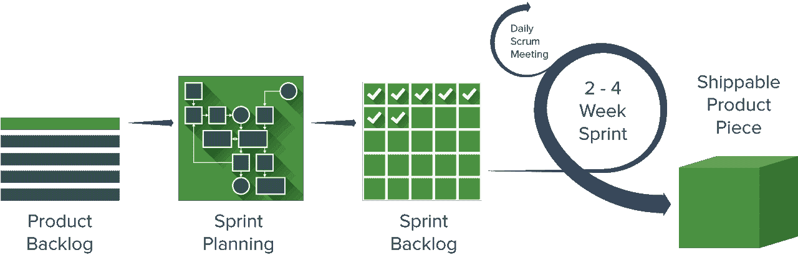
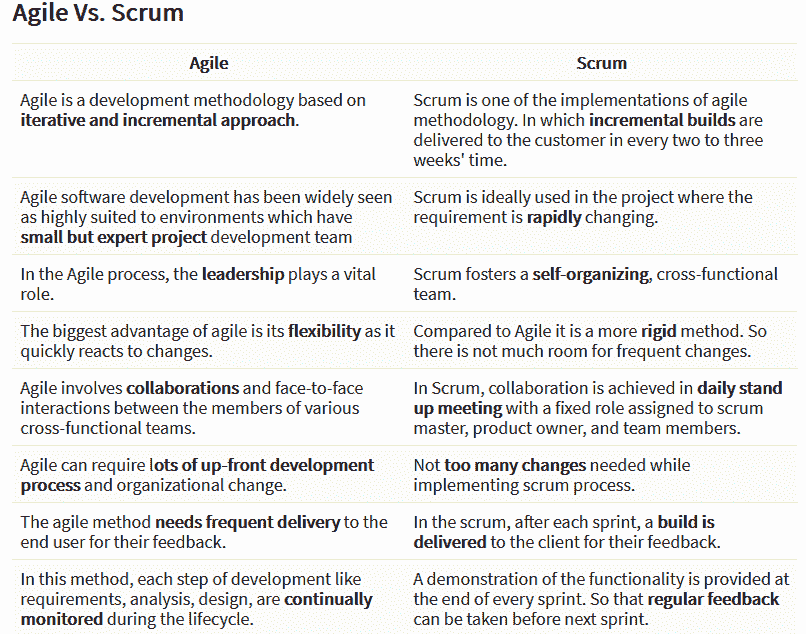

# Scrum 大师应该避免的 6 个错误及其补救措施

> 原文：<https://simpleprogrammer.com/scrum-master-mistakes/>

敏捷方法已经成为软件开发公司中最流行和最有活力的项目管理风格之一。

值得注意的是，敏捷可以应用于许多类型的项目和团队，而不仅仅局限于工程师或软件开发项目。[敏捷框架](https://www.cio.com/article/3156998/agile-development/agile-project-management-a-beginners-guide.html)由于其有效和快速的结果，在全球所有不同类型的组织中广泛使用。

我们将会看到敏捷团队中被称为“scrum master”的成员的一些最佳实践，他们可以帮助任何组织走向成功。这里有一些陷阱，以及可能的补救措施，来帮助说明 scrum 大师的角色。但是让我们从几个基本术语开始。

## 什么是 Scrum 大师？

软件交付过程贯穿着一种叫做“scrum”的敏捷方法 Scrum 是一种迭代软件开发模型，它允许我们处理软件开发中的复杂性。它在不同部门的工程团队中得到广泛认可，从制造到运营和教育，以及各种不同的业务。

在 scrum 方法论中，有 sprints，这是一个固定的术语，大约持续两周。在每个 sprint 中，一个团队在软件开发过程中工作，在每个 sprint 结束时，整个团队计划下一步。这里有一个例子:

*通过 Smartsheet.com 的 Scrum 框架图像*

敏捷和 scrum 都遵循相似的软件开发过程，有一个主要的区别:敏捷建立在一套原则之上，而 scrum 遵循特定的指导方针和规则。两者都是为了实现敏捷哲学。

以下是敏捷和 scrum 的快速区别:

*图片来源:Guru99*

Scrum 是项目管理中最新的时髦词汇，现在被世界上许多公司和组织所接受。一些项目负责人仍然没有意识到 scrum 的潜力，这可能会导致公司或团队面临巨大的损失。利用 scrum master 技术可以很容易地避免这种情况。

成为 scrum 大师是一项艰巨的工作，一些开发人员不明白这是什么。通常， [scrum masters 被误认为是项目经理](https://www.greycampus.com/blog/project-management/scrum-master-vs-project-manager-how-are-they-different)或项目负责人。但现实并非如此。scrum master 是团队中负责团队成员的建议，同时有效维护项目工作的人。

### 错误 1:表现得像一个项目经理

采用敏捷方法的公司遵循每日的 scrums。这意味着项目需要每天跟进，以便更有效、更快速地部署。在这里，scrum master 经常扮演项目经理或项目负责人的角色，密切关注其他团队成员。

敏捷框架不应该激发一种命令和控制的心态，在这种心态下，领导者分配任务并指示工作。Scrum 团队被认为是自组织的，因为 scrum 大师是仆人式的领导者，团队通过更有效地交付更大的价值来学习更好地表现。

如何处理:scrum master 不应该主导与团队成员的日常会议，还应该询问成员的意见并相应地工作。scrum master 应该让团队成员问自己“接下来应该完成什么？”而不是给出日常任务

### 错误 2:独自做决定

这可能是一个严重的问题，因为提出单方面的解决方案可能会对所有人产生误导性的影响，这种情况可能会使团队成员愤怒并失去对项目的关注。scrum 大师需要考虑每个人的意见，而不仅仅是自己做决定。

scrum 团队需要像大师一样给出输入，这样他们才能一起更好地工作。每个人的建议和意见都要记在心里，才能做出最好的决定。

**如何处理:**询问每个团队成员的个人意见是主人的唯一责任。scrum 大师并不知道所有的事情，所有人给出的意见有时会产生比之前决定的更好的解决方案。团队成员的意见和 scrum 主管的意见一样重要。

### 错误 3:经常检查团队成员

scrum 大师经常犯下过于频繁地检查团队成员的错误。这样做会降低 scrum master 在成员眼中的形象，最终使他成为一个糟糕的领导者。我们应该避免这种情况，因为这会导致成员变得愤怒，破坏与 scrum master 的关系。

频繁的跟进会在 scrum 团队中造成不信任的局面。没有人喜欢在完成工作时每分钟都被分析。

**如何处理:**团队成员不仅是 scrum master 的工人，也是他们的伙伴。因此，scrum masters 应该像任何人信任他们的亲密伙伴一样信任团队成员。这将使他们有更多的空间自由工作，并在各自的工作中更突出地代表自己。允许团队成员对自己负责会提高工作效率，但同时，scrum masters 应该鼓励他们，如果需要的话，及时地就项目进行交谈。

### 错误 4:认为敏捷很容易

It is evident that Agile methodology provides faster ways to identify errors and solve them as soon as possible. Transition to Agile takes time for any organization.

在最初的阶段，总会害怕搞砸。适应敏捷肯定是费时的，但是一旦你搞清楚了，它就变得熟悉多了，产品也能更快地交付。

**如何处理**:当 scrum 大师开始尝试敏捷方法时，事情会变得更加困难。随着时间的推移，它会看起来很自然，并改善沟通，时间管理，等等。

### 错误 5:不能快速处理变化

实施 sprints 可能需要多一点时间，但据估计，任何事件都不应该超过 15 分钟。每天的 scrum 一般不应该超过 15 分钟，但是团队成员经常会开始讨论他们的技术困难，这将导致它超过分配的时间。

当变化发生时，不迅速认识到变化会导致麻烦，因为这会给客户带来压力并动摇他们对组织的信心。获得定期更新有助于改进整体产品开发。

**如何处理**:限时冲刺的方法是让团队成员在会议期间站立 15 分钟，最终让他们感到疲劳，他们会更快地完成会议。此外，scrum masters 应该习惯于经常性的变更，因为快速适应变更以跟上项目的进度是非常重要的。

### 错误 6:不直接沟通

通常，scrum 成员在与产品负责人交谈时会感到有点焦虑。他们认为最好通过电子邮件交流来寻求答案。这种沟通无助于解决问题，但由于沟通不畅，往往会产生新的问题。

scrum 主管不应该充当中间人；因此团队成员应该被授权自由地直接向产品所有者提问，以解决疑问。

如何处理:电子邮件似乎是一个更好的选择，但有时它会导致误解或传达不完整的细节。和产品负责人面对面沟通是更好的选择，更有效。这也有助于提升团队成员在与人交流时的信心。直接沟通有助于立即解决问题并节省时间。

## 在你走之前

我们已经看到了 scrum 大师面临的一些障碍，以及解决这些障碍的最合适的方法。这些问题可以通过使用技能、专业知识和经验实现 scrum 来克服。因此，正如 Barry Overeem 在他的论文中所指出的，考虑每一个需要 scrum master 解决的小问题不仅有助于 scrum 团队的成长，还能在预防和扑灭火灾之间找到正确的平衡。

scrum 大师通常被定义为清除障碍的人。一个人不应该等到每天的混乱造成了障碍；scrum 大师应该利用一个冲刺目标，并尝试实现透明的决策。

scrum 大师还应该跟踪固定的障碍，通过创造性地消除障碍来了解组织，并与产品负责人合作，以停止以错误的方式花费时间和精力。因此，实施所有这些已定义的补救措施有助于为您的组织实现最佳结果。

所以，遵循正确的指导总是更好的选择。继续学习！