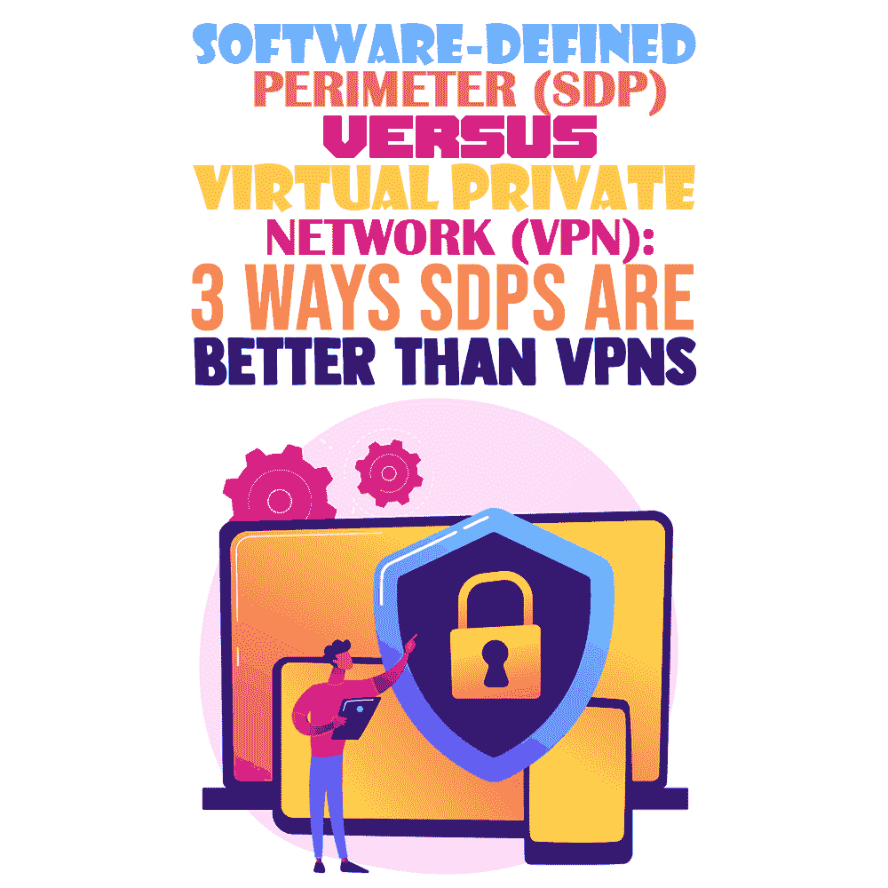

# 软件定义的边界(SDP)与虚拟专用网络(VPN):SDP 优于 VPN 的三个方面

> 原文：<https://simpleprogrammer.com/sdp-vs-vpn/>

A virtual private network (VPN) needs no introduction. Not only have you heard of it, but you are also likely using one on a daily basis. But traditional VPNs were invented over two decades ago at a time when enterprise applications were hosted in local data centers and most of the workforce worked on-premise.

如今，企业的运营方式大不相同，随着基于云的基础架构的日益普及，旨在保护的网络边界 VPN 实际上已经不复存在。

一个典型的企业现在有几十个应用程序托管在像亚马逊 AWS 这样的公共云平台上，更不用说大部分(如果不是全部的话)大大小小的公司员工现在出于需要正在远程工作环境中蓬勃发展。

因此，虽然传统的 VPN 允许安全的远程访问，但现代分布式企业网络需要更多。如今，许多应用程序和数据不再位于单一网络边界之内，而是转移到了云中，这一事实呼唤着对新一代 VPN 的需求。

进入软件定义的边界(SDP)技术。

在这篇文章中，我将向你展示什么是 SDP，它们是如何工作的，以及它们相对于 VPN 的主要优势。您将会发现，SDP 是未来的发展方向，因此了解它们的关键特性非常重要。

## 什么是 VPN？

在我们深入了解 SDP 及其与 VPN 的主要区别之前，让我们快速回顾一下什么是 VPN。

顾名思义，VPN 为用户提供了一个私有的虚拟网络，因此他们可以以安全和匿名的方式连接到 web。

VPN 在您的设备(您的笔记本电脑或智能手机)和互联网之间创建了一个安全的连接—一个私有的“隧道”。当你上网时，它充当中介，隐藏你的 IP 地址——你的个人识别码，它揭示了你的位置，使你的身份和活动可追踪——从而帮助隐藏你的身份。

换句话说，专用网络允许你通过加密的安全连接(使用不同的协议，如 IPSec、SSL、WireGuard 等)发送数据。)到外部服务器。从那里，流量被发送到互联网。这样你网上显示的 IP 地址也就被修改了。

因此，简而言之，VPN 帮助用户安全地连接到在线页面和应用程序。只要它是活动的，它就保持他们的连接和数据的私密性，并允许他们通过各种全球放置的服务器路由(和匿名)他们的流量。

## 什么是 SDP？

SDP 是一种基于零信任安全框架的网络安全方法。SDP 旨在提供相同的[用户体验](https://simpleprogrammer.com/user-experience-design/),无论用户是在内部还是在网络边界之外，同时仅允许访问用户需要的资源。

这种提供相同体验的能力意味着用户不需要记得像使用当前一代 VPN 那样连接。

术语“外围”经常引起混淆，因为它通常用来指非军事区(dmz)和防火墙等元素。尽管术语相当混乱，SDP 采取了完全相反的方法。

与传统的[企业架构](https://www.amazon.com/dp/0321127420/makithecompsi-20)不同，传统的[企业架构通过固定的边界将企业网络与外部世界隔离，SDP 在每个用户和他们访问的资源之间动态地创建一对一的网络连接。所有未经授权的网络资源都无法访问。](https://www.amazon.com/dp/0321127420/makithecompsi-20)

据 [Gartner](https://www.gartner.com/en/documents/3892882) 称，“由于应用动态、云的采用和合并，企业访问要求变得越来越复杂。为了克服这种复杂性，技术专业人员应该探索 SDP，这是一种新技术，其优势在于促进对企业应用程序的访问。”

SDP 被用作最终用户设备、控制器、服务器或网关上的软件。它既可以作为独立产品部署，也可以作为云托管服务部署。

## SDP 与 VPN:为什么 SDP 是未来的发展方向？

清楚了解软件定义的边界和虚拟专用网络之后，让我们看看两者之间的主要区别，以及 SDP 如何成为下一代 VPN。

| 方面 | 社会民主党 | 虚拟专用网络 |
| 安全性 | 

*   Authentication before access
*   Identity-centered access
*   Isolate application access to any application.
*   Make the application invisible until the user identity is authorized and authenticated.
*   Continuous risk assessment at device, user and application level
*   Minimal privilege access through IAM integration
*   Secure access to any application, cloud or on-premise, no matter where users are located.

 | 

*   Pre-authentication visit
*   IP-based access
*   Access to applications requires network access.
*   Ports exposed to the Internet
*   Equipment risk-free assessment
*   It is difficult to implement the least privilege access.

 |
| 管理 | 

*   Cloud delivery
*   Dynamically expand according to business needs
*   Infrastructure management for outsourced service providers
*   Integration with IAM, SIEM and other parts of the technology stack

 | 

*   Serious device-based
*   Inflexible infrastructure and static capacity
*   Administrative expenses of management
*   Configurations that are susceptible to misconfiguration and depend on other technologies.

 |
| 用户体验 | 

*   Consistent access across device types and platforms
*   Provide the same access experience for remote users and field workers.
*   Efficiently handle network transition and build for all device types.
*   Distributed service edge supports efficient routing to reduce latency.
*   Seamless authentication and single sign-on

 | 

*   Fragmented access experience and continuous recertification requirements
*   Provide access to remote users only.
*   Wireless and cellular connections and mobile devices are unreliable.
*   Traditional design brings speed and connection problems.

 |

总的来说，SDP 比传统的企业 VPN 要好。首先，它们提供了**更强的安全性**，因为它们允许对数据访问进行更严格的控制，最大限度地减少了企业网络的攻击面和风险。SDP 采用基于身份的方法，对每个用户设备实施定制的策略，而 VPN 访问则过于宽松，允许远程员工访问比完成任务所需更多的网络。

SDP 还提供更好的用户体验，而 VPN 通常不可靠且速度慢。相比之下，SDP 有一个全球性的接入点(pop)网络，它提供了一个减少延迟和优化数据路由的网络主干。

SDP 的另一个优势是它们提供了**更大的可扩展性。**对于许多公司来说，VPN 是根据需求安装和扩展的。随着业务的增长和增加额外的 VPN 连接来为业务合作伙伴和客户提供支持，管理的复杂性和成本都会显著增加。

相反，在每个用户价格固定的情况下，无论用户需要访问多少网络资源，具有云原生基础架构的 SDP 解决方案都可以快速、轻松、经济地扩展到数千个并发用户，依靠全球 pop 的主干。

此外，尽管有这些优势，SDP 通常成本更低。SDP 云平台通常不会按增加的数据中心或站点数量收费，而是按连接的用户数量收费，从而降低总成本。VPN 则不同，在 VPN 中，添加多个站点和数据中心会增加成本，因为需要额外的基础设施和许可证。

事实上， [Gartner 预测](https://cloudsecurityalliance.org/blog/2021/02/15/how-to-choose-a-zero-trust-architecture-sdp-or-reverse-proxy/)到 2023 年，60%的企业将淘汰大部分远程访问虚拟专用网络(VPN ),转而采用 SDP 等零信任网络访问(ZTNA)安全模式。因此，SDP 显然是前进的方向。

## SDP 是前进的方向

凭借[改善的最终用户体验](https://www.amazon.com/dp/0321205685/makithecompsi-20)，更好的可扩展性和更大的灵活性，SDP 不仅提供了当前一代 VPN 的所有功能，还提供了针对 VPN 许多缺点的解决方案，如更严格的安全性，包括基于应用的安全性。

SDP 可以让你在不改变网络基础设施或应用程序的情况下，采用零信任模式的谷歌 BeyondCorp 方法。远程员工、合作伙伴、承包商和客户都可以轻松、精确地访问特定资源，而无需传统的 VPN。