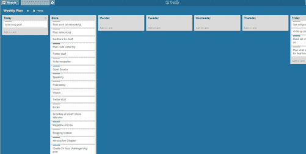
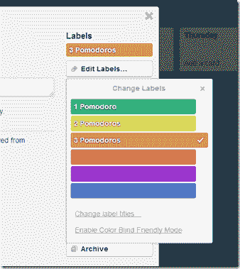
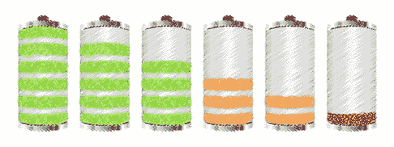

# 我荒谬生产力的秘密。(我现在正在用)

> 原文:[https://simple programmer . com/secret-raving-productivity-im-using-now/](https://simpleprogrammer.com/secret-ridiculous-productivity-im-using-now/)

去年，我:

*   [为 Pluralsight 制作了 30 个完整长度的视频课程](https://simpleprogrammer.com/pluralsight)
*   写了 56 篇博文
*   [制作了 40 集的起床和编码播客](http://getupandcode.com/)
*   [制作了 50 个 YouTube 视频](http://www.youtube.com/jsonmez)
*   [出书](https://leanpub.com/whymarketingyourselfisimportant)
*   [在 4 场活动中发言](http://codecamp.org/Raleigh)
*   超过 100 小时的合同工作
*   [创造了一个完整的产品，我正准备推出](https://simpleprogrammer.com/howtomarketyourself)
*   每周跑 3 次，每次 5 公里
*   每周举重 3 次，每周

我这么说不是为了吹牛——尽管我确实为这些成就感到自豪。我说这些是为了证明我知道我在谈论什么是生产力。

## 超级高效

现在——当我打字的时候——我有一个计时器在计时。时钟显示离我下一次休息还有大约 14 分钟。我的生死取决于这个时钟。

你可能已经猜到了，但这个时钟是一个[番茄钟](http://www.amazon.com/gp/product/B00A376NI8/ref=as_li_ss_tl?ie=UTF8&camp=1789&creative=390957&creativeASIN=B00A376NI8&linkCode=as2&tag=makithecompsi-20)计时器。在过去的一年里，我一直虔诚地使用番茄工作法，不仅是为了完成任务，也是为了计划我的一天和一周。

如果你不熟悉番茄工作法，这个概念非常简单。如此简单，以至于我一开始认为这很可笑。但是，由于我的好朋友乔希·厄尔的成功，我决定再试一次。

你基本上设置了 25 分钟的计时器。在那段时间里，你选择一个单一的任务去完成，并且不间断地工作。25 分钟后，你休息 5 分钟，然后重新开始。4 个周期后，你需要休息 15 分钟。(对此有一些变化，但这是基本的想法。)

就像我说的，这看起来很简单，不起眼，但我甚至无法表达这项技术对于完成工作有多么强大。

我天生懒惰。我必须不断地与想拖延和放弃工作的那一面作斗争。番茄工作法通过强迫我不间断地工作一段时间来帮助我集中注意力。它也给了我一个比较自己的标准和渴望达到的现实目标。

## 我的一周

我的一周从星期一开始。周一早上，我起床后去健身房举重。当我回来的时候，我喝一杯蛋白奶昔，然后开始工作。

周一我回到办公桌后做的第一件事就是启动我的番茄闹钟，打开我的“周计划”板。我用这个黑板来组织我的一周。它有九列。七列表示一周中的每一天，一列表示今天，一列表示完成。

我每天的第一个任务是创建我认为我能在那周完成的剩余任务。我从我知道自己每周需要做的事情的清单开始:

*   博客帖子
*   播客插曲
*   YouTube 视频
*   简讯电子邮件
*   缓冲社交网络帖子

然后，我为那周我正在做的当前项目添加卡片。

一旦我把我能想到的所有卡片都放在黑板上，我就开始用一种颜色标记每张卡片，这种颜色代表我认为这项任务需要多少番茄。我有三个类别:

*   绿:1 个番茄
*   黄色:2 个番茄
*   橙色:3 个番茄

如果一件事要占用三个番茄多的时间，就需要把它分成多个任务。

接下来是计划一周。一周中的每一天——除非有什么事情会占用我大部分时间——我估计我可以做大约 10 个番茄。这可能看起来不多，但相信我，确实很多。我把卡片拖到栏里，直到每个工作日我都装满了 10 张番茄纸牌。周末的时候，我通常会拖三四个小时。

我的估计总是偏高，但它们相当准确，因为以半小时为间隔进行估计相当容易——尤其是当你的许多任务每周重复时。(比如一篇博文估计三个番茄。)

## 我的一天

我每天都有类似的仪式。每天锻炼后，我做的第一件事是再次打开我的 Trello 板，这次是计划一天。

新的事情出现了，其他的事情需要改变，所以仅仅计划一周是不够的。通常，我会有不同的任务，这些任务我在一周开始的时候已经模糊地确定了，我会在以后更清晰地说明。

我首先从适当的一天把事情拖到我的“今天”栏，直到这一栏充满了大约 10 个值得做的工作。在那之后，我会看一下今天的专栏，想想我可能错过的需要在那天完成的事情。最后，我会根据优先级对“今天”栏进行排序——**我想确保我总是先处理最重要的事情。**

一旦我把一天安排好了，我就回到一周的其他日子里，在卡片上走来走去，直到一切都恢复平衡。如果我发现我有一些空的位置，我会创建新卡并开始填充这些位置，直到我再次达到最大容量。

一旦所有的准备工作都完成了，就到了真正开始工作的时候了。我抓起清单上的第一项任务，启动计时器，开始工作。大约 5:00，我停下一天的工作，把我的番茄加起来。如果我没有达到至少 10 点，我指望那天晚上工作一点。如果我打了 10 分，这是可选的。

## 为什么会这样

所以，你可能想知道为什么会这样——为什么值得写这么简单的工作流程。嗯，尽管这个工作流程看起来非常简单，但是这里有一些关键的东西并不是很明显。

首先，我使用配额来确保我每周完成我想要完成的工作量。我对每周需要制作的博客文章、播客、YouTube 视频和其他内容都有配额。由配额衡量的东西会先放到我的板上。

说到番茄，我也使用每天和每周的配额。番茄对于我来说是很小的可测量的工作单位。我知道我每天应该能完成 10 件事，我应该能在一周内完成大约 50 件事而不会累死自己。我从经验中知道，达到 60-70 分会导致下周的表现明显下降，如果我的成绩低于 50 分，我就是在偷懒。 

因为我有这些配额，所以我知道每周对我的期望是什么。我有能力让自己对一个真正可衡量的标准负责。我再怎么强调这一点的重要性也不为过。如果你没有办法让自己对自己想要达到的标准负责，人性会让你远远低于标准。

使这项技术成功的另一个主要因素是在给定的时间内意识到我的能力。很容易高估或低估你一周能完成的工作，因为你通常没有一把尺子来衡量任务持续时间和你的实际能力。当我开始一周的工作时，我知道我的容量大约是 50-我的车里有那么多油。我可以选择那周我想把车开到哪里——我只能开到这里。我必须对我实际能做的事情做一个现实的预测。根据这个预测，我必须优先考虑我的任务，这样最重要的事情才能先完成。

如果不了解自己的能力，就很容易陷入高估自己完成工作的能力和低估完成工作所需时间的陷阱。有了这个系统，我就有了一个可以比较的真实指标。我知道我不可能在一周内完成 80 个番茄。我知道在一天 8 小时的工作中，我不可能完成 8 小时的工作。我正在用真实的统计数据来取代我的偏见。

最后，番茄工作法的专注让我在工作中更有效率。当我一次只专注于一项任务时——不用查看脸书或推特——我的工作效率会高得多。几项研究表明，一心多用会导致效率下降。当我专注于一项任务时，我会完成更多。我以前写过这个问题，当我谈到辞职的时候，但是你很容易在一天中因为一些小事情而失去几个小时的时间。**在一年的时间里，所有这些被浪费的分钟可能最终等同于数周的生产力损失。**

## 好处

这项技术的一个巨大好处是，我可以毫无压力或负罪感地完成大部分工作。通常，当我工作的时候，我总是会为自己一天浪费了多少时间而感到内疚。我也因为没有完成我应该完成的工作而感到压力。这种压力和内疚的情况实际上最终成为拖延和倦怠的完美温床。

当我使用番茄工作法时，我不会有浪费时间的罪恶感，因为我知道只要我在一天内完成 10 个番茄工作法，我就达到了当天的工作目标。如果我做得更多，很好。

我也不会因为完成了我应该做的那么多而感到压力，因为我完成了多少不再是衡量的标准——我已经卸下了肩上的重担。我的关注点已经从结果转移到过程。我不能控制结果。工作花多少时间就花多少时间。但是，我可以控制这个过程。如果我在一天中放入了 10 个番茄，并且我已经充分地优先考虑了我的工作，那么我已经做到了我能做到的最好——不需要内疚、羞愧或压力。

## 休息时间到了

如果你对番茄工作法感兴趣，我推荐你去看看[有插图的](http://www.amazon.com/gp/product/B00A376NI8/ref=as_li_ss_tl?ie=UTF8&camp=1789&creative=390957&creativeASIN=B00A376NI8&linkCode=as2&tag=makithecompsi-20)番茄工作法。如果你对我的过程和它是如何工作的有任何问题，请随意提问，我很乐意在下面的评论中回答。

此外，如果你喜欢这篇文章，并且对我要说的关于提高生产力和促进你职业发展的更多内容感兴趣，[在这里注册我的每周简讯](https://simpleprogrammer.com/email)。你可能也想看看我正在组织的名为[的课程，“如何作为一名软件开发人员推销自己”](https://simpleprogrammer.com/howtomarketyourself)