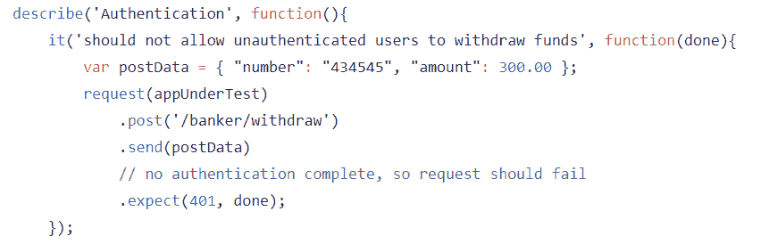
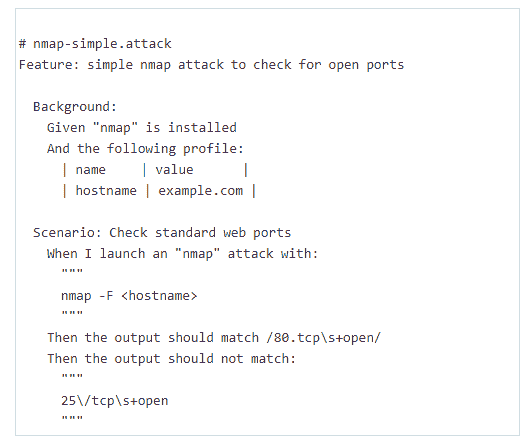
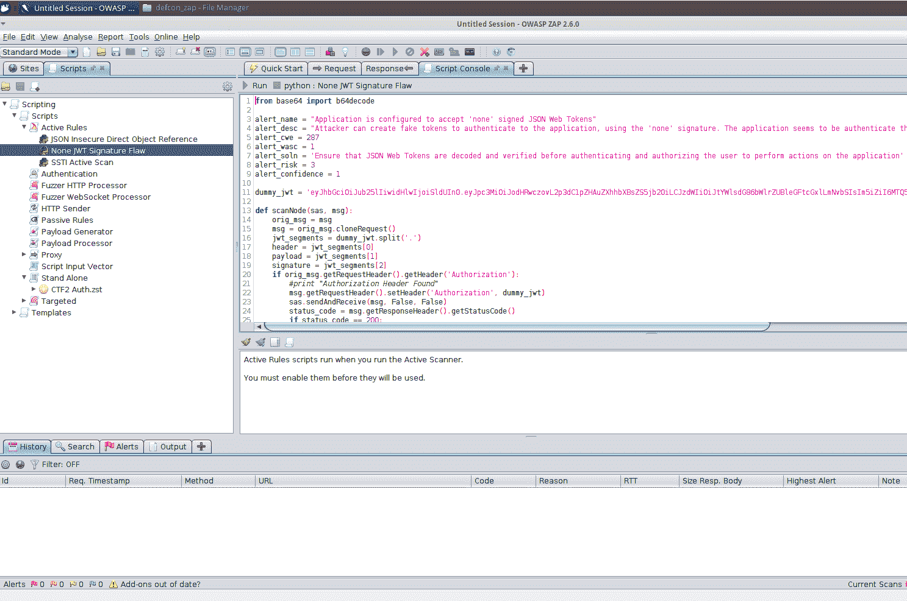

# 作为代码的安全性:为什么思想转变对于安全开发是必要的

> 原文：<https://simpleprogrammer.com/security-code-secure-devops/>

Inertia is “the tendency to do nothing or remain unchanged.” It is a strong force in physics. It also often holds sway in the technology industry.

到 1996 年，[互联网协议第 6 版(IPv6)](https://en.wikipedia.org/wiki/IPv6) 的第一个官方定义诞生了。20 多年后，IPv4 仍然是使用的主要版本。IPv6 正在缓慢发展，但在可预见的未来，它不会成为主要的 IP 版本。谈到技术，惯性是很强的。

心智模型也是如此。往往某种思维方式生根发芽，改变那种思维就变得越来越难。最终，那些新进入一个行业的人会简单地跟随其他人的做法。

然而，环境的变化必然要求思维的变化。DevOps 就是这样一种环境变化。DevOps 实践正在彻底改变软件的构建方式，比以往任何时候都更容易交付高质量的软件。

不幸的是，[有些人认为](https://media.licdn.com/mpr/mpr/AAEAAQAAAAAAAAheAAAAJDY4NTBhNzhkLWE1OWUtNDk5ZC1hYzkxLTVhNWYxYmE2ZWVjYg.png)在这个过程中应用程序的安全性被抛在了后面。如果安全性要跟上 DevOps 实践，开发人员和安全专业人员都需要转变他们的思维模式。开发人员需要拥抱安全，安全专业人员需要拥抱开发实践。

让我们看看为什么传统的安全思维不适合 DevOps 世界，需要什么新的思维方式来取代它。

## 传统安全实践

首先，让我们从传统应用程序安全性的“日常”开始。

一个开发团队苦干于最新的应用程序，这将使公司赚很多钱。它采用了最新最棒的技术。开发人员迫不及待地要发布它。直到应用程序安全团队开始研究。

在应用程序发布前一个月，安全团队审查架构和代码。他们发现了一系列的安全问题，并将它们提交给开发团队来解决。

现在有两件事发生了。要么不得不推迟应用程序的发布，要么发布的应用程序带有几个可能被利用的漏洞。

DevOps 实践和传统安全之间存在对立的力量。开发人员希望尽快交付价值(DevOps 实践)，而安全团队希望在发布之前暂停并确保一切都是安全和稳定的(传统的安全实践)。

那么这种对立如何化解呢？

## 作为代码的安全性

One of the fundamental tenets of DevOps is “[Infrastructure as Code](https://www.thoughtworks.com/insights/blog/infrastructure-code-reason-smile).” Technologies such as [Ansible](http://www.ansible.com/), [Chef](https://www.chef.io/chef/), and [Puppet](https://puppetlabs.com/) allow you to define your servers and infrastructure with programming language and deploy it in an automated fashion. With these tools, you can deploy the same setup for each instance of a server automatically.

将基础设施视为代码一直是 DevOps 实践的主要推动者，但它也需要实践它的人的思想转变。系统管理员遵循开发实践，并将代码保持在源代码控制中。开发人员现在了解了更多关于服务器设置的知识。它使两者能说同一种语言。

自动化测试是 DevOps 运动的强大催化剂。重要的是将功能测试推到“左边”，或者开发生命周期的早期。这使得您可以更快地找到并修复 bug，从而减少进入生产环境的 bug。

应用程序安全性是自动化测试的下一个目标。应用安全问题现在可以前所未有地自动化。但是为了让这些自动化实践解决安全问题，开发人员和安全专业人员需要进行思想上的转变。我们需要将安全“左移”我们需要安全代码。

## 开发人员，考虑安全性

在最近关注敏捷实践和[自动化测试](https://simpleprogrammer.com/selenium-with-node-js/)之前，开发人员倾向于自己编写代码而不进行测试。更常见的是将代码交给质量保证团队，让他们去发现错误。

人们最终接受了在开发周期的后期发现并修复 bug 要比在早期发现它们花费更多的钱。开发人员现在不得不考虑如何测试他们的代码。测试驱动开发试图确保代码与所需的功能相匹配。

安全应该没有什么不同。安全性是质量的一部分，应该像功能一样进行测试。

从项目一开始就考虑安全性的开发人员会实践测试驱动的安全性。这是通过编写安全测试用例来完成的，这些测试用例从一开始就以自动化的方式验证您的软件是安全的。

### 实现安全测试用例

这看起来像什么？开发人员根据应用程序的需求创建功能测试。安全需求也是如此。

例如，如果您正在构建一个需要身份验证的 REST API，那么您需要创建测试来确保在没有正确身份验证的情况下不能访问任何受限制的 URL。

看下面的例子(这里还有更多)。这是 Node.js REST API 中的一个测试，确保当身份验证令牌没有随请求一起发送时，返回 401 HTTP 代码。

如果这段代码失败了，那么您的身份验证代码就有大问题，需要检查一下。在开发期间和构建管道中本地运行这些测试。它们会让您确信您的系统的基本安全需求已经得到满足。

这是否意味着你不需要审查你的代码？不，人类仍然更善于发现导致漏洞的复杂错误。自动化基础工作，让人们发现复杂的问题。

开发人员和质量保证测试人员可以使用的另一个测试工具叫做 [Gauntlt](http://gauntlt.org/) (读作“gauntlet”)。Gauntlt 允许你使用类似于流行的[黄瓜](https://cucumber.io/)框架测试的句子结构来创建安全测试用例。看起来是这样的:

该测试使用 Nmap 检查服务器上打开的端口。在部署之后，这可能是一个有效的冒烟测试，以确保只有必要的端口在 web 服务器上打开。像这样的测试显示了安全测试用例的有用性，并且测试添加到您的项目中并不困难。

开发人员需要像对待单元和集成测试一样对待安全性测试。自动化您的测试，在保持交付速度的同时，为您的应用程序的安全性提供信心。

## 安全从业者，更像开发者一样思考

另一方面，传统的安全专家通常不遵循开发周期。许多人根本不了解软件开发实践。应用程序安全团队一直等到开发团队拍拍他们的肩膀，要求他们审查他们的应用程序。这通常发生在应用程序投入生产之前。

安全团队进行审查，然后传递一个 PDF 格式的结果文件。这在 DevOps 环境中不起作用，因为它的伸缩性不足以跟上应用程序的变化。同时运行许多应用程序和项目的大公司永远不会有足够大的安全团队来及时审查它们。

因此，应用程序安全团队也需要将安全性视为代码。这种作为代码的安全性不是应用程序测试用例，而是使用代码来自动化安全测试工具，以使测试更加高效。

让我们来看看这是如何工作的。

### 自动化您的渗透测试

OWASP Zed 攻击代理 (ZAP)是一个强大的渗透测试工具，用于测试 web 应用程序并发现可利用的漏洞。它有许多不同的方式来扫描开箱即用的应用程序，只需按一下按钮就非常有效。

然而，像 ZAP 这样的工具的真正价值是它对定制脚本的支持。ZAP 允许你创建定制的脚本来自动化复杂的测试，而这是人类可以做到的。

当使用像 ZAP 这样的工具时，应用程序安全团队可以使用的一个好策略是自动化您的手动测试结果。像往常一样对您的应用程序执行手动渗透测试，并记录发现的有趣和复杂的漏洞。然后使用 ZAP 将这些手动测试转换成自动化脚本。

现在，您可以将该脚本指向任意数量的类似应用程序，并在设置手动测试所需的一小部分时间内对它们进行测试。看看下面的例子:

看看 ZAP 中的脚本。它检查以确保应用程序不接受未签名的 [JSON Web 令牌](https://jwt.io/)。对所有需要 JSON web 令牌的 Web 应用程序运行这个测试，您会更快地发现问题，而无需手动渗透测试。

不要被我接下来要说的吓到:安全从业者可能必须创建他们自己的代码库，并使它们保持最新。开一个 GitHub 账户，玩玩它，了解它是如何工作的。请一位友好的开发人员向您展示如何在您使用的任何源代码控制系统中创建项目。一旦你学会了源码控制是如何工作的，你会发现使用它有很大的好处。

开发人员需要考虑安全性。安全专家需要思考发展。自动化是跟上开发运维环境的唯一方法。

### 为开发人员启用自助安全性

DevOps 的另一个关键租户是开发人员自助服务。开发人员现在可以根据需要随时创建服务器和环境，并在完成后拆除它们。

应用安全团队应该认识到这一点，并接受开发团队的自助服务。使用自动化工具使开发人员能够更快地发现 bug。在构建管道中集成安全测试工具，并确保它们在每次提交时运行。像 ZAP 和 Gauntlt 这样的工具可以很容易地在 Jenkins 这样的 CI 服务器中设置为任务。

在可能的范围内，应用程序安全团队应该将安全工具引入开发人员的日常工作中。IDE 插件可以帮助开发人员在编写代码时发现安全漏洞，而不是在几周或几个月后。 [Puma Scan](https://www.pumascan.com/) 是 Visual Studio 的一个插件，用于扫描 C#代码中的安全问题，而[查找安全漏洞](https://find-sec-bugs.github.io/)是 Eclipse 的一个流行插件，用于扫描 Java 代码。这些插件让你的软件更加安全，同时教会开发者如何安全地编码。

最后，当对代码库和构建进行扫描时，开发人员需要看到结果。创建可使用的仪表板，从安全角度清楚地显示应用程序的运行状况。

不要只把这个责任交给安全从业者，要让开发团队看到存在什么问题，并在他们使用的任何项目管理或 bug 管理软件中为他们创建标签。

## 作为代码的安全性:保护 DevOps 的途径

保护开发运维工作流似乎令人望而生畏。这种感觉源于坚持旧的做事方式，这些方式在这个令人兴奋的新世界中不再适用。

开发团队需要将安全性视为质量。在测试中给予安全性一流的地位，从一开始就保护您的应用程序。

同样重要的是，安全不能再成为发展的绊脚石。寻找自动化安全测试的方法。在构建安全软件方面为开发人员提供帮助，并帮助他们采取后续步骤。

当我们将安全性作为代码实现时，无论是技术上还是思想上，安全的 DevOps 都将成为现实。