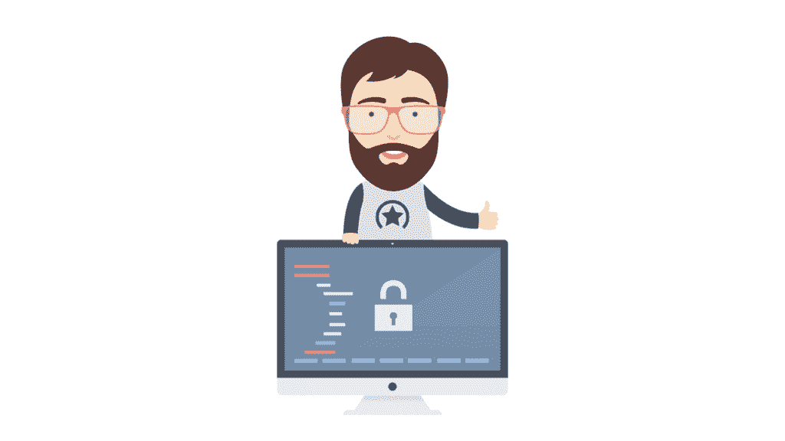

# 从一开始就确保安全

> 原文：<https://simpleprogrammer.com/security-from-the-start/>

如今，安全问题不断出现在新闻中。系统被攻破，信息被泄露，身份被窃取。该领域的渗透测试人员和安全专家比以往任何时候都多，这让一些人想知道问题出在哪里。

我认为其中一个问题是在我们的软件开发圈子里缺乏安全意识。所有这些安全问题的背后是一种心态，即“现在编码，以后修补安全。”

这需要改变。

## 保持安全心态

但是到底什么是“安全思维”？

安全思维包括像恶意入侵者一样思考。这是一种精神状态，在这种状态下，你所做的一切都受到潜在滥用的审查。问题永远不应该是“人们会尝试破解这个吗？”而是“如果这个被黑了会怎么样？”

安全从来都不是绝对的。相反，它是由一系列的层次构成的。我们必须为我们从事的每个项目选择适当的安全级别。

例如，在您的 Flash 版本的 *Pong* 中实现双因素认证显然是矫枉过正，但是没有对网站登录的输入进行净化是疏忽的。

有意识地了解什么样的安全级别适合您正在从事的项目是很重要的。这可以通过几个基本问题来确定:

1.  “我在处理什么样的数据？”请记住，客户数据应该始终保持私密，并在需要知道的基础上，即使是简单的事情，如电子邮件地址。
2.  “这还能访问其他什么系统？”许多关键系统的黑客攻击都是通过看似无害的系统中的漏洞发生的。一个很好的例子就是许多简单的 wordpress 插件，它们被用来提升对网站和服务器的访问。
3.  "我的安全措施是否对用户做出假设？"在一个所有用户都有非常棒的密码的世界里，加盐将远没有现在重要。我们不能对用户密码的质量做出假设，因为提供商比最终用户承担更多的安全责任。
4.  "这个项目将依赖哪些第三方资源"了解您的依赖关系可以防止第三方软件的安全漏洞。

问这样的基本问题是安全思维的全部内容。就像退一步，试着从另一个角度思考问题一样简单。做起来不需要很长时间，从长远来看可以省去很多麻烦。

### 嵌入式软件安全

嵌入式软件是忽视安全性的一个大问题。在为银行创建登录门户时，程序员不敢考虑忽略安全性，但同样的开发人员在为 usb 键盘编写代码时，可能根本不会考虑安全性。

我妻子是 1 型糖尿病患者，依赖胰岛素泵。对那些不熟悉的人来说，这是一个小装置，通过管子和一根一直插在她皮肤上的针与她相连。该泵包含一个胰岛素储器，全天向她输送救命激素。它具有蓝牙功能，允许她从血糖仪上控制胰岛素剂量。

现在，如果开发人员没有安全意识，为所有这些泵上的蓝牙连接设置了相同的默认密码，会怎么样呢？更糟糕的是，如果连接没有加密，根本不需要密码，那该怎么办？

他们可能会想，“谁会想黑掉胰岛素泵？”答案是，任何喜欢挑战的人。

回顾一下历史，你会发现人们过去常常用“盒子”来攻击电话公司，比如允许他们免费打电话的米色盒子。人们会，因为他们可以。我们已经在汽车行业看到了类似的问题。

像汽车的自动平行泊车功能这样简单的东西提供了一个漏洞，允许黑客控制 2015 款吉普的[方向盘。](https://www.wired.com/2015/07/hackers-remotely-kill-jeep-highway/)

开发人员在编写这些嵌入式功能时没有安全意识，结果是克莱斯勒付出了昂贵的召回代价。

## 对安全漠不关心的原因是什么？

### 教育

我认为这个问题的主要原因之一可以追溯到大学的计算机科学课程。

没有向本科生提供足够的安全课程。这些课程不仅应该更容易获得，而且对于获得软件开发领域学位的学生来说是强制性的。向学生讲授特定的常见漏洞(如数据库注入)可能会有所帮助。然而，对我们的教育系统来说，更重要的是教会学生“像黑客一样思考”。这类似于“给一个人一条鱼，喂他一天；“教一个人钓鱼，让他终身受益”谚语。通过教授安全思维和心态，我们可以更好地为下一代开发人员做准备。

我也鼓励所有计算机科学专业的学生参加 bug bounty 项目，因为这可以在这个领域提供丰富的真实世界经验。这将有助于下一代程序员从安全的角度来处理事情，在生产之前预防问题。这正符合一句老话，“一盎司的安全抵得上一磅的补丁”，或者类似的话。

### 投资于安全的责任

提高安全性的另一个障碍存在于公司内部。

似乎许多公司并没有从一开始就看到投入资源来提高安全性的价值。我在一家公司做了一年半的服务台技术人员。在那段时间里，我编写了一些软件来简化工作。该公司有分布在 35 个州的 1，000 多台机器需要管理，而只有五名服务台工作人员的团队却很少。

如果他们需要对机器进行全公司范围的更改，他们会让我们五名员工一个接一个地远程操作这些机器并应用这些更改。我编写了补丁部署软件，允许我们通过上传到服务器的脚本来部署变更。

当我这样做的时候，我的代码从来没有被另一个工人检查过。虽然我很感激这种信任，但滥用职权或犯错误的可能性非常高。他们从未质疑过我系统的安全性。

在最初的几个版本启动并运行后，我自己意识到如果 FTP 服务器被入侵，攻击者可以上传他们自己的脚本在这些机器上执行(其中许多用于零售点)。所以我自己承担起实现文件的非对称认证的责任，这样只有我们用私钥签名的脚本才会被执行。那家公司很幸运，我没有辜负他们的信任！

然而，为了实现这个安全措施，我不得不争取额外的时间，因为他们不想“浪费”时间。在这种情况下，是管理层没有安全意识，而不是程序员。

这就是自上而下的安全思维如此重要的原因。有些人按照要求去做，仅此而已。在一些工作场所，主动提高安全性实际上会给你带来麻烦。

许多经理和企业主没有看到的是，将安全放在第一位实际上会通过建立客户的可靠性和信任来提高利润。[仅塔吉特一家就因信用卡违约](https://techcrunch.com/2015/02/25/target-says-credit-card-data-breach-cost-it-162m-in-2013-14/)、[损失超过 1.6 亿美元，更不用说对其品牌](https://techcrunch.com/2015/02/25/target-says-credit-card-data-breach-cost-it-162m-in-2013-14/)的信任损失了。

虽然不是所有的管理者和所有者都能学到现代安全的所有技术细节，但是能够并且应该向企业中的任何领导角色传授安全意识的原则和安全的整体重要性。

## 越早越好–抢先打补丁

当[开始一个项目](https://simpleprogrammer.com/2016/12/16/9-steps-to-approach-development-task/)时，有许多重要的事情需要考虑。我们的工作就是将安全性作为考虑因素之一。修补应被视为最后的手段，而不是项目初始阶段忽视安全性的借口。

忽视安全性会增加与未修复的 bug 一样多(如果不是更多)的技术债务。很多时候，客户只是完全错过了需要的补丁。此外，补丁也有可能破坏其他功能，因为安全补丁需要快速编写和部署，这使得测试变得困难。

## 尊重最终用户

归根结底，这一切都取决于我们对用户的尊重程度。人们很容易对用户感到厌倦，但他们是最终让我们就业的人。他们是我们作为软件开发人员存在的理由，因此他们的安全和用户需求应该总是放在我们工作清单的第一位。

不可能防止所有的安全漏洞。然而，作为开发人员，我们应该开始推动我们的雇主和教育工作者从一开始就认识到安全思维的重要性。

我相信，如果我们齐心协力，将用户放在第一位，并自上而下地优先考虑安全问题，我们将大大减少我们在新闻中看到的伤害公司和客户的重大黑客事件。

因此，下次当你在编写一些普通的、看似不重要的代码时，请记住，安全从你开始。

## 资源

关于最新的安全新闻，请查看安全网站上的。如果你对 bug bounty 程序感兴趣， [HackerOne](https://hackerone.com/) 是一个很好的起点。你也可以搜索[国家漏洞数据库](https://web.nvd.nist.gov/view/vuln/search)来寻找最新的安全漏洞。最后，由迈克尔·霍华德、大卫·勒布朗和约翰·维埃加撰写的 *[软件安全的 24 大罪](http://www.amazon.com/exec/obidos/ASIN/0071626751/makithecompsi-20)* 涵盖了软件开发中许多最常见的安全问题。