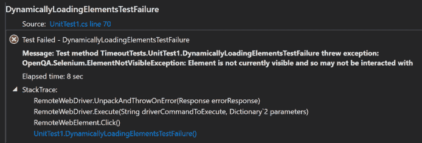

# 硒教程

> 原文：<https://simpleprogrammer.com/selenium-webdriver-tutorial-master-synchronization/>

为什么对自动化测试进行适当的同步很重要？

你曾经处理过古怪的自动检查吗？间歇性失败且不确定原因的检查？如果检查在您的持续集成环境中失败了，但是在本地工作呢？

所有这些都可能是测试中不正确同步的结果。同步指的是自动化检查的速度应该与被测应用程序(AUT)的速度相一致。基本上，如果您的自动化检查的代码运行得比实际的 AUT 快或慢，您将会遇到我上面列出的所有问题。

如果您的代码运行得太快，它将无法在页面上找到您期望的 HTML 元素。如果你的代码运行太慢，你将在测试执行过程中浪费宝贵的时间。无论哪种方式，这都会破坏您的功能检查的声誉，并认为它们是“古怪的”或“缓慢的”。你的自动支票不应该有那些红字。

因此，正确的自动化功能 GUI 测试同步技术对于任何测试自动化工程师来说都是非常重要的。本教程将深入研究 Selenium Webdriver 提供的所有超时和同步选项。

## 先决条件

* * *

我假设您已经或知道以下内容:

1.  Some flavor of Visual Studio installed

    -虽然我将使用 C#进行教学，但这里的大多数概念和思想可以应用于其他绑定，如 Java、Ruby 等。

2.  C#的一般知识
3.  对 [Selenium Webdriver](http://courses.ultimateqa.com/courses/selenium-with-c?coupon=simpleprogrammerparallelpost) 的基本了解
4.  使用 HTML 理解元素定位器

## 我们将测试什么应用程序？

* * *

这就是我们今天要与之共事的人。一位名叫 Dave Haeffner 的 Selenium 大师使用这个应用程序来教授 Selenium Webdriver。测试的目标非常简单:

1.  导航到页面
2.  点击 id 为“开始”的按钮
3.  确保 id = "finish "的元素出现在页面上

## 不正确的同步示例

* * *

我写了一个[快速测试](https://github.com/nadvolod/WebdriverTimeoutsTutorial)来给你一个当你的同步策略没有达到标准时会发生什么的例子。看一下这段代码:
如果您尝试在您的 Visual Studio 中运行测试，您可能会收到类似下图的消息。

那么这个测试为什么会失败呢？花点时间思考一下，然后浏览一下应用程序或者[浏览一下代码](https://github.com/nadvolod/WebdriverTimeoutsTutorial)。

由于不正确的同步，自动检查失败。按下“开始按钮”后，有一个加载屏幕，我们必须等待 5 秒钟。然而，在我们的自动化检查中，我们没有这样的同步点。因此，当我们的测试执行下面的代码行时，Webdriver API 在 500ms 内返回，并说这个元素不可见。当然，这是不可见的，有一个愚蠢的加载图标，我们没有考虑到:

为了解决同步问题，我将教你 3 种应用到测试中的技术。

## Selenium Webdriver 中的**隐式**等待是什么？

* * *

Selenium 中的一个**隐式等待**来自 Watir 的隐式等待思想。这里我们告诉 Webdriver 在试图查找一个或多个元素时轮询 DOM 一段特定的时间。默认设置为 0 秒。一旦设置，超时设置为驱动程序的生命，直到它再次改变。

([硒 HQ](http://www.seleniumhq.org/docs/04_webdriver_advanced.jsp#implicit-waits)

##### 如何使用隐式等待？

一旦创建了一种类型的驱动程序，您就可以访问 ImplicitlyWait()方法。这个方法采用一个 TimeSpan 对象，您可以用它来指定在抛出一个 **NoSuchElementException** 之前您希望驱动程序等待的最长时间。

##### 隐式等待的优缺点是什么？

**优势**

*   创建这些类型的同步非常简单快捷

**缺点**

*   超时持续到驱动程序的生命周期。有些情况下，当自动检查找不到元素时，您希望自动检查立即失败。因此，您将需要在这段时间内重置等待，并记住在完成后将其设置回原始值，因为其余的测试现在将使用新值
*   因此，测试可能会更加繁琐或者运行时间更长

##### 隐式等待会引发什么异常？

OpenQA。硒。NoSuchElementException

## 什么是 Selenium Webdriver 中的**显式**等待？

* * *

一个**显式等待**是您定义的代码，在代码中进一步处理之前等待某个条件发生。最糟糕的情况是线程。Sleep()，它将条件设置为等待的确切时间段。提供了一些方便的方法来帮助您编写只在需要时等待的代码。WebDriverWait 与 ExpectedCondition 结合使用是实现这一点的一种方式。([硒 HQ](http://www.seleniumhq.org/docs/04_webdriver_advanced.jsp#implicit-waits)

##### 如何使用显式等待？

**预期条件**

这些是可以与 WebDriverWait 类一起使用来检查对象状态的一组常见条件。

一些最常见的包括:

| **名称** | **描述** |
| 元素存在 | 期望检查页面的 DOM 中是否存在元素。这并不一定意味着元素是可见的。 |
| elemontisvisible | 期望检查一个元素是否出现在页面的 DOM 上并且可见。可见性意味着元素不仅被显示，而且高度和宽度都大于 0。 |
| [frame tobealableandwittoit(字符串)](https://seleniumhq.github.io/selenium/docs/api/dotnet/html/M_OpenQA_Selenium_Support_UI_ExpectedConditions_FrameToBeAvailableAndSwitchToIt_1.htm) | 期望检查给定帧是否可切换到。如果帧可用，它将给定的驱动程序切换到指定的帧。 |
| [文本呈现元素](https://seleniumhq.github.io/selenium/docs/api/dotnet/html/M_OpenQA_Selenium_Support_UI_ExpectedConditions_TextToBePresentInElement.htm) | 期望检查指定元素中是否存在给定文本。 |
| [URL 包含](https://seleniumhq.github.io/selenium/docs/api/dotnet/html/M_OpenQA_Selenium_Support_UI_ExpectedConditions_UrlContains.htm) | 期望当前页面的 URL 是一个特定的 URL。 |

所有预期条件的完整列表[可以在这里](https://seleniumhq.github.io/selenium/docs/api/dotnet/html/T_OpenQA_Selenium_Support_UI_ExpectedConditions.htm)找到。

##### 显式等待的优缺点是什么？

**优势**

*   显式等待是动态的，非常适合定位转换点之间的元素。它将等待指定的最长时间，但仅在必要时
*   Selenium Webdriver 提供了内置的 ExpectedConditions 类，这样我们就可以用一两行代码来检查我们的 web 应用程序的不同条件

**缺点**

*   与隐式等待相比，存在更大的进入障碍，因为我们需要学习应用显式等待的所有不同方式
*   如果使用线程。Sleep()，这会使我们的功能测试变得非常脆弱和缓慢

### 显式等待会引发什么异常？

OpenQA。硒。NoSuchElementException

## 不要混淆隐式和显式等待

* * *

需要注意的是，不要混合使用隐式和显式等待。主要问题是隐式等待可能会被嵌入到 Selenium Webdriver 使用的不同组件中，所有的可执行程序如 ChromeDriver.exe、IEDriverServer.exe 等等。因此，当您在不同的隐式等待之间进行多次跳转时，您可能会误入“未定义的行为”( [Jim Evans](http://stackoverflow.com/questions/15164742/combining-implicit-wait-and-explicit-wait-together-results-in-unexpected-wait-ti/15174978#15174978) )。

我强烈建议您只使用显式等待。

[这个帖子](http://www.aptuz.com/blog/selenium-implicit-vs-explicit-waits/)很好地传达了混音等待时的未定义行为。

## 默认等待

* * *

默认等待，在 Java 中也称为流畅等待，是一种利用 C# Webdriver 绑定的 Default Wait 类来设置同步超时的等待。在 Java 中，WebDriverWait 类继承自 FluentWait 类。但是，在 C#中，WebDriverWait 类继承自 DefaultWait 类。因此，不同的命名。请记住，WebDriverWait 类是我们用来构造性感的显式等待的类。看一下这个片段:

##### 如何使用默认等待？

DefaultWait 类向我们公开了所有的功能来构造真正受控的同步点。例如，我们可以设置轮询间隔、要忽略的异常，甚至编写我们自己的自定义消息。

##### DefaultWaits 的优缺点是什么？

**优势**

*   为我们提供了一种非常好的控制 Selenium Webdriver 等待的方式

**缺点**

*   您需要定义自己的预期条件才能使用这些函数
*   创建简单的同步点需要太多代码
*   大多数功能已经通过 WebDriverWait 的两个构造函数公开了

**结论**

我创建了下面的表格来帮助您容易地理解三种同步技术之间的区别，您可以使用它们来改进您的测试。

| **等待类型** | **定义** | **用途** | **默认超时(秒)** |
| 隐形的 | 告诉 Webdriver 在一定时间内轮询 DOM | [https://gist . github . com/nadvolod/92a a44d 6b 1516 CB 65d 7 def 7 af 2429726](https://gist.github.com/nadvolod/92aa44d6b1516cb65d7def7af2429726) | Zero |
| 显式等待 | 这是您编写的代码，用于等待特定条件发生后再继续 | https://gist.github.com/nadvolod/b3a4f1c44f229a18037d48290df4994e | .5 |
| 默认等待 | 这个类允许您指定轮询间隔、消息、要忽略的异常等等。 | https://gist.github.com/nadvolod/9249cd30ac71065da2d20242f3683ac0 | 取决于您的实现 |

Selenium 社区建议您优先使用显式等待，因为它们为您的测试提供了最大的好处。然而，使用类似线程的东西。Sleep()几乎是不可接受的。在我的职业生涯中，我只有少数几个硬编码等待时间的例子。相反，您应该利用 WebDriverWait 和 ExpectedConditions 进行显式等待。

知道默认等待是很好的，只是为了把它放在你的后口袋里。然而，我从来没有使用它们的需要。事实上，我花在他们身上的时间最多的就是这个教程。在我看来，WebDriverWait 类很好地向我展示了所有相关的功能，而不必升级到 DefaultWait 类。然而，这并不意味着它对你不起作用。

也许你会发现这个类的一些可怕的用途。如果有，请告诉我，我很想知道你是如何使用这个类的。

最后，不要忘记本教程的整个目标是让你的自动检查更加稳定，从而为你的雇主提供更高的价值。所以，去做好你的检查吧。直到下次自动化爱好者！

当你继续学习更多的技能和概念时，一定要看看我们简单的程序员课程:[快速学习任何东西的 10 个步骤。](https://simpleprogrammer.com/store/products/learn-anything-quickly/)T3】

## 额外资源

* * *

*   [Selenium Webdriver 同步视频教程](http://courses.ultimateqa.com/courses/synchronization-techniques?coupon=simpleprogrammerparallelpost)
*   [Selenium Webdriver 超时](http://goo.gl/w4bt8f)
*   [Selenium web driver c#中的 WebdriverWait 类](https://goo.gl/5dZtwh)
*   [Selenium web driver Java 中的 WebdriverWait 类](https://goo.gl/O26UKE)
*   [Selenium Webdriver 显式和隐式等待](https://goo.gl/O26UKE)
*   John Sonmez 的 Selenium 框架