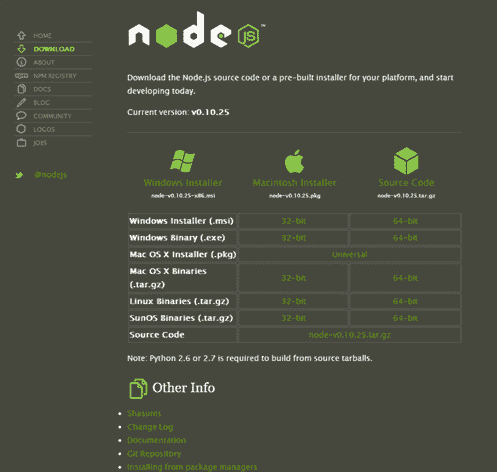
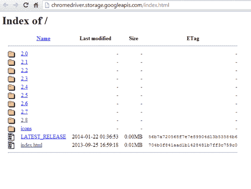
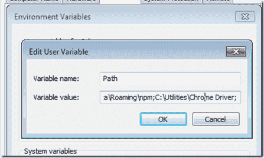
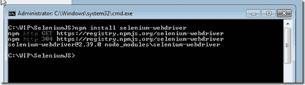
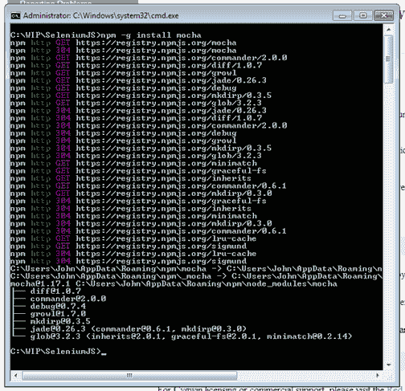
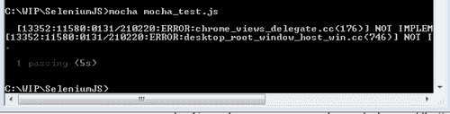

# 使用 Node.js 和 Mocha 的 Selenium:使用 JavaScript 的自动化测试

> 原文：<https://simpleprogrammer.com/selenium-with-node-js/>

我一直觉得有点奇怪，我们不得不使用 C#或 Java 这样的语言来编写使用 Selenium 的自动化测试。

并不是说我不喜欢这两种语言，但是——尤其是在现代 JavaScript 时代——主要用 JavaScript 编写一个 web 应用程序，然后用 C#、Java、Ruby 或 Python 为它编写自动化测试，这有点奇怪。

这就是为什么我非常兴奋地看到有针对 JavaScript 的 Selenium 绑定，它允许您用 JavaScript 编写自动化测试并从 Node 运行它们。您终于可以将 Selenium 与 Node 一起使用了。

在这篇文章中，我将带您了解使用 Selenium 和 Node.js 以及 Mocha 进行设置和运行一个简单的基于 JavaScript 的测试的过程。

(这里的说明是针对 Windows 的，但是如果你计划在 Mac 或 Linux 上运行你的测试，你可以很容易地理解这篇文章的大部分内容——事实上，这应该容易得多。)

另外，在你开始学习任何新技能或概念之前，我建议你看一下我的课程[“快速学习任何东西的 10 个步骤”](https://simpleprogrammer.com/store/products/learn-anything-quickly/)。

## 安装 Node.js

在开始之前，我们首先需要安装 Node.js。

只需前往 Node.js 站点的下载页面，找到每个平台的 Node.js 的[下载。](http://nodejs.org/download/) 

只需选择合适的版本并安装。您将需要 Node.js 来运行 JavaScript 测试，因为您需要某种方式来本地执行您的 JavaScript。

*(如果你有兴趣进一步了解 Node.js，我推荐优秀的 [Node.js in Action](http://www.amazon.com/gp/product/1617290572/ref=as_li_ss_tl?ie=UTF8&camp=1789&creative=390957&creativeASIN=1617290572&linkCode=as2&tag=makithecompsi-20) 这本书。)*

## 通过节点工作获得硒

一旦我们安装了 Node，我们需要获得 Selenium webdriver，这样我们就可以真正有一种方法来自动化浏览器。

不过没那么快，在我们让那部分工作之前，我们需要确保我们有最新的 chrome 驱动程序。先去[下载 Chrome 驱动](http://chromedriver.storage.googleapis.com/index.html)放在你的 PATH 里。

现在，我们已经准备好获取 Selenium webdriver 绑定，我们将使用它从 JavaScript 中自动化浏览器。绑定将通过 JavaScript 公开 Selenium API，我们可以通过在 Node 中导入一个模块来访问它。

转到您将要创建测试项目的位置，并在那里打开一个命令行或终端窗口。

我们将使用 Node 的内置包管理器，或 NPM，来安装 Selenium webdriver 包。

只需运行*“NPM 安装 Selenium-web driver”*即可在当前项目目录下安装 Selenium webdriver。

让我们做一个快速测试，以确保到目前为止一切正常。

使用以下代码在项目中创建一个名为 *first_test.js* 的文件:

然后，通过运行以下命令来执行代码:

> *node first_test.js*

你应该看到 Chrome 浏览器弹出，它应该搜索“简单的程序员”，然后退出。*(如果太快，去掉 driver.quit 线。)*

*(另外，一本关于硒的好书是[硒测试工具食谱](http://www.amazon.com/gp/product/B00AC1HDJI/ref=as_li_ss_tl?ie=UTF8&camp=1789&creative=390957&creativeASIN=B00AC1HDJI&linkCode=as2&tag=makithecompsi-20)。你也可以在 plur sight 上查看[我的课程。)](https://simpleprogrammer.com/pluralsight)*

## 加点摩卡

[Mocha](http://visionmedia.github.io/mocha/) 是一个测试框架，通常用于为 JavaScript 代码编写单元测试，但是当使用 Selenium with Node 时，我们也可以使用它作为驱动程序来驱动我们的 Selenium 测试。

我们也可以使用节点包管理器来获得 Mocha，但是对于 Mocha，我们希望使用–g 选项，它将全局安装包，而不仅仅是本地安装到我们的项目中。这将允许我们在不使用 [Cygwin](http://www.cygwin.com/) 的情况下在 Windows 上运行 Mocha。

继续输入以下命令安装 Mocha:

> *npm 安装–g 摩卡*

## 编写您的第一个测试

现在我们已经准备好使用 Mocha 编写我们的第一个测试了。

在目录中创建一个名为 mocha_test.js 的新文件，内容如下:

这个简单的测试将测试我们可以在谷歌的搜索框中键入“简单程序员”，并验证文本是否存在。

这是一个非常简单的测试，但是它展示了使用 Selenium 和 Node.js 创建自动化测试的基本框架。

您可以通过键入以下命令来执行测试:

> *摩卡摩卡 _test.js*

如果测试执行得太快，您可以注释掉*驱动程序。退出*以保持浏览器窗口打开。

## 更进一步…

好了，这应该让您开始使用 JavaScript 和 Node 运行由 Mocha 驱动的 Selenium 测试。

您可以使用这个基本设置来创建更加健壮的自动化测试。我称这种测试为黑盒自动化测试或 BATs。*(如果你想了解更多关于创建自动化测试框架的知识，请查看我的系列文章。)*

如果你喜欢这篇文章，请继续[在这里](https://simpleprogrammer.com/email)注册，以确保你不会错过像这样的其他内容。