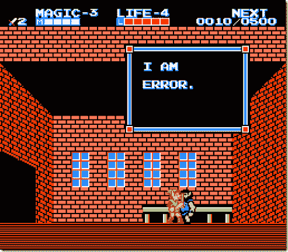

# 自本地化错误消息

> 原文：<https://simpleprogrammer.com/self-localizing-error-messages/>

昨天，我在试图找出错误消息的本地化位置时遇到了一个问题。

我们正在为基于 web 的应用程序使用 MVP(模型视图演示者)模式。我正在重构一些代码，将处理文件解析的业务逻辑从视图层移到模型中。

当我的文件解析类遇到错误时，它需要能够将这些错误发送回视图以显示给用户。

由于可能会有多个错误，并且如果遇到错误，我们不一定要停止解析文件，因此我们需要一种方法来将这些错误成批发送给 presenter，以便提供给视图。

在考虑本地化问题之前，列出一系列错误消息是很容易的。

文件解析器真的需要了解本地化吗？它真的应该处理错误消息字符串吗？

## 错误消息救援

一旦我找到了解决办法，它对我来说是显而易见的。

为什么不让错误信息自己本地化呢？事实上，为什么不给消息提供它所需要的特定于该实例的数据，并让它自己构造呢？

这是一个非常干净的解决方案。职责分明。让我们来看看新的流程。

1.  Presenter 将数据源交给文件解析器进行解析。
2.  解析器开始解析文件。
3.  当解析器遇到错误时，它会创建一个新的类型化错误消息，该消息实现 IErrorMessage。
4.  将错误消息列表返回给演示者。
5.  演示者遍历错误消息列表，询问每个错误消息的生成消息。(演示者对这里的本地化一无所知)。
6.  错误消息使用其内部数据和本地化来为演示者生成本地化的错误消息。
7.  演示者将生成的字符串传递给视图。

## 为什么这么热闹？

为什么不在文件解析器中本地化字符串呢？

好问题。这实际上可以归结为[关注点分离](http://en.wikipedia.org/wiki/Separation_of_concerns)和[单一责任](http://en.wikipedia.org/wiki/Single_responsibility_principle)。

理想情况下，我们不希望表示器或解析器必须知道任何关于从数据位生成字符串和本地化这些字符串的知识。

通过这样做，我们使软件更容易维护和调试，因为在一个地方只发生一件事。

想改变文件的解析方式吗？查看文件解析器；错误消息仍然处理生成它们的字符串表示，您不必知道如何处理。

想改变错误信息创建字符串的方式吗？看看那个错误消息类。

甚至演示者也不需要知道错误消息是如何格式化或生成的，它只需要知道它有一些错误，它可以告诉错误给它一个字符串表示。