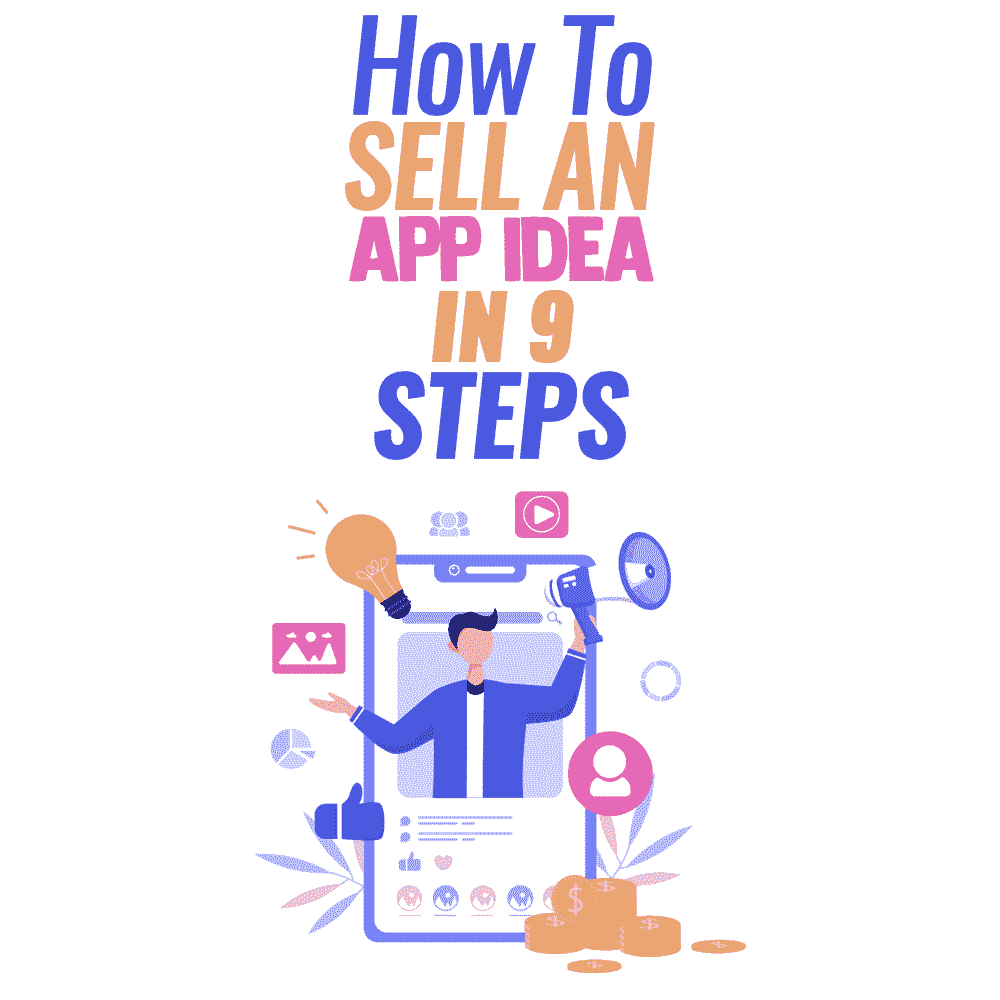

# 如何用 9 个步骤推销一个应用创意

> 原文：<https://simpleprogrammer.com/sell-an-app-idea-9-steps/>

In the market of modern innovations, ideas are as sell-eligible as full-fledged tech products. However, selling an application idea is much more difficult than selling an app that’s ready for launch.

原因应该不言而喻:你没什么好展示的！

这个世界充满了想法，但并不是所有的想法都是可行的。这让投资者和观众有理由怀疑，因为所有要展示的都是一个幽灵般的概念，没有任何有形的东西。

尽管有这个挑战，你仍然可以推销你的应用想法，只要你确保你有一些基础知识。

这正是我将在这篇文章中与你分享的，告诉你如何准备，这样你就可以最大化你的成功机会。

## 销售应用创意:9 步战略

因为想法不是有形的，所以很难估计它们的价值。根据你的想法的细节、它在市场中的相关性、它的特点以及你的应用程序所解决的问题，你的想法可能价值**5000 到 50 万美元。**

但首先要做的是。那么[你有一个应用程序的想法](https://themindstudios.com/blog/what-to-do-if-you-have-an-app-idea/) …下一步是什么？如果你非常确定你不想创建一个成熟的解决方案，让我们试着用九个步骤来推销一个应用程序的想法。

### 确保你的想法是可行的

在采取积极措施推销一个应用的想法之前，你需要确保它是可行的——也就是说，它会引起潜在投资者的兴趣。在这个阶段，你必须使用想法验证技术，如[市场调查](https://www.amazon.com/dp/0749475854/makithecompsi-20)，竞争对手研究和焦点小组调查。

第一步是市场调查。从市场概况开始，确定你的目标受众:谁更有可能对你的应用感兴趣，为什么？

之后，继续研究你的竞争对手。将你的想法与你的竞争对手已经实现的想法进行比较，确定他们的优缺点。

最后，与你的目标受众中的一些有代表性的成员取得联系，请他们分享他们对你将要创建的应用程序的看法。

### 在研究的基础上寻找改进你想法的方法

正如我上面给你展示的，验证你的想法不仅仅是确保你有一个好主意。这也是为了获得关于如何进一步改进你的应用想法的有价值的见解。

抓住这个机会，重新利用你的研究成果，让你的应用创意更具竞争力。这将有助于你让它对潜在投资者和科技公司更具吸引力，他们可能会使用你的应用开展业务。

此外，考虑一下在不久的将来相关的[移动应用开发趋势](https://financesonline.com/mobile-app-trends/)。按需、移动商务、人工智能和 AR 驱动的应用正在兴起。

### 创建一个原型

在你基于现实世界的研究改进了你的应用想法之后，你可以继续[创建第一个原型](https://www.amazon.com/dp/1491954086/makithecompsi-20)。

首先，你可以在纸上画出你的 UI。然后借助 UI 设计工具做一个数字版。这将有助于你将你的概念形象化，再一次向你的目标受众证明它，并将它与你的推销和商业计划一起展示给潜在的投资者。

### 写下推销词

推销是一个 30 秒的关于你的应用创意的故事，它应该确认它的价值并激发购买的欲望。

起草销售推介有[种不同的方法，但它应该针对你的目标投资者(对某个特定领域感兴趣的投资者)，关注你要解决的问题和你将如何解决，并列出主要的好处和价值。](https://www.saleshacker.com/sales-pitch-examples/)

### 用商业计划来支持它

撰写商业计划是一项具有挑战性但仍必不可少的任务。在它的帮助下，你将能够向你的投资者解释你的应用为他们打开了什么样的商机。对于仍然只是一个想法的应用程序的商业计划，您应该注意以下几个部分:

*   项目开发评估——投资者应该抓住投资这个想法及其开发的经济可行性，所以你应该尽可能地提出一个准确的[项目开发评估](https://simpleprogrammer.com/app-development-pricing-2021/)。
*   商业模式——试着用最清晰的方式解释你的商业模式，因为这是你未来应用赚钱的方式。商业模式应该是合法的，行业认可的，有收益保证的。
*   营销策略——此外，你应该建议一些行之有效的方法来营销你的应用程序，并用营销成本估算来支持它。关注品牌发展战略、社交媒体推广、搜索引擎优化和其他可能适合你的策略。

### 为你的应用程序名称和徽标注册商标

为你的应用程序名称和徽标创建商标是保护你的知识产权的下一步。一定要做到。然后你的申请想法就可以呈现给潜在的投资者了。此外，不要忘记你的应用程序的软件许可，以保护它免受黑客和盗版的攻击。

### 与投资者取得联系

现在是时候联系潜在投资者，让他们考虑你的应用创意了。有几个地方可以找到需要的人:

*   像[产品搜索](https://www.producthunt.com/)这样的创业平台
*   像 Funded.com 和 T2 这样的商业天使网络
*   像 [Kickstarter](https://www.kickstarter.com/) 这样的众筹平台
*   企业孵化器、加速器和专业企业网络

准备你的推销和商业计划。此外，考虑为您的项目创建一个演示视频。由于第一印象总是视觉上的，一个简短的解释者视频是一个很好的机会来解释你的应用程序想法是如何工作的，以及它为用户带来了什么样的价值。

### 协商条款和条件

How do you sell an idea for an app and get the most benefit out of it? The only answer is negotiating the price and other favorable conditions you may get.

例如，你没有义务出售一个想法和所有的知识产权。相反，你可能会同意某种形式的合作，根据这种合作，你将有资格获得部分利润。

如果你的想法是真正新鲜的，并且完全适合企业或用户的问题，你就有更多的机会进行条款和条件的谈判。

### 考虑在出售之前完成你的应用程序

正如我说过的，与[销售现成的应用](https://www.digifloor.com/top-9-mobile-apps-marketplace-buy-sell-source-code-21)相比，向公司销售应用创意更加困难。当你完成所有这些步骤后，你可能会觉得完成你的应用程序会比出售一个裸露的想法更有益。与简单的想法相比，现成的应用需要更多的时间和金钱投入，但它们也更有利可图。

所以，在这个阶段，确保冷静地比较每种策略的利弊。如果你有技术专长来完成你的应用程序，这可能更有意义。然而，如果你需要在技术开发上投资的成本超过了你可以从现成的解决方案中获得的金额，那么最好卖掉这个想法，然后继续头脑风暴下一个。

但是也许最有利可图的策略是在最小可行产品(MVP)阶段销售你的应用程序。在这个阶段，你已经有一个可行的解决方案，你有来自目标受众和受众本身的真实见解，你可以向投资者展示真实的商业价值。

## 创意也可以销售

利用应用创意赚钱是一种很有前途的盈利方式。如果你精通科技行业，并能直观地感受到差距在哪里，为应用程序开发创意可能是一项有前景的业务。

根据我与您分享的策略，开始销售您的应用程序创意，并通过与能够以最佳方式利用知识产权的公司分享您的知识产权来赚钱。