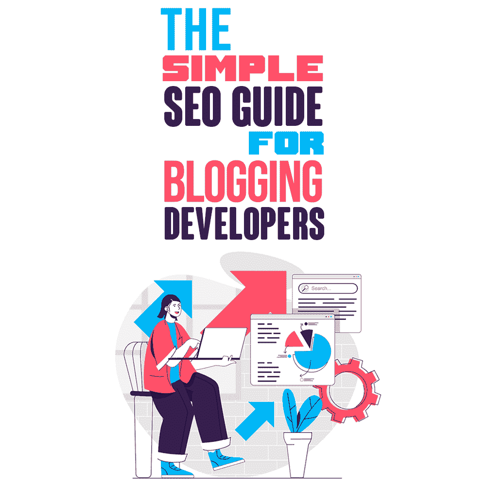
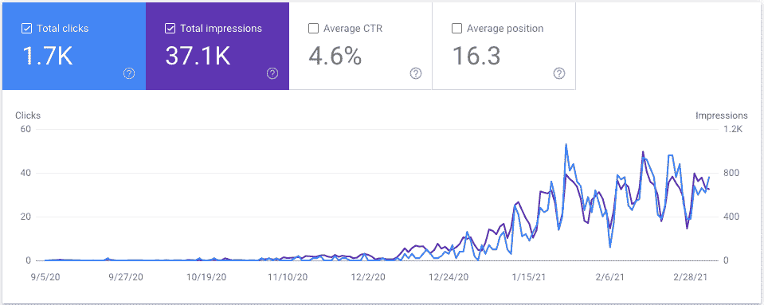
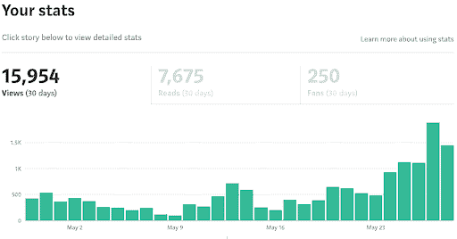

# 博客开发者的简单 SEO 指南

> 原文：<https://simpleprogrammer.com/seo-guide-blogging-developers/>

Have you been told that SEO is dying and that the blogging industry is losing its momentum to other mediums?

然后就是喋喋不休地说开一个博客有多难。所有的竞争。yeeeeaaaars 它可以让你的内容在谷歌的第一页排名。建设反向链接的辛劳。以及每天、每周或每月发布一次的痛苦。

所有这一切只是为了发现 SEO 正在失去它曾经拥有的蒸汽、推力和力量？

我发现这种 SEO jabber 就像特百惠聚会一样令人兴奋，就像不含咖啡因的咖啡一样有用。对其他行业来说可能是真的，但我们是软件开发人员。而大部分开发者在需要寻求一些帮助的时候又会跑去哪里呢？

**谷歌！**😋

*“谷歌一下就知道了”*–你知道吗？

当然，也有一些开发者会去其他地方——比如 YouTube。但是我们很多人更喜欢阅读而不是观看。我们习惯于阅读代码，那么为什么不阅读解释如何解决编码问题的博客文章呢？这就是为什么我们急着去谷歌。

我们会让其他人谈论在“SEO 的沉没泰坦尼克号”上重新安排他们的椅子他们可以哭诉他们的不幸，而你和我建立我们的博客，看着我们的排名飙升。

故事是这样的。我是这样做的。

不到一年前，我开始写自己的关于 Angular 的博客。并且发现 [SEO 并没有死](https://www.amazon.com/dp/B00NH0XZR0/makithecompsi-20)。

如果你愿意投入工作，你可以很快获得惊人的有机流量。一旦你在互联网上有了一个吸引人的地方，就有无数的方法通过这种关注获得一些被动收入。

那么怎么做呢？有哪些方法可以保证你的博客开始排名？即使你才刚刚起步，你又如何获得有机流量呢？

我不相信使用垃圾的、卑鄙的、可疑的 SEO 来提升你博客的 SEO 性能——他们以后只会反咬你一口。你必须愿意坚持不懈地努力工作。这里是我的五个最好的 SEO 技巧，可以帮助你的博客更快开始排名。

## 将您的网站添加到 Google 搜索控制台

*" **谷歌搜索控制台**是[谷歌](https://en.wikipedia.org/wiki/Google)的一项网络服务，它允许[网站管理员](https://en.wikipedia.org/wiki/Webmasters)检查索引状态和[优化他们网站的可见性](https://en.wikipedia.org/wiki/Search_engine_optimization)"— [来源](https://en.wikipedia.org/wiki/Google_Search_Console)*

这是可以给出的最重要的 SEO 技巧。最棒的是，这并不难做到。

如果你的网站没有在谷歌搜索控制台注册，那么你就无法知道你的开发者博客是否排名靠前，更重要的是，它的排名有多好。另外，谷歌不能开始对它不知道的网站进行排名，所以如果你的内容没有反向链接，那么谷歌就不会找到你的网站。

此外，你没有借口，当它只需要 15 分钟做这件事。

要开始这个过程，你需要进入[搜索控制台](https://g.co/searchconsole)，用你的谷歌账户登录。登录后，您会在左上角找到添加域属性的选项。

一旦你验证了你的域名(博客)的所有权，你就可以跟踪你的网站获得了多少点击。如果最初几个月你看不到任何活动，也不要气馁。对我来说就是这样，但几个月后，我开始排名，在我第一篇博客发布后的六个月内，我收到了 1700 次有机访问。

你也可以追踪你正在排名的关键词。这些信息是黄金，我们将在一段时间内使用它，使您的帖子在搜索结果开始排名时跃升至顶部。

## 写文章回答与你的领域相关的问题

首先，如果你的博客甚至没有一个主要的利基，那么你需要[决定一个利基](https://simpleprogrammer.com/philip-morgan-identifies-the-niche-to-position-in/)并专门就该主题写博客。我的小众是有棱角的，我选择有棱角的原因很简单，因为有棱角是我的激情。

最近的搜索引擎优化研究显示，在谷歌搜索中最常见的词是“如何”和“什么”

通常会找到一个标题为“*提高 React 应用速度的 9 种方法*”的内容虽然它可能充满了好主意，但它不会像类似的标题为“我如何才能提高我的 React 应用程序的速度”的内容那样受到关注或者“这是如何提高你的 React 应用程序的速度”会得到。

人们谷歌东西的原因是因为他们有疑问。他们从不去寻找九种方法来做这个或那个。他们只是想知道“我如何…”或“如何…”或“什么是…”

确保你的文章有一个标题，表明它将回答一个特定的问题。

## 将您的内容发布到其他平台

你的内容越引人注目，你的个人品牌就越大。通过将您的内容发布到其他平台，您的内容将覆盖更广泛的受众。

值得考虑的几个地方是 LinkedIn、 [Medium](https://medium.com) 和 [Dev Community](https://dev.to/) 。

每个星期，我都会把我的博客文章导入到 Medium 并发布在那里。就在上个月，我获得了 15，954 次浏览，我的关注者几乎翻了一番。

这是某种秘密的链接建设策略吗？不，不幸的是没有，因为这些大型出版网站会给你发布的链接添加一个属性，告诉谷歌爬虫不要跟踪这些链接。这样做的好处是，你的内容可以接触到更多的受众，让你的品牌得到更多的宣传。我强烈建议你在你发表的每篇文章的底部都包含一个你的博客的链接，这样读者就知道这篇文章最初是在哪里发表的。

Medium 的另一个很酷的特性是，随着你成为一名作家，很快就会有大型出版物要求出版你的内容。这让它出现在更多的眼球面前，给你更多的宣传。

此外，媒体的一个优势是，它们给你提供了为你的内容赚钱的选择。如果你决定把你的内容放在“付费墙”后面，那么只有订阅者能够阅读它，任何时候他们给你的文章鼓掌，你的银行账户都会听到一声“嘿！Ching！”当硬币滚滚而来。

发布到 LinkedIn 的好处是，它向你的职业网络证明了你的能力。如果你写了一篇关于 Python 的文章，那么很明显你是 Python 专家，对吗？LinkedIn 提供链接到一篇文章或者在 LinkedIn 内部写一篇新文章的选项。关于如何做到这一点的建议是有争议的，但我建议你只链接回你的博客，而不是将你博客的内容复制到 LinkedIn 的新文章中。

## 研究搜索引擎优化王

有大量的搜索引擎优化专家在不断地测试搜索引擎优化行业，发现什么搜索引擎优化技术效果最好，以及如何应用它们。他们不断地在博客上分享什么可行，什么不可行——而且是免费的！所以为什么不让他们为你做所有的尝试和错误的事情呢？直接从马嘴中抓取最佳 SEO 实践？

尼尔·帕特尔是一位让我受益匪浅的专家。这里有一些值得研究的博客文章，外加一门免费的 SEO 课程。

布莱恩·迪恩也有一份值得订阅的电子邮件简讯。他发出的每封邮件都是 SEO 金。

## 打破这个搜索引擎优化规则，你就完蛋了

当你写内容想在谷歌首页排名的时候，你需要关注的一件事是什么？

关注高质量的、解决问题的、有娱乐性的[内容](https://simpleprogrammer.com/youre-one-piece-content-away-changing-life/)来帮助人们。说真的，这是你应该关注的 20%，它会让你获得 80%的结果。

你的内容必须有帮助。它需要解决一个问题，并提供一个解决方案，策略，技术，以及任何对你的读者有帮助的东西。更好的是，加上一点幽默。或许再来几张搞笑的 gif？还是爆笑图？确保它是好的，诚实的幽默——没有古怪的东西，取笑少数民族或黄色笑话。

在你的帖子中加入一些描述性的形容词——如果你需要帮助，可以使用一本同义词词典——但是不要太多，因为你想让它听起来像你。讲个故事。分享你试图帮助读者解决的问题的个人经历。给它一点个人特色。

正如一位企业家曾经说过的，“不确定写些什么？写下你在谷歌上搜索时找不到的文章或博客文章。

那么为什么这个建议很重要呢？

谷歌的排名算法是不断更新的。仅仅一年时间，他们就更新了排名算法 3200 次。因为谷歌对给用户提供最好的内容感兴趣，他们希望高质量的内容出现在搜索结果中，他们不断调整自己的算法，剔除差的结果，用更好的结果取代它们。

所以，弄清楚如何利用你的博客提供大量高质量的、解决问题的、有趣的内容。

## 努力是值得的

And that, my friend, concludes our quick trip into the SEO jungle. I’ve done my absolute best to give you the five top places you should be swinging your SEO ax to get the best organic results quickly.

你猜怎么着，我一次都没有提到链接建设！

通过遵循这五个步骤，[提高你的 SEO 知识](https://www.amazon.com/dp/1118921755/makithecompsi-20)并且每周额外投资一两个小时来优化你的博客的 SEO 性能，你可以为你的博客带来成千上万的有机访问。让你的品牌更受欢迎。发现比你想象的更多的机会。

听起来工作量太大了？记住约翰说的话:

“如果你做容易的事，生活就会变得艰难。如果你做了困难的事，生活就会变得容易。约翰·松梅兹