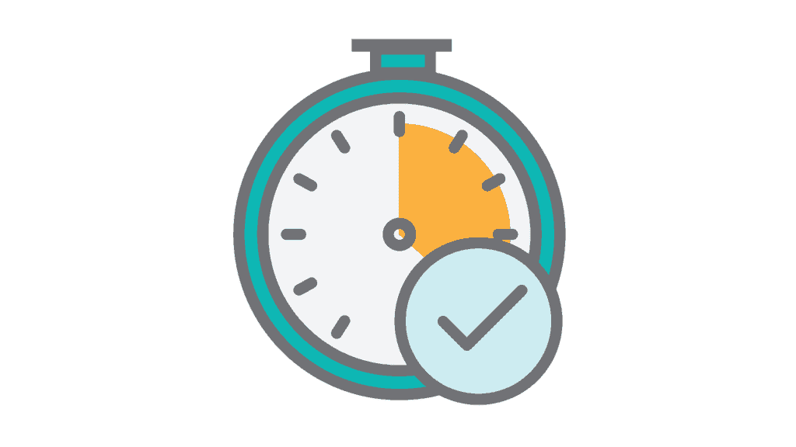

# 作为一个家庭生活繁忙的开发者，如何打造一个副业项目

> 原文：<https://simpleprogrammer.com/side-project-with-a-busy-family-life/>

毫无疑问:作为一名程序员从事兼职项目总是一件好事。但这并不意味着，将编写下一个应用程序或 SaaS 项目这样的副业嵌入到有配偶、孩子和日常工作的繁忙生活中会很容易。

最近我自己也在做一个副业: [Getappvise.io](https://www.getappvise.io) 。我这样做的时候，正忙于我的房子，与我的妻子和家人共度美好时光，并抚养我四岁的双胞胎。

也许你也是一位母亲或父亲，或者也许你很快就会成为。如果你想知道即使在忙碌的家庭生活中，你是否还能做些副业，我可以告诉你:总有办法让事情发生。

在这篇文章中，我想就如何在繁忙的社交和家庭生活中开始和完成一个业余项目提供一些建议，否则这些生活可能会让你的日程表排得满满的。

## 忙碌的生活是幸福的生活

你知道该怎么做:你的生活中充斥着社交活动，比如和家人以及其他你关心的人在一起。

大多数人参加社团，参加他们的课外活动，在团队运动中出汗，或者花时间做他们喜欢的事情。这些活动通常是人们指望你出现并参与的活动。

当你关心的人指望着你的时候，你不想让他们靠边站。另一方面，重要的是要确保当你开始花时间在一个兼职项目上时，你不会感到压力过大。你需要[在检查](https://simpleprogrammer.com/2017/03/20/work-life-balance/)中保持工作生活的平衡。

如果你有很多对你来说很重要的朋友、同事和家人，那就太好了。这也使得那些埋头于屏幕前设计、编码、测试和部署副业项目的人变得更加困难。

作为一名开发人员，你知道当你在*区*编码你的解决方案时，很容易忘记你周围的世界和人。但是不要害怕。总有办法让事情运转起来，只要你努力让你的副业与你的个人生活保持一致。

## 去过那里，编码过

我一直想在参与忙碌的家庭生活的同时，创建一个兼职项目。作为我亲爱的妻子的工作丈夫，我四岁双胞胎(一男一女)的父亲，我希望有一篇文章能给我一些指点，告诉我如何在业余时间建立和执行一个兼职项目，同时平衡家庭生活。如果有一个向导来解释如何准备我的环境和我需要采取的步骤，以便我的想法可以转化为人们可以在网上找到和使用的东西，那就太好了。

我不会在这件事上欺骗你；这不是一条容易的路。

即使当你的副业项目很小的时候，从你头脑中的小想法[到你可以实际运输的产品或服务](http://www.amazon.com/exec/obidos/ASIN/1422166961/makithecompsi-20)可能会感觉像让一枚自主火箭降落在浮动的着陆台上一样困难。

我想让这篇文章成为我多年前想读的东西。让我向你介绍一下我在繁忙的生活中从事副业所学到的东西，以及如何正确设置。

## 大约是时间

时间也许是程序员拥有的最大资源。你只能花一次，而且你总是需要弄清楚你打算把它花在什么地方。然而，与金钱不同的是，即使你坐在家里的安乐椅上，你也会花掉它。

当你决定开始一个兼职项目时，你将会减少与生活中对你重要的人相处的时间(假设这并不意味着你只是减少了与网飞相处的时间)。

确保你有一个对你来说重要的事情的清单，你想在你的生活中完成的事情。对于开发人员来说，有一个兼职项目是一个好主意，所以如果你曾经想过做一个兼职项目，把它添加到你的优先事项列表中。

一旦你发现你确实想花时间在一个兼职项目上，并且你要承诺花时间在它上面，你就可以让它成为你生活方式的一部分。将它融入你的日常生活。

为了让你保持在兼职项目上花费时间的动力，你需要思考驱使你从事兼职项目的动机。

## 为什么，以比尔·盖茨的名义，你想做一个副业？

“为什么”这个问题不仅仅是你项目的原因。这是自我激励，将推动你的努力。

弄清楚你为什么想做这个兼职项目是很重要的，因为这将决定你是否会坚持下去..

正如约翰在本帖中解释的那样，有各种各样的动机可能会让你想做一个兼职项目。你的动机越多，你就越有理由继续做你的兼职项目。他们给你目标。虽然有一天你可能会想到财务收益，但另一天你可能就不在乎了。因此，拥有多种动机就像在清洗摩天大楼的窗户时拥有多条生命线:如果一条失败了，你可以依靠另一条。

如果你想学习一种编码技术或一个能帮你找到理想工作的库，并且你相信你的副业有可能给你带来额外收入，那么激励因素的组合将有助于推动你继续从事副业，直到完成为止。

“为什么”也定义了对自己和他人的期望(也许是你的另一半？)谁在生活中依赖你，谁(希望)喜欢和你在一起。

不管你是出于什么原因开始做你的兼职项目，一定要和你的家人谈谈。

和你的伴侣谈谈，花点时间讨论一下原因。如果你有一个或多个孩子，如果他们已经大到可以理解讨论的内容，也可以和他们一起讨论。

太多时候，父母认为这些是“成人”的事情，并跳过与他们的孩子交谈，却发现这是在咬他们的屁股。孩子们需要关注，他们不会考虑你的副业——除非你向他们提及。

把它变成一件家庭事务，让每个人都参与进来。

我如何让我的家人理解我为什么想在我的笔记本电脑上做一些项目？我谈到了和妻子一起做兼职项目的重要性，以及这种爱好如何让我感到快乐。

我详细阐述了它如何让我在工作中做得更好，并在工作中增加我的职业机会。一些想法实际上可能会产生一些额外的收入，并使我有一天能够成为自己的老板。这些也是鼓舞人心的原因。

我从与我妻子的交谈中了解到，只要你真诚并分享你想花时间做兼职项目的动机，你生活中的人就会理解它对你作为程序员的重要性。

当你让家人参与进来，他们会对你和你的副业项目有更多的好感。

告诉他们你将要发布一些东西，这意味着你需要在接下来的几天里传递一些杂务。

给你的搭档提个醒，你要连续几天熬夜编程，这样你就可以准备好你的东西了。也解释一下收获:通过几天的自我承诺，你将完成你设定的目标，保持你的时间表，避免工作落后。

解释它如何帮助你理清思路，如何帮助你专注于家中其他重要的任务。

每个人也需要休息。确保计划一天或一个晚上和家人一起外出。去散步，去游乐场，或者一起吃饭。

最后，全速冲向你的最终目标可能会导致你撞到路边的树上，而不是到达终点线。

## 承诺装船

商人交换他的想法，以金钱，孤立的向量插图。从想法到实现和成功的概念在黄色背景。投资创新和现代技术。团队设计

在他关于[副业如何根据你的经验水平](https://simpleprogrammer.com/2017/02/02/side-projects-change-according-experience/)而变化的文章中，John 解释了你如何从你实际完成的副业中获得最大收益。当你的副业 99%都被编码了，但是没有人能使用它的时候，放弃是没有价值的。

约翰的帖子告诉我们，全力以赴(但不去完成)只是浪费时间，直到你越过终点线:运送它。你本可以和家人在一起的时间。

大多数开发人员认为获得实际编码的经验是主要的工作，但事实并非如此。编码经验是你可以在下一个项目中使用的一个工具，对你工具箱中所有工具的洞察比只对编码的洞察更有价值。

如果你了解一个项目的所有方面，你会收获更多。从设计到用户访谈，从编码到测试，从构建到交付。

这些方面中的每一个都需要一定的技能:这些是构建成功所需要的工具。使用所有这些工具会比只使用一两个获得更多的经验值。

它让你更加多才多艺，给你更广阔的视野，让你明白从头到尾到底需要做些什么。

请注意，这并不意味着你需要为你的副业项目交付 100%的功能才能成功。恰恰相反。100%只意味着你需要从构思到实现它的整个过程。

我从我的兼职项目中学到的最有价值的事情是，走完整个路径，从想法，到发货，到与实际用户互动，比仅仅学习如何编写项目的小功能部分更有价值。

执行我的计划的每个阶段，从 A 到 Z，并体验软件开发的所有相关方面是非常重要的，但真正让我获得经验的是运输和营销。事实上，我获得了一些深入的编码经验只是一个很好的补充。

人们不愿意努力去完成一个附带项目，这就是为什么他们中的大多数人最终会在 GitHub 的某个虚拟书架上积灰。

交付你的项目——即使你已经将功能削减到最初计划的十分之一——会比单独编码给你更多的洞察力，因此最终会有更大的收获。

所以，一定要确保你的最终目标是完成并发布你的副业。

## 明确努力的方向

我强调了完成项目的重要性，因为这可能是任何附带项目中最重要的方面。

通过剔除你想要构建的东西中的绒毛，你达到那个目标的几率会大大增加。试着看看你的项目为了实现它的目标所需要的核心功能。

我通常从写下一个想法开始，添加更多的细节和功能方面，然后勾画出屏幕和屏幕流的轮廓。

就我个人而言，我使用类似于老办法的方法来区分用户故事(特性，如果你愿意的话)的优先次序，并且只把*必做的事情*添加到我的待办事项列表中。我这样做是为了避免陷入 80%的用户不感兴趣的不太相关的功能或用户场景。

在我决定了我想要创建什么之后，我可以(粗略地)估计一下需要做的工作量。

注意，估计不需要特定于小时。我倾向于用半天、几天或几周来估算。这让我在完成工作所需的时间上有了一些余量。

上面的步骤允许我粗略估计我需要多少周来完成我的副业项目的范围目标。

在和我妻子谈论这个的时候，我能够指出我什么时候可以给她看我的工作成果。这有助于她想象出我的想法实际上是关于什么的，而在我这边，这让我的估计更加现实，因为我已经给了除我之外的其他人一个时间指示。

然而，对工作量有一个估计是不够的。每周为你的兼职项目安排一个或多个专门的时间是很重要的。每周固定一段时间可以让你清楚地了解你能以多快的速度完成你刚刚估算的工作，以及你预计什么时候交付你的项目。

## 专用时间和常规

如果你想从事一个副业，最好是不间断地、稳步地进行。最简单的方法是制定一个你什么时候以及如何做你的兼职项目的常规，然后坚持下去。

选择一周中的一天或几天，并选择一个时间段，在这个时间段内你将从事你的兼职项目。看看你的家庭日历，和你的伴侣聊聊天，找出哪些夜晚或日子最适合你的生活。

和你的配偶讨论一下一周中什么时间最适合你做你的项目是很重要的。这有助于你避免因其他活动时间变少或让你每周不停地从 A 地跑到 B 地而产生的压力。

确保你和你的伴侣都知道这个时间表，这样可以防止你们任何一方在你为副业预留的时间里计划事情。

一旦你为你的兼职项目制定了一个(每周)时间表，这个时间表适合你的家庭，你就会知道你每周可以花多少时间在你的兼职项目上。

这反过来又让你洞察到你能以多快的速度完成你的项目，并对什么时候完成有更好的感觉。

然而，当你经营一个家庭时，你不能只是计划所有这些，然后就去你的*工作区*做你的副业。

你需要清楚地谈论你在副业项目上的专注工作实际上意味着什么。

解释说你需要在约定的时间内不受干扰地工作，你会退到一个特定的房间或位置，在那里你可以做你的事情。

如果你有孩子，帮助他们认识到无论何时你在你的工作区，他们都需要让你集中精力做你的工作。如果你在一天中的某个时间工作，而你的小孩还没睡，挂一个可视的指示可能会帮助他们明白你现在不想被打扰。

您已经创建了一个时间表，并计划了开展兼职项目的时间。努力计划和花时间陪你的孩子，让他们知道你在他们身边。

如果有任何杂务需要你的注意，确保在你开始做你的副业之前完成它们。这将有助于你在开始工作时保持头脑清醒和注意力集中。

我想在一周的某个晚上做我的兼职项目(写博客，做 SaaS 项目，写一本电子书，等等)。在和妻子谈过之后，我选择了周二晚上。这是最符合我们每周日程的。

因此，每周二，在我的孩子们上床睡觉后，我会拿起一瓶苏打水开始喝。

## 保持你工作地点的引擎运转

如果说有一件事真的提高了我在家的工作效率，那就是[创造了一个环境](http://www.amazon.com/exec/obidos/ASIN/1101904038/makithecompsi-20)，在这里我可以放下电脑，插上任何外设，继续工作。

我建议考虑工作场所的方方面面:

*   周围没有干扰
*   一张收拾好的桌子，上面有白板、素描纸或任何其他你可能用得着的灵感触发画布
*   显示器、输入设备、扬声器等。坐下后即可使用
*   您的计算机已经清理干净，重新启动，连接良好，并准备启动必要的开发和支持工具
*   足够的水和健康的零食，或其他健脑食物，让你保持活力

通过控制这些事情，我可以在几分钟内变得高效，而不是花半个小时去工作。

当我可以在一个处于“待命”和“可热部署”状态的工作场所坐下来时，当我真正需要开始需要完成的工作时，我不会用那些步骤来让我忙碌。

你在清洁办公桌方面的收获可能会有所不同，但我自己知道，当东西到处都是时，我更容易分心，在冰箱和工作场所之间走来走去对我来说没有效率。

我认识一些人，当他们的办公桌上摆满了文件、草图和一些无关紧要的东西时，他们会更有创造力。想想什么能让你感觉舒服，让你的思维变得有效率。

## 危险信号

你已经估算了时间，你已经和家人谈过了，终点线已经明确规划好了。

你已经跳进了你的开发机器，并且你已经开始努力工作去创造你所计划的东西。您正在向终点线冲刺——剩下的工作就是准备好您的项目，对吗？

不对。有一件事你必须让自己变得坚如磐石，这是我不得不通过艰难的方式学会的:评估。

每一到两周评估一下自己的进步，让自己保持有条理。放一个两周一次的提醒，告诉你检查你的进度，尽可能多的用烦人的提醒。因为如果你已经建设了几个星期，而你只完成了计划进度的百分之十，那你就把自己搞砸了。大时代。

只有当你强迫自己评估自己的进展时，你才会清楚任何你懈怠和/或没有遵循计划的迹象。

每两周检查一次，看看是否:

*   你完成了自己承诺的时间
*   进度符合计划
*   如果你没有走上正轨，你能指出为什么和你能采取什么行动来解决这个问题吗？
*   你提前计划了吗:你有可能更快地学会东西吗？

如果你对其中一个问题的回答是肯定的，一定要理解其中的含义，并做出相应的调整。与你的家人一起检查，看看他们是否能帮助你理解你偏离总体规划的原因。

## 跟踪你的工作，也就是“不要自欺欺人”

当你在做自己的项目时，不要自欺欺人是非常重要的。

我发现，通过做研究、浏览你不会使用的信息或库，或者设计一个看起来很重要的徽标或其他视觉效果，来“为任务做准备”太容易了，但这些看起来并没有为你正在解决的问题或你想要实现的服务的功能解决方案增加任何东西。

监控你工作的一个方法是记录你在一个特定的任务上工作了多长时间。记录你所花的时间，和/或使用 Pomodoros 工具，如 [Kanbanflow](https://kanbanflow.com/) ，可能会帮助你监控你的进度。看看[约翰](https://www.youtube.com/watch?v=W9k0OhJkjQ0)的这段视频，展示了他是如何使用 Kanbanflow 计划每周任务的。

如果你正在寻找一种更“实用”或更像日记的方法，看看上的[工作。它们使你能够回复一封描述你一直在做什么的日常邮件，然后每周给你发一份报告。对我来说，我把它当作日记来检查我是否真的在做正确的事情。](https://www.workingon.co)

## 实践你所宣扬的

你已经读到了我学到的教训。那里真的没有火箭科学。但最有价值的课程往往是那些让你意识到自己如何做事，以及在最亲近的人面前如何表现的课程。

也许你认为家人或朋友是理所当然的。如果是，那就停止吧。

让你所爱的人参与进来，让他们成为接一个兼职项目的旅程的一部分。即使你的家人不是技术人员，只要你不单干，一切皆有可能。与他们交谈，带他们一起踏上你想要的旅程。这让你的生活和他们的生活都变得更加轻松。

不要忘记:

*   让副业成为你学习道路的一部分的最好方法是真诚而明确地对待它。
*   与你的家人分享你的意图和你的工作将会带来的影响
*   嵌入一个附带项目意味着给它空间，但也要确保所有其他活动都得到管理
*   如果你能计划你的副业，你也可以和家人一起计划休假。也别忘了。
*   要切中要害，指出付出的努力以及会给你带来什么。
*   只要对你重要的人知道*为什么*你的副业对你重要，你需要克服的最大挑战就是击败你最大的对手，你内心的敌人。监督你自己，坚持你的计划。

建造。学习。提高。重复一遍。