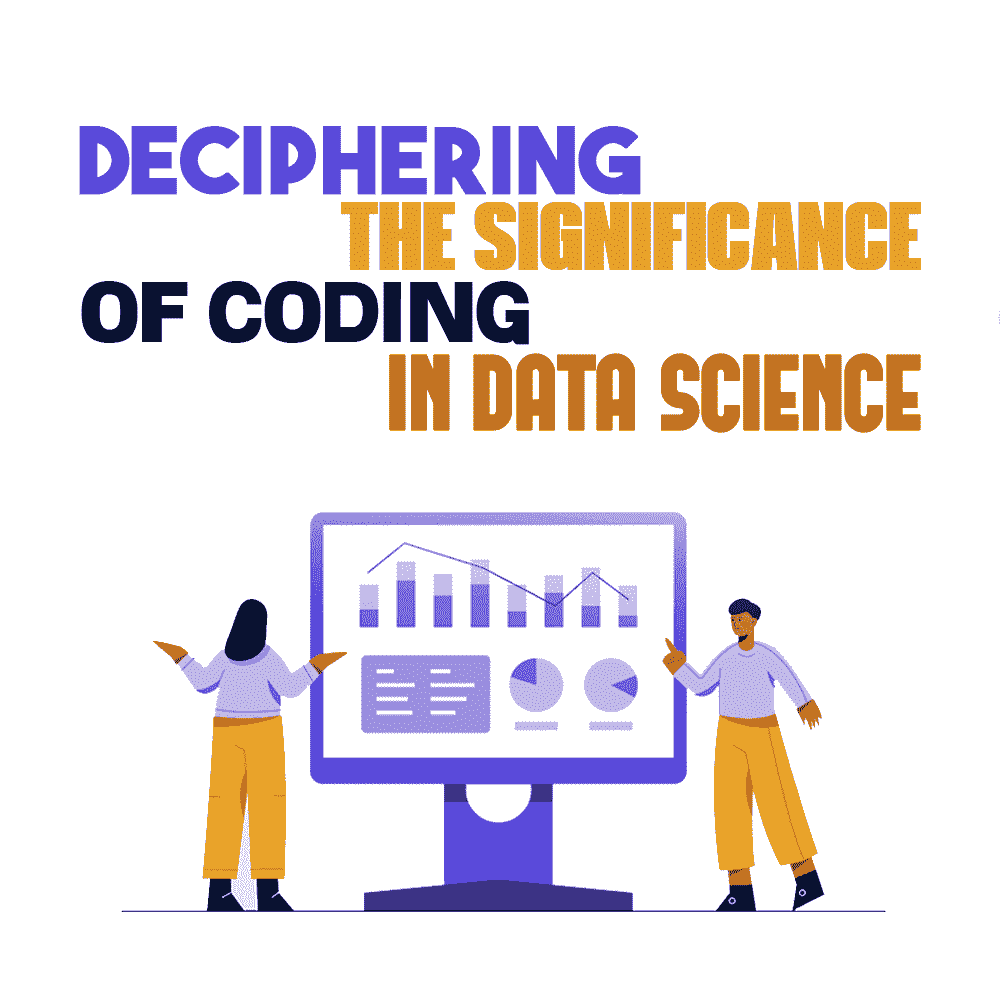

# 解读编码在数据科学中的意义

> 原文:[https://simple programmer . com/significance-coding-in-data-science/](https://simpleprogrammer.com/significance-coding-in-data-science/)

Data science is an in-depth study related to the substantial amounts of data that are stored in a company’s or organization’s database. [Research](https://junilearning.com/blog/guide/coding-and-data-science/) tells us that it is important to know from where the data is retrieved, its accuracy, and how it can help the business to expand.

因此，分析这些数据可以让公司通过检测数据集中的模式来获得超越竞争对手的巨大优势。我们还获得了对市场或客户趋势的宝贵见解。

在这篇文章中，我将让你更近距离地了解数据科学，解释它的重要性，并阐述为什么它是一个程序员的可靠职业选择。

## 谁是数据科学家？

公司的数据有两种格式:有组织的和无组织的。数据科学家是将非结构化数据转化为有用业务知识的专家。算法编码和数据分析，机器智能，统计学都是这些科学家认可的。

一些处理大量数据的组织有:

*   联邦政府
*   计算机系统设计
*   送货公司
*   科技公司
*   研究与开发
*   高等院校
*   软件公司
*   汽车公司

举几个例子，亚马逊、网飞、制药行业、航空公司以及处理欺诈检测或互联网搜索的公司都是大数据分析的用户。

数据科学是一个相当新的热门职业选择，提供有吸引力的待遇。原因很明显:今天一切都被认为是数据，这一科学领域的专家需要精确地管理这些数据。

如果你正在考虑将数据科学作为职业道路，那么你应该知道对数据科学家的需求正在上升。所以，你必须相应地训练自己，才能脱颖而出。

## 如何培养成为一名数据科学家？

数据科学家没有预先定义的认证。如果你想成为一名数据科学家，通常的标准是拥有工程学学位(不管有没有编码)。要获得这些，你必须通过工程考试。

你也可以攻读计算机科学或 IT 专业的理学学士学位。你甚至可以看一看让你了解更多关于数据科学和数据结构的课程。

你在[数据科学](https://simpleprogrammer.com/beginners-guide-data-science/)中培训自己的主要目标应该是获得这些技能:

*   管理非结构化数据的技术知识
*   熟悉编程语言，如 R 和 Python
*   使用 SQL 数据库的知识
*   数据清理和挖掘
*   使用 Hadoop、Hive 和 Pig 作为数据资源
*   数据可视化

掌握编码语言也会帮助你提升技能。鼓励学习下列两种语言:

*   Java:这种语言用于大多数工作场所，因为大数据工具是可用的，并且是用 Java 编写的。这种语言的好处在数据科学中是无穷无尽的。
*   [Python 编码语言](https://www.codingninjas.com/v2/courses/online-data-science-course):是计算机语言中的主要名称之一。它用于获取、清理、分析和可视化数据。因此，这种语言是数据科学的基础。

正确的培训可以帮助你获得你梦想的工作，并根据你的愿望赚取收入。

## 理解编码在数据科学中的作用

为了理解[编码在数据科学](https://simpleprogrammer.com/machine-learning-data-science/)中的重要性，让我们来看看数据分析的不同阶段。

### 规划和设计

在编码之前，数据科学家必须了解必须解决的问题，并确定解决问题背后的最终目标。然后，他们必须寻找在这个过程中使用的工具、数据和软件。在这个计划阶段不需要编码。

相反，绘图和设计是这里的优先事项，跳过这些可能会在未来产生后果。相反，适当的执行可以让数据科学家专注于目标，避免因不需要的结果或数据而分心。

### 获取数据

在今天的市场中，有一个巨大的数据库正在快速增长。据报道，每天有 2.5 万亿字节的数据产生。因此，迫切需要数据处理和质量分析，因为错误处理或放错如此大量的数据可能会导致一些严重的后果。

由数据管理不当引起的问题可能是任何事情，如错误输入的数据、过时的数据或不一致的数据，或者可能是重复的或缺失的数据集。获取所需的大量数据集可能是艰难而单调的。很多时候，数据科学家可能需要多个数据集。编码，比如 NoSQL 和 SQL，在这里扮演着重要的角色。

### 干净的数据

在一个位置编译完数据后，您需要清理它。例如，在分析和优化数据时，错误标记的数据可能会导致问题。因此，小的拼写错误、标签错误和其他小错误都会引起问题。

数据科学家使用像 R 和 Python 这样的语言来清理数据。他们可能会使用 Trifacta Wrangler 和 OpenRefine 等应用程序，这些应用程序主要用于清理数据并将其转换为各种格式。

### 分析数据

在清理和统一格式化数据之后，就可以进入分析阶段了。数据分析是一个具有多种定义的术语，因应用而异。因此，当需要进行数据分析时，Python 在数据科学社区中无处不在。

MATLAB 和 R 也很有名，因为它们是专门为数据分析而开发的。尽管这些语言的学习曲线比 Python 陡峭，但它是努力奋斗的数据科学家的救星。这两个用于全球数据分析。除了这些语言，在互联网上还可以很容易地获得各种工具来简化和加速数据分析。

### 可视化数据

The conclusion and results of data analysis need to be visualized, which assists data scientists in transmitting the worth of their findings and work. It can be done with the help of charts, graphs, and other visuals that allow people to know the importance of a data scientist’s work.

在这个可视化过程中常用的语言再次是 Python，像 Prettyplotlib 和 Seaborn 这样的工具帮助[数据科学家](https://towardsdatascience.com/top-programming-languages-for-data-science-in-2020-3425d756e2a7)构建可视化。其他软件如 Excel 和 Tableau 也可用于创建图形。

### 询问

除了数据分析，了解面向对象语言也是至关重要的。在数据采集时，许多科学家在数据层次中操纵数据库。像 SQL 这样的语言、它的后代以及特定的云系统加速了数据争吵的过程。

除此之外，查询语言还根据数据科学家的偏好计算运算和公式。

## 数据科学是未来

在[数据科学过程](https://www.amazon.com/dp/1119092949/makithecompsi-20)的每一步，编程对于实现各种目标至关重要。随着数据科学领域日益深入和复杂，数据科学家将主要依靠编码来确保他们成功解决可能出现的复杂问题。

出于这些原因，数据科学家学习使用编码来为这样的角色和服务做准备是不可或缺的。此外，由于创新的快速增加和业务的不断扩张，各个领域的公司对数据科学家的需求也在不断增加。总而言之，数据科学和这个职业的未来充满了更多的乐趣和惊险！